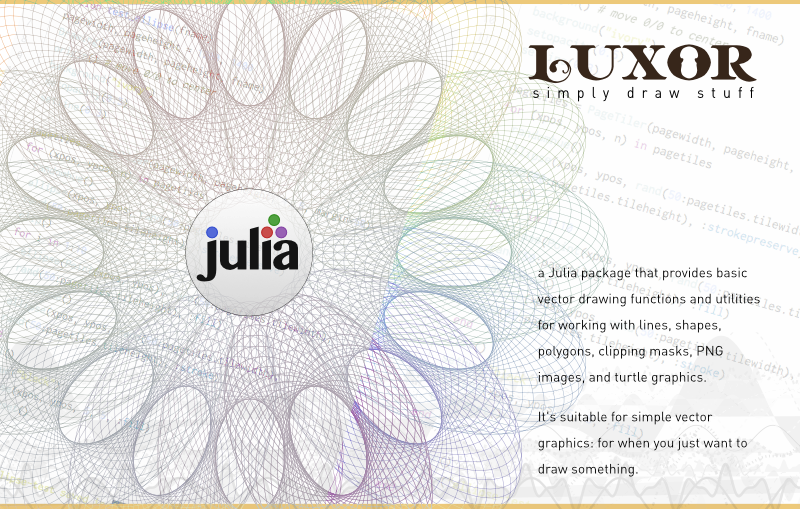

[![][codecov-img]][codecov-url]

Documentation:

 This describes the most recent released version of the package.

 This refers to the current in-development version of the package.

## Luxor

Luxor provides basic vector drawing functions, and utilities for working with shapes, polygons, clipping masks, PNG images, and turtle graphics. The focus of Luxor is on simplicity: it should be easier to use than plain  [Cairo.jl](https://github.com/JuliaLang/Cairo.jl), with shorter names, fewer underscores, default contexts, and simplified functions. The idea is that you issue a sequence of simple graphics 'commands' until you've filled a drawing, then save it into a file.

For interactive graphics, try [Gtk.jl](https://github.com/JuliaGraphics/Gtk.jl) or [GLVisualize](https://github.com/JuliaGL/GLVisualize.jl).

[codecov-img]: https://codecov.io/gh/JuliaGraphics/Luxor.jl/branch/master/graph/badge.svg
[codecov-url]: https://codecov.io/gh/JuliaGraphics/Luxor.jl
