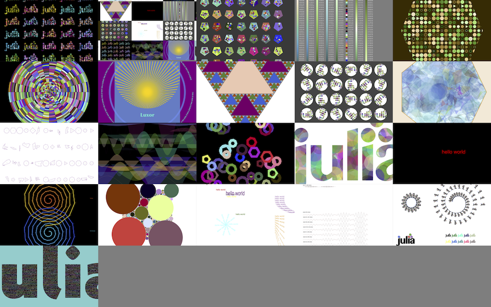
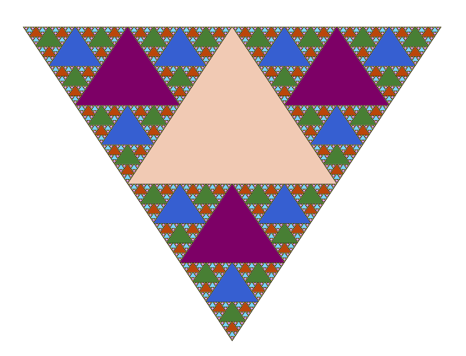
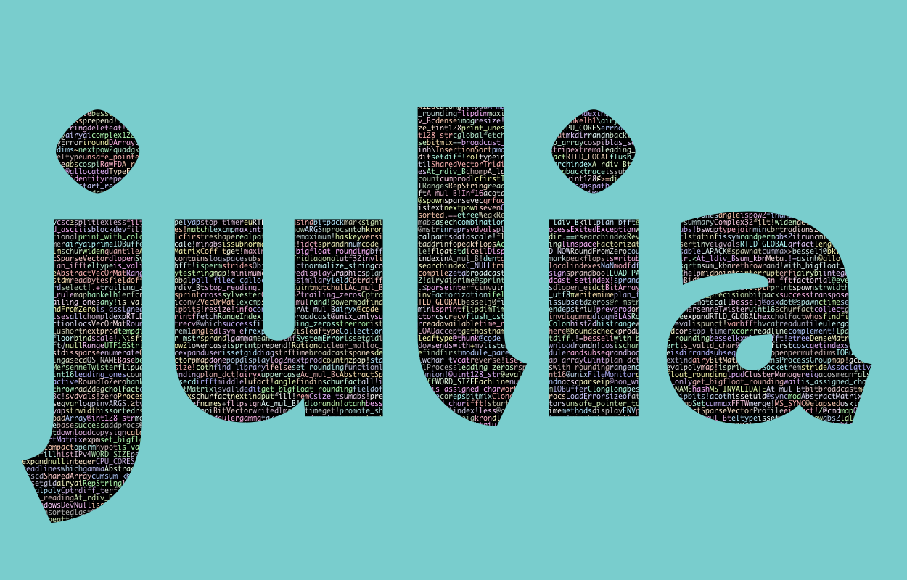
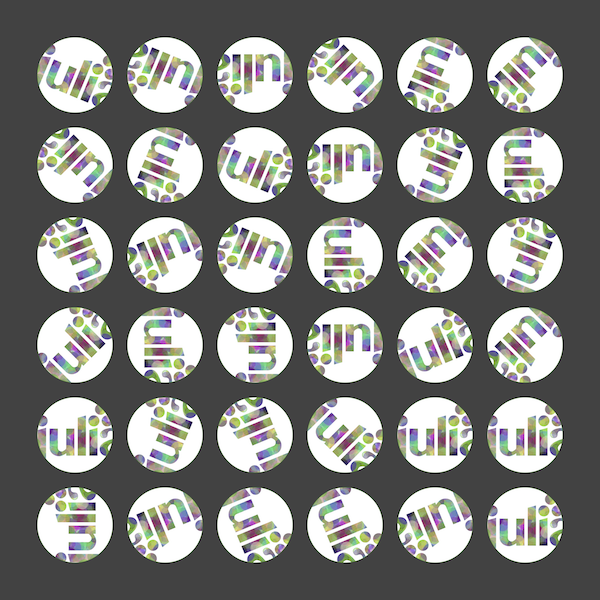

## Luxor

Luxor is the lightest dusting of syntactic sugar on Julia's Cairo graphics package (which should also be installed). It provides some basic vector drawing commands, and a few utilities for working with polygons, clipping masks, PNG images, and turtle graphics.



The idea of Luxor is that it's slightly easier to use than [Cairo.jl](https://github.com/JuliaLang/Cairo.jl), with shorter names, fewer underscores, default contexts, and simplified functions. It's for when you just want to draw something without too much ceremony. If you've ever hacked on a PostScript file, you should feel right at home (only without the reverse Polish notation, obviously).

For a much more powerful graphics environment, try [Compose.jl](http://composejl.org). Also worth looking at is Andrew Cooke's [Drawing.jl](https://github.com/andrewcooke/Drawing.jl) package.

[Colors.jl](https://github.com/JuliaGraphics/Colors.jl) provides excellent color definitions and is also required.

I've only tried this on MacOS X. It will need some changes to work on Windows (but I can't test it).

### Current status ###

It's been updated for Julia version 0.4 and for the new Colors.jl.

SVG rendering currently seems unreliable — text placement generates segmentation faults.

### Example usage

To install:

    Pkg.clone("https://github.com/cormullion/Luxor.jl")

and to use:

    using Luxor

#### "Hello World"

Here's a simple "Hello world":


```julia
using Luxor, Colors
Drawing(1000, 1000, "/tmp/hello-world.png")
origin()
sethue("red")
fontsize(50)
text("hello world")
finish()
preview()
```

The `Drawing(1000, 1000, "/tmp/hello-world.png")` line defines the size of the image and the location of the finished image when it's saved. `origin()` moves the 0/0 point to the centre of the drawing surface (by default it's at the top left corner). Because we're using `Colors.jl`, we can specify colors by name. `text()` places text at 0/0 if you don't specify otherwise. `finish()` completes the drawing and saves the image in the file. `preview()` tries to open the saved file using some other application (eg on MacOS X, Preview).

#### General Graphics


```julia
    using Luxor, Colors
    Drawing(1200, 1400, "/tmp/basic-test.png") # or PDF/SVG filename for PDF or SVG

    origin()
    background("purple")

    setopacity(0.7)                      # opacity from 0 to 1
    sethue(0.3,0.7,0.9)                  # sethue sets the color but doesn't change the opacity
    setline(20)                          # line width

    rect(-400,-400,800,800, :fill)       # or :stroke, :fillstroke, :clip
    randomhue()
    circle(0, 0, 460, :stroke)

    circle(0,-200,400,:clip)             # a circular clipping mask above the x axis
    sethue("gold")
    setopacity(0.7)
    setline(10)

    for i in 0:pi/36:2pi - pi/36
        move(0, 0)
        line(cos(i) * 600, sin(i) * 600 )
        stroke()
    end

    clipreset()                           # finish masking

    fontsize(60)
    setcolor("turquoise")
    fontface("Optima-ExtraBlack")
    textwidth = textextents("Luxor")[5]

    # move the text by half the width
    textcentred("Luxor", -textwidth/2, currentdrawing.height/2 - 400)

    fontsize(18)
    fontface("Avenir-Black")

    # text on curve
    textcurve("THIS IS TEXT ON A CURVE " ^ 14, 0, 550, Point(0, 0))

    finish()
    preview() # on Mac OS X, opens in Preview
```

#### Turtle graphics

Some simple "turtle graphics" commands are included:


```julia
    using Luxor, Colors

    Drawing(1200, 1200, "/tmp/turtles.png")
    origin()
    background("black")

    # let's have two turtles
    raphael = Turtle(0, 0, true, 0, (1.0, 0.25, 0.25)) ; michaelangelo = Turtle(0, 0, true, 0, (1.0, 0.25, 0.25))

    setopacity(0.95)
    setline(6)

    Pencolor(raphael, 1.0, 0.4, 0.2);       Pencolor(michaelangelo, 0.2, 0.9, 1.0)
    Reposition(raphael, 500, -200);         Reposition(michaelangelo, 500, 200)
    Message(raphael, "Raphael");            Message(michaelangelo, "Michaelangelo")
    Reposition(raphael, 0, -200);           Reposition(michaelangelo, 0, 200)

    pace = 10
    for i in 1:5:400
        for turtle in [raphael, michaelangelo]
            Circle(turtle, 3)
            HueShift(turtle, rand())
            Forward(turtle, pace)
            Turn(turtle, 30 - rand())
            Message(turtle, string(i))
            pace += 1
        end
    end

    finish()
    preview()
```

#### Sierpinski triangle

The main defined type is the `Point`.



```julia
    using Luxor, Colors

    function triangle(points::Array{Point}, degree::Int64)
        global counter, cols
        setcolor(cols[degree+1])
        poly(points, :fill)
        counter += 1
    end

    function sierpinski(points::Array{Point}, degree::Int64)
        triangle(points, degree)
        if degree > 0
            p1, p2, p3 = points
            sierpinski([p1, midpoint(p1, p2),
                            midpoint(p1, p3)], degree-1)
            sierpinski([p2, midpoint(p1, p2),
                            midpoint(p2, p3)], degree-1)
            sierpinski([p3, midpoint(p3, p2),
                            midpoint(p1, p3)], degree-1)
        end
    end

    @time begin
        depth = 8 # 12 is ok, 20 is right out
        cols = distinguishable_colors(depth+1)
        Drawing(400, 400, "/tmp/sierpinski.svg")
        origin()
        setopacity(0.5)
        counter = 0
        my_points = [Point(-100,-50), Point(0,100), Point(100.0,-50.0)]
        sierpinski(my_points, depth)
        println("drew $counter triangles")
    end

    finish()
    preview()

    # drew 9841 triangles
    # elapsed time: 1.738649452 seconds (118966484 bytes allocated, 2.20% gc time)
```

#### n-gons


```julia
    using Luxor, Colors
    Drawing(1200, 1400)

    origin()
    cols = diverging_palette(60,120, 20) # hue 60 to hue 120
    background(cols[1])
    setopacity(0.7)
    setline(2)

    ngon(0, 0, 500, 8, 0, :clip)

    for y in -500:50:500
        for x in -500:50:500
            setcolor(cols[rand(1:20)])
            ngon(x, y, rand(20:25), rand(3:12), 0, :fill)
            setcolor(cols[rand(1:20)])
            ngon(x, y, rand(10:20), rand(3:12), 0, :stroke)
        end
    end

    finish()
    preview()
```

#### clipping masks

This example loads a file containing functions that draw the Julia logo. One of the functions creates paths but doesn't apply an action them; they can therefore be used as a mask for clipping subsequent graphics:


```julia
    # load functions to draw the Julia logo
    include("../test/julia-logo.jl")

    currentwidth = 500 # pts
    currentheight = 500 # pts
    Drawing(currentwidth, currentheight, "/tmp/clipping-tests.pdf")

    function draw(x, y)
        foregroundcolors = diverging_palette(rand(0:360), rand(0:360), 200, s = 0.99, b=0.8)
        gsave()
        translate(x-100, y)
        julialogomask()                 # add paths for logo
        clip()                          # use paths for clipping
        for i in 1:500
            sethue(foregroundcolors[rand(1:end)])
            circle(rand(-50:350), rand(0:300), 15, :fill)
        end
        grestore()
    end

    origin()
    background("white")
    setopacity(.4)
    draw(0, 0)

    finish()
    preview()
```

#### text clipping

You can use newly-created text paths as a clipping region - here the text paths are 'filled' with names of randomly chosen Julia functions.



```julia
    using Luxor, Colors

    currentwidth = 1250 # pts
    currentheight = 800 # pts
    Drawing(currentwidth, currentheight, "/tmp/text-path-clipping.png")

    origin()
    background("darkslategray3")

    fontsize(600)                             # big fontsize to use for clipping
    fontface("Agenda-Black")
    str = "julia"                             # string to be clipped
    w, h = textextents(str)[3:4]              # get width and height

    translate(-(currentwidth/2) + 50, -(currentheight/2) + h)

    textpath(str)                             # make text into a path
    setline(3)
    setcolor("black")
    fillpreserve()                            # fill but keep
    clip()                                    # and use for clipping region

    fontface("Monaco")
    fontsize(10)
    namelist = map(x->string(x), names(Base)) # get list of function names in Base.

    x = -20
    y = -h
    while y < currentheight
        sethue(rand(7:10)/10, rand(7:10)/10, rand(7:10)/10)
        s = namelist[rand(1:end)]
        text(s, x, y)
        se = textextents(s)
        x += se[5]                            # move to the right
        if x > w
           x = -20                            # next row
           y += 10
        end
    end

    finish()
    preview()
```

#### Images ####

There is some limited support for placing PNG images on the drawing.

Load a PNG image using `readpng(filename)`.

Place a PNG image by its top left corner at point `x/y` or `pt`:

    placeimage(img, x, y)

    placeimage(img, pt)

    placeimage(image, x, y, alpha)

    placeimage(image, pt, alpha)

```julia
    using Luxor

    width, height = 4000, 4000
    margin = 500

    Drawing(width, height, "/tmp/cairo-image.pdf")
    origin()
    background("grey25")

    setline(5)
    sethue("green")

    image = readpng("../examples/julia-logo-mask.png")
    w = image.width
    h = image.height

    x = (-width/2) + margin
    y = (-height/2) + margin

    for i in 1:36
        circle(x, y, 250, :stroke)
        circle(x, y, 250, :clip)
        gsave()
        translate(x, y)
        scale(.95, .95)
        rotate(rand(0.0:pi/8:2pi))

        placeimage(image, -w/2, -h/2)

        grestore()
        clipreset()
        x += 600
        if x > width/2
            x = (-width/2) + margin
            y += 600
        end
    end

    finish()
    preview()
```



There's also `paint_with_alpha(ctx::Cairo.CairoContext, a = 0.5)`.

### Functions

#### Files

- `Drawing()`
 	create a drawing, defaulting to PNG format, default filename "/tmp/luxor-drawing.png", default size 800 pixels square
- `Drawing(300,300)`
 	create a drawing 300 by 300 pixels, defaulting to PNG format, default filename "/tmp/luxor-drawing.png",
- `Drawing(300,300, "/tmp/my-drawing.pdf")`
 	create a PDF drawing in the file "/tmp/my-drawing.pdf", 300 by 300 pixels
- `Drawing(800,800, "/tmp/my-drawing.svg")`
 	create an SVG drawing in the file "/tmp/my-drawing.svg", 800 by 800 pixels
- `Drawing(800,800, "/tmp/my-drawing.eps")`
 	create an EPS drawing in the file "/tmp/my-drawing.eps", 800 by 800 pixels
- `finish()`
 	finish the drawing
- `preview()`
 	tell the OS to open the file

The global variable `currentdrawing` holds a few parameters:

    julia> fieldnames(currentdrawing)
    10-element Array{Symbol,1}:
     :width
     :height
     :filename
     :surface
     :cr
     :surfacetype
     :redvalue
     :greenvalue
     :bluevalue
     :alpha

There's a `rescale()` function which is just a utility function for converting a number from one range to another.

#### Axes and backgrounds

The origin (0/0) is at the top left, x axis runs left to right, y axis runs top to bottom

- `origin()`
	move the 0/0 origin to the centre of the image
- `axes()`
	draw coordinate axes at current 0/0
- `background(color)`
	fill background with a colored rectangle

#### Shapes and lines

For many functions, the *action* argument can be `:nothing`, `:fill`, `:stroke`, `:fillstroke`, `fillpreserve`, `strokepreserve`, `:clip`. The default is `:nothing`.

There is a Point type (the only main type, apart from `Drawing`).

   `Point(12.0, 13.0)`

Positions are often specified by both x and y coordinates or a Point(x, y).

- `circle(x, y, r, action)`
- `circle(center, r, action)`

- `arc(xc, yc, radius, angle1, angle2, action)` add arc to current path centered at `xc/yc` starting at `angle1` and ending at `angle2` drawing arc clockwise

- `carc(xc, yc, radius, angle1, angle2, action)` add arc to current path centered at `xc/yc` starting at `angle1` and ending at `angle2`, drawing arc counterclockwise.

- `sector(innerradius, outerradius, startangle, endangle, action)` draw a sector/track relative to the current 0/0 point.

Angles are measured from the positive x-axis to the positive y-axis (which points 'down' the page or canvas) in radians, clockwise.

- `rect(xmin, ymin, w, h, action)`
- `rect(cornerpoint, w, h, action)`

There is a 'current position':

- `move(x, y)` move to this position
- `move(pt)`

- `rmove(x, y)` move relative to current position by `x` and `y`
- `rmove(pt)`

- `line(x, y)` draw line from current position to the `x/y` position
- `line(pt)`

- `rline(x, y)` draw line from current position by `x` and `y`
- `rline(pt)`

- `curve(x1, y1, x2, y2, x3, y3)` a cubic Bézier spline
- `curve(p1, p2, p3)`

The spline starts at the current position, finishing at `x3/y3` (`p3`), following two control points `x1/y1` (`p1`) and `x2/y2` (`p2`)

Polygons are arrays of points.

Regular polygons, from triangles, pentagons, hexagons, septagons, heptagons, octagons, nonagons, decagons, and on-and-on-agons, with:

- `ngon(xc, yc, radius, sides, orientation, action=:nothing)` draws a `sides`-sided polygon

Ngons are closed by default.

- `ngon(x, y, radius, sides, orientation, action; close=true, reversepath=false)`

Without an action, returns an array of points instead:

- `ngon(xc, yc, radius, sides, orientation)`

Compare:

```julia
    ngon(0, 0, 4, 4, 0) # returns the polygon's points

        4-element Array{Luxor.Point,1}:
         Luxor.Point(2.4492935982947064e-16,4.0)
         Luxor.Point(-4.0,4.898587196589413e-16)
         Luxor.Point(-7.347880794884119e-16,-4.0)
         Luxor.Point(4.0,-9.797174393178826e-16)

    ngon(0, 0, 4, 4, 0, :close) # draws a polygon
```

A polygon is an array of Points.

- `poly(list::Array, action = :nothing; close=false, reversepath=false)`:

    `poly(randompointarray(0, 0, 200, 200, 85), :stroke)`

- `randompoint(lowx, lowy, highx, highy)` returns a random point

- `randompointarray(lowx, lowy, highx, highy, n)` returns an array of random points. For example:

    `poly(randompointarray(0,0,200,200, 85), :stroke)`

Polygons can contain holes. The `reversepath` keyword changes the direction of the polygon. This draws an hexagonal bolt shape:

    ngon(0, 0, 60, 6, 0, :path)
    newsubpath()
    ngon(0, 0, 40, 6, 0, :path, reversepath=true)
    fillstroke()

Polygons can be simplified using the Douglas-Peucker algorithm (non-recursive version):

- `simplify(polygon, tolerance)` to delete points from an array of Points within the tolerance provided

- `isinside(point, polygon)` returns true if the point is inside the polygon

There are some experimental polygon functions. These don't work well for polygons that aren't simple or where the sides intersect each other.

- `polysplit(p, point1, point2)`

returns two polygons if a line from point1 to point2 divides the polygon.

- `polysortbydistance(p, startingpoint)`

returns the points sorted by finding the nearest point to the start point, then the nearest point to that, and so on.

- `polysortbyangle(p, startingpoint)`

returns the points sorted by the angle that each point makes with a starting point.

- `polycentroid(p)` returns `Point(centerx, centery)

- `polybbox(p)`

returns `[Point(lowx, lowy), Point(highx, highy)]`, opposite corners of a bounding box.

#### Styles

- `setline(n)` set line width

- `setlinecap(str)` set line ends to "butt", "round", or "square"

- `setlinejoin(str)` set line joins to "miter", "round", or "bevel"

- `setdash(str)` set line dashing to "solid", "dotted", "dot", "dotdashed", "longdashed", "shortdashed", "dash", "dashed", "dotdotdashed", or "dotdotdotdashed"

- `fillstroke()` fill and stroke the current path

- `stroke()` stroke the current path

- `fill()` fill the current path

- `strokepreserve()` stroke the path but keep it current

- `fillpreserve()` fill the path but keep it current

`gsave()` and `grestore()` should always be balanced in pairs. `gsave()` saves a copy of the current graphics settings (current axis rotation, position, scale, line and text settings, and so on). When the next `grestore()` is called, all changes you've made to the graphics settings will be discarded, and they'll return to how they were when you used `gsave()`.

- `gsave()` save the graphics state

- `grestore()` restore the graphics state

#### Transforms

- `scale(sx, sy)` scale by sx and sy

- `rotate(a)` rotate clockwise (positive x-axis to positive y-axis) by `a` radians around current 0/0

- `translate(tx, ty)` translate to `tx/ty` or `pt`
- `translate(pt)`

The current matrix is a six number array, perhaps like this:

	[1, 0, 0, 1, 0, 0]

- `getmatrix()` gets the current matrix

- `setmatrix(a)` sets the matrix to array `a`

- `transform(a)` transform the current matrix by 'multiplying' it with matrix `a`. For example, to skew by 45 degrees in x and move by 20 in y direction:

    `transform([1, 0, tand(45), 1, 0, 20])`

#### Color and opacity

For color definitions and conversions, use Colors.jl.

The difference between the `setcolor()` and `sethue()` functions is that `sethue()` is independent of alpha opacity, so you can change the hue without changing the current opacity value (like in Mathematica).

- `setcolor(color)`

    `setcolor"gold"` (is a string macro, still experimental but might be quicker ...)

	`setcolor("gold")`

	`setcolor("darkturquoise")`

	`setcolor(convert(Colors.HSV, Colors.RGB(0.5, 1, 1)))`

- `setcolor(r, g, b, alpha)` eg:

	`setcolor(.2, .3, .4, .5)`

- `setcolor(r, g, b)`

- `sethue(color)` like `setcolor`

- `sethue(r, g, b)` like `setcolor()` but doesn't change opacity

- `setopacity(alpha)` change the alpha opacity (`alpha` is between 0 and 1)

- `randomhue()` choose a random color without changing current alpha opacity

- `randomcolor()` choose a random color

#### Paths

- `newpath()`

- `newsubpath()` used for example to make holes in shapes

- `closepath()`

- `getpath()` get the current path as an array of element types and points

- `getpathflat()` get the current path as an array of type/points with curves flattened to lines

#### Clipping

- `clip()` turn the current path into a clipping region, masking any graphics outside the path

- `clippreserve()` keep the current path, but also use it as a clipping region

- `clipreset()`

#### Text and fonts

- `text(t, x, y)` draw string `t` at `x`/`y`, or at `0/0` if `x`/`y` omitted
- `text(t, pt)` draw string `t` at `pt`

- `textcentred(t, x, y)` draw string `t` centred at `x`/`y` or `0/0`
- `textcentred(t, pt)`

- `textpath(t)`

make the string `t` into a graphic path suitable for `fill()`, `stroke()`...

- `textcurve(str, startangle, radius, xcentre, ycentre)`
- `textcurve(str, startangle, radius, centerpt)`

draw string `str` on an arc of radius `r` centered at `xcenter/ycenter` (or `centrept`) starting on angle start_angle.
You can change the letter spacing, and/or spiral in or out, using these optional keywords:

-  `spiral_ring_step = 0`,   step out or in by this amount
-  `letter_spacing = 0`,     tracking/space between chars, tighter is (-), looser is (+)
-  `spiral_in_out_shift = 0` + values go outwards, - values spiral inwards 

- `fontface(fontname)`

choose font `fontname`

- `fontsize(n)`

set font size in points

- `textextents(str)`

get array of dimensions of the string `str`, given current font:

	[xb, yb, width, height, xadvance, yadvance]

#### Images ####

Load a PNG image with `readpng()`. Place it by its top left corner at the specified position using `placeimage()`.

Place a PNG image by its top left corner at point `x/y` or `pt`.

```julia

    image = readpng(filename)
    placeimage(img, xpos, ypos)
    placeimage(img, pt::Point)
    placeimage(img, xpos, ypos, alpha = 1.0)
    placeimage(img, pt::Point, alpha = 1.0)

    image = readpng("../examples/julia-logo-mask.png")
    w = image.width
    h = image.height

    placeimage(image, -w/2, -h/2) # centered

```
