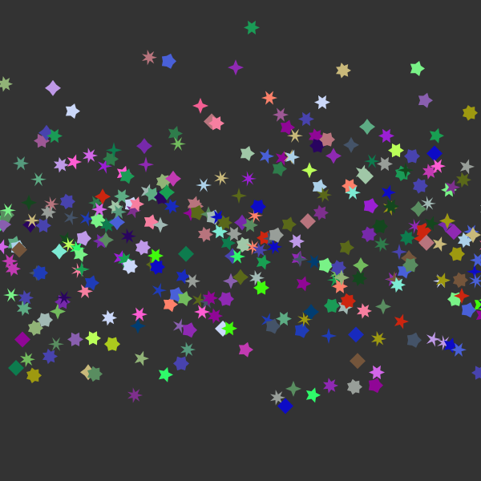

<a id='Luxor-1'></a>

## Luxor


Luxor is the lightest dusting of syntactic sugar on Julia's Cairo graphics package (which should also be installed). It provides some basic vector drawing commands, and a few utilities for working with polygons, clipping masks, PNG images, and turtle graphics.


The idea of Luxor is that it's slightly easier to use than [Cairo.jl](https://github.com/JuliaLang/Cairo.jl), with shorter names, fewer underscores, default contexts, and simplified functions. It's for when you just want to draw something without too much ceremony. If you've ever hacked on a PostScript file, you should feel right at home (only without the reverse Polish notation, obviously).


For a much more powerful graphics environment, try [Compose.jl](http://composejl.org). Also worth looking at is Andrew Cooke's [Drawing.jl](https://github.com/andrewcooke/Drawing.jl) package.


[Colors.jl](https://github.com/JuliaGraphics/Colors.jl) provides excellent color definitions and is also required.


I've only tried this on MacOS X. It will need some changes to work on Windows (but I can't test it).


<a id='Current-status-1'></a>

# Current status


It's been updated for Julia version 0.5 and for the new Colors.jl. SVG rendering currently seems unreliable — text placement generates segmentation faults.


<a id='Installation-and-basic-usage-1'></a>

# Installation and basic usage


To install:


```
Pkg.clone("https://github.com/cormullion/Luxor.jl")
```


and to use:


```
using Luxor
```


<a id='The-basic-"Hello-World"-1'></a>

## The basic "Hello World"


Here's a simple "Hello world":


```julia
using Luxor, Colors
Drawing(1000, 1000, "/tmp/hello-world.png")
origin()
sethue("red")
fontsize(50)
text("hello world")
finish()
preview()
```


The `Drawing(1000, 1000, "/tmp/hello-world.png")` line defines the size of the image and the location of the finished image when it's saved.


`origin()` moves the 0/0 point to the centre of the drawing surface (by default it's at the top left corner). Because we're using `Colors.jl`, we can specify colors by name.


`text()` places text. It's placed at 0/0 if you don't specify otherwise.


`finish()` completes the drawing and saves the image in the file. `preview()` tries to open the saved file using some other application (eg on MacOS X, Preview).


<a id='A-slightly-more-interesting-image-1'></a>

## A slightly more interesting image


```julia
    using Luxor, Colors
    Drawing(1200, 1400, "/tmp/basic-test.png") # or PDF/SVG filename for PDF or SVG

    origin()
    background("purple")

    setopacity(0.7)                      # opacity from 0 to 1
    sethue(0.3,0.7,0.9)                  # sethue sets the color but doesn't change the opacity
    setline(20)                          # line width

    rect(-400,-400,800,800, :fill)       # or :stroke, :fillstroke, :clip
    randomhue()
    circle(0, 0, 460, :stroke)

    circle(0,-200,400,:clip)             # a circular clipping mask above the x axis
    sethue("gold")
    setopacity(0.7)
    setline(10)

    for i in 0:pi/36:2pi - pi/36
        move(0, 0)
        line(cos(i) * 600, sin(i) * 600 )
        stroke()
    end

    clipreset()                           # finish masking

    fontsize(60)
    setcolor("turquoise")
    fontface("Optima-ExtraBlack")
    textwidth = textextents("Luxor")[5]

    # move the text by half the width
    textcentred("Luxor", -textwidth/2, currentdrawing.height/2 - 400)

    fontsize(18)
    fontface("Avenir-Black")

    # text on curve starting at angle 0 rads centered on origin with radius 550
    textcurve("THIS IS TEXT ON A CURVE " ^ 14, 0, 550, Point(0, 0))

    finish()
    preview() # on Mac OS X, opens in Preview
```


<a id='Types-1'></a>

## Types


The two main defined types are the `Point` and the `Drawing`.


The Point type holds two coordinates, the x and y:


```
`Point(12.0, 13.0)`
```


<a id='Drawings-and-files-1'></a>

## Drawings and files


To create a drawing, and optionally specify the file name and type, and dimensions, use the `Drawing` function.

<a id='Luxor.Drawing' href='#Luxor.Drawing'>#</a>
**`Luxor.Drawing`** &mdash; *Type*.


A Drawing holds details about the location and type of drawing, and tracks the current color.


<a target='_blank' href='https://github.com/cormullion/Luxor.jl/tree/3dab27a80a25f0bf323eed07aa10cb43d794cf94/src/Luxor.jl#L51-L53' class='documenter-source'>source</a><br>


To finish a drawing and close the file, use `finish()`, and, to launch an external application to view it, use `preview()`.

<a id='Luxor.finish' href='#Luxor.finish'>#</a>
**`Luxor.finish`** &mdash; *Function*.


```
finish()
```

Finish drawing, and close the file. The filename is still available in `currentdrawing.filename`, and you may be able to open it using `preview()`.


<a target='_blank' href='https://github.com/cormullion/Luxor.jl/tree/3dab27a80a25f0bf323eed07aa10cb43d794cf94/src/Luxor.jl#L171-L175' class='documenter-source'>source</a><br>

<a id='Luxor.preview' href='#Luxor.preview'>#</a>
**`Luxor.preview`** &mdash; *Function*.


```
preview()
```

On macOS, opens the file, which probably uses the default app, Preview.app On Unix, open the file with xdg-open. On Windows, pass the filename to the shell.


<a target='_blank' href='https://github.com/cormullion/Luxor.jl/tree/3dab27a80a25f0bf323eed07aa10cb43d794cf94/src/Luxor.jl#L185-L191' class='documenter-source'>source</a><br>


The global variable `currentdrawing` holds a few parameters:


```
julia> fieldnames(currentdrawing)
10-element Array{Symbol,1}:
:width
:height
:filename
:surface
:cr
:surfacetype
:redvalue
:greenvalue
:bluevalue
:alpha
```


<a id='Axes-and-backgrounds-1'></a>

## Axes and backgrounds


The origin (0/0) is at the top left, x axis runs left to right, y axis runs top to bottom.


The `origin()` function moves the c0/0 point. The `axes()` function draws a couple of lines to indicate the current axes. `background()` fills the entire image with a color.

<a id='Luxor.background' href='#Luxor.background'>#</a>
**`Luxor.background`** &mdash; *Function*.


```
background(color)
```

Fill the canvas with color.

Examples:

```
background("antiquewhite")
background("ivory")
background(Colors.RGB(0, 0, 0))
background(Colors.Luv(20, -20, 30))
```


<a target='_blank' href='https://github.com/cormullion/Luxor.jl/tree/3dab27a80a25f0bf323eed07aa10cb43d794cf94/src/Luxor.jl#L243-L254' class='documenter-source'>source</a><br>

<a id='Luxor.axes' href='#Luxor.axes'>#</a>
**`Luxor.axes`** &mdash; *Function*.


Draw two axes lines starting at 0/0 and continuing out along the current positive x and y axes.


<a target='_blank' href='https://github.com/cormullion/Luxor.jl/tree/3dab27a80a25f0bf323eed07aa10cb43d794cf94/src/Luxor.jl#L223-L225' class='documenter-source'>source</a><br>

<a id='Luxor.origin' href='#Luxor.origin'>#</a>
**`Luxor.origin`** &mdash; *Function*.


```
origin()
```

Set the 0/0 origin at the center of the drawing (otherwise it will stay at the top left corner).


<a target='_blank' href='https://github.com/cormullion/Luxor.jl/tree/3dab27a80a25f0bf323eed07aa10cb43d794cf94/src/Luxor.jl#L202-L206' class='documenter-source'>source</a><br>


<a id='Basic-drawing-1'></a>

## Basic drawing


The underlying Cairo drawing model is similar to PostScript: paths can be filled and/or stroked, using the current graphics state, which specifies colors, line thicknesses and patterns, and opacity.


Many drawing functions have an *action* argument. This can be `:nothing`, `:fill`, `:stroke`, `:fillstroke`, `:fillpreserve`, `:strokepreserve`, `:clip`. The default is `:nothing`.


Positions are usually specified either by x and y coordinates or a `Point(x, y)`. Angles are usually measured from the positive x-axis to the positive y-axis (which points 'down' the page or canvas) in radians, clockwise.


<a id='Simple-shapes-1'></a>

### Simple shapes


Functions for drawing shapes include circle(), arc(), carc(), curve(), sector(), rect(), and box().

<a id='Luxor.circle' href='#Luxor.circle'>#</a>
**`Luxor.circle`** &mdash; *Function*.


Draw a circle centred at `x`/`y`.

```
circle(x, y, r, action)
```

`action` is one of the actions applied by `do_action`.


<a target='_blank' href='https://github.com/cormullion/Luxor.jl/tree/3dab27a80a25f0bf323eed07aa10cb43d794cf94/src/Luxor.jl#L384-L390' class='documenter-source'>source</a><br>


Draw a circle centred at `pt`.

```
circle(pt, r, action)
```


<a target='_blank' href='https://github.com/cormullion/Luxor.jl/tree/3dab27a80a25f0bf323eed07aa10cb43d794cf94/src/Luxor.jl#L399-L404' class='documenter-source'>source</a><br>

<a id='Luxor.arc' href='#Luxor.arc'>#</a>
**`Luxor.arc`** &mdash; *Function*.


Add an arc to the current path from `angle1` to `angle2` going clockwise.

```
arc(xc, yc, radius, angle1, angle2, action=:nothing)
```

Angles are defined relative to the x-axis, positive clockwise.


<a target='_blank' href='https://github.com/cormullion/Luxor.jl/tree/3dab27a80a25f0bf323eed07aa10cb43d794cf94/src/Luxor.jl#L407-L413' class='documenter-source'>source</a><br>

<a id='Luxor.carc' href='#Luxor.carc'>#</a>
**`Luxor.carc`** &mdash; *Function*.


Add an arc to the current path from `angle1` to `angle2` going counterclockwise.

```
carc(xc, yc, radius, angle1, angle2, action=:nothing)
```

Angles are defined relative to the x-axis, positive clockwise.


<a target='_blank' href='https://github.com/cormullion/Luxor.jl/tree/3dab27a80a25f0bf323eed07aa10cb43d794cf94/src/Luxor.jl#L420-L426' class='documenter-source'>source</a><br>

<a id='Luxor.curve' href='#Luxor.curve'>#</a>
**`Luxor.curve`** &mdash; *Function*.


Create a cubic Bézier spline curve.

```
- `curve(x1, y1, x2, y2, x3, y3)`

- `curve(p1, p2, p3)`
```

The spline starts at the current position, finishing at `x3/y3` (`p3`), following two control points `x1/y1` (`p1`) and `x2/y2` (`p2`)


<a target='_blank' href='https://github.com/cormullion/Luxor.jl/tree/3dab27a80a25f0bf323eed07aa10cb43d794cf94/src/Luxor.jl#L600-L609' class='documenter-source'>source</a><br>

<a id='Luxor.sector' href='#Luxor.sector'>#</a>
**`Luxor.sector`** &mdash; *Function*.


```
sector(innerradius, outerradius, startangle, endangle, action=:none)
```

Draw a track/sector based at 0/0.


<a target='_blank' href='https://github.com/cormullion/Luxor.jl/tree/3dab27a80a25f0bf323eed07aa10cb43d794cf94/src/Luxor.jl#L474-L478' class='documenter-source'>source</a><br>

<a id='Luxor.rect' href='#Luxor.rect'>#</a>
**`Luxor.rect`** &mdash; *Function*.


Create a rectangle with one corner at (`xmin`/`ymin`) with width `w` and height `h` and do an action.

```
rect(xmin, ymin, w, h, action)
```


<a target='_blank' href='https://github.com/cormullion/Luxor.jl/tree/3dab27a80a25f0bf323eed07aa10cb43d794cf94/src/Luxor.jl#L432-L436' class='documenter-source'>source</a><br>


Create a rectangle with one corner at `cornerpoint` with width `w` and height `h` and do an action.

```
rect(cornerpoint, w, h, action)
```


<a target='_blank' href='https://github.com/cormullion/Luxor.jl/tree/3dab27a80a25f0bf323eed07aa10cb43d794cf94/src/Luxor.jl#L446-L450' class='documenter-source'>source</a><br>

<a id='Luxor.box' href='#Luxor.box'>#</a>
**`Luxor.box`** &mdash; *Function*.


Create a rectangle between two points and do an action.

```
box(cornerpoint1, cornerpoint2, action=:nothing)
```


<a target='_blank' href='https://github.com/cormullion/Luxor.jl/tree/3dab27a80a25f0bf323eed07aa10cb43d794cf94/src/Luxor.jl#L455-L460' class='documenter-source'>source</a><br>


Create a rectangle between the first two points of an array of Points.

```
box(points::Array, action=:nothing)
```


<a target='_blank' href='https://github.com/cormullion/Luxor.jl/tree/3dab27a80a25f0bf323eed07aa10cb43d794cf94/src/Luxor.jl#L465-L469' class='documenter-source'>source</a><br>


<a id='Lines-and-arcs-1'></a>

### Lines and arcs


There is a 'current position' which you can set with `move()`, and use implicitly in functions like `line()` and `text()`.

<a id='Luxor.move' href='#Luxor.move'>#</a>
**`Luxor.move`** &mdash; *Function*.


Move to a point.

```
- `move(x, y)`
- `move(pt)`
```


<a target='_blank' href='https://github.com/cormullion/Luxor.jl/tree/3dab27a80a25f0bf323eed07aa10cb43d794cf94/src/Luxor.jl#L541-L546' class='documenter-source'>source</a><br>

<a id='Luxor.rmove' href='#Luxor.rmove'>#</a>
**`Luxor.rmove`** &mdash; *Function*.


Move by an amount from the current point. Move relative to current position by `x` and `y`:

```
- `rmove(x, y)`
```

Move relative to current position by the `pt`'s x and y:

```
- `rmove(pt)`
```


<a target='_blank' href='https://github.com/cormullion/Luxor.jl/tree/3dab27a80a25f0bf323eed07aa10cb43d794cf94/src/Luxor.jl#L550-L558' class='documenter-source'>source</a><br>

<a id='Luxor.line' href='#Luxor.line'>#</a>
**`Luxor.line`** &mdash; *Function*.


Create a line from the current position to the `x/y` position and optionally apply an action:

```
- `line(x, y)`

- `line(x, y, :action)`

- `line(pt)`
```


<a target='_blank' href='https://github.com/cormullion/Luxor.jl/tree/3dab27a80a25f0bf323eed07aa10cb43d794cf94/src/Luxor.jl#L562-L571' class='documenter-source'>source</a><br>


Make a line between two points, `pt1` and `pt2`.

```
line(pt1::Point, pt2::Point, action=:nothing)
```


<a target='_blank' href='https://github.com/cormullion/Luxor.jl/tree/3dab27a80a25f0bf323eed07aa10cb43d794cf94/src/Luxor.jl#L575-L580' class='documenter-source'>source</a><br>

<a id='Luxor.rline' href='#Luxor.rline'>#</a>
**`Luxor.rline`** &mdash; *Function*.


Create a line relative to the current position to the `x/y` position and optionally apply an action:

```
- `rline(x, y)`

- `rline(x, y, :action)`

- `rline(pt)`
```


<a target='_blank' href='https://github.com/cormullion/Luxor.jl/tree/3dab27a80a25f0bf323eed07aa10cb43d794cf94/src/Luxor.jl#L587-L595' class='documenter-source'>source</a><br>


<a id='Paths-1'></a>

## Paths


A path is a group of points. A path can have subpaths (which can form holes).

<a id='Luxor.newpath' href='#Luxor.newpath'>#</a>
**`Luxor.newpath`** &mdash; *Function*.


```
newpath()
```

Create a new path. This is Cairo's `new_path()` function.


<a target='_blank' href='https://github.com/cormullion/Luxor.jl/tree/3dab27a80a25f0bf323eed07aa10cb43d794cf94/src/Luxor.jl#L269-L273' class='documenter-source'>source</a><br>

<a id='Luxor.newsubpath' href='#Luxor.newsubpath'>#</a>
**`Luxor.newsubpath`** &mdash; *Function*.


```
newsubpath()
```

Create a new subpath of the current path. This is Cairo's `new_sub_path()` function. It can be used, for example, to make holes in shapes.


<a target='_blank' href='https://github.com/cormullion/Luxor.jl/tree/3dab27a80a25f0bf323eed07aa10cb43d794cf94/src/Luxor.jl#L276-L280' class='documenter-source'>source</a><br>

<a id='Luxor.closepath' href='#Luxor.closepath'>#</a>
**`Luxor.closepath`** &mdash; *Function*.


```
closepath()
```

Close the current path. This is Cairo's `close_path()` function.


<a target='_blank' href='https://github.com/cormullion/Luxor.jl/tree/3dab27a80a25f0bf323eed07aa10cb43d794cf94/src/Luxor.jl#L283-L287' class='documenter-source'>source</a><br>


The `getpath()` function get the current Cairo path as an array of element types and points. `getpathflat()` gets the current path as an array of type/points with curves flattened to line segments.


<a id='Color-and-opacity-1'></a>

## Color and opacity


For color definitions and conversions, we use Colors.jl. The difference between the `setcolor()` and `sethue()` functions is that `sethue()` is independent of alpha opacity, so you can change the hue without changing the current opacity value (this is similar to Mathematica).


<a id='Styles-1'></a>

## Styles


The set- commands control the width, end shapes, join behaviour and dash pattern:

<a id='Luxor.setline' href='#Luxor.setline'>#</a>
**`Luxor.setline`** &mdash; *Function*.


Set the line width.

```
setline(n)
```


<a target='_blank' href='https://github.com/cormullion/Luxor.jl/tree/3dab27a80a25f0bf323eed07aa10cb43d794cf94/src/Luxor.jl#L490-L495' class='documenter-source'>source</a><br>

<a id='Luxor.setlinecap' href='#Luxor.setlinecap'>#</a>
**`Luxor.setlinecap`** &mdash; *Function*.


Set the line ends. `s` can be "butt" (default), "square", or "round".

```
setlinecap(s)

setlinecap("round")
```


<a target='_blank' href='https://github.com/cormullion/Luxor.jl/tree/3dab27a80a25f0bf323eed07aa10cb43d794cf94/src/Luxor.jl#L498-L504' class='documenter-source'>source</a><br>

<a id='Luxor.setlinejoin' href='#Luxor.setlinejoin'>#</a>
**`Luxor.setlinejoin`** &mdash; *Function*.


Set the line join, ie how to render the junction of two lines when stroking.

```
setlinejoin("round")
setlinejoin("miter")
setlinejoin("bevel")
```


<a target='_blank' href='https://github.com/cormullion/Luxor.jl/tree/3dab27a80a25f0bf323eed07aa10cb43d794cf94/src/Luxor.jl#L515-L521' class='documenter-source'>source</a><br>

<a id='Luxor.setdash' href='#Luxor.setdash'>#</a>
**`Luxor.setdash`** &mdash; *Function*.


Set the dash pattern to one of: "solid", "dotted", "dot", "dotdashed", "longdashed", "shortdashed", "dash", "dashed", "dotdotdashed", "dotdotdotdashed"

```
setlinedash("dot")
```


<a target='_blank' href='https://github.com/cormullion/Luxor.jl/tree/3dab27a80a25f0bf323eed07aa10cb43d794cf94/src/Luxor.jl#L532-L536' class='documenter-source'>source</a><br>

<a id='Luxor.fillstroke' href='#Luxor.fillstroke'>#</a>
**`Luxor.fillstroke`** &mdash; *Function*.


Fill and stroke the current path.


<a target='_blank' href='https://github.com/cormullion/Luxor.jl/tree/3dab27a80a25f0bf323eed07aa10cb43d794cf94/src/Luxor.jl#L330-L332' class='documenter-source'>source</a><br>

<a id='Luxor.stroke' href='#Luxor.stroke'>#</a>
**`Luxor.stroke`** &mdash; *Function*.


Stroke the current path with the current line width, line join, line cap, and dash settings. The current path is then cleared.

```
stroke()
```


<a target='_blank' href='https://github.com/cormullion/Luxor.jl/tree/3dab27a80a25f0bf323eed07aa10cb43d794cf94/src/Luxor.jl#L290-L295' class='documenter-source'>source</a><br>

<a id='Base.fill' href='#Base.fill'>#</a>
**`Base.fill`** &mdash; *Function*.


Fill the current path with current settings. The current path is then cleared.

```
fill()
```


<a target='_blank' href='https://github.com/cormullion/Luxor.jl/tree/3dab27a80a25f0bf323eed07aa10cb43d794cf94/src/Luxor.jl#L298-L303' class='documenter-source'>source</a><br>

<a id='Luxor.strokepreserve' href='#Luxor.strokepreserve'>#</a>
**`Luxor.strokepreserve`** &mdash; *Function*.


Stroke the current path with current line width, line join, line cap, and dash settings, but then keep the path current.

```
strokepreserve()
```


<a target='_blank' href='https://github.com/cormullion/Luxor.jl/tree/3dab27a80a25f0bf323eed07aa10cb43d794cf94/src/Luxor.jl#L314-L319' class='documenter-source'>source</a><br>

<a id='Luxor.fillpreserve' href='#Luxor.fillpreserve'>#</a>
**`Luxor.fillpreserve`** &mdash; *Function*.


Fill the current path with current settings, but then keep the path current.

```
fillpreserve()
```


<a target='_blank' href='https://github.com/cormullion/Luxor.jl/tree/3dab27a80a25f0bf323eed07aa10cb43d794cf94/src/Luxor.jl#L322-L327' class='documenter-source'>source</a><br>


`gsave()` and `grestore()` should always be balanced in pairs. `gsave()` saves a copy of the current graphics settings (current axis rotation, position, scale, line and text settings, and so on). When the next `grestore()` is called, all changes you've made to the graphics settings will be discarded, and they'll return to how they were when you used `gsave()`.

<a id='Luxor.gsave' href='#Luxor.gsave'>#</a>
**`Luxor.gsave`** &mdash; *Function*.


Save the current graphics state on the stack.


<a target='_blank' href='https://github.com/cormullion/Luxor.jl/tree/3dab27a80a25f0bf323eed07aa10cb43d794cf94/src/Luxor.jl#L618-L620' class='documenter-source'>source</a><br>

<a id='Luxor.grestore' href='#Luxor.grestore'>#</a>
**`Luxor.grestore`** &mdash; *Function*.


Replace the current graphics state with the one on top of the stack.


<a target='_blank' href='https://github.com/cormullion/Luxor.jl/tree/3dab27a80a25f0bf323eed07aa10cb43d794cf94/src/Luxor.jl#L629-L631' class='documenter-source'>source</a><br>


<a id='Polygons-and-such-1'></a>

## Polygons and such


<a id='Regular-polygons-("ngons")-1'></a>

### Regular polygons ("ngons")


You can make regular polygons — from triangles, pentagons, hexagons, septagons, heptagons, octagons, nonagons, decagons, and on-and-on-agons — with `ngon()` and `ngonv()`. `ngon()` uses the shapes: if you just want the raw points, use `ngonv`, which returns an array of points instead:


```julia
using Luxor, Colors
Drawing(1200, 1400)

origin()
cols = diverging_palette(60,120, 20) # hue 60 to hue 120
background(cols[1])
setopacity(0.7)
setline(2)

ngon(0, 0, 500, 8, 0, :clip)

for y in -500:50:500
  for x in -500:50:500
    setcolor(cols[rand(1:20)])
    ngon(x, y, rand(20:25), rand(3:12), 0, :fill)
    setcolor(cols[rand(1:20)])
    ngon(x, y, rand(10:20), rand(3:12), 0, :stroke)
  end
end

finish()
preview()
```

<a id='Luxor.ngon' href='#Luxor.ngon'>#</a>
**`Luxor.ngon`** &mdash; *Function*.


Draw a regular polygon centred at `x`, `y`:

```
ngon(x, y,      radius, sides, orientation, action; close=true, reversepath=false)
```

Use `ngonv()` to return the points of a polygon.


<a target='_blank' href='https://github.com/cormullion/Luxor.jl/tree/3dab27a80a25f0bf323eed07aa10cb43d794cf94/src/polygons.jl#L280-L286' class='documenter-source'>source</a><br>


Draw a regular polygon centred at `p`:

```
ngon(centerpos, radius, sides, orientation, action; close=true, reversepath=false)
```


<a target='_blank' href='https://github.com/cormullion/Luxor.jl/tree/3dab27a80a25f0bf323eed07aa10cb43d794cf94/src/polygons.jl#L291-L296' class='documenter-source'>source</a><br>

<a id='Luxor.ngonv' href='#Luxor.ngonv'>#</a>
**`Luxor.ngonv`** &mdash; *Function*.


Return the vertices of a regular n-sided polygon centred at `x`, `y`:

```
ngonv(x, y, radius, sides, orientation)
```

`ngon()` uses the shapes: if you just want the raw points, use `ngonv`, which returns an array of points instead. Compare:

```julia
ngonv(0, 0, 4, 4, 0) # returns the polygon's points

4-element Array{Luxor.Point,1}:
Luxor.Point(2.4492935982947064e-16,4.0)
Luxor.Point(-4.0,4.898587196589413e-16)
Luxor.Point(-7.347880794884119e-16,-4.0)
Luxor.Point(4.0,-9.797174393178826e-16)

ngon(0, 0, 4, 4, 0, :close) # draws a polygon
```


<a target='_blank' href='https://github.com/cormullion/Luxor.jl/tree/3dab27a80a25f0bf323eed07aa10cb43d794cf94/src/polygons.jl#L248-L266' class='documenter-source'>source</a><br>


Return the vertices of a regular polygon centred at `p`:

```
ngonv(p, radius, sides, orientation)
```


<a target='_blank' href='https://github.com/cormullion/Luxor.jl/tree/3dab27a80a25f0bf323eed07aa10cb43d794cf94/src/polygons.jl#L272-L276' class='documenter-source'>source</a><br>


<a id='Polygons-1'></a>

### Polygons


A polygon is an array of Points. Use poly() to add them, or randompointarray() to create a random list of Points. Polygons can contain holes. The `reversepath` keyword changes the direction of the polygon. This uses `ngon()` to make two polygons, one forming a hole in another to make a hexagonal bolt shape:


```
ngon(0, 0, 60, 6, 0, :path)
newsubpath()
ngon(0, 0, 40, 6, 0, :path, reversepath=true)
fillstroke()
```


Polygons can be simplified using the Douglas-Peucker algorithm (non-recursive version), using `simplify()`.

<a id='Luxor.simplify' href='#Luxor.simplify'>#</a>
**`Luxor.simplify`** &mdash; *Function*.


Simplify a polygon:

```
simplify(pointlist::Array, detail)
```

`detail` is probably the smallest permitted distance between two points.


<a target='_blank' href='https://github.com/cormullion/Luxor.jl/tree/3dab27a80a25f0bf323eed07aa10cb43d794cf94/src/polygons.jl#L236-L242' class='documenter-source'>source</a><br>


There are some experimental polygon functions. These don't work well for polygons that aren't simple or where the sides intersect each other.

<a id='Luxor.polysplit' href='#Luxor.polysplit'>#</a>
**`Luxor.polysplit`** &mdash; *Function*.


Split a polygon into two where it intersects with a line:

```
polysplit(p, p1, p2)
```

This doesn't always work, of course. (Tell me you're not surprised.) For example, a polygon the shape of the letter "E" might end up being divided into more than two parts.


<a target='_blank' href='https://github.com/cormullion/Luxor.jl/tree/3dab27a80a25f0bf323eed07aa10cb43d794cf94/src/polygons.jl#L393-L400' class='documenter-source'>source</a><br>

<a id='Luxor.polysortbydistance' href='#Luxor.polysortbydistance'>#</a>
**`Luxor.polysortbydistance`** &mdash; *Function*.


Sort a polygon by finding the nearest point to the starting point, then the nearest point to that, and so on.

```
polysortbydistance(p, starting::Point)
```

You can end up with convex (self-intersecting) polygons, unfortunately.


<a target='_blank' href='https://github.com/cormullion/Luxor.jl/tree/3dab27a80a25f0bf323eed07aa10cb43d794cf94/src/polygons.jl#L176-L183' class='documenter-source'>source</a><br>

<a id='Luxor.polysortbyangle' href='#Luxor.polysortbyangle'>#</a>
**`Luxor.polysortbyangle`** &mdash; *Function*.


Sort the points of a polygon into order. Points are sorted according to the angle they make with a specified point.

```
polysortbyangle(parray, parray[1])
```

The `refpoint` can be chosen, minimum point is usually OK:

```
polysortbyangle(parray, polycentroid(parray))
```


<a target='_blank' href='https://github.com/cormullion/Luxor.jl/tree/3dab27a80a25f0bf323eed07aa10cb43d794cf94/src/polygons.jl#L157-L166' class='documenter-source'>source</a><br>

<a id='Luxor.polycentroid' href='#Luxor.polycentroid'>#</a>
**`Luxor.polycentroid`** &mdash; *Function*.


Find the centroid of simple polygon.

```
polycentroid(pointlist)
```

Only works for simple (non-intersecting) polygons. Come on, this isn't a CAD system...! :)

Returns a point.


<a target='_blank' href='https://github.com/cormullion/Luxor.jl/tree/3dab27a80a25f0bf323eed07aa10cb43d794cf94/src/polygons.jl#L107-L115' class='documenter-source'>source</a><br>

<a id='Luxor.polybbox' href='#Luxor.polybbox'>#</a>
**`Luxor.polybbox`** &mdash; *Function*.


Find the bounding box of a polygon (array of points).

```
polybbox(pointlist::Array)
```

Return the two opposite corners (suitable for `box`, for example).


<a target='_blank' href='https://github.com/cormullion/Luxor.jl/tree/3dab27a80a25f0bf323eed07aa10cb43d794cf94/src/polygons.jl#L87-L93' class='documenter-source'>source</a><br>


The `prettypoly()` function can place graphics at each vertex of a polygon. After the poly action, the `vertex_action` is evaluated at each vertex. For example, to mark each vertex of a polygon with a circle scaled to 0.1.


```
prettypoly(pl, :fill, :(
                        scale(0.1, 0.1);
                        circle(0, 0, 10, :fill)
                       ),
           close=false)
```


The `vertex_action` expression can't use definitions that are not in scope, eg you can't pass a variable in from the calling function and expect the polygon-drawing function to know about it.


<a id='Stars-1'></a>

### Stars


Use `starv()` to return the vertices of a star, and `star()` to make a star.





```julia
using Luxor, Colors
w, h = 600, 600
Drawing(w, h, "/tmp/stars.png")
origin()
cols = [RGB(rand(3)...) for i in 1:50]
background("grey20")
x = -w/2
for y in 100 * randn(h, 1)
    setcolor(cols[rand(1:end)])
    star(x, y, 10, rand(4:7), rand(3:7)/10, 0, :fill)
    x += 2
end
finish()
preview()
```

<a id='Luxor.starv' href='#Luxor.starv'>#</a>
**`Luxor.starv`** &mdash; *Function*.


Make a star, returning its vertices:

```
starv(xcenter, ycenter, radius, npoints, ratio=0.5, orientation=0, close=true, reversepath=false)
```

Use `star()` to draw a star.


<a target='_blank' href='https://github.com/cormullion/Luxor.jl/tree/3dab27a80a25f0bf323eed07aa10cb43d794cf94/src/polygons.jl#L300-L306' class='documenter-source'>source</a><br>

<a id='Luxor.star' href='#Luxor.star'>#</a>
**`Luxor.star`** &mdash; *Function*.


Draw a star:

```
star(xcenter, ycenter, radius, npoints, ratio=0.5, orientation=0, action=:nothing, close=true, reversepath=false)
```

Use `starv()` to return the vertices of a star.


<a target='_blank' href='https://github.com/cormullion/Luxor.jl/tree/3dab27a80a25f0bf323eed07aa10cb43d794cf94/src/polygons.jl#L325-L331' class='documenter-source'>source</a><br>


Draw a star:

```
star(centerpos, radius, npoints, ratio=0.5, orientation=0, action=:nothing, close=true, reversepath=false)
```

Use `starv()` to return the vertices of a star.


<a target='_blank' href='https://github.com/cormullion/Luxor.jl/tree/3dab27a80a25f0bf323eed07aa10cb43d794cf94/src/polygons.jl#L336-L342' class='documenter-source'>source</a><br>


<a id='Text-and-fonts-1'></a>

## Text and fonts


<a id='Placing-text-1'></a>

### Placing text


Use `text()` and `textcentred()` to place text. `textpath()` converts the text into  a graphic path suitable for further manipulations.

<a id='Luxor.text' href='#Luxor.text'>#</a>
**`Luxor.text`** &mdash; *Function*.


```
text(str, x, y)
text(str, pt)
```

Draw the text in the string `str` at `x`/`y` or `pt`, placing the start of the string at the point. If you omit the point, it's placed at 0/0.

In Luxor, placing text doesn't affect the current point!


<a target='_blank' href='https://github.com/cormullion/Luxor.jl/tree/3dab27a80a25f0bf323eed07aa10cb43d794cf94/src/Luxor.jl#L746-L754' class='documenter-source'>source</a><br>

<a id='Luxor.textcentred' href='#Luxor.textcentred'>#</a>
**`Luxor.textcentred`** &mdash; *Function*.


```
textcentred(str, x, y)
textcentred(str, pt)
```

Draw text in the string `str` centered at `x`/`y` or `pt`. If you omit the point, it's placed at 0/0.

Text doesn't affect the current point!


<a target='_blank' href='https://github.com/cormullion/Luxor.jl/tree/3dab27a80a25f0bf323eed07aa10cb43d794cf94/src/Luxor.jl#L765-L773' class='documenter-source'>source</a><br>

<a id='Luxor.textpath' href='#Luxor.textpath'>#</a>
**`Luxor.textpath`** &mdash; *Function*.


```
textpath(t)
```

Convert the text in string `t` to a new path, for subsequent filling/stroking etc...


<a target='_blank' href='https://github.com/cormullion/Luxor.jl/tree/3dab27a80a25f0bf323eed07aa10cb43d794cf94/src/Luxor.jl#L782-L786' class='documenter-source'>source</a><br>


<a id='Fonts-1'></a>

### Fonts


Use `fontface(fontname)` to choose a font, and `fontsize(n)` to set font size in points.


The `textextents(str)` function gets array of dimensions of the string `str`, given current font.

<a id='Luxor.fontface' href='#Luxor.fontface'>#</a>
**`Luxor.fontface`** &mdash; *Function*.


```
fontface(fontname)
```

Select a font to use. If the font is unavailable, it defaults to ... [?]


<a target='_blank' href='https://github.com/cormullion/Luxor.jl/tree/3dab27a80a25f0bf323eed07aa10cb43d794cf94/src/Luxor.jl#L704-L710' class='documenter-source'>source</a><br>

<a id='Luxor.fontsize' href='#Luxor.fontsize'>#</a>
**`Luxor.fontsize`** &mdash; *Function*.


```
fontsize(n)
```

Set the font size to n (points? pixels?).


<a target='_blank' href='https://github.com/cormullion/Luxor.jl/tree/3dab27a80a25f0bf323eed07aa10cb43d794cf94/src/Luxor.jl#L713-L719' class='documenter-source'>source</a><br>

<a id='Luxor.textextents' href='#Luxor.textextents'>#</a>
**`Luxor.textextents`** &mdash; *Function*.


```
textextents(str)
```

Return the measurements of the string `str` when set using the current font settings:

```
x_bearing
y_bearing
width
height
x_advance
y_advance
```

The bearing is the displacement from the reference point to the upper-left corner of the bounding box. It is often zero or a small positive value for x displacement, but can be negative x for characters like j as shown; it's almost always a negative value for y displacement. The width and height then describe the size of the bounding box. The advance takes you to the suggested reference point for the next letter. Note that bounding boxes for subsequent blocks of text can overlap if the bearing is negative, or the advance is smaller than the width would suggest.


<a target='_blank' href='https://github.com/cormullion/Luxor.jl/tree/3dab27a80a25f0bf323eed07aa10cb43d794cf94/src/Luxor.jl#L722-L742' class='documenter-source'>source</a><br>


<a id='Text-on-a-curve-1'></a>

### Text on a curve


Use `textcurve(str)` to draw a string `str` on an arc.


```julia
  using Luxor, Colors
  Drawing(1800, 1800, "/tmp/text-spiral.png")
  fontsize(18)
  fontface("LucidaSansUnicode")
  origin()
  background("ivory")
  sethue("royalblue4")
  textstring = join(names(Base), " ")
  textcurve("this spiral contains every word in julia names(Base): " * textstring, -pi/2,
    800, 0, 0,
    spiral_in_out_shift = -18.0,
    letter_spacing = 0,
    spiral_ring_step = 0)

  fontsize(35)
  fontface("Agenda-Black")
  textcentred("julia names(Base)", 0, 0)
  finish()
  preview()
```

<a id='Luxor.textcurve' href='#Luxor.textcurve'>#</a>
**`Luxor.textcurve`** &mdash; *Function*.


Place a string of text on a curve. It can spiral in or out.

```
textcurve(the_text,
          start_angle,
          start_radius,
          x_pos,
          y_pos;
          # optional keyword arguments:
          spiral_ring_step = 0,   # step out or in by this amount
          letter_spacing = 0,     # tracking/space between chars, tighter is (-), looser is (+)
          spiral_in_out_shift = 0 # + values go outwards, - values spiral inwards
          )
```

`start_angle` is relative to +ve x-axis, arc/circle is centred on `(x_pos,y_pos)` with radius `start_radius`.


<a target='_blank' href='https://github.com/cormullion/Luxor.jl/tree/3dab27a80a25f0bf323eed07aa10cb43d794cf94/src/Luxor.jl#L791-L808' class='documenter-source'>source</a><br>


<a id='Text-clipping-1'></a>

### Text clipping


You can use newly-created text paths as a clipping region - here the text paths are 'filled' with names of randomly chosen Julia functions.


```julia
    using Luxor, Colors

    currentwidth = 1250 # pts
    currentheight = 800 # pts
    Drawing(currentwidth, currentheight, "/tmp/text-path-clipping.png")

    origin()
    background("darkslategray3")

    fontsize(600)                             # big fontsize to use for clipping
    fontface("Agenda-Black")
    str = "julia"                             # string to be clipped
    w, h = textextents(str)[3:4]              # get width and height

    translate(-(currentwidth/2) + 50, -(currentheight/2) + h)

    textpath(str)                             # make text into a path
    setline(3)
    setcolor("black")
    fillpreserve()                            # fill but keep
    clip()                                    # and use for clipping region

    fontface("Monaco")
    fontsize(10)
    namelist = map(x->string(x), names(Base)) # get list of function names in Base.

    x = -20
    y = -h
    while y < currentheight
        sethue(rand(7:10)/10, rand(7:10)/10, rand(7:10)/10)
        s = namelist[rand(1:end)]
        text(s, x, y)
        se = textextents(s)
        x += se[5]                            # move to the right
        if x > w
           x = -20                            # next row
           y += 10
        end
    end

    finish()
    preview()
```


<a id='Transforms-and-matrices-1'></a>

## Transforms and matrices


For basic transformations of the drawing space, use `scale(sx, sy)`, `rotate(a)`, and `translate(tx, ty)`.

<a id='Base.scale' href='#Base.scale'>#</a>
**`Base.scale`** &mdash; *Function*.


Scale in x and y

Example:

```
scale(0.2, 0.3)
```


<a target='_blank' href='https://github.com/cormullion/Luxor.jl/tree/3dab27a80a25f0bf323eed07aa10cb43d794cf94/src/Luxor.jl#L644-L651' class='documenter-source'>source</a><br>

<a id='Luxor.rotate' href='#Luxor.rotate'>#</a>
**`Luxor.rotate`** &mdash; *Function*.


Rotate by `a` radians.

```
rotate(a)
```


<a target='_blank' href='https://github.com/cormullion/Luxor.jl/tree/3dab27a80a25f0bf323eed07aa10cb43d794cf94/src/Luxor.jl#L655-L660' class='documenter-source'>source</a><br>

<a id='Luxor.translate' href='#Luxor.translate'>#</a>
**`Luxor.translate`** &mdash; *Function*.


Translate to new location.

```
translate(x, y)
```

or

```
translate(point)
```


<a target='_blank' href='https://github.com/cormullion/Luxor.jl/tree/3dab27a80a25f0bf323eed07aa10cb43d794cf94/src/Luxor.jl#L664-L672' class='documenter-source'>source</a><br>


The current matrix is a six number array, perhaps like this:


```
[1, 0, 0, 1, 0, 0]
```


`getmatrix()` gets the current matrix, `setmatrix(a)` sets the matrix to array `a`, and  `transform(a)` transforms the current matrix by 'multiplying' it with matrix `a`.

<a id='Luxor.getmatrix' href='#Luxor.getmatrix'>#</a>
**`Luxor.getmatrix`** &mdash; *Function*.


Get the current matrix.

```
getmatrix()
```

Return current Cairo matrix as an array.

In Cairo and Luxor, a matrix is an array of 6 float64 numbers:

  * xx component of the affine transformation
  * yx component of the affine transformation
  * xy component of the affine transformation
  * yy component of the affine transformation
  * x0 translation component of the affine transformation
  * y0 translation component of the affine transformation


<a target='_blank' href='https://github.com/cormullion/Luxor.jl/tree/3dab27a80a25f0bf323eed07aa10cb43d794cf94/src/Luxor.jl#L989-L1004' class='documenter-source'>source</a><br>

<a id='Luxor.setmatrix' href='#Luxor.setmatrix'>#</a>
**`Luxor.setmatrix`** &mdash; *Function*.


Change the current Cairo matrix to matrix `m`.

```
setmatrix(m::Array)
```


<a target='_blank' href='https://github.com/cormullion/Luxor.jl/tree/3dab27a80a25f0bf323eed07aa10cb43d794cf94/src/Luxor.jl#L1011-L1015' class='documenter-source'>source</a><br>

<a id='Luxor.transform' href='#Luxor.transform'>#</a>
**`Luxor.transform`** &mdash; *Function*.


Modify the current matrix by multiplying it by matrix `a`.

```
transform(a::Array)
```

For example, to skew the current state by 45 degrees in x and move by 20 in y direction:

```
transform([1, 0, tand(45), 1, 0, 20])
```


<a target='_blank' href='https://github.com/cormullion/Luxor.jl/tree/3dab27a80a25f0bf323eed07aa10cb43d794cf94/src/Luxor.jl#L1032-L1040' class='documenter-source'>source</a><br>


<a id='Clipping-1'></a>

## Clipping


Use `clip()` to turn the current path into a clipping region, masking any graphics outside the path. `clippreserve()` keep the current path, but also use it as a clipping region. `clipreset()` resets it. `:clip` is also an action for drawing commands like `circle()`.

<a id='Luxor.clip' href='#Luxor.clip'>#</a>
**`Luxor.clip`** &mdash; *Function*.


Establish a new clip region by intersecting the current clip region with the current path and then clearing the current path.

```
clip()
```


<a target='_blank' href='https://github.com/cormullion/Luxor.jl/tree/3dab27a80a25f0bf323eed07aa10cb43d794cf94/src/Luxor.jl#L363-L367' class='documenter-source'>source</a><br>

<a id='Luxor.clippreserve' href='#Luxor.clippreserve'>#</a>
**`Luxor.clippreserve`** &mdash; *Function*.


Establishes a new clip region by intersecting the current clip region with the current path, but keep the current path.

```
clippreserve()
```


<a target='_blank' href='https://github.com/cormullion/Luxor.jl/tree/3dab27a80a25f0bf323eed07aa10cb43d794cf94/src/Luxor.jl#L370-L374' class='documenter-source'>source</a><br>

<a id='Luxor.clipreset' href='#Luxor.clipreset'>#</a>
**`Luxor.clipreset`** &mdash; *Function*.


Reset the clip region to the current drawing's extent.

```
clipreset()
```


<a target='_blank' href='https://github.com/cormullion/Luxor.jl/tree/3dab27a80a25f0bf323eed07aa10cb43d794cf94/src/Luxor.jl#L377-L381' class='documenter-source'>source</a><br>


This example loads a file containing a function that draws the Julia logo. It can create paths but doesn't necessarily apply an action them; they can therefore be used as a mask for clipping subsequent graphics:


```julia
# load functions to draw the Julia logo
include("../test/julia-logo.jl")

currentwidth = 500 # pts
currentheight = 500 # pts
Drawing(currentwidth, currentheight, "/tmp/clipping-tests.pdf")

function draw(x, y)
    foregroundcolors = diverging_palette(rand(0:360), rand(0:360), 200, s = 0.99, b=0.8)
    gsave()
    translate(x-100, y)
    julialogo(false, true)      # add paths for logo
    clip()                      # use paths for clipping
    for i in 1:500
        sethue(foregroundcolors[rand(1:end)])
        circle(rand(-50:350), rand(0:300), 15, :fill)
    end
    grestore()
end

origin()
background("white")
setopacity(.4)
draw(0, 0)

finish()
preview()
```


<a id='Images-1'></a>

## Images


There is some limited support for placing PNG images on the drawing. First, load a PNG image using `readpng(filename)`.

<a id='Luxor.readpng' href='#Luxor.readpng'>#</a>
**`Luxor.readpng`** &mdash; *Function*.


Read a PNG file into Cairo.

```
readpng(pathname)
```

This returns a Cairo.CairoSurface, suitable for placing on the current drawing with `placeimage()`. You can access its width and height properties.

```
image = readpng("/tmp/test-image.png")
w = image.width
h = image.height
```


<a target='_blank' href='https://github.com/cormullion/Luxor.jl/tree/3dab27a80a25f0bf323eed07aa10cb43d794cf94/src/Luxor.jl#L1053-L1063' class='documenter-source'>source</a><br>


Then use `placeimage()` to place a loaded PNG image by its top left corner at point `x/y` or `pt`.

<a id='Luxor.placeimage' href='#Luxor.placeimage'>#</a>
**`Luxor.placeimage`** &mdash; *Function*.


Place a PNG image on the drawing.

```
placeimage(img, xpos, ypos)
```

Place an image previously loaded using `readpng()`.


<a target='_blank' href='https://github.com/cormullion/Luxor.jl/tree/3dab27a80a25f0bf323eed07aa10cb43d794cf94/src/Luxor.jl#L1072-L1078' class='documenter-source'>source</a><br>


Place a PNG image on the drawing using alpha transparency.

```
placeimage(img, xpos, ypos, 0.5) # alpha
```

Place an image previously loaded using `readpng()`.


<a target='_blank' href='https://github.com/cormullion/Luxor.jl/tree/3dab27a80a25f0bf323eed07aa10cb43d794cf94/src/Luxor.jl#L1085-L1091' class='documenter-source'>source</a><br>


```julia
img = readpng(filename)
placeimage(img, xpos, ypos)
placeimage(img, pt::Point)
placeimage(img, xpos, ypos, 0.5) # use alpha transparency of 0.5
placeimage(img, pt::Point, 0.5)

img = readpng("examples/julia-logo-mask.png")
w = img.width
h = img.height
placeimage(img, -w/2, -h/2) # centered at point
```


Image clipping is possible:


```julia
using Luxor

width, height = 4000, 4000
margin = 500

Drawing(width, height, "/tmp/cairo-image.pdf")
origin()
background("grey25")

setline(5)
sethue("green")

image = readpng("examples/julia-logo-mask.png")
w = image.width
h = image.height

x = (-width/2) + margin
y = (-height/2) + margin

for i in 1:36
    circle(x, y, 250, :stroke)
    circle(x, y, 250, :clip)
    gsave()
    translate(x, y)
    scale(.95, .95)
    rotate(rand(0.0:pi/8:2pi))

    placeimage(image, -w/2, -h/2)

    grestore()
    clipreset()
    x += 600
    if x > width/2
        x = (-width/2) + margin
        y += 600
    end
end

finish()
preview()
```


<a id='Turtle-graphics-1'></a>

## Turtle graphics


Some simple "turtle graphics" commands are included. Functions to control the turtle begin with a capital letter: Forward, Turn, Circle, Orientation, Rectangle, Pendown, Penup, Pencolor, Penwidth, and Reposition.


```julia
using Luxor, Colors

Drawing(1200, 1200, "/tmp/turtles.png")
origin()
background("black")

# let's have two turtles
raphael = Turtle(0, 0, true, 0, (1.0, 0.25, 0.25)) ; michaelangelo = Turtle(0, 0, true, 0, (1.0, 0.25, 0.25))

setopacity(0.95)
setline(6)

Pencolor(raphael, 1.0, 0.4, 0.2);       Pencolor(michaelangelo, 0.2, 0.9, 1.0)
Reposition(raphael, 500, -200);         Reposition(michaelangelo, 500, 200)
Message(raphael, "Raphael");            Message(michaelangelo, "Michaelangelo")
Reposition(raphael, 0, -200);           Reposition(michaelangelo, 0, 200)

pace = 10
for i in 1:5:400
    for turtle in [raphael, michaelangelo]
        Circle(turtle, 3)
        HueShift(turtle, rand())
        Forward(turtle, pace)
        Turn(turtle, 30 - rand())
        Message(turtle, string(i))
        pace += 1
    end
end

finish()
preview()
```

<a id='Luxor.Turtle' href='#Luxor.Turtle'>#</a>
**`Luxor.Turtle`** &mdash; *Type*.


Turtle lets you run a turtle doing turtle graphics.

Once created, you can command it using the functions Forward, Turn, Circle, Orientation, Rectangle, Pendown, Penup, Pencolor, Penwidth, and Reposition.

There are also some other functions. To see how they might be used, see Lindenmayer.jl.


<a target='_blank' href='https://github.com/cormullion/Luxor.jl/tree/3dab27a80a25f0bf323eed07aa10cb43d794cf94/src/Turtle.jl#L19-L26' class='documenter-source'>source</a><br>

<a id='Luxor.Forward' href='#Luxor.Forward'>#</a>
**`Luxor.Forward`** &mdash; *Function*.


Forward: the turtle moves forward by `d` units. The stored position is updated.

```
Forward(t::Turtle, d)
```


<a target='_blank' href='https://github.com/cormullion/Luxor.jl/tree/3dab27a80a25f0bf323eed07aa10cb43d794cf94/src/Turtle.jl#L42-L46' class='documenter-source'>source</a><br>

<a id='Luxor.Turn' href='#Luxor.Turn'>#</a>
**`Luxor.Turn`** &mdash; *Function*.


Turn: increase the turtle's rotation by `r` radians. See also `Orientation`.

```
Turn(t::Turtle, r)
```


<a target='_blank' href='https://github.com/cormullion/Luxor.jl/tree/3dab27a80a25f0bf323eed07aa10cb43d794cf94/src/Turtle.jl#L62-L66' class='documenter-source'>source</a><br>

<a id='Luxor.Circle' href='#Luxor.Circle'>#</a>
**`Luxor.Circle`** &mdash; *Function*.


Circle: draw a filled circle centred at the current position with the given radius.

```
Circle(t::Turtle, radius)
```


<a target='_blank' href='https://github.com/cormullion/Luxor.jl/tree/3dab27a80a25f0bf323eed07aa10cb43d794cf94/src/Turtle.jl#L94-L98' class='documenter-source'>source</a><br>

<a id='Luxor.Orientation' href='#Luxor.Orientation'>#</a>
**`Luxor.Orientation`** &mdash; *Function*.


Orientation: set the turtle's orientation to `r` radians. See also `Turn`.

```
Orientation(t::Turtle, r)
```


<a target='_blank' href='https://github.com/cormullion/Luxor.jl/tree/3dab27a80a25f0bf323eed07aa10cb43d794cf94/src/Turtle.jl#L70-L74' class='documenter-source'>source</a><br>

<a id='Luxor.Rectangle' href='#Luxor.Rectangle'>#</a>
**`Luxor.Rectangle`** &mdash; *Function*.


Rectangle: draw a filled rectangle centred at the current position with the given radius.

```
Rectangle(t::Turtle, width, height)
```


<a target='_blank' href='https://github.com/cormullion/Luxor.jl/tree/3dab27a80a25f0bf323eed07aa10cb43d794cf94/src/Turtle.jl#L105-L110' class='documenter-source'>source</a><br>

<a id='Luxor.Pendown' href='#Luxor.Pendown'>#</a>
**`Luxor.Pendown`** &mdash; *Function*.


Pendown. Put that pen down and start drawing.

```
Pendown(t::Turtle)
```


<a target='_blank' href='https://github.com/cormullion/Luxor.jl/tree/3dab27a80a25f0bf323eed07aa10cb43d794cf94/src/Turtle.jl#L78-L82' class='documenter-source'>source</a><br>

<a id='Luxor.Penup' href='#Luxor.Penup'>#</a>
**`Luxor.Penup`** &mdash; *Function*.


Penup. Pick that pen up and stop drawing.

```
Penup(t::Turtle)
```


<a target='_blank' href='https://github.com/cormullion/Luxor.jl/tree/3dab27a80a25f0bf323eed07aa10cb43d794cf94/src/Turtle.jl#L86-L90' class='documenter-source'>source</a><br>

<a id='Luxor.Pencolor' href='#Luxor.Pencolor'>#</a>
**`Luxor.Pencolor`** &mdash; *Function*.


Pencolor: Set the Red, Green, and Blue colors of the turtle:

```
Pencolor(t::Turtle, r, g, b)
```


<a target='_blank' href='https://github.com/cormullion/Luxor.jl/tree/3dab27a80a25f0bf323eed07aa10cb43d794cf94/src/Turtle.jl#L172-L176' class='documenter-source'>source</a><br>

<a id='Luxor.Penwidth' href='#Luxor.Penwidth'>#</a>
**`Luxor.Penwidth`** &mdash; *Function*.


Penwidth: set the width of the line.

```
Penwidth(t::Turtle, w)
```


<a target='_blank' href='https://github.com/cormullion/Luxor.jl/tree/3dab27a80a25f0bf323eed07aa10cb43d794cf94/src/Turtle.jl#L192-L196' class='documenter-source'>source</a><br>

<a id='Luxor.Reposition' href='#Luxor.Reposition'>#</a>
**`Luxor.Reposition`** &mdash; *Function*.


Reposition: pick the turtle up and place it at another position:

```
Reposition(t::Turtle, x, y)
```


<a target='_blank' href='https://github.com/cormullion/Luxor.jl/tree/3dab27a80a25f0bf323eed07aa10cb43d794cf94/src/Turtle.jl#L182-L186' class='documenter-source'>source</a><br>


<a id='More-examples-1'></a>

## More examples


<a id='Sierpinski-triangle-1'></a>

### Sierpinski triangle


```julia
using Luxor, Colors

function triangle(points::Array{Point}, degree::Int64)
    global counter, cols
    setcolor(cols[degree+1])
    poly(points, :fill)
    counter += 1
end

function sierpinski(points::Array{Point}, degree::Int64)
    triangle(points, degree)
    if degree > 0
        p1, p2, p3 = points
        sierpinski([p1, midpoint(p1, p2),
                        midpoint(p1, p3)], degree-1)
        sierpinski([p2, midpoint(p1, p2),
                        midpoint(p2, p3)], degree-1)
        sierpinski([p3, midpoint(p3, p2),
                        midpoint(p1, p3)], degree-1)
    end
end

@time begin
    depth = 8 # 12 is ok, 20 is right out
    cols = distinguishable_colors(depth+1)
    Drawing(400, 400, "/tmp/sierpinski.svg")
    origin()
    setopacity(0.5)
    counter = 0
    my_points = [Point(-100,-50), Point(0,100), Point(100.0,-50.0)]
    sierpinski(my_points, depth)
    println("drew $counter triangles")
end

finish()
preview()

# drew 9841 triangles
# elapsed time: 1.738649452 seconds (118966484 bytes allocated, 2.20% gc time)
```
