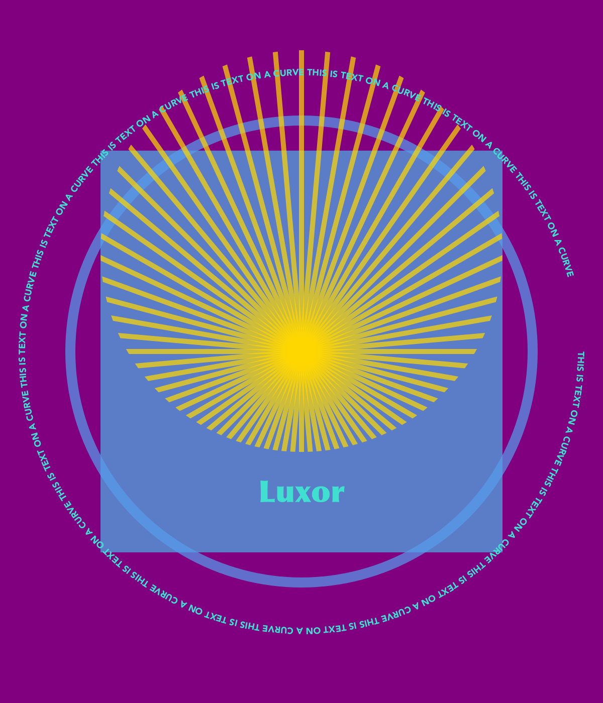

## Luxor

Luxor is the lightest dusting of syntactic sugar on Julia's Cairo graphics package (which should also be installed).

Luxor is intended to be slightly easier to use than Cairo, with shorter names, fewer underscores, and simplified functions. It's for when you just want to draw something without too much ceremony. For a much more powerful graphics environment, try [Compose.jl](http://composejl.org).

[Color.jl](https://github.com/JuliaLang/Color.jl) provides excellent color definitions and is required.

I've only tried this on MacOS X. It will need some changes to work on Windows (but I can't test it).

### Example usage

#### "Hello World"

    using Luxor
    Drawing(1000, 1000, "/tmp/hello-world.png")
    origin()
    sethue(Color.color("red"))
    fontsize(50)
    text("hello world")
    finish()
    preview()

#### General Graphics

    using Luxor, Color
    Drawing(1200, 1400, "/tmp/luxor-test1.png") # or PDF filename for PDF

    origin() # move 0/0 to center
    background(color("purple"))

    setopacity(0.7)     # opacity from 0 to 1
    sethue(0.3,0.7,0.9) # sethue sets the color but doesn't change the opacity
    setline(20) # line width
    # graphics functions use :fill, :stroke, :fillstroke, :clip, or leave blank
    rect(-400,-400,800,800, :fill)
    randomhue()
    circle(0, 0, 460, :stroke)

    # clip the following graphics to a circle positioned above the x axis
    circle(0,-200,400,:clip)
    sethue(color("gold"))
    setopacity(0.7)
    setline(10)

    # simple line drawing
    for i in 0:pi/36:2*pi - pi/36
        move(0, 0)
        line(cos(i) * 600, sin(i) * 600 )
        stroke()
    end

    # finish clipping
    clipreset()

    # here using Mac OS X fonts
    fontsize(60)
    setcolor(color("turquoise"))
    fontface("Optima-ExtraBlack")
    textwidth = textextents("Luxor")[5]
    # move the text by half the width
    text("Luxor", -textwidth/2, currentdrawing.height/2 - 400)

    # text on curve starting on an arc: arc starts at a line through (0,-10) radius 550, centered at 0,0 
    fontsize(18)
    fontface("Avenir-Black")
    textcurve("THIS IS TEXT ON A CURVE " ^ 14, 0, 0, 0, -10, 550)
    finish()
    preview() # Mac OS X only, opens in Preview
 
#### Sierpinski triangle

    using Luxor, Color
    Drawing(400, 400, "/tmp/luxor-test1.pdf") # or PNG filename for PNG

    origin()
    randomhue()

    function drawTriangle(points, degree)
        setcolor(cols[degree+1])
        move(points[1].x,    points[1].y)
        line(   points[2].x,    points[2].y)
        line(   points[3].x,    points[3].y)
        line(   points[1].x,    points[1].y)
        fill()
    end

    getMid(p1,p2) = Point((p1.x+p2.x) / 2, (p1.y + p2.y) / 2)

    function sierpinski(points, degree)
        drawTriangle(points, degree)
        if degree > 0
            sierpinski([points[1],
                            getMid(points[1], points[2]),
                            getMid(points[1], points[3])], degree-1)
            sierpinski([points[2],
                            getMid(points[1], points[2]),
                            getMid(points[2], points[3])], degree-1)
            sierpinski([points[3],
                            getMid(points[3], points[2]),
                            getMid(points[1], points[3])], degree-1)
        end
    end

    function  main()
        setopacity(0.5)
        depth = 8 # 12 is ok, 20 is right out
        cols = distinguishable_colors(depth+1)
        myPoints = [Point(-100,-50), Point(0,100), Point(100,-50)]
        sierpinski(myPoints, depth)
        finish()
        preview()
    end

    main()  

### Functions

#### Files

- `Drawing()`
 	create a PNG drawing defaulting to 800 by 800
- `Drawing(300,300)`
 	create a PNG drawing 300 by 300 pixels
- `Drawing(300,300, "/tmp/my-drawing.pdf")`
 	create a PDF drawing in the file, of 300 by 300 pixels
- `finish()`
 	finish the drawing
- `preview()`
 	open finished drawing in Preview (MacOS X only)

#### Axes and backgrounds

The origin (0/0) is at the top left, x axis runs left to right, y axis runs top to bottom

- `origin()`
	move origin to the centre of the image
- `axes()` 
	draw axes at current 0/0
- `background(color)`
	fill background with a coloured rectangle

#### Shapes and lines

For these functions, the *action* argument can be `:nothing`, `:fill`, `:stroke`, `:fillstroke`, or `:clip`, defaulting to `:nothing`.

- `circle(x, y, r, action)`

- `arc(xc, yc, radius, angle1, angle2, action)`

- `rect(xmin, ymin, w, h, action)`

- `move(x, y)`
	move to this position

- `rmove(x, y)`
	move relative to current position

- `line(x, y)`
	draw line from current position to new position

- `rline(x, y)`
	draw line from current position 

- `curve(x1, y1, x2, y2, x3, y3)`
	
- `poly(list::Array{Point{Float64}}, action = :nothing; close=false)` draw polygon from array of Points. For example:
    
    `poly(randompointarray(0,0,200,200, 85), :stroke)`

- `poly(list::Array, action = :nothing; close=false)` draw polygon from array of tuples. For example:

    `poly([(100,345), (456,523),(150,253)], :stroke)`
	
- `randompoint(lowx, lowy, highx, highy)` return a random point

- `randompointarray(lowx, lowy, highx, highy, n)` return an array of random points. For example:

    `poly(randompointarray(0,0,200,200, 85), :stroke)`

#### Styles

- `setline(n)` set line width

- `setlinecap(s)` set line ends to "butt", "round", or "square"

- `setlinejoin(s)` set line joins to "miter", "round", or "bevel"

- `setdash(dashing)` set line dashing to "solid", "dotted", "dot", "dotdashed", "longdashed", "shortdashed", "dash", "dashed", "dotdotdashed", "dotdotdotdashed"

- `fillstroke()` fill and stroke the current path

- `stroke()` stroke the current path

- `fill()` fill the current path

- `strokepreserve()` stroke the path but keep it current

- `fillpreserve()` fill the path but keep it current

- `save()` save the graphics state

- `restore()` restore the graphics state

#### Transforms

- `scale(sx, sy)` scale by sx and sy

- `rotate(a)` rotate clockwise by a radians around current 0/0

- `translate(tx, ty)` translate by tx/ty

The current matrix is a 6 number array, perhaps like this:

	[1, 0, 0, 1, 0, 0]

- `getmatrix()` gets the current matrix

- `setmatrix(a)` sets the matrix to array `a`

- `transform(a)` transform the current matrix by 'multiplying' it with matrix `a`. For example, to skew by 45 degrees in x and move by 20 in y direction:

    transform([1, 0, tand(45), 1, 0, 20]) 

#### Color and opacity

For color definitions, use Colors.jl. The difference between the `setcolor()` and `sethue()` functions is that `sethue()` is independent of alpha opacity, so you can change the hue without changing the current opacity value (like in Mathematica).

- `setcolor(color)`

	setcolor(color("gold"))
	setcolor(color("darkturquoise"))
	setcolor(convert(Color.HSV, Color.RGB(0.5, 1, 1)))

- `setcolor(r, g, b, alpha)`
	
	setcolor(.2, .3, .4, .5)

- `sethue(r, g, b)` like `setcolor` but doesn't change opacity

- `sethue(color)` like `setcolor`

- `setopacity(alpha)` change the alpha opacity (to between 0 and 1) 

- `randomhue()` random color (without changing current alpha opacity)

- `randomcolor()` random color

#### Paths

- `newpath()`

- `newsubpath()` used for example to make holes in shapes

- `closepath()`
    
#### Clipping

- `clip()`

- `clippreserve()`

- `clipreset()`
    
#### Text and fonts

- `text(t, x, y)` draw string `t` at `x`/`y`, or at 0/0 if `x`/`y` omitted

- `textcentred(t, x, y)` draw string `t` centred at `x`/`y` or 0/0

- `textpath(t)`
	make the string `t` into a graphic path suitable for `fill()`, `stroke()`...

- `textcurve(str, x, y, xc, yc, r)`
	draw string `str` on a circular arc of radius `r` entered at `xc/yc` starting at line passing from `xc/yc` through `x/y`

- `fontface(fontname)`
	choose font `fontname`
	 
- `fontsize(n)`
	set font size in points

- `textextents(str)`
	get array of dimensions of the string `str`, given current font:
	
	`[xb, yb, width, height, advance, yadvance]`

