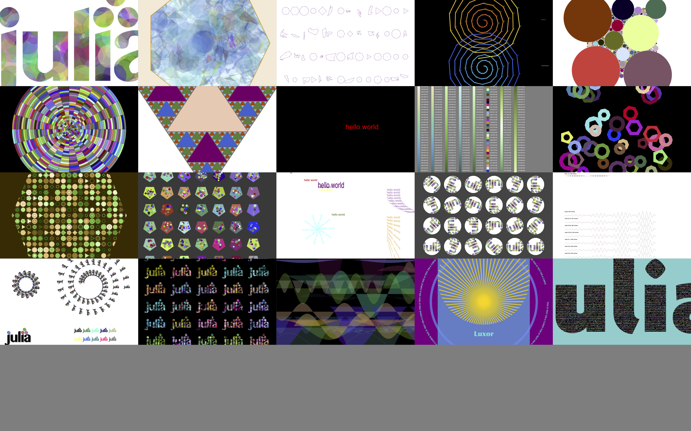

## Luxor

Documentation: http://cormullion.github.io/Luxor.jl/

Luxor is the lightest dusting of syntactic sugar on Julia's Cairo graphics package (which should also be installed). It provides some basic vector drawing commands, and a few utilities for working with polygons, clipping masks, PNG images, and turtle graphics.

The idea of Luxor is that it's easier to use than [Cairo.jl](https://github.com/JuliaLang/Cairo.jl), with shorter names, fewer underscores, default contexts, and simplified functions. It's for when you just want to draw something without too much ceremony. If you've ever hacked on a PostScript file, you should feel right at home (only without the reverse Polish notation, obviously).

[Colors.jl](https://github.com/JuliaGraphics/Colors.jl) provides excellent color definitions and is also required.
