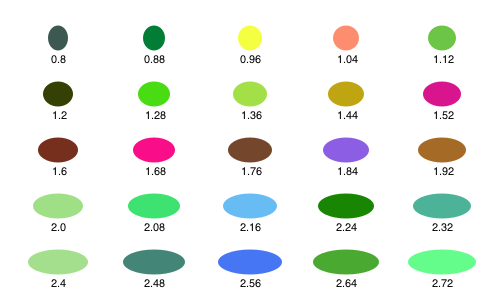

# The basics

The underlying drawing model is that points are added to paths, then the paths can be filled and/or stroked, using the current graphics state, which specifies colors, line thicknesses and patterns, and opacity. You can modify the drawing space by transforming/rotating/scaling it before you add graphics.

Many of the drawing functions have an *action* argument. This can be `:nothing`, `:fill`, `:stroke`, `:fillstroke`, `:fillpreserve`, `:strokepreserve`, `:clip`. The default is `:nothing`.

Positions are usually specified either by x and y coordinates or a `Point(x, y)`. Angles are usually measured starting at the positive x-axis going towards the positive y-axis (which usually points 'down' the page or canvas) in radians. Or 'clockwise'.

## Types

The two main defined types are the `Point` and the `Drawing`. The Point type holds two coordinates, `x` and `y`:

```
Point(12.0, 13.0)
```

It's immutable, so you want to avoid trying to change the x or y coordinate directly. You can use the letter *O* as a shortcut to refer to the current Origin, `Point(0, 0)`.

The other is `Drawing`, which is how you create new drawings.

## Drawings and files

To create a drawing, and optionally specify the filename and type, and dimensions, use the `Drawing` constructor function.

```@docs
Drawing
```

To finish a drawing and close the file, use `finish()`, and, to launch an external application to view it, use `preview()`.

```@docs
finish
preview
```

The global variable `currentdrawing` (of type Drawing) holds a few parameters which are occasionally useful:

```
julia> fieldnames(currentdrawing)
10-element Array{Symbol,1}:
:width
:height
:filename
:surface
:cr
:surfacetype
:redvalue
:greenvalue
:bluevalue
:alpha
```

The drawing area (or any other area) can be divided into rectangular tiles (as rows and columns) using the `Tiler` iterator, which returns the center point and tile number of each tile.

In this example, every third tile is divided up into subtiles and colored:

```@example
using Luxor, Colors # hide
Drawing(400, 300, "../figures/tiler.png") # hide
background("white") # hide
origin() # hide
srand(1) # hide
fontsize(20) # hide
tiles = Tiler(400, 300, 4, 5, margin=5)
for (pos, n) in tiles
  randomhue()
  box(pos, tiles.tilewidth, tiles.tileheight, :fill)
  if n % 3 == 0
    gsave()
    translate(pos)
    subtiles = Tiler(tiles.tilewidth, tiles.tileheight, 4, 4, margin=5)
    for (pos1, n1) in subtiles
      randomhue()
      box(pos1, subtiles.tilewidth, subtiles.tileheight, :fill)
    end
     grestore()
  end
  sethue("white")
  textcentred(string(n), pos + Point(0, 5))
end
finish() # hide
```


```@docs
Tiler
```

## Axes and backgrounds

The origin (0/0) starts off at the top left: the x axis runs left to right, and the y axis runs top to bottom.

The `origin()` function moves the 0/0 point to the center of the drawing. It's often convenient to do this at the beginning of a program. You can use functions like `scale()`, `rotate()`, and `translate()` to change the coordinate system.

`background()` fills the image with a color, covering any previous contents. By default, PDF files have a white background, whereas PNG drawings have no background, so the background appears transparent in other applications. If there is a current clipping region, `background()` fills just that region. Here, the first `background()` filled the entire drawing; the calls in the loop fill only the active clipping region:

```@example
using Luxor, Colors # hide
Drawing(600, 400, "../figures/backgrounds.png") # hide
background("magenta")
origin() # hide
tiles = Tiler(600, 400, 5, 5, margin=30)
for (pos, n) in tiles
  box(pos, tiles.tilewidth, tiles.tileheight, :clip)
  background(randomhue()...)
  clipreset()
end
finish() # hide
```


The `axes()` function draws a couple of lines and text labels in light gray to indicate the position and orientation of the current axes.

```@example
using Luxor, Colors # hide
Drawing(400, 400, "../figures/axes.png") # hide
background("gray80")
origin()
axes()
finish() # hide
```


```@docs
background
axes
origin
```

## Simple shapes

Functions for making shapes include `circle()`, `ellipse()`, `squircle()`, `arc()`, `carc()`, `curve()`, `sector()`, `rect()`, `pie()`, and `box()`. There's also `ngon()` and `star()`, listed under Polygons, below.

## Rectangles and boxes


```@docs
rect
box
polybbox
```

## Circles, ellipses, and the like

There are various ways to make circles, including by center and radius, through two points, or passing through three points.

```@example
using Luxor, Colors # hide
Drawing(400, 200, "../figures/circles.png") # hide
background("white") # hide
origin() # hide
setline(2) # hide
p1 = O
p2 = Point(100, 0)
sethue("red")
circle(p1, 40, :fill)
sethue("green")
circle(p1, p2, :stroke)
sethue("black")
arrow(O, Point(0, -40))
map(p -> circle(p, 4, :fill), [p1, p2])
finish() # hide
```


```@example
using Luxor, Colors # hide
Drawing(400, 200, "../figures/center3.png") # hide
background("white") # hide
origin() # hide
setline(3) # hide
sethue("black")
p1 = Point(0, -50)
p2 = Point(100, 0)
p3 = Point(0, 65)
map(p -> circle(p, 4, :fill), [p1, p2, p3])
sethue("orange") # hide
circle(center3pts(p1, p2, p3)..., :stroke)
finish() # hide
```


With `ellipse()` you can place ellipses (and circles) by defining the center point and the width and height.

```@example
using Luxor, Colors # hide
Drawing(500, 300, "../figures/ellipses.png") # hide
background("white") # hide
fontsize(11) # hide
srand(1) # hide
origin() # hide
tiles = Tiler(500, 300, 5, 5)
width = 20
height = 25
for (pos, n) in tiles
  randomhue()
  ellipse(pos, width, height, :fill)
  sethue("black")
  label = string(round(width/height, 2))
  textcentered(label, pos.x, pos.y + 25)
  width += 2
end
finish() # hide
```



```@docs
circle
ellipse
```

A sector (strictly an "annular sector") has an inner and outer radius, as well as start and end angles.

```@example
using Luxor, Colors # hide
Drawing(400, 200, "../figures/sector.png") # hide
background("white") # hide
origin() # hide
sethue("cyan") # hide
sector(50, 90, pi/2, 0, :fill)
finish() # hide
```


```@docs
sector
```

A pie (or wedge) has start and end angles.

```@example
using Luxor, Colors # hide
Drawing(400, 300, "../figures/pie.png") # hide
background("white") # hide
origin() # hide
sethue("magenta") # hide
pie(0, 0, 100, pi/2, pi, :fill)
finish() # hide
```


```@docs
pie
```

A *squircle* is a cross between a square and a circle. You can adjust the squariness and circularity of it to taste:

```@example
using Luxor, Colors # hide
Drawing(600, 250, "../figures/squircle.png") # hide
background("white") # hide
origin() # hide
fontsize(20) # hide
setline(2)
tiles = Tiler(600, 250, 1, 3)
for (pos, n) in tiles
    sethue("lavender")
    squircle(pos, 80, 80, rt=[0.3, 0.5, 0.7][n], :fillpreserve)
    sethue("grey20")
    stroke()
    textcentered("rt = $([0.3, 0.5, 0.7][n])", pos)
end
finish() # hide
```


```@docs
squircle
```

## Lines, arcs, and curves

There is a 'current position' which you can set with `move()`, and can use implicitly in functions like `line()`, `text()`, and `curve()`.

`curve()` constructs Bèzier curves from control points:

```@example
using Luxor, Colors # hide
Drawing(500, 175, "../figures/curve.png") # hide
origin() # hide
background("white") # hide

setline(.1)
pt1 = Point(0, -125)
pt2 = Point(200, 125)
pt3 = Point(200, -125)

sethue("red")
foreach(p -> circle(p, 2, :fill), [O, pt1, pt2, pt3])

line(O, pt1, :stroke)
line(pt2, pt3, :stroke)

sethue("black")
setline(3)

move(O)
curve(pt1, pt2, pt3)
stroke()
finish()
```


There are a few arc-drawing commands, such as `arc()`, `carc()`, and `arc2r()`. `arc2r()` draws a circular arc that joins two points:  

```@example
using Luxor, Colors # hide
Drawing(500, 175, "../figures/arc2r.png") # hide
origin() # hide
background("white") # hide
tiles = Tiler(500, 175, 1, 4)
for (pos, n) in tiles
    c1, pt2, pt3 = ngon(pos, rand(10:50), 3, rand(0:pi/12:2pi), vertices=true)
    sethue("black")
    map(pt -> circle(pt, 4, :fill), [c1, pt3])
    sethue("red")
    circle(pt2, 4, :fill)
    randomhue()
    arc2r(c1, pt2, pt3, :stroke)
end
finish() # hide
```


```@docs
move
rmove
line
rline
arc
arc2r
carc
curve
```

## Arrows

You can draw lines or arcs with arrows at the end with `arrow()`. For straight arrows, supply the start and end points. For arrows as circular arcs, you provide center, radius, and start and finish angles. You can optionally provide dimensions for the arrowheadlength and angle of the tip of the arrow. The default line weight is 1.0, equivalent to `setline(1)`), but you can specify another with otherwise the default is 1.

```@example
using Luxor, Colors # hide
Drawing(400, 250, "../figures/arrow.png") # hide
background("white") # hide
origin() # hide
sethue("steelblue4") # hide
setline(2) # hide
arrow(O, Point(0, -65))
arrow(O, Point(100, -65), arrowheadlength=20, arrowheadangle=pi/4, linewidth=.3)
arrow(O, 100, pi, pi/2, arrowheadlength=25,   arrowheadangle=pi/12, linewidth=1.25)
finish() # hide
```


```@docs
arrow
```

## Paths

A path is a group of points. A path can have subpaths (which can form holes).

The `getpath()` function gets the current Cairo path as an array of element types and points. `getpathflat()` gets the current path as an array of type/points with curves flattened to line segments.

```@docs
newpath
newsubpath
closepath
getpath
getpathflat
```

## Color and opacity

For color definitions and conversions, use Colors.jl.

The difference between the `setcolor()` and `sethue()` functions is that `sethue()` is independent of alpha opacity, so you can change the hue without changing the current opacity value.

```@docs
sethue
setcolor
randomhue
randomcolor
```

## Styles

The `set-` functions control subsequent lines' width, end shapes, join behavior, and dash pattern:

```@example
using Luxor, Colors # hide
Drawing(400, 250, "../figures/line-ends.png") # hide
background("white") # hide
origin() # hide
translate(-100, -60) # hide
fontsize(18) # hide
for l in 1:3
  sethue("black")
  setline(20)
  setlinecap(["butt", "square", "round"][l])
  textcentred(["butt", "square", "round"][l], 80l, 80)
  setlinejoin(["round", "miter", "bevel"][l])
  textcentred(["round", "miter", "bevel"][l], 80l, 120)
  poly(ngon(Point(80l, 0), 20, 3, 0, vertices=true), :strokepreserve, close=false)
  sethue("white")
  setline(1)
  stroke()
end
finish() # hide
```


```@example
using Luxor, Colors # hide
Drawing(600, 250, "../figures/dashes.png") # hide
background("white") # hide
origin() # hide
fontsize(14) # hide
sethue("black") # hide
setline(12)
patterns = ["solid", "dotted", "dot", "dotdashed", "longdashed",
  "shortdashed", "dash", "dashed", "dotdotdashed", "dotdotdotdashed"]
tiles =  Tiler(400, 250, 10, 1, margin=10)
for (pos, n) in tiles
  setdash(patterns[n])
  textright(patterns[n], pos.x - 20, pos.y + 4)
  line(pos, Point(400, pos.y), :stroke)
end
finish() # hide
```


```@docs
setline
setlinecap
setlinejoin
setdash
fillstroke
stroke
fill
strokepreserve
fillpreserve
```

`gsave()` saves a copy of the current graphics settings (current axis rotation, position, scale, line and text settings, color, and so on). When the next `grestore()` is called, all changes you've made to the graphics settings will be discarded, and they'll return to how they were when you last used `gsave()`. `gsave()` and `grestore()` should always be balanced in pairs.

```@docs
gsave
grestore
```

## Polygons and shapes

### Shapes

### Regular polygons ("ngons")

You can make regular polygons — from triangles, pentagons, hexagons, septagons, heptagons, octagons, nonagons, decagons, and on-and-on-agons — with `ngon()`.


```julia
using Luxor, Colors
Drawing(1200, 1400)

origin()
cols = diverging_palette(60, 120, 20) # hue 60 to hue 120
background(cols[1])
setopacity(0.7)
setline(2)

ngon(0, 0, 500, 8, 0, :clip)

for y in -500:50:500
  for x in -500:50:500
    setcolor(cols[rand(1:20)])
    ngon(x, y, rand(20:25), rand(3:12), 0, :fill)
    setcolor(cols[rand(1:20)])
    ngon(x, y, rand(10:20), rand(3:12), 0, :stroke)
  end
end

finish()
preview()
```

```@docs
ngon
```
### Polygons

A polygon is an array of Points. Use `poly()` to draw it:

```@example
using Luxor, Colors # hide
Drawing(400, 250, "../figures/simplepoly.png") # hide
background("white") # hide
origin() # hide
sethue("orchid4")
poly([Point(rand(-150:150), rand(-100:100)) for i in 1:20], :fill)
finish() # hide
```


```@docs
poly
```

A polygon can contain holes. The `reversepath` keyword changes the direction of the polygon. The following piece of code uses `ngon()` to make two paths, the second forming a hole in the first, to make a hexagonal bolt shape:

```@example
using Luxor, Colors # hide
Drawing(400, 250, "../figures/holes.png") # hide
background("white") # hide
origin() # hide
sethue("orchid4") # hide
ngon(0, 0, 60, 6, 0, :path)
newsubpath()
ngon(0, 0, 40, 6, 0, :path, reversepath=true)
fillstroke()
finish() # hide
```


The `prettypoly()` function can place graphics at each vertex of a polygon. After the polygon action, the `vertex_action` expression is evaluated at each vertex. For example, to mark each vertex of a polygon with a randomly-colored circle:

```@example
using Luxor, Colors
Drawing(400, 250, "../figures/prettypolybasic.png") # hide
background("white") # hide
origin() # hide
sethue("steelblue4") # hide
setline(4)
poly1 = ngon(0, 0, 100, 6, 0, vertices=true)
prettypoly(poly1, :stroke, :(
  randomhue();
  scale(0.5, 0.5);
  circle(0, 0, 15, :stroke)
  ),
close=true)
finish() # hide
```


```@docs
prettypoly
```

Introducing recursion is possible, but some of the parameters have to be enclosed with `$()` to protect them on their journey through the evaluation process:

```@example
using Luxor, Colors # hide
Drawing(400, 250, "../figures/prettypolyrecursive.png") # hide
background("white") # hide
srand(42) # hide
origin() # hide
sethue("magenta") # hide
setopacity(0.5) # hide

p = star(O, 80, 7, 0.3, 0, vertices=true)
prettypoly(p, :fill,
                  :(
                  ## for each vertex of the mother polygon
                  randomhue();
                  scale(0.5, 0.5);
                  prettypoly($(p), :fill,
                    :(
                    # for each vertex of each daughter polygon
                    randomhue();
                    scale(0.15, 0.15);
                    prettypoly($($(p)), :fill)))))

finish()
```


Polygons can be simplified using the Douglas-Peucker algorithm (non-recursive version), via `simplify()`.

```@example
using Luxor, Colors # hide
Drawing(600, 500, "../figures/simplify.png") # hide
background("white") # hide
origin() # hide
sethue("black") # hide
setline(1) # hide
fontsize(20) # hide
translate(0, -120) # hide
sincurve =  (Point(6x, 80sin(x)) for x in -5pi:pi/20:5pi)
prettypoly(collect(sincurve), :stroke, :(sethue("red"); circle(0, 0, 3, :fill)))
text(string("number of points: ", length(collect(sincurve))), 0, 100)
translate(0, 200)
simplercurve = simplify(collect(sincurve), 0.5)
prettypoly(simplercurve, :stroke, :(sethue("red"); circle(0, 0, 3, :fill)))
text(string("number of points: ", length(simplercurve)), 0, 100)
finish() # hide
```


```@docs
simplify
```

The `isinside()` function returns true if a point is inside a polygon.

```@example
using Luxor, Colors # hide
Drawing(400, 250, "../figures/isinside.png") # hide
background("white") # hide
origin() # hide
setopacity(0.5)
apolygon = star(O, 100, 5, 0.5, 0, vertices=true)
for n in 1:10000
  apoint = randompoint(Point(-200, -150), Point(200, 150))
  randomhue()
  isinside(apoint, apolygon) && circle(apoint, 3, :fill)
end
finish() # hide
```


```@docs
isinside
```

You can use `randompoint()` and `randompointarray()` to create a random Point or list of Points.

```@example
using Luxor, Colors # hide
Drawing(400, 250, "../figures/randompoints.png") # hide
background("white") # hide
srand(42) # hide
origin() # hide

pt1 = Point(-100, -100)
pt2 = Point(100, 100)

sethue("gray80")
map(pt -> circle(pt, 6, :fill), (pt1, pt2))
box(pt1, pt2, :stroke)

sethue("red")
circle(randompoint(pt1, pt2), 7, :fill)

sethue("blue")
map(pt -> circle(pt, 2, :fill), randompointarray(pt1, pt2, 100))

finish() # hide
```


```@docs
randompoint
randompointarray
```

There are some experimental polygon functions. These don't work well for polygons that aren't simple or where the sides intersect each other, but they sometimes do a reasonable job. For example, here's `polysplit()`:

```@example
using Luxor, Colors # hide
Drawing(400, 150, "../figures/polysplit.png") # hide
origin() # hide
setopacity(0.7) # hide
srand(42) # hide
sethue("black") # hide
s = squircle(O, 60, 60, vertices=true)
pt1 = Point(0, -120)
pt2 = Point(0, 120)
line(pt1, pt2, :stroke)
poly1, poly2 = polysplit(s, pt1, pt2)
randomhue()
poly(poly1, :fill)
randomhue()
poly(poly2, :fill)
finish() # hide
```


```@docs
polysplit
polysortbydistance
polysortbyangle
polycentroid
```

### Stars

Use `star()` to make a star.

```@example
using Luxor, Colors # hide
Drawing(500, 300, "../figures/stars.png") # hide
background("white") # hide
origin() # hide
tiles = Tiler(400, 300, 4, 6, margin=5)
for (pos, n) in tiles
  randomhue()
  star(pos, tiles.tilewidth/3, rand(3:8), 0.5, 0, :fill)
end
finish() # hide
```


```@docs
star
```

## Text and fonts

### Placing text

Use `text()` to place text.

```@example
using Luxor, Colors # hide
Drawing(400, 150, "../figures/text-placement.png") # hide
origin() # hide
background("white") # hide
fontsize(24) # hide
sethue("black") # hide
pt1 = Point(-100, 0)
pt2 = Point(0, 0)
pt3 = Point(100, 0)
sethue("red")
map(p -> circle(p, 4, :fill), [pt1, pt2, pt3])
sethue("black")
text("text 1",  pt1, halign=:left,   valign = :bottom)
text("text 2",  pt2, halign=:center, valign = :bottom)
text("text 3",  pt3, halign=:right,  valign = :bottom)
text("text 4",  pt1, halign=:left,   valign = :top)
text("text 5 ", pt2, halign=:center, valign = :top)
text("text 6",  pt3, halign=:right,  valign = :top)
finish() # hide
```


```@docs
text
```

`textpath()` converts the text into a graphic path suitable for further styling.

```@docs
textpath
```

### Fonts

Use `fontface(fontname)` to choose a font, and `fontsize(n)` to set the font size in points.

The `textextents(str)` function gets an array of dimensions of the string `str`, given the current font.


The green dot is the text placement point and reference point for the font, the yellow circle shows the text block's x and y bearings, and the blue dot shows the advance point where the next character should be placed.

```@docs
fontface
fontsize
textextents
```

### Text on a curve

Use `textcurve(str)` to draw a string `str` on a circular arc or spiral.


```julia
using Luxor, Colors
Drawing(1800, 1800, "/tmp/text-spiral.png")
origin()
background("ivory")
fontsize(18)
fontface("LucidaSansUnicode")
sethue("royalblue4")
textstring = join(names(Base), " ")
textcurve("this spiral contains every word in julia names(Base): " * textstring, -pi/2,
  800, 0, 0,
  spiral_in_out_shift = -18.0,
  letter_spacing = 0,
  spiral_ring_step = 0)

fontsize(35)
fontface("Agenda-Black")
textcentred("julia names(Base)", 0, 0)
finish()
preview()
```

```@docs
textcurve
```

### Text clipping

You can use newly-created text paths as a clipping region - here the text paths are filled with names of randomly chosen Julia functions:


```julia
using Luxor, Colors

currentwidth = 1250 # pts
currentheight = 800 # pts
Drawing(currentwidth, currentheight, "/tmp/text-path-clipping.png")

origin()
background("darkslategray3")

fontsize(600)                             # big fontsize to use for clipping
fontface("Agenda-Black")
str = "julia"                             # string to be clipped
w, h = textextents(str)[3:4]              # get width and height

translate(-(currentwidth/2) + 50, -(currentheight/2) + h)

textpath(str)                             # make text into a path
setline(3)
setcolor("black")
fillpreserve()                            # fill but keep
clip()                                    # and use for clipping region

fontface("Monaco")
fontsize(10)
namelist = map(x->string(x), names(Base)) # get list of function names in Base.

x = -20
y = -h
while y < currentheight
    sethue(rand(7:10)/10, rand(7:10)/10, rand(7:10)/10)
    s = namelist[rand(1:end)]
    text(s, x, y)
    se = textextents(s)
    x += se[5]                            # move to the right
    if x > w
       x = -20                            # next row
       y += 10
    end
end

finish()
preview()
```
