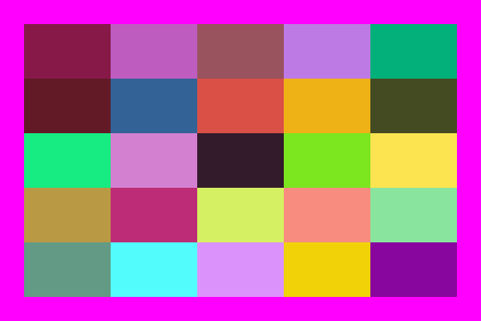

```@meta
DocTestSetup = quote
    using Luxor, Colors
    end
```

# The basics

The underlying drawing model is that you make shapes, and add points to paths, and these are filled and/or stroked, using the current *graphics state*, which specifies colors, line thicknesses, and opacity. You can modify the current graphics state by transforming/rotating/scaling it, and setting style parameters, and so on. Subsequent graphics use the new state, but the graphics you've already drawn are unchanged.

You can specify points on the drawing surface using `Point(x, y)`. The default origin is at the top left of the drawing area, but you can reposition it at any time. Many of the drawing functions have an *action* argument. This can be `:none`, `:fill`, `:stroke`, `:fillstroke`, `:fillpreserve`, `:strokepreserve`, `:clip`, or `:path`. The default is `:none`.

Y coordinates increase downwards, so `Point(0, 100)` is below `Point(0, 0)`. This is the preferred coordinate system for computer graphics software, but mathematicians and scientists may well be used to the y-axis increasing upwards...

The main types you'll encounter in Luxor are:

| Name of type      | Purpose |
| ---               | ---     |
| Drawing           | holds the current drawing |
| Point             | specifies 2D points |
| BoundingBox       | defines a bounding box |
| Table             | defines a table with different column widths and row  heights |
| Partition         | defines a table defined by cell width and height |
| Tiler             | defines a rectangular grid of tiles |
| BezierPathSegment | a Bezier path segment defined by 4 points |
| BezierPath        | contains a series of BezierPathSegments |
| GridRect          | defines a rectangular grid |
| GridHex           | defines a hexagonal grid |
| Scene             | used to define a scene for an animation |
| Turtle            | represents a turtle for drawing turtle graphics |

## Points and coordinates

The Point type holds two coordinates, `x` and `y`. For example:

```julia
julia> P = Point(12.0, 13.0)
Luxor.Point(12.0, 13.0)

julia> P.x
12.0

julia> P.y
13.0
```

Points are immutable, so you can't change P's x or y values directly. But it's easy to make new points based on existing ones.

Points can be added together:

```julia
julia> Q = Point(4, 5)
Luxor.Point(4.0, 5.0)

julia> P + Q
Luxor.Point(16.0, 18.0)
```

You can add or multiply Points and scalars:

```julia
julia> 10P
Luxor.Point(120.0, 130.0)

julia> P + 100
Luxor.Point(112.0, 113.0)
```

You can also make new points by mixing Points and tuples:

```julia
julia> P + (10, 0)
Luxor.Point(22.0, 13.0)

julia> Q * (0.5, 0.5)
Luxor.Point(2.0, 2.5)
```

You can also create points from tuples:
```
julia> Point((1.0, 14))
Point(1.0, 14.0)

julia> plist = (1.0, 2.0), (-10, 10), (14.2, 15.4));

julia> Point.(plist)
3-element Array{Point,1}:
 Point(1.0, 2.0)
 Point(-10.0, 10.0)
 Point(14.2, 15.4)
```

You can use the letter **O** as a shortcut to refer to the current Origin, `Point(0, 0)`.

```@example
using Luxor # hide
Drawing(600, 300, "assets/figures/point-ex.png") # hide
background("white") # hide
origin() # hide
sethue("blue") # hide
rulers()
box.([O + (i, 0) for i in range(0, stop=200, length=5)], 20, 20, :stroke)
finish() # hide
nothing # hide
```


Angles are usually supplied in radians, measured starting at the positive x-axis turning towards the positive y-axis (which usually points 'down' the page or canvas, so 'clockwise'). (The main exception is for turtle graphics, which conventionally let you supply angles in degrees.)

Coordinates are interpreted as PostScript points, where a point is 1/72 of an inch.

Because Julia allows you to combine numbers and variables directly, you can supply units with dimensions and have them converted to points (assuming the current scale is 1:1):

- inch (`in` is unavailable, being used by `for` syntax)
- cm   (centimeters)
- mm   (millimeters)

For example:

```
rect(Point(20mm, 2cm), 5inch, (22/7)inch, :fill)
```

## Drawings

### Drawings and files

To create a drawing, and optionally specify the filename, type, and dimensions, use the `Drawing` constructor function.

```@docs
Drawing
paper_sizes
```

To finish a drawing and close the file, use `finish()`, and, to launch an external application to view it, use `preview()`.

If you're using a notebook environment, such as Jupyter (IJulia) or Pluto, `preview()` tries to display PNG and SVG files in the next notebook cell.


If you're using Juno or VS Code, then PNG and SVG files should appear in the Plots pane.


```@docs
finish
preview
```

!!! note

    SVGs are text based, and can get quite big. Up to a certain size, SVGs will be previewable as easily and quickly as PNGs. But very large drawings in SVG format won't necessarily  be displayed.

## Quick drawings with macros

The `@draw`, `@svg`, `@png`, and `@pdf` macros are designed to let you quickly create graphics without having to provide the usual boiler-plate functions. For example, the Julia code:

```julia
@svg circle(O, 20, :stroke) 50 50
```

expands to

```julia
Drawing(50, 50, "luxor-drawing-(timestamp).svg")
origin()
background("white")
sethue("black")
circle(O, 20, :stroke)
finish()
preview()
```

They're short-cuts - designed to save typing. You can omit the width and height (defaulting to 600 by 600, except for `@imagematrix`), and you don't have to specify a filename (you'll get time-stamped files in the current working directory). For multiple lines, use either:

```julia
@svg begin
    setline(10)
    sethue("purple")
    circle(O, 20, :fill)
end
```

or (less nicely):

```julia
@svg (setline(10);
      sethue("purple");
      circle(O, 20, :fill)
     )
```

The `@draw` macro creates an in-memory drawing. You should see it displayed if you're working in a capable environment (Juno, VSCode, Jupyter, Pluto).

```@docs
@svg
@png
@pdf
@draw
@imagematrix
```

If you don't specify a size, the defaults are 600 by 600. If you don't specify a file name, files created with the macros are placed in your current working directory as `luxor-drawing-` followed by a time stamp. You don't have to specify the suffix:

```
@svg juliacircles(150) 400 400 "test" # saves in "test.svg"
```

If you want to create drawings with transparent backgrounds, or located other than in the center, use the longer form rather than the macros:

```julia
Drawing()
background(1, 1, 1, 0)
origin()
setline(30)
sethue("green") # assumes current opacity
box(BoundingBox() - 50, :stroke)
finish()
preview()
```


### Drawings in memory

You can choose to store the drawing in memory. The advantage is that in-memory drawings are quicker, and can be passed as Julia data. It's useful in some environments to not have to worry about writing files. This syntax for the `Drawing()` function:

```
Drawing(width, height, surfacetype, [filename])
```

lets you supply `surfacetype` as a symbol (`:svg` or `:png`). This creates a new drawing of the given surface type and stores the image only in memory if no `filename` is supplied. The `@draw` macro creates PNG files in memory.

You can specify `:image` as the surface type. This allows you to copy the current drawing into a 2D matrix (using `image_as_matrix()`). See the Images chapter for more information.

### Interactive graphics with IJulia and Interact

Currently, you should use an in-memory SVG drawing to display graphics if you're using Interact.jl. This example provides an HSB color widget.

```julia
using Interact, Colors, Luxor
@manipulate for h in 0:360, s in 0:0.01:1, b in 0:0.01:1
    d = Drawing(300, 300, :svg)
    sethue(Colors.HSB(h, s, b))
    origin()
    circle(O, 100, :fill)  
    circle(polar(110, deg2rad(h)), 10, :fill)
    sethue("black")
    label(string(h, "°"), deg2rad(h), polar(120, deg2rad(h)))
        finish()
    d
end
```


# Drawing as image matrix

While drawing, you can copy the data in the form of a
matrix, using the `image_as_matrix()` function.

`image_as_matrix()` returns a array of ARGB32 values that encode the Red, Green, Blue, and Alpha values of each pixel.

The following example draws a red rectangle, then copies the drawing into a matrix called `mat1`. Then it adds a blue triangle, and copies the updated drawing into `mat2`. Then, the second drawing reads the values in from the two matrices and draws some square tiles depending on the corresponding values in the two matrices ... a very primitive Boolean operation.

```@example
using Luxor, Colors, Random # hide
Random.seed!(42) # hide
Drawing(40, 40, :png)
origin()
background("black")
sethue("red")
box(O, 40, 15, :fill)
mat1 = image_as_matrix()
sethue("blue")
setline(10)
setopacity(0.6)
ngon(O, 10, 3, 0, :stroke)
mat2 = image_as_matrix()
finish()

# second drawing

Drawing(400, 400, "assets/figures/image-drawings.svg")
background("grey20")
origin()
t = Table(40, 40, 4, 4)
sethue("white")
rc = CartesianIndices(mat1)
for i in rc
    r, c = Tuple(i)
    pixel1 = convert(Colors.RGBA, mat1[r, c])
    pixel2 = convert(Colors.RGBA, mat2[r, c])
    if red(pixel1) > .5 && blue(pixel2) > .5
        randomhue()
        box(t, r, c, :fillstroke)
    end
end
finish() # hide
nothing # hide
```


(You can use `collect()` to gather the re-interpreted values together.)

If you're working with Images.jl, you will probably want to transpose the array:

```
using Luxor, Images

# in Luxor

Drawing(50, 50, :png)
origin()
background(randomhue()...)
sethue("white")
fontsize(40)
fontface("Georgia")
text("42", halign=:center, valign=:middle)
mat = image_as_matrix();
finish()

# in Images

img = Gray.(mat)
display(imresize(img, 150, 150))
```

## The drawing surface

The origin (0/0) starts off at the top left: the x axis runs left to right across the page, and the y axis runs top to bottom down the page.

The `origin()` function moves the 0/0 point to the center of the drawing. It's often convenient to do this at the beginning of a program.

You can use functions like `scale()`, `rotate()`, and `translate()` to change the coordinate system.

`background()` fills the drawing with a color, covering any previous contents. By default, PDF drawings have a white background, whereas PNG drawings have no background so that the background appears transparent in other applications. If there is a current clipping region, `background()` fills just that region. In the next example, the first `background()` fills the entire drawing with magenta, but the calls in the loop fill only the active clipping region, a table cell defined by the `Table` iterator:

```@example
using Luxor # hide
Drawing(600, 400, "assets/figures/backgrounds.png") # hide
background("magenta")
origin()
table = Table(5, 5, 100, 50)
for (pos, n) in table
    box(pos,
        table.colwidths[table.currentcol],
        table.rowheights[table.currentrow],
        :clip)
    background(randomhue()...)
    clipreset()
end
finish() # hide
nothing # hide
```



The `rulers()` function draws a couple of rulers to indicate the position and orientation of the current axes.

```@example
using Luxor # hide
Drawing(400, 400, "assets/figures/axes.png") # hide
background("gray80")
origin()
rulers()
finish() # hide
nothing # hide
```


```@docs
background
rulers
origin
```

## Save and restore

`gsave()` saves a copy of the current graphics settings (current axis rotation, position, scale, line and text settings, color, and so on). When the next `grestore()` is called, all changes you've made to the graphics settings will be discarded, and the previous settings are restored, so things return to how they were when you last used `gsave()`. `gsave()` and `grestore()` should always be balanced in pairs.

The `@layer` macro is a synonym for a `gsave()`...`grestore()` pair.

```julia
@svg begin
    circle(O, 100, :stroke)
    @layer (sethue("red"); rule(O); rule(O, π/2))
    circle(O, 200, :stroke)
end
```

or

```julia
@svg begin
    circle(O, 100, :stroke)
    @layer begin
        sethue("red")
        rule(O)
        rule(O, pi/2)
    end
    circle(O, 200, :stroke)
end
```

```@docs
gsave
grestore
```

## Return the current drawing

In some situations you'll want to explicitly return the current drawing to the calling function.

```@docs
currentdrawing
```
