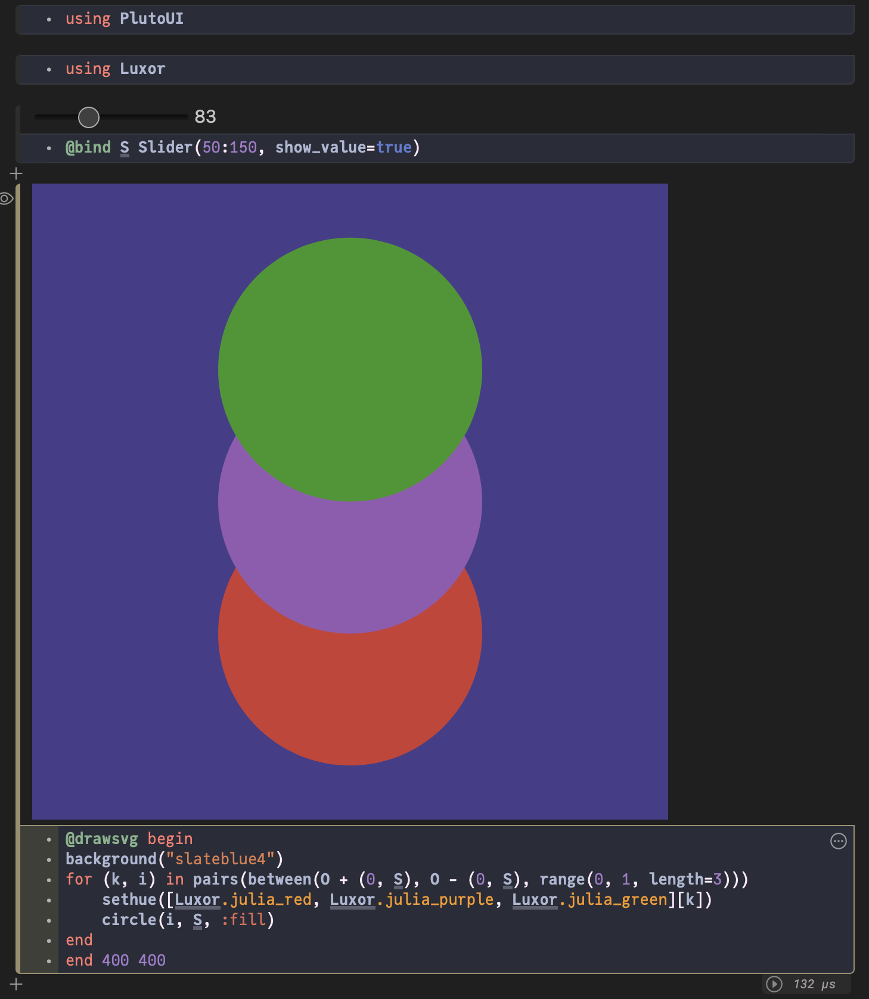
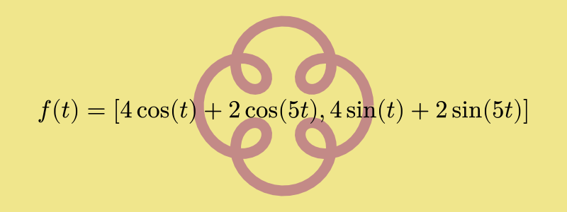

```@meta
DocTestSetup = quote
    using Luxor, Colors
end
```
# Simple examples

## The obligatory "Hello World"

Here's the "Hello world":


```julia
using Luxor
Drawing(1000, 1000, "hello-world.png")
origin()
background("black")
sethue("red")
fontsize(50)
text("hello world")
finish()
preview()
```

`Drawing(1000, 1000, "hello-world.png")` defines the width,
height, location, and format of the finished image.
[`origin`](@ref) moves the 0/0 point to the centre of the
drawing surface (by default it's at the top left corner).
Thanks to `Colors.jl` we can specify colors by name as well
as by numeric value: [`background("black")`](@ref) defines
the color of the background of the drawing.
`text("helloworld")` draws the text. It's placed at the
current 0/0 point and left-justified if you don't specify
otherwise. [`finish`](@ref) completes the drawing and saves
the PNG image in the file. [`preview`](@ref) tries to
display the saved file, perhaps using another application
(eg Preview on macOS).

The macros `@png`, `@svg`, `@pdf`, `@draw`, and
`@imagematrix` provide shortcuts for making and previewing
graphics without you having to provide the usual set-up and
finish instructions:

So this macro:

```julia
using Luxor

@png begin
    fontsize(50)
    circle(Point(0, 0), 150, action = :stroke)
    text("hello world", halign=:center, valign=:middle)
end
```


expands the 140 or so characters into this 250+ character source:

```julia
Drawing(600, 600, "luxor-drawing-072453_822.png")
origin()
background("white")
sethue("black")
fontsize(50)
circle(Point(0, 0), 150, action=:stroke)
text("hello world", halign=:center, valign=:middle)
finish()
preview()
```

The `@drawsvg` macro returns SVG code of the drawing which, in this Documenter-generated document, will be inserted into the HTML source of the page.

```@example
using Luxor

@drawsvg begin
    background("black")
    sethue("red")
    randpoint = Point(rand(-300:300), rand(-300:300))
    circle(randpoint, 5, action = :fill)
    sethue("white")
    foreach(f -> arrow(f, between(f, randpoint, .1), arrowheadlength=6),
        first.(collect(Table(fill(30, 20), fill(30, 20)))))
end
```

The `@draw` and `drawsvg` macros create a PNG or SVG format drawing in memory, rather than saved in a file, and the result of executing the code is returned and, in many editing environments, included and displayed as a graphic. For VS Code, the graphic is usually displayed in the plot pane. In Pluto, it appears above the cell.

```julia
using Luxor

@draw begin
    setopacity(0.85)
    steps = 20
    gap   = 2
    for (n, θ) in enumerate(range(0, step=2π/steps, length=steps))
        sethue([Luxor.julia_green,
            Luxor.julia_red,
            Luxor.julia_purple,
            Luxor.julia_blue][mod1(n, 4)])
        sector(Point(0, 0), 50, 250 + 2n, θ, θ + 2π/steps - deg2rad(gap), action = :fill)
    end
end
```




## The Julia logos

Luxor contains built-in functions that draw the Julia logo, either in color or a single color, and the three Julia circles.

```@example
using Luxor
Drawing(600, 400, "../assets/figures/julia-logos.png")
origin()
background("white")

for θ in range(0, step=π/8, length=16)
    gsave()
    scale(0.2)
    rotate(θ)
    translate(350, 0)
    julialogo(action=:fill, bodycolor=randomhue())
    grestore()
end

gsave()
scale(0.3)
juliacircles()
grestore()

translate(150, -150)
scale(0.3)
julialogo()
finish()

# preview()
nothing # hide
```


The [`gsave`](@ref) function saves the current drawing environment temporarily, and any subsequent changes such as the [`scale`](@ref) and [`rotate`](@ref) operations are discarded when you call the next [`grestore`](@ref) function.

Use the extension to specify the format: for example, change `julia-logos.png` to `julia-logos.svg` or `julia-logos.pdf` or `julia-logos.eps` to produce SVG, PDF, or EPS format output.

## Something a bit more complicated: a Sierpinski triangle

Here's a version of the Sierpinski recursive triangle, clipped to a circle.


```julia
using Luxor, Colors
Drawing()
background("white")
origin()

function triangle(points, degree)
    sethue(cols[degree])
    poly(points, action = :fill)
end

function sierpinski(points, degree)
    triangle(points, degree)
    if degree > 1
        p1, p2, p3 = points
        sierpinski([p1, midpoint(p1, p2),
                        midpoint(p1, p3)], degree-1)
        sierpinski([p2, midpoint(p1, p2),
                        midpoint(p2, p3)], degree-1)
        sierpinski([p3, midpoint(p3, p2),
                        midpoint(p1, p3)], degree-1)
    end
end

function draw(n)
    circle(Point(0, 0), 75, :clip)
    points = ngon(Point(0, 0), 150, 3, -π/2, vertices=true)
    sierpinski(points, n)
end

depth = 8 # 12 is ok, 20 is right out (on my computer, at least)
cols = distinguishable_colors(depth) # from Colors.jl
draw(depth)

finish()
preview()
```

The Point type is an immutable composite type containing `x` and `y` fields that specify a 2D point.

## Formatted text

Use [`textformat()`](@ref) to display text with formatting:

```@example
using Luxor, Colors

function textbackground(pos, str;
        fillcolor="grey20",
        strokecolor="grey80",
        )
    @layer begin
        tx = textextents(str)
        bxwidth = tx[5] + 5
        bxheight = tx[4] - tx[2]
        hpos = pos.x + tx[5] / 2
        vpos = pos.y - tx[6] / 2 + tx[2] / 2
        bxcenter = Point(hpos, vpos)
        sethue(fillcolor)
        box(bxcenter, bxwidth, bxheight, :fillpreserve)
        sethue(strokecolor)
        strokepath()
    end
end

@drawsvg begin
background("black")
sethue("white")
fontsize(30)
textformat(
    (text="We", fontsize=40),
    "want a language that’s",
    (text="open source",
        prolog = textbackground,
        color = HSV(10, 0.9, 0.9)),
    (text="with a liberal license.",
        # fontface="Georgia-Bold"
        ),
    (text="We want the speed of",
        color = "orange",
        # fontface = "Georgia-Italic"
        ),
    (text="C",
        color="cyan", fontsize=30),
    (text="with the",),
    (text="d y n a m i s m", baseline=10),
    "of",
    (text="Ruby",
        advance=0,
        prolog=(a, b) -> textbackground(a, b, 
            strokecolor="orange", 
            fillcolor="#A91401"),
        # fontface="Courier",
        fontsize=40),
    ".",
    (text="We want a language that's",
        color="grey80",
        fontsize = 30),
        #fontface="Georgia-Bold",
    (text="homoiconic",
        # fontface="Courier-Bold",
        color="orange",
        fontsize=35,
        baseline=-15),
    (text="with true macros like",
        color="green"),
    (text="Lisp,",
        # fontface="CourierNewPS-BoldItalicMT",
        fontsize=40),
    (text="but with obvious, familiar mathematical notation like", 
        color="magenta",
        advance=30),
    (text="Matlab.",
        color="grey70",
        prolog=textbackground),
    position=boxtopleft() * 0.75,
    width=650,
    leading=200)
end 800 400
```

(but hopefully not quite as garish as this.)

## Simple numberlines

[`tickline()`](@ref) is useful for generating spaced points along a line:

```@example
using Luxor
@drawsvg begin
background("black")
fontsize(12)
sethue("white")
tickline(Point(-350, 0), Point(350, 0),
    finishnumber=100,
    log=true,
    major=7)
end 800 150
```

The [`arrow`](@ref) functions let you add decoration to the arrow shafts, so it's possible to use this function to create more complicated spacings. Here's how a curved number line could be made:

```@example
using Luxor
@drawsvg begin
    background("antiquewhite")
    _counter() = (a = -1; () -> a += 1)
    counter = _counter() # closure
    fontsize(15)
    arrow(O +  (0, 100), 200, π, 2π,
        arrowheadlength=0,
        decoration=range(0, 1, length=61),
        decorate = () -> begin
                d = counter()
                if d % 5 == 0
                    text(string(d), O + (0, -20), halign=:center)
                    setline(3)
                end
                line(O - (0, 5), O + (0, 5), action = :stroke)
            end
        )
end 800 300
```

The `decorate` function here adds graphics and text at the origin, which is located at each point along the shaft.

## Draw a matrix

To draw the contents of a matrix, you can use a Table to generate the
positions for the numbers.

It's sometimes useful to be able to highlight particular
cells. Here, numbers that have already been used once
are drawn in orange.

```@example
using Luxor

function drawmatrix(A::Matrix;
        cellsize = (10, 10))
    table = Table(size(A)..., cellsize...)
    used = Set()
    for i in CartesianIndices(A)
        r, c = Tuple(i)
        if A[r, c] ∈ used
            sethue("orange")
        else
            sethue("purple")
            push!(used, A[r, c])
        end
        text(string(A[r, c]), table[r, c],
            halign=:center,
            valign=:middle)
        sethue("white")
        box(table, r, c, action = :stroke)
    end
end

A = rand(1:99, 5, 8)

@drawsvg begin
    background("black")
    fontsize(30)
    setline(0.5)
    sethue("white")
    drawmatrix(A, cellsize = 10 .* size(A))
end
```

## Simple ``\LaTeX`` equations

You can draw simple ``\LaTeX`` equations by passing a string to `text()`, using the formats provided by the LaTeXStrings.jl package.

```@example
# drawing with 800×300 canvas
using Luxor
using MathTeXEngine
d = Drawing(800, 300, :svg)
origin()
background("khaki")
f(t) = Point(4cos(t) + 2cos(5t), 4sin(t) + 2sin(5t))
setline(15)
fontsize(35)
@layer begin
    setopacity(0.4)
    sethue("purple")
    poly(20f.(range(0, 2π, length=160)), action = :stroke)
end
sethue("grey5")
text(L"f(t) = [4\cos(t) + 2\cos(5t), 4\sin(t) + 2\sin(5t)]", O, halign=:center)
fontsize(5) # hide 
text(Libc.strftime(time()), boxtopleft(BoundingBox()) + (0, 12)) # hide
finish()
d # hide
```


See the [Writing LaTeX and Typst](@ref) section for more information. You'll have to install the fonts that MathTeXEngine.jl requires. 

## Basic typesetting with Typst

You can typeset text, including equations, onto Luxor drawings using the [Typstry](https://github.com/jakobjpeters/Typstry.jl) package, which uses the [Typst](https://typst.app) typesetting engine. Pass the text to be typeset as a `TypstString` to the `text()` function. General formatting and configuration information can be passed via the `preamble` keyword.

```julia
using Luxor
using Typstry

ts = typst"""$ f(t) = [4 cos(t) + 2 cos(5t), 4 sin(t) + 2 sin(5t)] $""";

ty_preamble = typst"""
    #set page(fill: none, 
        height: 300pt, width: 800pt, 
        margin: 140pt);
    #set text(fill: black, size: 35pt)
"""

d = Drawing(800, 300, "/tmp/typst.svg")
origin()
background("khaki")
f(t) = Point(4cos(t) + 2cos(5t), 4sin(t) + 2sin(5t))
setline(15)
@layer begin
    setopacity(0.4)
    sethue("purple")
    poly(20f.(range(0, 2π, length=160)), action=:stroke)
end
text(ts, O, preamble=ty_preamble, centered=true)
finish()
preview()
```



You can render multipage Typst documents with the [`render_typst_document()`](@ref) function.

## Drawing pixels

You can use Luxor to draw into an array of ARGB32 values, which are essentially colored pixels. This example uses Images.jl to display the array.

```julia
using Luxor, Colors, Images

# a matrix of 150 rows, 600 columns
buffer = zeros(ARGB32, 150, 600) 

Drawing(buffer)
origin()

for i in 1:15:150
    buffer[i:i+10, 1:600] .= RGB(rand(), rand(), rand())
end

for i in 1:100
    randomhue()
    ngon(rand(BoundingBox()), 15, 4, 0, :fill)
end

finish()
buffer
```


## Triangulations

This example shows how a Delaunay triangulation of a set of
random points can be used to derive a set of Voronoi cells.

```@example
# Inspired by @TheCedarPrince!
using Luxor, Colors, Random
Random.seed!(42)

d = @drawsvg begin
background("black")
setlinejoin("bevel")
verts = randompointarray(BoundingBox(), 40)

triangles = polytriangulate(verts) # create Delaunay

@layer begin
    for tri in triangles
        sethue(HSB(rand(120:320), 0.7, 0.7))
        poly(tri, action = :stroke, close=true)
    end
end

dict = Dict{Point, Vector{Int}}()

for (n, t) in enumerate(triangles)
    for pt in t
        if haskey(dict, pt)
            push!(dict[pt], n)
        else
            dict[pt] = [n]
        end
    end
end

setopacity(0.9)
setline(3)
for v in verts
    hull = Point[]
    tris = dict[v]
    # vertex v belongs to all triangles tris
    for tri in tris
        push!(hull, trianglecenter(triangles[tri]...))
    end
    sethue(HSB(rand(120:320), 0.7, 0.7))
    if length(hull) >= 3
        ph = polyhull(hull)
        poly(ph, action = :fillpreserve, close=true)
        sethue("black")
        strokepath()
    end
end
end 800 500
d
```
