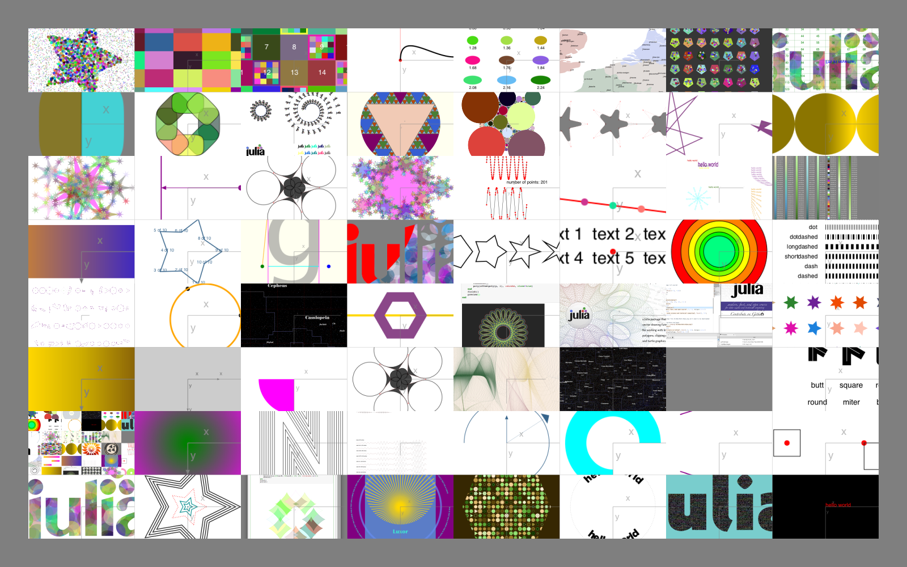
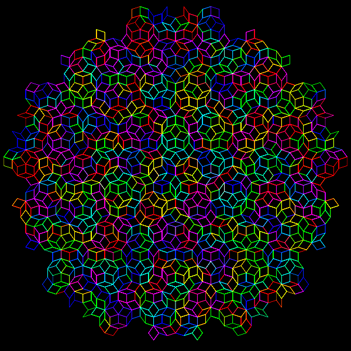
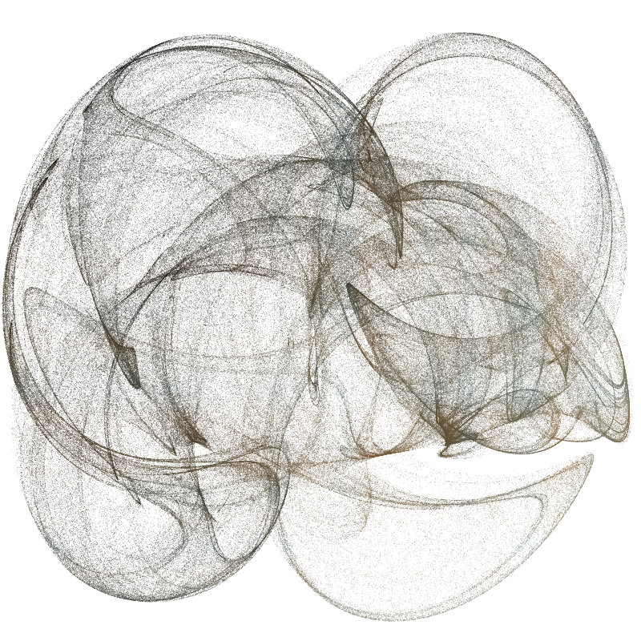

```@meta
DocTestSetup = quote
    using Luxor, Colors
end
```

# More examples

One place to look for examples is the `Luxor/test` directory.



## Illustrating this document

This documentation was built with [Documenter.jl](https://github.com/JuliaDocs/Documenter.jl), which is an amazingly powerful and flexible documentation generator written in Julia. The illustrations are mostly created when the HTML pages are built: the Julia source for the image is stored in the Markdown source document, and the code to create the images runs each time the documentation is generated.

The Markdown markup looks like this:

`````
```@example
using Luxor, Random # hide
Drawing(600, 250, "../assets/figures/polysmooth-pathological.png") # hide
origin() # hide
background("white") # hide
setopacity(0.75) # hide
Random.seed!(42) # hide
setline(1) # hide
p = star(O, 60, 5, 0.35, 0, vertices=true)
setdash("dot")
sethue("red")
prettypoly(p, close=true, action = :stroke)
setdash("solid")
sethue("black")
polysmooth(p, 40, :fill, debug=true)
finish() # hide
```


`````

and after you run Documenter's build process the HTML output looks like this:

```@example
using Luxor, Random # hide
Drawing(600, 250, "../assets/figures/polysmoothy.png") # hide
origin() # hide
background("white") # hide
setopacity(0.75) # hide
Random.seed!(42) # hide
setline(1) # hide
p = star(O, 60, 5, 0.35, 0, vertices=true)
setdash("dot")
sethue("red")
prettypoly(p, close=true, action = :stroke)
setdash("solid")
sethue("black")
polysmooth(p, 40, :fill, debug=true)
finish() # hide
nothing # hide
```


## Why turtles?

An interesting application for turtle-style graphics is for drawing Lindenmayer systems (l-systems). Here's an example of how a complex pattern can emerge from a simple set of rules, taken from [Lindenmayer.jl](https://github.com/cormullion/Lindenmayer.jl):



The definition of this figure is:

```julia
penrose = LSystem(Dict("X"  =>  "PM++QM----YM[-PM----XM]++t",
                       "Y"  => "+PM--QM[---XM--YM]+t",
                       "P"  => "-XM++YM[+++PM++QM]-t",
                       "Q"  => "--PM++++XM[+QM++++YM]--YMt",
                       "M"  => "F",
                       "F"  => ""),
                  "1[Y]++[Y]++[Y]++[Y]++[Y]")
```

where some of the characters—eg "F", "+", "-", and "t"—issue turtle control commands, and others—"X,", "Y", "P", and "Q"—refer to specific components of the design. The execution of the l-system involves replacing every occurrence in the drawing code of every dictionary key with the matching values.

## Strange

It's usually better to draw fractals and similar images
using pixels and image processing tools. But just for fun
it's an interesting experiment to render a strange attractor
image using vector drawing rather than placing pixels.

```@example
using Luxor, Colors
function strange(dotsize, w=800.0)
    xmin = -2.0; xmax = 2.0; ymin= -2.0; ymax = 2.0
    Drawing(w, w, "../assets/figures/strange-vector.png")
    origin()
    background("grey5")
    xinc = w / (xmax - xmin)
    yinc = w / (ymax - ymin)
    # control parameters
    a = 2.24
    b = 0.43
    c = -0.65
    d = -2.43
    e1 = 1.0
    x = y = z = 0.0
    wover2 = w / 2 - 50 # margin
    for j = 1:w
        for i = 1:w
            xx = sin(a * y) - z * cos(b * x)
            yy = z * sin(c * x) - cos(d * y)
            zz = e1 * sin(x)
            x = xx
            y = yy
            z = zz
            if xx < xmax && xx > xmin
                if yy < ymax && yy > ymin
                    xpos = rescale(
                        xx,
                        xmin,
                        xmax,
                        -wover2,
                        wover2,
                    ) # scale to range
                    ypos = rescale(
                        yy,
                        ymin,
                        ymax,
                        -wover2,
                        wover2,
                    ) # scale to range
                    rcolor = rescale(xx, -1, 1, 0.0, 0.6)
                    gcolor = rescale(yy, -1, 1, 0.2, 0.5)
                    bcolor = rescale(zz, -1, 1, 0.6, 0.9)
                    setcolor(rcolor, gcolor, bcolor)
                    move(Point(xpos, ypos))
                    line(Point(xpos + dotsize, ypos))
                    line(Point(
                        xpos + dotsize,
                        ypos + dotsize,
                    ))
                    line(Point(xpos, ypos + dotsize))
                    fillpath()
                end
            end
        end
    end
    finish()
end

strange(.5, 800)
nothing # hide
```



This example generates about 650,000 paths, which is why
it’s better to target PNG rather than SVG or PDF for this
example. Also for speed, the “dots” are actually simple
square paths, which are slightly quicker to draw than circles or
polygons.

## More animations

[](https://youtu.be/1FA2FgJU6dM)

Most of the animations on [this YouTube channel](https://www.youtube.com/channel/UCfd52kTA5JpzOEItSqXLQxg) are made with Luxor.

## The Luxor logo

```@example
using Luxor, Colors

function set_gold_blend()
    gblend = blend(O, 0, O, 250, "gold2", "gold3")
    setblend(gblend)
end

function draw_scarab_legs(pos)
    translate(pos)
    # legs
    @layer begin
        for i in 1:2
            move(O)
            rline.((polar(80, -π/6),
                polar(70, -π/2),
                polar(12, -5π/6),
                polar(60, -π/4)))

            #middle leg
            move(0, 40)
            rline.((
                polar(120, -π/6),
                polar(40, π/2)))

            #back leg
            move(0, 100)
            rline.((
                polar(130, -π/6),
                polar(110, π/2)))

            # flip for other leg
            transform([-1 0 0 1 0 0])
        end
    end
end

function draw_scarab_body()
    @layer begin
        squircle(Point(0, -25), 26, 75, action=:path)
        squircle(Point(0, 0), 50, 70, action=:path)
        squircle(Point(0, 40), 65, 90, action=:path)
    end
end

function draw()
    @drawsvg begin
    setopacity(1.0)
    setline(20)
    setlinecap("butt")
    setlinejoin("round")
    width = 180
    height= 240

    sethue("black")
    squircle(O, width, height-5, rt=0.4, action=:fill)

    set_gold_blend()
    squircle(O, width, height-5, rt=0.4, action=:path)
    translate(0, 50)
    draw_scarab_legs(O)
    strokepath()
    draw_scarab_body()
    fillpath()

    # julia dots === Ra egyptian sun deity
    @layer begin
        translate(0, -190)
        circle(O, 48, action=:fill)
        juliacircles(20)
    end

    clipreset()
    end
end

draw()
```

## A Japanese-style Temple scene

This code was created by **kfung**, a student that participated in [Google Code-in](https://codein.withgoogle.com/about/) 2019 competition.

```@example
using Luxor
Drawing(1280, 720, "../assets/figures/temple.png")
origin()
setblend(blend(Point(0, -200), Point(0, 300), "#F38070", "#F3C3BC"))
box(O, 1280, 720, :fill)
sethue("#F7C5BC")
setopacity(0.3)
sun = Point(450, -225)
poly([sun, Point(400, 400), Point(640, 400), sun], :fill)
poly([sun, Point(-150, 400), Point(150, 400), sun], :fill)
poly([sun, Point(-640, 400), Point(-640, 0), sun], :fill)
poly([sun, Point(-640, -150), Point(-640, -450), sun], :fill)
poly([sun, Point(100, -360), Point(300, -360), sun], :fill)
poly([sun, Point(375, -400), Point(475, -400), sun], :fill)
poly([sun, Point(585, -400), Point(775, -400), sun], :fill)
poly([sun, Point(640, -265), Point(640, -175), sun], :fill)
poly([sun, Point(640, -100), Point(640, 125), sun], :fill)
sethue("#C02C20")
setopacity(1)
circle(450, -225, 40, :fill)
sethue("white")
setopacity(0.98)
ellipse(20, -275, 150, 75, :fill)
ellipse(-20, -240, 150, 50, :fill)
ellipse(60, -245, 150, 50, :fill)
ellipse(-450, -240, 150, 50, :fill)
ellipse(-350, -250, 150, 50, :fill)
ellipse(430, -90, 200, 10, :fill)
ellipse(470, -95, 200, 10, :fill)
setopacity(0.8)
ellipse(-450, -130, 200, 10, :fill)
ellipse(-490, -135, 200, 10, :fill)
setopacity(1)
sethue("#2E951A")
drawbezierpath(makebezierpath([Point(-780, 500), Point(-640, 100), Point(-560, -20), Point(-480, -80), Point(-400, -80), Point(-320, -20), Point(-240, 100), Point(-240, 500)]), :fill, close=false)
sethue("#37C61B")
drawbezierpath(makebezierpath([Point(-780, 500), Point(-640, 200), Point(-560, 100), Point(-480, 40), Point(-400, 30), Point(-320, 70), Point(-240, 150), Point(-240, 500)]), :fill, close=false)
sethue("#23AE34")
setopacity(1)
ellipse(530, 90, 100, 100, :fill)
ellipse(490, 150, 80, 80, :fill)
ellipse(570, 150, 80, 80, :fill)
sethue("#713D1D")
box(530, 220, 15, 290, :fill)
setline(15)
line(Point(530,180), Point(565, 125), action = :stroke)
line(Point(530,140), Point(495, 105), action = :stroke)
sethue("#E13705")
circle(480, 150, 8, :fill)
circle(560, 100, 8, :fill)
circle(510, 70, 8, :fill)
circle(580, 160, 8, :fill)
[circle(544+16*(i-1), 292, 8, :fill) for i in 1:3]
circle(552, 278, 8, :fill)
circle(512, 292, 8, :fill)
circle(496, 292, 8, :fill)
sethue("white")
setline(10)
line(Point(440, 300), Point(440, 250), action = :stroke)
poly([Point(410, 250), Point(395, 235), Point(410, 220), Point(465, 220), Point(465, 250)], :fill)
sethue("black")
fontsize(12)
fontface("Arial")
text("THIS WAY", Point(434, 241), halign=:center,  valign = :center)
setopacity(1)
sethue("#2A3A4A")
box(0, 330, 1280, 60, :fill)
setline(20)
setopacity(1)
drawbezierpath(makebezierpath([Point(-570, 320), Point(-500, 270), Point(-400, 230), Point(-550, 200), Point(-360, 160), Point(-460, 110), Point(-342, 70), Point(-340, 70)]), action = :stroke, close=false)
circle(-340, 69, 10, :fill)
circle(-336, 67, 10, :fill)
setopacity(1)
sethue("white")
[box(-600+100*(i-1), 330, 50, 5, :fill) for i in 1:13]
sethue("#E7D1BC")
box(0, 240, 700, 120, :fill)
box(0, 150, 300, 120, :fill)
box(0, 40, 500, 120, :fill)
sethue("#EE766B")
[circle((-400+20*(i-1)), 180, 10, :fill) for i in 1:41]
[circle((-270+20*(i-1)), -20, 10, :fill) for i in 1:28]
sethue("#D14A3E")
poly([Point(-420, 180), Point(420, 180), Point(250, 70), Point(-250, 70), Point(-420, 180)], :fill)
poly([Point(-290, -20), Point(290, -20), Point(150, -120), Point(-150, -120), Point(-290, -20)], :fill)
circle(0, 58, 10, :fill)
circle(0, 45, 4, :fill)
sethue("#B71909")
poly([Point(0, 55), Point(140, 180), Point(-140, 180), Point(0, 55)], :fill)
sethue("#E7D1BC")
poly([Point(0, 70), Point(159, 210), Point(-159, 210), Point(0, 70)], :fill)
sethue("black")
[box(-180+120*(i-1), 30, 20, 40, :fill) for i in 1:4]
box(-300, 240, 20, 40, :fill)
box(-200, 240, 20, 40, :fill)
box(200, 240, 20, 40, :fill)
box(300, 240, 20, 40, :fill)
sethue("#C99A6F")
box(-130, 240, 10, 120, :fill)
box(130, 240, 10, 120, :fill)
poly([Point(0, 85), Point(91, 165), Point(-91, 165), Point(0, 85)], :fill)
sethue("black")
box(0, 258, 88, 84, :fill)
sethue("#C99A6F")
box(-20, 260, 38, 80, :fill)
box(20, 260, 38, 80, :fill)
sethue("black")
circle(-10, 260, 4, :fill)
circle(10, 260, 4, :fill)
finish()
nothing # hide
```


