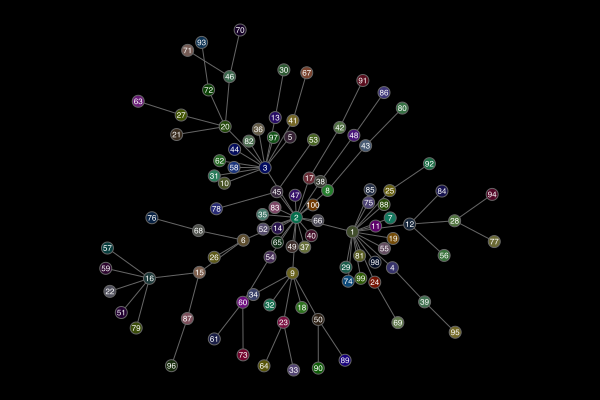

```@meta
DocTestSetup = quote
    using Luxor, Colors
end
```

# More examples

One place to look for examples is the `Luxor/test` directory.


## Other packages that work with Luxor

### 3D with Thebes.jl

Some limited 3D graphics capabilities can be added to Luxor using the [Thebes.jl](https://github.com/cormullion/Thebes.jl) package.


```julia
using Luxor
using Thebes
using Colors

function makemobius()
    x(u, v) = (1 + (v / 2 * cos(u / 2))) * cos(u)
    y(u, v) = (1 + (v / 2 * cos(u / 2))) * sin(u)
    z(u, v) = v / 2 * sin(u / 2)
    w = 1
    st = 2π / 150
    Δ = 0.2
    result = Array{Point3D,1}[]
    for u in 0:st:2π-st
        for v in -w:Δ:w
            p1 = Point3D(
                x(u, v + Δ / 2),
                y(u, v + Δ / 2),
                z(u, v + Δ / 2))
            p2 = Point3D(
                x(u + st, v + Δ / 2),
                y(u + st, v + Δ / 2),
                z(u + st, v + Δ / 2))
            p3 = Point3D(
                x(u + st, v - Δ / 2),
                y(u + st, v - Δ / 2),
                z(u + st, v - Δ / 2))
            p4 = Point3D(
                x(u, v - Δ / 2),
                y(u, v - Δ / 2),
                z(u, v - Δ / 2))
            push!(result, [p1, p2, p3, p4])
        end
    end
    return result
end

@svg begin
    background("grey20")
    eyepoint(300, 250, 400)
    setline(0.5)
    setopacity(0.8)
    mb = makemobius()
    for pgon in mb
        randomhue()
        pin(100pgon, gfunction = (pt3, pt2)
        -> begin
            a = cartesiantospherical(pt3[1])
            sethue(HSL(rescale(a[2], 0, 2π, 0, 360), 0.8, 0.5))
            poly(pt2, :fillpreserve, close=true)
            sethue("white")
            strokepath()
        end 
        )
    end
end 800 600 "mobius-band.svg"
```

### Graphs with Karnak

Luxor provides the drawing tools for the graph visualization package [Karnak](https://github.com/cormullion/Karnak.jl).



```julia

using Karnak
using Graphs
using Colors
g = barabasi_albert(100, 1)
@drawsvg begin
    background("black")
    sethue("grey40")
    fontsize(8)
    drawgraph(g, 
        layout=stress, 
        vertexlabels = 1:nv(g),
        vertexfillcolors = 
            [RGB(rand()/2, rand()/2, rand()/2) 
               for i in 1:nv(g)]
    )
end 600 400
```


## Illustrating this document

This documentation was built with [Documenter.jl](https://github.com/JuliaDocs/Documenter.jl), which is an amazingly powerful and flexible documentation generator written in Julia. The illustrations are mostly created when the HTML pages are built: the Julia source for the image is stored in the Markdown source document, and the code to create the images runs each time the documentation is generated.

The Markdown markup looks like this:

`````
```@example
using Luxor, Random # hide
Drawing(600, 250, "../assets/figures/polysmooth-pathological.png") # hide
origin() # hide
background("white") # hide
setopacity(0.75) # hide
Random.seed!(42) # hide
setline(1) # hide
p = star(O, 60, 5, 0.35, 0, vertices=true)
setdash("dot")
sethue("red")
prettypoly(p, close=true, action = :stroke)
setdash("solid")
sethue("black")
polysmooth(p, 40, :fill, debug=true)
finish() # hide
```


`````

and after you run Documenter's build process the HTML output looks like this:

```@example
using Luxor, Random # hide
Drawing(600, 250, "../assets/figures/polysmoothy.png") # hide
origin() # hide
background("white") # hide
setopacity(0.75) # hide
Random.seed!(42) # hide
setline(1) # hide
p = star(O, 60, 5, 0.35, 0, vertices=true)
setdash("dot")
sethue("red")
prettypoly(p, close=true, action = :stroke)
setdash("solid")
sethue("black")
polysmooth(p, 40, :fill, debug=true)
finish() # hide
nothing # hide
```


## Why turtles?

An interesting application for turtle-style graphics is for drawing Lindenmayer systems (l-systems). Here's an example of how a complex pattern can emerge from a simple set of rules, taken from [Lindenmayer.jl](https://github.com/cormullion/Lindenmayer.jl):


The definition of this figure is:

```julia
penrose = LSystem(Dict("X"  =>  "PM++QM----YM[-PM----XM]++t",
                       "Y"  => "+PM--QM[---XM--YM]+t",
                       "P"  => "-XM++YM[+++PM++QM]-t",
                       "Q"  => "--PM++++XM[+QM++++YM]--YMt",
                       "M"  => "F",
                       "F"  => ""),
                  "1[Y]++[Y]++[Y]++[Y]++[Y]")
```

where some of the characters—eg "F", "+", "-", and "t"—issue turtle control commands, and others—"X,", "Y", "P", and "Q"—refer to specific components of the design. The execution of the l-system involves replacing every occurrence in the drawing code of every dictionary key with the matching values.

## Strange

It's usually better to draw fractals and similar images
using pixels and image processing tools. But just for fun
it's an interesting experiment to render a strange attractor
image using vector drawing rather than placing pixels.

```@example
using Luxor, Colors
function strange(dotsize, w=800.0)
    xmin = -2.0; xmax = 2.0; ymin= -2.0; ymax = 2.0
    Drawing(w, w, "../assets/figures/strange-vector.png")
    origin()
    background("grey5")
    xinc = w / (xmax - xmin)
    yinc = w / (ymax - ymin)
    # control parameters
    a = 2.24
    b = 0.43
    c = -0.65
    d = -2.43
    e1 = 1.0
    x = y = z = 0.0
    wover2 = w / 2 - 50 # margin
    for j = 1:w
        for i = 1:w
            xx = sin(a * y) - z * cos(b * x)
            yy = z * sin(c * x) - cos(d * y)
            zz = e1 * sin(x)
            x = xx
            y = yy
            z = zz
            if xx < xmax && xx > xmin
                if yy < ymax && yy > ymin
                    xpos = rescale(
                        xx,
                        xmin,
                        xmax,
                        -wover2,
                        wover2,
                    ) # scale to range
                    ypos = rescale(
                        yy,
                        ymin,
                        ymax,
                        -wover2,
                        wover2,
                    ) # scale to range
                    rcolor = rescale(xx, -1, 1, 0.0, 0.6)
                    gcolor = rescale(yy, -1, 1, 0.2, 0.5)
                    bcolor = rescale(zz, -1, 1, 0.6, 0.9)
                    setcolor(rcolor, gcolor, bcolor)
                    move(Point(xpos, ypos))
                    line(Point(xpos + dotsize, ypos))
                    line(Point(
                        xpos + dotsize,
                        ypos + dotsize,
                    ))
                    line(Point(xpos, ypos + dotsize))
                    fillpath()
                end
            end
        end
    end
    finish()
end

strange(.5, 800)
nothing # hide
```


This example generates about 650,000 paths, which is why
it’s better to target PNG rather than SVG or PDF for this
example. Also for speed, the “dots” are actually simple
square paths, which are slightly quicker to draw than circles or
polygons.

## More animations

[](https://youtu.be/1FA2FgJU6dM)

Most of the animations on [this YouTube channel](https://www.youtube.com/channel/UCfd52kTA5JpzOEItSqXLQxg) are made with Luxor.

