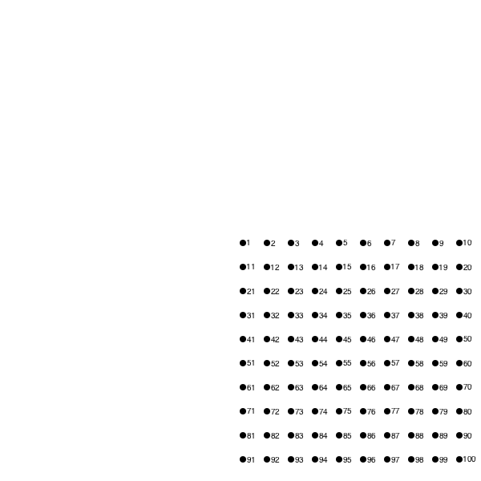
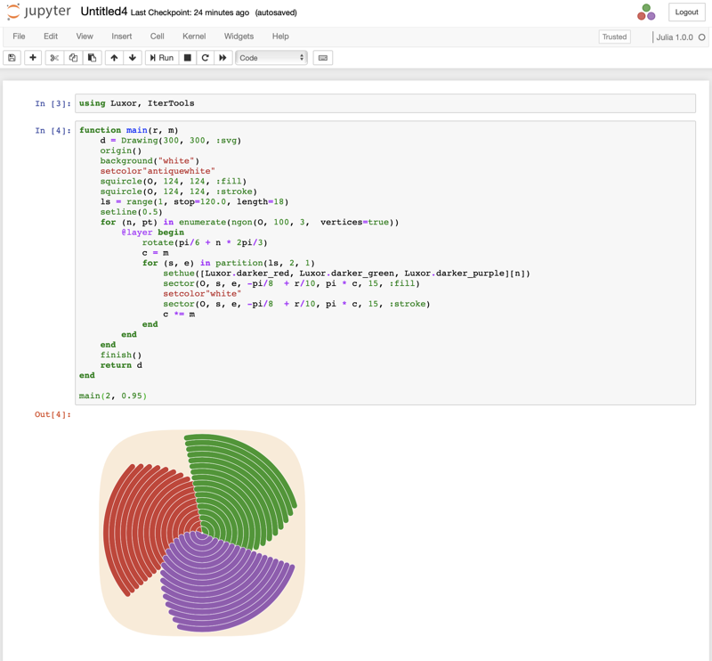

```@meta
DocTestSetup = quote
    using Luxor, Colors
    end
```
# Examples

## The obligatory "Hello World"

Here's the "Hello world":


```julia
using Luxor
Drawing(1000, 1000, "hello-world.png")
origin()
background("black")
sethue("red")
fontsize(50)
text("hello world")
finish()
preview()
```

`Drawing(1000, 1000, "hello-world.png")` defines the width, height, location, and type of the finished image. `origin()` moves the 0/0 point to the centre of the drawing surface (by default it's at the top left corner). Thanks to `Colors.jl` we can specify colors by name as well as by numeric value: `background("black")` defines the color of the background of the drawing. `text("helloworld")` draws the text. It's placed at the current 0/0 point and left-justified if you don't specify otherwise. `finish()` completes the drawing and saves the PNG image in the file. `preview()` tries to open the saved file using some other application (eg Preview on macOS).

The macros `@png`, `@svg`, `@pdf`, `@draw`, and `@imagematrix` provide shortcuts for making and previewing graphics without having to provide the usual set-up and finish instructions:

```julia
# using Luxor

@png begin
        fontsize(50)
        circle(O, 150, :stroke) # note the capital O (not 0) as the first argument
        text("hello world", halign=:center, valign=:middle)
     end
```


```julia
@svg begin
    sethue("red")
    randpoint = Point(rand(-200:200), rand(-200:200))
    circle(randpoint, 2, :fill)
    sethue("black")
    foreach(f -> arrow(f, between(f, randpoint, .1), arrowheadlength=6),
        first.(collect(Table(fill(20, 15), fill(20, 15)))))
end
```


The `@draw` macro is useful if you work in Juno/VS Code IDEs
or a notebook environment such as Jupyter or Pluto and
don't need to save work in files. It creates a PNG format
drawing in memory, rather than saved in a file. It's
displayed in the plot pane or the next cell.

```julia
@draw begin
    setopacity(0.85)
    steps = 20
    gap   = 2
    for (n, θ) in enumerate(range(0, step=2π/steps, length=steps))
        sethue([Luxor.julia_green,
            Luxor.julia_red,
            Luxor.julia_purple,
            Luxor.julia_blue][mod1(n, 4)])
        sector(O, 50, 250 + 2n, θ, θ + 2π/steps - deg2rad(gap), :fill)
    end
end
```


## The Julia logos

Luxor contains built-in functions that draw the Julia logo, either in color or a single color, and the three Julia circles.

```@example
using Luxor
Drawing(600, 400, "assets/figures/julia-logos.png")
origin()
background("white")
for θ in range(0, step=π/8, length=16)
    gsave()
    scale(0.25)
    rotate(θ)
    translate(250, 0)
    randomhue()
    julialogo(action=:fill, color=false)
    grestore()
end

gsave()
scale(0.3)
juliacircles()
grestore()

translate(200, -150)
scale(0.3)
julialogo()
finish()
# preview()
nothing # hide
```


The `gsave()` function saves the current drawing parameters, and any subsequent changes such as the `scale()` and `rotate()` operations are discarded by the next `grestore()` function.

Use the extension to specify the format: for example change `julia-logos.png` to `julia-logos.svg` or `julia-logos.pdf` or `julia-logos.eps` to produce SVG, PDF, or EPS format output.

## Something a bit more complicated: a Sierpinski triangle

Here's a version of the Sierpinski recursive triangle, clipped to a circle.


```julia
# Subsequent examples will omit these setup and finishing functions:
#
# using Luxor, Colors
# Drawing()
# background("white")
# origin()

function triangle(points, degree)
    sethue(cols[degree])
    poly(points, :fill)
end

function sierpinski(points, degree)
    triangle(points, degree)
    if degree > 1
        p1, p2, p3 = points
        sierpinski([p1, midpoint(p1, p2),
                        midpoint(p1, p3)], degree-1)
        sierpinski([p2, midpoint(p1, p2),
                        midpoint(p2, p3)], degree-1)
        sierpinski([p3, midpoint(p3, p2),
                        midpoint(p1, p3)], degree-1)
    end
end

function draw(n)
    circle(O, 75, :clip)
    points = ngon(O, 150, 3, -π/2, vertices=true)
    sierpinski(points, n)
end

depth = 8 # 12 is ok, 20 is right out (on my computer, at least)
cols = distinguishable_colors(depth) # from Colors.jl
draw(depth)

# finish()
# preview()
```

The Point type is an immutable composite type containing `x` and `y` fields that specify a 2D point.

## Working in IDEs and notebooks

You can use an environment such as a Jupyter or Pluto notebook or the Juno or VS Code IDEs, and load Luxor at the start of a session. The first drawing will take a few seconds, because the Cairo graphics engine needs to warm up. Subsequent drawings are then much quicker. (This is true of much graphics and plotting work. Julia compiles each function when it first encounters it, and then calls the compiled versions thereafter.)




## Images as matrices

With the `@imagematrix` macro, you can create your drawing with vector graphics in the usual way, but the result is returned as a matrix. Each element of the matrix is a colored pixel, encoded as `ARGB` (UInt32). This example plots the ampersand as if was a matrix of data points.

```
using Luxor, Colors

m = @imagematrix begin
        background("black")
        sethue("white")
        fontface("Georgia")
        fontsize(240)
        text("&", halign=:center, valign=:middle)
    end

import SparseArrays
import Plots

sa = SparseArrays.sparse(convert.(Colors.Gray, m') .> convert(Colors.Gray, ARGB32(0.0, 0.0, 0.0, 1.0)))

Plots.spy(sa, markersize=1.5)
```


## Feature gallery

Here's a quick visual overview of some of the features in Luxor.jl:


