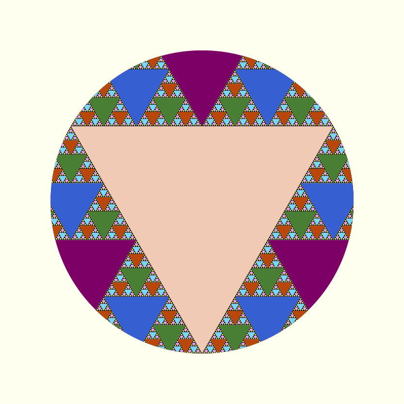

## The obligatory "Hello World"

Here's the "Hello world":


```julia
using Luxor, Colors
Drawing(1000, 1000, "hello-world.png")
origin()
background("black")
sethue("red")
fontsize(50)
text("hello world")
finish()
preview()
```

The `Drawing(1000, 1000, "hello-world.png")` line defines the size of the image and the location and type of the finished image when it's saved. `origin()` moves the 0/0 point to the centre of the drawing surface (by default it's at the top left corner). Because we're `using Colors`.jl, we can specify colors by name: `background("black")` defines the color of the background of the drawing. `text("helloworld")` draws the text. It's placed at the current 0/0 if you don't specify otherwise. `finish()` completes the drawing and saves the image in the file. `preview()` tries to open the saved file using some other application (eg on MacOS X, Preview).

## A slightly more complicated example: a Sierpinski triangle

Here's a version of the Sierpinski recursive triangle, clipped to a circle.



```julia
using Luxor, Colors

function triangle(points, degree)
    sethue(cols[degree])
    poly(points, :fill)
end

function sierpinski(points, degree)
    triangle(points, degree)
    if degree > 1
        p1, p2, p3 = points
        sierpinski([p1, midpoint(p1, p2),
                        midpoint(p1, p3)], degree-1)
        sierpinski([p2, midpoint(p1, p2),
                        midpoint(p2, p3)], degree-1)
        sierpinski([p3, midpoint(p3, p2),
                        midpoint(p1, p3)], degree-1)
    end
end

function draw(n)
  Drawing(200, 200, "/tmp/sierpinski.pdf")
  origin()
  background("ivory")
  circle(O, 75, :clip)
  my_points = ngon(O, 150, 3, -pi/2, vertices=true)
  sierpinski(my_points, n)
  finish()
  preview()
end

depth = 8 # 12 is ok, 20 is right out (on my computer, at least)
cols = distinguishable_colors(depth)
draw(depth)
```

You can change "sierpinski.pdf" to "sierpinski.svg" or "sierpinski.png" or "sierpinski.eps" to produce alternative formats.

The main type (apart from the Drawing) is the Point, an immutable composite type containing `x` and `y` fields.

## How I use Luxor

Here are some examples of how I use Luxor.

### Sector chart


Sector charts look cool but they aren't always good at their job. This chart takes the raw benchmark scores from the [Julia website](http://julialang.org) and tries to render them literally as radiating sectors. The larger the sector, the slower the performance, so it's difficult to see the Julia scores sometimes...!

[link to PDF original](figures/sector-chart.pdf) | [link to Julia source](examples/sector-chart.jl)

### Star chart

Looking further afield, here's a straightforward chart rendering stars from the Astronexus HYG database catalog available on [github](https://github.com/astronexus/HYG-Database) and read into a DataFrame. There are a lot of challenges with representing so many stars—sizes, colors, constellation boundaries. It takes about 4 seconds to load the data, and 7 seconds to draw it— about 120,000 stars, using still-to-be-optimized code.

A small detail:


A more complete version:


[link to PDF original](figures/star-chart.pdf) | [link to Julia source](examples/star-chart.jl)

### Ampersands

Here are a few ampersands collected together, mainly of interest to typomaniacs and fontophiles. It was necessary to vary the font size of each font, since they're naturally different.


[link to PDF original](figures/iloveampersands.pdf) | [link to Julia source](examples/iloveampersands.jl)

### Moon phases

Looking upwards again, this moon phase chart shows the calculated phase of the moon for every day in a year.


[link to PDF original](figures/2017-moon-phase-calendar.pdf) | [link to github repository](https://github.com/cormullion/Spiral-moon-calendar)

### Misc images

Sometimes you just want to take a line for a walk:


