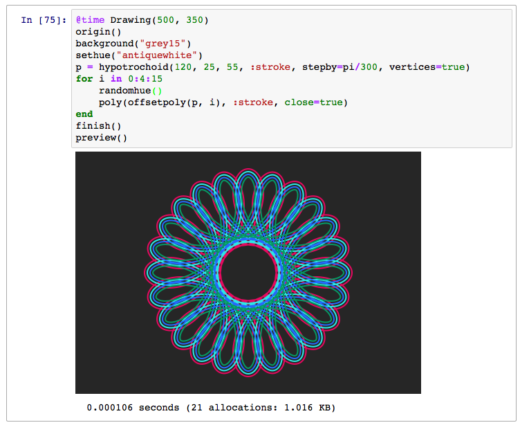
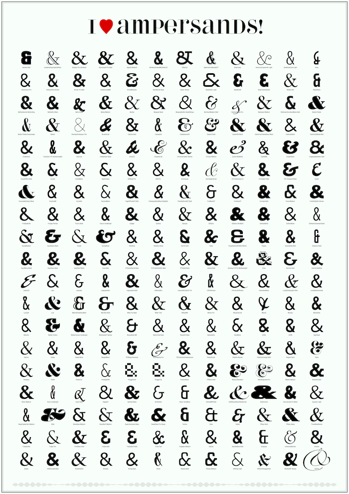

# Examples

## The obligatory "Hello World"

Here's the "Hello world":


```julia
using Luxor
Drawing(1000, 1000, "hello-world.png")
origin()
background("black")
sethue("red")
fontsize(50)
text("hello world")
finish()
preview()
```

`Drawing(1000, 1000, "hello-world.png")` defines the size of the image, and the location and type of the finished image. `origin()` moves the 0/0 point to the centre of the drawing surface (by default it's at the top left corner). Thanks to `Colors.jl` we can specify colors by name: `background("black")` defines the color of the background of the drawing. `text("helloworld")` draws the text. It's placed at the current 0/0 if you don't specify otherwise. `finish()` completes the drawing and saves the image in the file. `preview()` tries to open the saved file using some other application (eg Preview on macOS).

## The Julia logos

Luxor contains two functions that draw the Julia logo, either in color or a single color, and the three Julia circles.

```@example
using Luxor
Drawing(600, 400, "assets/figures/julia-logos.png")
origin()
background("white")
for theta in range(0, pi/8, 16)
    gsave()
    scale(0.25, 0.25)
    rotate(theta)
    translate(250, 0)
    randomhue()
    julialogo(action=:fill, color=false)
    grestore()
end
gsave()
scale(0.3, 0.3)
juliacircles()
grestore()
translate(200, -150)
scale(0.3, 0.3)
julialogo()
finish()
nothing # hide
```


The `gsave()` function saves the current drawing parameters, and any subsequent changes such as the `scale()` and `rotate()` operations are discarded by the next `grestore()` function.

You can change the extension of the file name, for example "julia-logos.png" to "julia-logos.svg" or "julia-logos.pdf" or "julia-logos.eps", to produce alternative formats.

## Something a bit more complicated: a Sierpinski triangle

Here's a version of the Sierpinski recursive triangle, clipped to a circle. (This and subsequent examples assume that the drawing has been created, the origin and background set.)


```julia
function triangle(points, degree)
    sethue(cols[degree])
    poly(points, :fill)
end

function sierpinski(points, degree)
    triangle(points, degree)
    if degree > 1
        p1, p2, p3 = points
        sierpinski([p1, midpoint(p1, p2),
                        midpoint(p1, p3)], degree-1)
        sierpinski([p2, midpoint(p1, p2),
                        midpoint(p2, p3)], degree-1)
        sierpinski([p3, midpoint(p3, p2),
                        midpoint(p1, p3)], degree-1)
    end
end

function draw(n)
    circle(O, 75, :clip)
    my_points = ngon(O, 150, 3, -pi/2, vertices=true)
    sierpinski(my_points, n)
end

depth = 8 # 12 is ok, 20 is right out (on my computer, at least)
cols = distinguishable_colors(depth)
draw(depth)
```

The main type (apart from the Drawing) is the Point, an immutable composite type containing `x` and `y` fields.

## Working in Jupyter

If you want to work interactively, you can use an environment such as a Jupyter notebook, and load Luxor at the start of a session. The first drawing will take a few seconds, because the Cairo graphics engine needs to warm up. Subsequent drawings are then much quicker. (This is true of much graphics and plotting work, of course. And if you're working in the REPL, after your first drawing subsequent drawings will be much quicker.)



## More complex examples

### Sector chart


Sector charts look cool but they aren't always good at their job. This chart takes the raw benchmark scores from the [Julia website](http://julialang.org) and tries to render them literally as radiating sectors. The larger the sector, the slower the performance, so it's difficult to see the Julia scores sometimes...!

[link to PDF original](assets/figures/sector-chart.pdf) | [link to Julia source](assets/examples/sector-chart.jl)

### Star chart

Looking further afield, here's a straightforward chart rendering stars from the Astronexus HYG database catalog available on [github](https://github.com/astronexus/HYG-Database) and read into a DataFrame. There are a lot of challenges with representing so many stars—sizes, colors, constellation boundaries. It takes about 4 seconds to load the data, and 7 seconds to draw it— about 120,000 stars, using still-to-be-optimized code.

A small detail:


A more complete version:


[link to PDF original](assets/figures/star-chart.pdf) | [link to Julia source](assets/examples/star-chart.jl)

### Ampersands

Here are a few ampersands collected together, mainly of interest to typomaniacs and fontophiles. It was necessary to vary the font size of each font, since they're naturally different.



[link to PDF original](assets/figures/iloveampersands.pdf) | [link to Julia source](assets/examples/iloveampersands.jl)

### Moon phases

Looking upwards again, this moon phase chart shows the calculated phase of the moon for every day in a year.


[link to PDF original](assets/figures/2017-moon-phase-calendar.pdf) | [link to github repository](https://github.com/cormullion/Spiral-moon-calendar)

### Misc images

Sometimes you just want to take a line for a walk:


