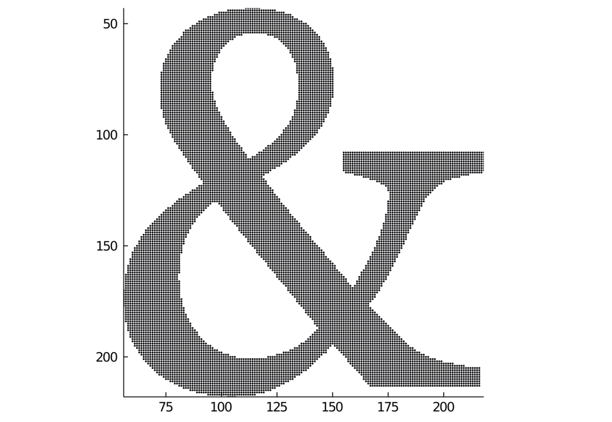
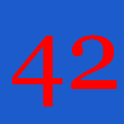
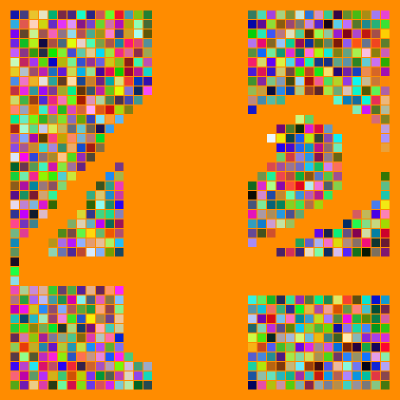

# Drawings as image matrices

# Images as matrices

While drawing a PNG drawing, you can at any time copy the current graphics in a drawing as a matrix of colored pixels, using the [`image_as_matrix`](@ref) function. 

With the
[`@imagematrix`](@ref) macro, you can create a drawing
in the usual way, and then return the
result as a matrix of colored pixels.

This code draws a very small PNG image and also uses the `image_as_matrix()` function to stores the pixels in `mat` as a `25×25 reinterpret(ColorTypes.ARGB32, ::Matrix{UInt32}):`. 

```julia
using Luxor
Drawing(25, 25, :png)
origin()
background(randomhue()...)
sethue("red")
fontsize(20)
fontface("Georgia")
text("42", halign=:center, valign=:middle)
mat = image_as_matrix()
finish()
preview()
````

The next example draws an ampersand and then processes the
pixels further in Images.jl.

```
using Luxor, Colors, Images, ImageFiltering

m = @imagematrix begin
        background("black")
        sethue("white")
        fontface("Georgia")
        fontsize(180)
        text("&", halign=:center, valign=:middle)
end 200 200

function convertmatrixtocolors(m)
    return convert.(Colors.RGBA, m)
end

img = convertmatrixtocolors(m)

imfilter(img, Kernel.gaussian(10))
```



[`image_as_matrix`](@ref) returns a array of ARGB32
(AlphaRedGreenBlue) values. Each ARGB value encodes the Red,
Green, Blue, and Alpha 8-bit values of a pixel into a single 32
bit integer.

You can display the matrix using, for example, Images.jl.

```
using Luxor, Images

# in Luxor

Drawing(250, 250, :png)
origin()
background(randomhue()...)
sethue("red")
fontsize(200)
fontface("Georgia")
text("42", halign=:center, valign=:middle)
mat = image_as_matrix()
finish()

# in Images

img = RGB.(mat)
# img = Gray.(mat) # for greyscale

imfilter(img, Kernel.gaussian(10))
```

In Luxor:



In Images:


The next example makes two drawings. The first draws a red rectangle, then copies the
drawing in its current state into a matrix called `mat1`. Next it adds a blue
triangle, and copies the updated drawing state into `mat2`.

In the second drawing, values from these two matrices are
tested, and table cells are randomly colored depending on
the corresponding values ... this is a primitive Boolean
operation.

```@example
using Luxor, Colors, Random # hide
Random.seed!(42) # hide

# first drawing

Drawing(40, 40, :png)
origin()
background("black")
sethue("red")
box(Point(0, 0), 40, 15, :fill)
mat1 = image_as_matrix()
sethue("blue")
setline(10)
setopacity(0.6)
ngon(Point(0, 0), 10, 3, 0, :stroke)
mat2 = image_as_matrix()
finish()

# second drawing

Drawing(400, 400, "../assets/figures/image-drawings.svg")
background("grey20")
origin()
t = Table(40, 40, 4, 4)
sethue("white")
rc = CartesianIndices(mat1)
for i in rc
    r, c = Tuple(i)
    pixel1 = convert(Colors.RGBA, mat1[r, c])
    pixel2 = convert(Colors.RGBA, mat2[r, c])
    if red(pixel1) > .5 && blue(pixel2) > .5
        randomhue()
        box(t, r, c, :fillstroke)
    end
end
finish() # hide
nothing # hide
```

The first image (enlarged) shows the `mat1` matrix as red, `mat2` as blue.


In the second drawing, a table with 1600 squares is colored according to the values in the matrices.



(You can use `collect` to gather the re-interpreted values together.)
