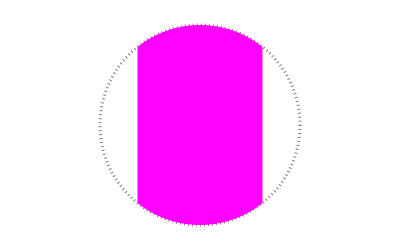

```@meta
DocTestSetup = quote
    using Luxor, Colors
end
```
# Clipping

There's two types of clipping in Luxor: polygon clipping and visual clipping.

## Polygon clipping

Use [`polyclip`](@ref) to clip one polygon by another. The clipping polygon must
be convex (every interior angle is less than or equal to 180°).

```@example
using Luxor # hide
@drawsvg begin # hide
s = hypotrochoid(160, 48, 88, vertices=true)
setline(0.5)
sethue("grey60")
poly(s, :stroke)
c = box(O, 260, 250)
poly(c, :stroke, close=true)
sethue("gold")
setline(2)
poly(polyclip(s, c), :stroke, close=true)
end 600 400  # hide
```

See also `[polyintersect()](@ref)`.

## Visual clipping

Use [`clip`](@ref) to turn the current path into a *clipping region*. Subsequent graphics will be drawn if they're inside the region, and will not be drawn if they're outside the region. [`clippreserve`](@ref) keeps the current path, but also uses it as a clipping region. [`clipreset`](@ref) resets it. `:clip` is also an action for drawing functions like [`circle`](@ref).

```@example
using Luxor # hide
Drawing(400, 250, "../assets/figures/simpleclip.png") # hide
background("white") # hide
origin() # hide
setline(3) # hide
sethue("grey50")
setdash("dotted")
circle(O, 100, :stroke)
circle(O, 100, :clip)
sethue("magenta")
box(O, 125, 200, :fill)
finish() # hide
nothing # hide
```


This example uses the built-in function that draws the Julia logo. The `clip` action lets you use the shapes as a mask for clipping subsequent graphics, which in this example are randomly-colored circles:


```julia
function draw(x, y)
    foregroundcolors = Colors.diverging_palette(rand(0:360), rand(0:360), 200, s = 0.99, b=0.8)
    gsave()
    translate(x-100, y)
    julialogo(action=:clip)
    for i in 1:500
        sethue(foregroundcolors[rand(1:end)])
        circle(rand(-50:350), rand(0:300), 15, :fill)
    end
    grestore()
end

currentwidth = 500 # pts
currentheight = 500 # pts
Drawing(currentwidth, currentheight, "clipping-tests.pdf")
origin()
background("white")
setopacity(.4)
draw(0, 0)
finish()
preview()
```

You can define a clipping region that excludes graphics by defining paths with holes.

In the following example, the drawing on the left defines a clipping region consisting of a 4×4 grid of squares, and the circles are drawn over the entire drawing, only if they're inside the squares. In the drawing on the right, the first enclosing path drawn forces the 16 subsequent squares to become holes in the clipping region. The circles are drawn only if they're outside the squares.

```@example
using Luxor # hide

hcat(
    @drawsvg begin
        background("orange")
        setfillrule(:even_odd)
        for (pos, n) in Tiler(260, 260, 4, 4)
            @layer begin
                translate(pos)
                box(O, 50, 50, :path)
            end
        end
        clip()
        sethue("black")
        circle.(randompointarray(BoundingBox(), 10), 4, :fill)
        clipreset()
    end 300 300
    ,
    @drawsvg begin
        background("orange")
        # box forms the first part of the path
        box(BoundingBox(), :path)
        setfillrule(:even_odd)
        # squares form holes
        for (pos, n) in Tiler(260, 260, 4, 4)
            @layer begin
                translate(pos)
                box(O, 50, 50, :path)
            end
        end
        clip()
        sethue("black")
        circle.(randompointarray(BoundingBox(), 10), 4, :fill)        
        clipreset()
    end 300 300
)
```

