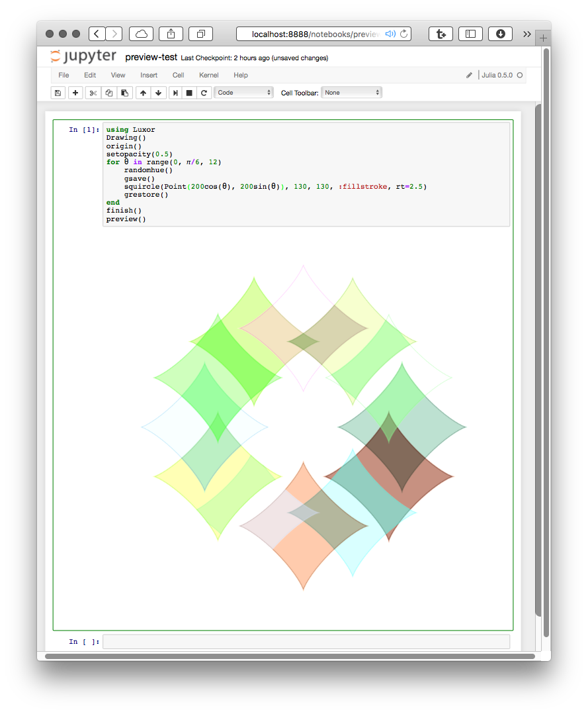
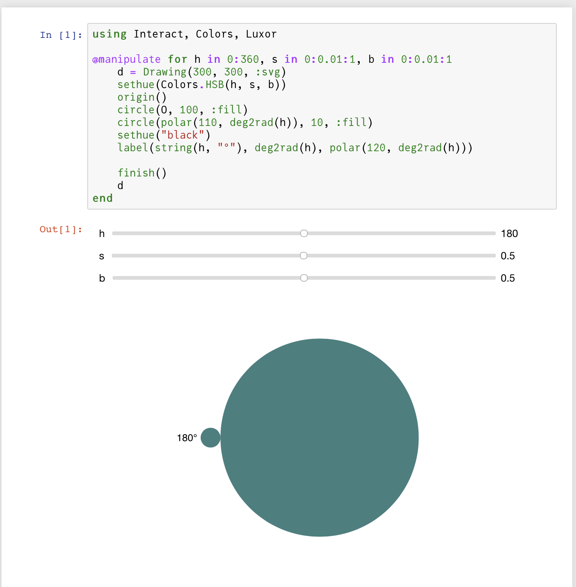

# Create a Drawing

In Luxor you always work with a current drawing, so the first thing to do is to create one.

To create a drawing, and optionally specify the filename, type, and dimensions, use the [`Drawing`](@ref) constructor function.

To finish a drawing and close the file, use [`finish`](@ref), and, if the drawing doesn't appear in your notebook, you can launch an external application to view it using [`preview`](@ref).

To finish a drawing and close the file, use [`finish`](@ref), and, to launch an external application to view it, use [`preview`](@ref).



If you're using VS Code, then PNG and SVG drawings should appear in the Plots pane, if it's enabled. In a Pluto notebook, output appears above the cell. In a notebook environment, output appears in the next notebook cell.


!!! note

    SVGs are text-based, and can get quite big. Up to a certain size, SVGs will preview as easily and quickly as PNGs. As they get larger, though, they'll take longer, and it won't be long before they'll take longer to preview than to create in the first place. Very large drawings in SVG format might not display at all.

## Quick drawings with macros

The [`@draw`](@ref), [`@svg`](@ref), [`@png`](@ref), and [`@pdf`](@ref) macros are designed to let you quickly create graphics without having to provide the usual boiler-plate functions.

!!! note

    The macros are shortcuts, designed to make it quick and easy to get started. You can save a few keystrokes and some time, but, for full control over all parameters, use [`Drawing`](@ref).

For example, the Julia code:

```julia
@svg circle(Point(0, 0), 20, action = :stroke) 50 50
```

expands to

```julia
Drawing(50, 50, "luxor-drawing-(timestamp).svg")
origin()
background("white")
sethue("black")
circle(Point(0, 0), 20, action = :stroke)
finish()
preview()
```

They're just short-cuts. You can omit the width and height (thus defaulting to 600 by 600, except for `@imagematrix`), and you don't have to specify a filename (you'll get time-stamped files in the current working directory). For multiple lines, use either:

```julia
@svg begin
    setline(10)
    sethue("purple")
    circle(Point(0, 0), 20, action = :fill)
end
```

or (less nicely):

```julia
@svg (setline(10);
      sethue("purple");
      circle(Point(0, 0), 20, action = :fill)
     )
```

If you don't specify a size, the defaults are usually 600 by 600. If you don't specify a file name, files created with the macros are placed in your current working directory as `luxor-drawing-` followed by a time stamp. You don't even have to specify the suffix:

```julia
@svg juliacircles(150) 400 400 "test" # saves in "test.svg"
```

If you want to create drawings with transparent backgrounds, or use variables to specify filenames, you have to use the longer form, rather than the macros:

```julia
Drawing()
background(1, 1, 1, 0)
origin()
setline(30)
sethue("green") # assumes current opacity
box(BoundingBox() - 50, action = :stroke)
finish()
preview()
```


### In-memory drawings

You can choose to store drawings in memory. The advantage is that in-memory drawings are quicker, and the results can be passed as Julia data. Also, it's useful in some environments to not have to worry about writing files. 

This syntax for the [`Drawing`](@ref) function:

```julia
Drawing(width, height, surfacetype, [filename])
```

lets you supply `surfacetype` as a symbol (`:svg`, `:png`, `:image`, or `:rec`). This creates a new drawing of the given surface type and stores the image only in memory if no `filename` is supplied.

The [`@draw`](@ref) macro (equivalent to `Drawing(..., :png)` creates a PNG drawing in-memory (not saved in a file). You should see it displayed if you're working in a suitable environment (VSCode, Jupyter, Pluto).

The SVG equivalent of `@draw` is [`@drawsvg`](@ref).

Use [`svgstring()`](@ref) to extract the SVG source for a finished SVG drawing.

If you want to generate SVG without making a drawing, use `@savesvg` instead of `@drawsvg`.

### Concatenating SVG drawings

The Julia functions `hcat()` and `vcat()` can concatenate two SVG drawings horizontally or vertically.

```@example
using Luxor

d1 = @drawsvg begin
    sethue("blue")
    paint()
     end 200 100

d2 = @drawsvg begin
    sethue("yellow")
    paint()
    end 200 100

vcat(d1, d2)
```

## Interactive drawings

### Using Pluto

Pluto notebooks typically display the final result of a piece of code in a cell. So there are various ways you can organize your drawing code. For example:

```julia
using Luxor, PlutoUI, Colors

@bind x Slider(0:0.1:12)

@bind y Slider(1:12)

@draw begin
    setopacity(0.8)
    for i in 0:0.1:1
        sethue(HSB(360i, .8, .8))
        squircle(O, 50, 50, action = :fill, rt = x * i)
        rotate(2π/y)
    end
end 100 100
```

or

```julia
begin
    d = Drawing(800, 800, :svg)
    origin()
    for (n, m) in enumerate(exp10.(range(0.0, 2, step=0.2)))
        setmesh(mesh(convert(Vector{Point}, BoundingBox()/m),
            ["darkviolet","gold2", "firebrick2", "slateblue4"]))
        rotate(π/7)
        paint()
    end
    finish()
    d
end
```


### Using Jupyter notebooks (IJulia and Interact)

Currently, you should use an in-memory SVG drawing to display graphics if you're using Interact.jl. This example provides an HSB color widget.

```julia
using Interact, Colors, Luxor
@manipulate for h in 0:360, s in 0:0.01:1, b in 0:0.01:1
    d = Drawing(300, 300, :svg)
    sethue(Colors.HSB(h, s, b))
    origin()
    circle(Point(0, 0), 100, action = :fill)  
    circle(polar(110, deg2rad(h)), 10, action = :fill)
    sethue("black")
    label(string(h, "°"), deg2rad(h), polar(120, deg2rad(h)))
        finish()
    d
end
```
 


## Extracting the drawing as an image

If you create a drawing using `Drawing(w, h, :png)`, you can use the [`image_as_matrix`](@ref) function at any stage in the drawing process to extract the drawing in its current state as a matrix of pixels.

See the [Drawings as image matrices](@ref) section for more information.

## Recordings

The `:rec` option for `Drawing()` creates a recording surface in memory. You can then use `snapshot(filename, ...)` to copy the drawing into a file.
