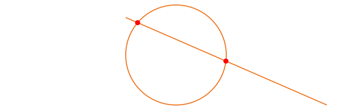
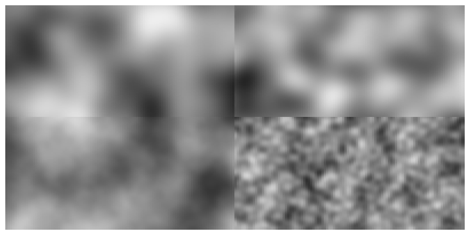

```@meta
DocTestSetup = quote
    using Luxor, Colors, Random
    end
```

# Geometry tools

## Lines and distances

You can find the midpoint between two points using
[`midpoint`](@ref).

The following code places a small pentagon (using
[`ngon`](@ref)) at the midpoint of each side of a larger
pentagon:

```@example
using Luxor # hide
Drawing(700, 220, "../assets/figures/midpoint.png") # hide
origin() # hide
background("white") # hide
sethue("red")
ngon(O, 100, 5, 0, action = :stroke)

sethue("darkgreen")
p5 = ngon(O, 100, 5, 0, vertices=true)

for i in eachindex(p5)
    pt1 = p5[mod1(i, 5)]
    pt2 = p5[mod1(i + 1, 5)]
    ngon(midpoint(pt1, pt2), 20, 5, 0, action = :fill)
end
finish() # hide
nothing # hide
```


A more general function, [`between`](@ref), finds for a value `x` between 0 and 1 the corresponding point on a line defined by two points. So `midpoint(p1, p2)` and `between(p1, p2, 0.5)` should return the same point.

```@example
using Luxor # hide
Drawing(700, 150, "../assets/figures/betweenpoint.png") # hide
origin() # hide
background("white") # hide
sethue("red")
p1 = Point(-150, 0)
p2 = Point(150, 40)
line(p1, p2)
strokepath()
for i in -0.5:0.1:1.5
    randomhue()
    circle(between(p1, p2, i), 5, action = :fill)
end
finish() # hide
nothing # hide
```


Values less than 0.0 and greater than 1.0 appear to work well too, placing the point on the line if extended.

[`center3pts`](@ref) finds the radius and center point of a circle passing through three points which you can then use with functions such as [`circle`](@ref) or [`arc2r`](@ref).

[`perpendicular`](@ref) finds the foot of a perpendicular line which lies on a line through two points perpendicular to a another point.

```@example
using Luxor # hide
d = @drawsvg begin # hide
A, B = Point(-150, 0), Point(150, 50)

sethue("grey50")
fontsize(18)
setline(4)

line(A, B, action = :stroke)

# point perpendicular to line
C = Point(-50, -80)
D = perpendicular(A, B, C)

# line perpendicular to line
E, F = perpendicular(A, B)

# point perpendicular to extended line
G = Point(230, -200)
H = perpendicular(A, B, G)

sethue("grey50")
label.(string.(["A", "B", "C", "D", "E", "F", "G", "H"]),
    :ne, offset=10,
    (A, B, C, D, E, F, G, H))

sethue("red")
arrow(C, D)
sethue("green")
arrow(E, F)
sethue("orange")
arrow(G, H)
sethue("purple")
circle.([A, B, C, D, E, F, G, H], 4, action = :fill)
end # hide
d # hide
```

## Points and arcs

Use `isarcclockwise(c, p1, p2)` to check whether an arc centered at `c` running from `p1` to `p2` is clockwise.

The [`pointinverse`](@ref) function finds the inverse of a point relative to a reference circle (centerpoint and radius). In the following example, each vertex on the shape inside the circle is linked by an arrow to its inverse outside the circle.

```@example
using Luxor, Colors # hide
d = @drawsvg begin
origin() # hide
background("antiquewhite") # hide
setline(1) # hide
radius = 60
circle(O, radius + 20, action = :stroke)

points = polycross(O, radius, 7, vertices=true)
poly(points, action = :stroke, close=true)

antipoints = last.(pointinverse.(points, O, radius+20))

for (n, pt) in enumerate(zip(points, antipoints))
    sethue(HSB(length(points) * n, 0.8, 0.8))
    @. circle(pt, distance(O, pt)/6, action = :fill)
    sethue("black")
    arrow(pt...)
end
end 800 500
d # hide
```

Use [`anglethreepoints`](@ref) to find the angle formed by two lines connecting three points:

```@example
using Luxor # hide
Drawing(800, 800, "../assets/figures/anglethreepoints.png") # hide
origin() # hide

function showangle(pt1, pt2, pt3)
    θ = anglethreepoints(pt1, pt2, pt3)
    label(string(round(rad2deg(θ), digits=2), "°"), :w, pt2)
    newpath()
    carc(pt2, 50, 0, -θ)
    strokepath()
end

let
    background("grey20")
    sethue("white")
    fontsize(12)
    tiles = Tiler(800, 800, 4, 4)
    for (pos, n) in tiles
        @layer begin
            translate(pos)
            pg = [polar(50, 0), O, polar(50, n * -2π/16)]
            poly(pg, action = :stroke)
            for n in 1:3
                pt1 = pg[1]
                pt2 = pg[2]
                pt3 = pg[3]
                showangle(pt1, pt2, pt3)
            end
        end
    end
    finish() # hide
end

nothing # hide
```


Functions that help with geometry include:

- [`distance`](@ref)

- [`getnearestpointonline`](@ref)

- [`pointlinedistance`](@ref)

- [`slope`](@ref)

- [`perpendicular`](@ref)

- [`dotproduct`](@ref)

- [`@polar`](@ref)

- [`polar`](@ref)

- [`ispointonline`](@ref)

- [`ispointonpoly`](@ref)

- [`isarcclockwise`](@ref)

- [`pointinverse`](@ref)

- [`anglethreepoints`](@ref)

- [`determinant3`](@ref)

## Triangle centers

To find the center of a triangle, use one of:

- [`trianglecircumcenter`](@ref) center of circumcircle/intersection of the perpendicular bisectors.

- [`triangleincenter`](@ref) intersection of the interior angle bisectors

- [`trianglecenter`](@ref) centroid

- [`triangleorthocenter`](@ref) intersection of the altitudes

```@example
using Luxor # hide

Drawing(350, 350, "../assets/figures/trianglecenters.svg") # hide
origin() # hide
background("white") # hide
setline(0.4) # hide
fontsize(11) # hide
▲ = Point[Point(-100.0, 0.0), Point(110.0, 30.0), Point(65.0, 90.0)]

@layer begin
    sethue("red")
    setline(2)
    poly(▲,  :stroke, close=true)
end

# circumcenter
circle(▲..., action = :stroke)
cp = trianglecircumcenter(▲...)
circle(cp, 2, action = :fill)
label("circumcenter", :N, cp)

# incenter
cp = triangleincenter(▲...)
circle(cp, 2, action = :fill)
pt1 = getnearestpointonline(▲[1], ▲[2], cp)
@layer begin
    sethue("black")
    circle(cp, distance(cp, pt1), action = :stroke)
    label("incenter", :S, cp)
end

# center    
cp = trianglecenter(▲...)
circle(cp, 2, action = :fill)
label("center", :w, cp)

# orthocenter
cp = triangleorthocenter(▲...)
circle(cp, 2, action = :fill)
label("orthocenter", :e, cp)

finish() # hide
nothing # hide
```


## Intersections

[`intersectionlines`](@ref) finds the intersection of two lines.

```@example
using Luxor # hide
Drawing(700, 220, "../assets/figures/intersection.png") # hide
background("white") # hide
origin() # hide

sethue("black")
P1, P2, P3, P4 = ngon(O, 100, 5, vertices=true)
label.(["P1", "P2", "P3", "P4"], :N, [P1, P2, P3, P4])
line(P1, P2, action = :stroke)
line(P4, P3, action = :stroke)

flag, ip =  intersectionlines(P1, P2, P4, P3)
if flag
    circle(ip, 5, action = :fill)
end

finish() # hide
nothing # hide
```


[`intersectionlinecircle`](@ref) finds the intersection of a line and a circle. There can be 0, 1, or 2 intersection points.

```@example
using Luxor # hide
Drawing(700, 220, "../assets/figures/intersection_line_circle.png") # hide
origin() # hide
background("white") # hide
sethue("chocolate2") # hide
l1 = Point(-100.0, -75.0)
l2 = Point(300.0, 100.0)
rad = 100
cpoint = Point(0, 0)
line(l1, l2, action = :stroke)
sethue("darkgreen") # hide
circle(cpoint, rad, action = :stroke)
nints, ip1, ip2 =  intersectionlinecircle(l1, l2, cpoint, rad)
sethue("black")
if nints == 2
    circle(ip1, 8, action = :stroke)
    circle(ip2, 8, action = :stroke)
end
finish() # hide
nothing # hide
```


[`intersection2circles`](@ref) finds the area of the intersection of two circles, and [`intersectioncirclecircle`](@ref) finds the points where they cross.

This example shows the areas of two circles, and the area of their intersection.

```@example
using Luxor # hide
Drawing(700, 310, "../assets/figures/intersection2circles.png") # hide
origin() # hide
background("white") # hide
fontsize(14) # hide
sethue("black") # hide

c1 = (O, 150)
c2 = (O + (100, 0), 150)

circle(c1... , action = :stroke)
circle(c2... , action = :stroke)

sethue("purple")
circle(c1... , action = :clip)
circle(c2... , action = :fill)
clipreset()

sethue("black")

text(string(150^2 * π |> round), c1[1] - (125, 0))
text(string(150^2 * π |> round), c2[1] + (100, 0))
sethue("white")
text(string(intersection2circles(c1..., c2...) |> round),
     midpoint(c1[1], c2[1]), halign=:center)

sethue("red")
flag, C, D = intersectioncirclecircle(c1..., c2...)
if flag
    circle.([C, D], 5, action = :fill)
end
finish() # hide
nothing # hide
```


## Bounding boxes

The `BoundingBox` type allows you to use rectangular extents
to organize and interact with the 2D drawing area. A
`BoundingBox` holds two points, the opposite corners of a
bounding box.

You can make a BoundingBox from:

- the current drawing
- two points
- a text string
- an existing polygon
- a stored path
- a table or table cell

and by modifying an existing bounding box, or using the results of functions such
as `circle()` or `box()`.

[`BoundingBox`](@ref) without arguments defines an extent that
encloses the drawing (assuming that the origin is at the
center of the drawing—see [`origin`](@ref)). Use
`centered=false` if the drawing origin is still at the top
left corner.

This example draws circles at three points: at two of the
drawing's corners and at the midway point between them:

```@example
using Luxor # hide
Drawing(700, 400, "../assets/figures/bbox.png") # hide
background("white") # hide

origin()

bb = BoundingBox()
setline(10)
sethue("orange")

circle(bb[1], 150, action = :stroke) # first corner

circle(bb[2], 150, action = :stroke) # second corner

circle(midpoint(bb...), 150, action = :stroke) # midpoint

sethue("blue")
circle.([bb[1], midpoint(bb[1:2]), bb[2]], 130, action = :fill)

sethue("red")
circle.([first(bb), midpoint(bb...), last(bb)], 100, action = :fill)

finish() # hide
nothing # hide
```


You can make a bounding box from a polygon:

```@example
using Luxor # hide
Drawing(400, 200, "../assets/figures/bboxpoly.png") # hide
background("white") # hide
origin() # hide

p = star(O, 100, 5, 0.1, π/3.3, vertices=true)
sethue("antiquewhite")
box(BoundingBox(p), action = :fill)

sethue("black")
poly(p, action = :stroke, close=true)

finish() # hide
nothing # hide
```


The resulting bounding boxes can be passed to [`box`](@ref) or [`poly`](@ref) to be drawn.

To convert a bounding box `b` into a box, use `box(b, vertices=true)` or `convert(Vector{Point}, BoundingBox())`.

To obtain the coordinates of the corners or key points on the bounding box, use the functions with names combining `box` and `top|middle|bottom` and `left|center|right`. So `boxtopleft(bbox)` finds the top left corner of the bounding box `bbox`.

You can also do some arithmetic on bounding boxes. In the next example, the bounding box is created from the text "good afternoon". The bounding box is filled with purple, then increased by 40 units on all sides (blue), also scaled by 1.3 (green), and also shifted by `(0, 100)` (orange).

```@example
using Luxor # hide
Drawing(500, 300, "../assets/figures/bbox2.png") # hide
background("white") # hide
origin() # hide

translate(-130,0)
fontsize(40)
str = "good afternoon"
sethue("purple")
box(BoundingBox(str), action = :fill)
sethue("white")
text(str)

sethue("blue")
modbox = BoundingBox(str) + 40 # add 40 units to all sides
poly(modbox, action = :stroke, close=true)

sethue("green")
modbox = BoundingBox(str) * 1.3
poly(modbox, action = :stroke, close=true)

sethue("orange")
modbox = BoundingBox(str) + (0, 100)
poly(modbox, action = :fill, close=true)

finish() # hide
nothing # hide
```


You can find the union and intersection of BoundingBoxes, and also find whether a point lies inside one. The following code creates, shrinks, and shifts two bounding boxes (colored yellow and pink), and then draws: their union (a bounding box that includes both), in black outline; and their intersection (a bounding box of their common areas), in red. Then some random points are created (you can pass a bounding box to `rand()` to get a random point inside the box) and drawn differently depending on whether they're inside the intersection or outside.

```@example
using Luxor, Random # hide
Drawing(600, 400, "../assets/figures/bbox3.png") # hide
background("white") # hide
Random.seed!(42) # hide

origin()
setopacity(0.75)
setline(8)

bbox1 = BoundingBox()/2 - (50, 30)
sethue("yellow")
box(bbox1, action = :fill)

bbox2 = BoundingBox()/2  + (50, 30)
sethue("pink")
box(bbox2, action = :fill)

sethue("black")
box(bbox1 + bbox2, action = :stroke)

sethue("red")
bothboxes = intersectboundingboxes(bbox1, bbox2)
box(bothboxes, action = :fill)

for i in 1:500
    pt = rand(bbox1 + bbox2)
    if isinside(pt, bothboxes)
        sethue("white")
        circle(pt, 3, action = :fill)
    else
        sethue("black")
        circle(pt, 2, action = :fill)
    end
end

finish() # hide
nothing # hide
```


To find out where a line starting at the center of a bounding box passing through a point crosses or would cross the edges of the box, use [`pointcrossesboundingbox`](@ref).

```@example
using Luxor, Random # hide
Drawing(600, 400, "../assets/figures/bbox4.png") # hide
background("antiquewhite") # hide
Random.seed!(42) # hide
origin() # hide
bx = BoundingBox(box(O, 200, 200))
setline(1)
sethue("black") # hide
box(bx, action = :stroke)
for i in 1:10
    pt = randompoint((1.5bx)...)
    pt2 = pointcrossesboundingbox(pt, bx)

    sethue("grey50")
    arrow(O, pt)
    sethue("red")
    circle(pt2, 3, action = :stroke)
end

finish() # hide
nothing # hide
```


## Random points

You can use [`randompointarray`](@ref) to create an array of randomly placed points.

The `randompointarray(boundingbox, distance)` method fills
the boundingbox with random points up to `distance` units apart
using a Poisson Disk sampling method.

```@example
using Luxor, Colors # hide
@drawsvg begin # hide
background("black")
b = blend(
        boxtopleft(BoundingBox()),
        boxbottomright(BoundingBox()),
        "red",
        "green")

addstop(b, 0.3, "orange")
addstop(b, 0.4, "magenta")
addstop(b, 0.5, "cyan")
addstop(b, 0.7, "yellow")
setblend(b)

for pt in randompointarray(BoundingBox() * 0.9, 15)
    d = rescale(distance(pt, O), 0, sqrt(800 * 500), 1, 0)
    circle(pt, 1 + 7d, action = :fill)
end
end 800 500 # hide
```

The `randompointarray(point1, point2, n)` method generates
`n` random points in the area bounded by two points, using Julia's
random number generator.

```@example
using Luxor, Random # hide
@drawsvg begin # hide
background("white") # hide
Random.seed!(42) # hide
origin() # hide

pt1 = Point(-300, -150)
pt2 = Point(300, 150)

sethue("purple")
map(pt -> circle(pt, 6, action = :fill), (pt1, pt2))
box(pt1, pt2, action = :stroke)

sethue("blue")
map(pt -> circle(pt, 4, action = :fill), randompointarray(pt1, pt2, 200))

end 800 400 # hide
```

Use `rand(BoundingBox())` to return a single point somewhere inside a bounding box.

## Noise

For artistic graphics you might prefer noisy input values to purely random ones. Use the [`noise`](@ref) function to obtain smoothly changing random values corresponding to input coordinates. The returned values wander slowly rather than jump about everywhere.

In this example, the gray value varies gradually as the [`noise`](@ref) function returns values between 0 and 1 depending on the location of the two input values `pos.x` and `pos.y`.

The top two quadrants use a lower value for the `detail` keyword argument, an integer ()>= 1) specifying how many "octaves" of noise you want.

The left two quadrants use a lower value for the `persistence` keyword argument, a floating point number specifying how the amplitude diminishes for each successive level of detail. There is more fine detail when the persistence is higher, particularly when the `detail` setting is also high.

```@example
using Luxor, Colors # hide
Drawing(800, 400, "../assets/figures/noise.png") # hide

background("white") # hide
origin() # hide

tiles = Tiler(800, 400, 200, 200)
sethue("black")
for (pos, n) in tiles
    freq = 0.05
    pos.y < 0 ? d = 1      : d = 4
    pos.x < 0 ? pers = 0.3 : pers = 1.0
    ns = noise(freq * pos.x, freq * pos.y,
        detail=d,
        persistence=pers)
    setgray(ns)
    box(pos, tiles.tilewidth, tiles.tileheight, action = :fillstroke)
end

finish() # hide
nothing # hide
```



Use [`initnoise`](@ref) to initialize the noise behaviour.
