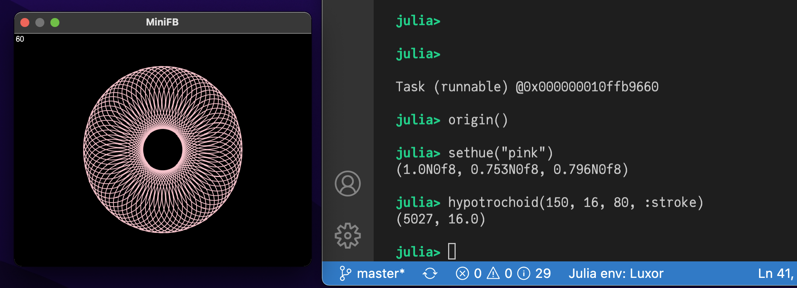

# Interactive graphics and snapshots

## Continuous display

With the help of an external appication to manage windows, it's possible to use Luxor to create continuously changing graphics in a window.

### The `@play` macro

This example uses the [MiniFB](https://github.com/aviks/MiniFB.jl) package, which you can add using `] add MiniFB`.

The file `play.jl` defines a simple macro, `@play`, which continuously evaluates and draws the graphics in a window. For example, this code:

```julia
using Luxor

include(dirname(pathof(Luxor)) * "/play.jl")

let θ = 0
    @play 400 400 begin
    #
        background("black")
        sethue("white")
        rotate(θ)
        hypotrochoid(200, 110, 37, :stroke)
        θ += π/120
        sleep(0.01)
    #
    end
end
```

draws a continuously rotating hypotrochoid.


### Clock

This code also imports the `@play` macro.

The call to `sleep` reduces the CPU time, and allows other processes to run, but the millisecond
animation will be less smooth as a result.


```julia
using Luxor, Colors, Dates, ColorSchemes

include(dirname(pathof(Luxor)) * "/play.jl")

function clock(cscheme=ColorSchemes.leonardo)
    @play 400 600 begin

        # background
        sethue(get(cscheme, .0))
        paint()

        # 24hour sector
        fontsize(30)
        sethue(get(cscheme, .2))
        h = Dates.hour(now())
        sector(O, 180, 200, π/2, π/2 + rescale(h, 0, 24, 0, 2pi), :fill)

        @layer begin
            fontsize(12)
            sethue("white")
            @. text(["0", "6", "12", "18"], polar(190, [i * π/2 for i in 1:4]),
                halign=:center,
                valign=:middle)
        end

        # minute sector
        sethue(get(cscheme, .4))
        m = Dates.minute(now())
        sector(O, 160, 180, 3π/2, 3π/2 + rescale(m, 0, 60, 0, 2pi), :fill)

        # second sector
        sethue(get(cscheme, .6))
        s = Dates.second(now())
        sector(O, 140, 160, 3π/2, 3π/2 + rescale(s, 0, 60, 0, 2pi), :fill)

        # millisecond indicator
        @layer begin
            setopacity(0.5)
            sethue(get(cscheme, .8))
            ms = Dates.value(Dates.Millisecond(Dates.now()))
            circle(polar(120, 3π/2 + rescale(ms, 0, 1000, 0, 2pi)), 20, :fill)
        end

        # central text
        fontface("JuliaMono-Black")
        sethue(get(cscheme, 1.0))
        text(Dates.format(Dates.now(), "HH:MM:SS"), halign=:center)

        sleep(0.05)
    end
end

clock(ColorSchemes.klimt)
```

## Live coding with MiniFB

Here are some examples of how to use Luxor with MiniFB as the display window, without using the simple `@play` macro.

### Interactivity

This example lets you type graphic commands at the REPL and see the results instantly displayed in a window.

First, run this code to connect a Luxor drawing to a MiniFB buffer:

```julia
using Luxor
using Colors
using MiniFB

function window_update_task(window, buffer, showFPS=false)
    state = mfb_update(window, buffer)
    updateCount = 0
    startTime = floor(Int, time())
    fps = "0"
    while state == MiniFB.STATE_OK
        if showFPS
            elapsedTime = floor(Int, time()) - startTime
            if elapsedTime > 1
                fps = string(round(Int, updateCount / elapsedTime))
                startTime = floor(Int, time())
                updateCount = 0
            end
            @layer begin
                setcolor("black")
                circle(boxtopleft() + (15, 15), 15, :fill)
                setcolor("white")
                fontsize(20)
                text(fps, boxtopleft() + (15, 15), halign=:center, valign=:middle)
            end
        end
        state = mfb_update(window, buffer)
        sleep(1.0 / 120.0)
        updateCount += 1
    end
    println("\nWindow closed\n")
end

const WIDTH = 800
const HEIGHT = 600

buffer = zeros(ARGB32, WIDTH, HEIGHT)
d = Drawing(buffer)
window = mfb_open_ex("MiniFB", WIDTH, HEIGHT, MiniFB.WF_RESIZABLE)
@async window_update_task(window, buffer, true)
```

Now, the window will display the results of any expressions you type at the REPL:



### Live animations

If you want to do live animations in the window in a "while" loop, you need to call `sleep()` for a while to allow the `window_update_task()` to get some execution time. 

In this example you can enter "q" and "return" in the REPL to stop the animation's while loop. Using "ctrl-c" to stop the animation could also stop the window update task by chance.


```@raw html
<details closed><summary>Code for this example</summary>
```

```julia
mutable struct Ball
    position::Point
    velocity::Point
end
function sticks(w, h)
    channel = Channel(10)
    #enter "q" and "return" to stop the while loop
    @async while true
        kb = readline(stdin)
        if contains(kb, "q")
            put!(channel, 1)
            break
        end
    end
	colors = [ rand(1:255), rand(1:255), rand(1:255) ]
	newcolors  = [ rand(1:255), rand(1:255), rand(1:255) ]
	c = ARGB(colors[1]/255, colors[2]/255, colors[3]/255, 1.0)
	balls = [ Ball( rand(BoundingBox(Point(-w/2, -h/2), Point(w/2, h/2))), rand(BoundingBox(Point(-10, -10), Point(10, 10))) ) for _ in 1:2 ] 
	while true
		background(0, 0, 0, 0.05)
		if colors == newcolors
			newcolors = [ rand(1:255), rand(1:255), rand(1:255) ]
		end
		for (index, (col, newcol)) in enumerate(zip(colors, newcolors))
			if col != newcol
				col > newcol ? col -= 1 : col += 1
				colors[index] = col
			end
		end
		c = ARGB(colors[1]/255, colors[2]/255, colors[3]/255, 1.0)
		for ball in balls
			if !(-w/2 < ball.position.x < w/2)
				ball.velocity = Point(-ball.velocity.x, ball.velocity.y)
			end
			if !(-h/2 < ball.position.y < h/2)
				ball.velocity = Point(ball.velocity.x, -ball.velocity.y)
			end
			ball.position = ball.position + ball.velocity
		end
		setcolor(c)
		line(balls[1].position, balls[2].position, :stroke)
		sleep(1.0/120.0)
        if isready(channel)
            break
        end
	end
end

origin()
sticks(WIDTH, HEIGHT)
```

```@raw html
</details>
```

### Interactive graphics with multiple drawings

This next example shows how to work with multiple drawings. We'll create three windows, then combine (`AND`) the contents of the first two and display them in the third.


First, we'll setup our display buffers and MiniFB windows, one for each Luxor drawing:

```julia
using MiniFB, Luxor, Colors, FixedPointNumbers

WIDTH=500
HEIGHT=500

function windowUpdateTask(window,buffer)
    state=mfb_update(window,buffer)
    while state == MiniFB.STATE_OK
        state=mfb_update(window,buffer)
        sleep(1.0/120.0)
    end
    println("\nWindow closed\n")
end

window1 = mfb_open_ex("1", WIDTH, HEIGHT, MiniFB.WF_RESIZABLE)
buffer1 = zeros(ARGB32, WIDTH, HEIGHT)
@async windowUpdateTask(window1,buffer1)

window2 = mfb_open_ex("2", WIDTH, HEIGHT, MiniFB.WF_RESIZABLE)
buffer2 = zeros(ARGB32, WIDTH, HEIGHT)
@async windowUpdateTask(window2,buffer2)

window3 = mfb_open_ex("3=1+2", WIDTH, HEIGHT, MiniFB.WF_RESIZABLE)
buffer3 = zeros(ARGB32, WIDTH, HEIGHT)
@async windowUpdateTask(window3,buffer3)
```

Buffers 1, 2, and 3 are the buffers for the three MiniFB windows. They'll appear on your display.

Next we'll create three Luxor drawings that connect to these buffers.

```julia
d1 = Drawing(buffer1)    

Luxor.set_next_drawing_index()   
d2 = Drawing(buffer2)

Luxor.set_next_drawing_index()   
d3 = Drawing(buffer3, "julia.png")
```

We now have three drawings which are continuously updated and visible in three separate windows.
Let's start by drawing on drawing 1.

```julia
Luxor.set_drawing_index(1) 
origin()
setopacity(0.4)
foregroundcolors = Colors.diverging_palette(rand(0:360), rand(0:360), 200, s=0.99, b=0.8)
gsave()
for i in 1:500
    sethue(foregroundcolors[rand(1:end)])
    circle(Point(rand(-300:300), rand(-300:300)), 15, :fill)
end
grestore()
```

Now let's switch to drawing 2 and draw the Julia logo:

```julia
Luxor.set_drawing_index(2)
origin()
setopacity(1.0)
gsave()
julialogo(centered=true, bodycolor=colorant"white")
grestore()
```

Finally, we'll switch to drawing 3, and set its contents by ANDing the buffers of drawings 1 and 2:

```julia
Luxor.set_drawing_index(3)  
background("black")
buffer3 .= reinterpret(ARGB{N0f8}, 
    (reinterpret.(UInt32,buffer1) .& 
     reinterpret.(UInt32,buffer2)))
```

To finish, we'll set the opacity of each pixel to 1.0:

```julia
buffer3.=ARGB32.(RGB24.(buffer3))

finish()
preview()
```

## Snapshots

A _snapshot_ is a view of the current Luxor drawing in its current state, before it's been closed via [`finish`](@ref). You can take a snapshot, then continue drawing on the current drawing.

!!! note

    You can take a snapshot only for drawings created using the `:rec` (recording) format.

The following code exports a series of snapshots made with [`snapshot`](@ref), showing the state of the computation for different values of the `stepby` parameter. (This image is a composite of all the snapshots.)


```julia
using Luxor, ColorSchemes, Colors

function julia(z, c, maxiter::Int64)
    for n = 1:maxiter
        abs(z) > 2 ? (return n) : z = z^3 + c
    end
    return maxiter
end

function drawjulia(c::Complex, pwidth, pheight;
        klo = 0.0,
        khi = 1.0,
        cpos = Point(0, 0),
        w = 4,
        stepby=1,
        maxiterations = 300)
    xmin = cpos.x - w/2; ymin = cpos.y - w/2
    xmax = cpos.x + w/2; ymax = cpos.y + w/2
    lo = 10; hi = 2
    for col = -pwidth/2:stepby:pwidth/2
        for row = -pheight/2:stepby:pheight/2
            imagex = rescale(col, -pwidth/2, pwidth/2, xmin, xmax)
            imagey = rescale(row, -pheight/2, pheight/2, ymin, ymax)
            pixelcolor = julia(complex(imagex, imagey), c, maxiterations)
            if pixelcolor > hi
                hi = pixelcolor
            end
            if pixelcolor < lo
                lo = pixelcolor
            end
            s = rescale(pixelcolor, klo, khi)
            a = slope(Point(row, col), O)
            h, sa, l = getfield.(convert(HSL, get(ColorSchemes.inferno, s)), 1:3)
            sethue(HSL(mod(180 + 360 * a/2π, 360), sa , 2l))
            box(Point(row, -col), stepby,  stepby, :fillstroke)
        end
    end
    sethue("white")
    text("$(stepby)", boxbottomcenter(BoundingBox()) + (0, -20), halign=:center)
    snapshot(fname = "/tmp/temp-$(stepby).png")
    return lo, hi
end

function main()
    w = h = 500
    Drawing(w, h, :rec)
    fontsize(20)
    fontface("JuliaMono-Bold")
    origin()
    circle(O, w/2, :clip)
    for s in vcat(50:-5:1,1)
        l, h = drawjulia(-0.5368 + 0.0923im, w, w, maxiterations = 250,
            w=3, stepby=s, klo=1, khi=100)
    end
    finish()
    preview()
end

main()
```
