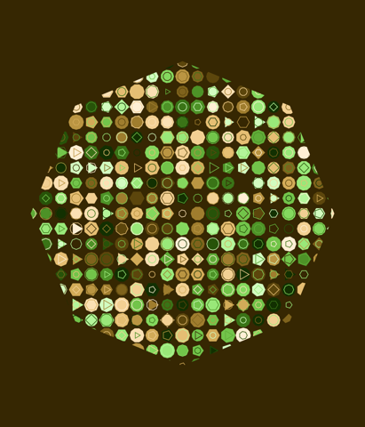
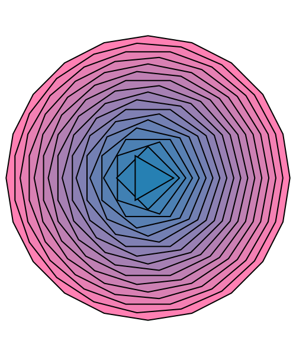
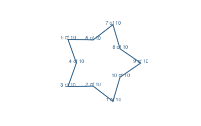
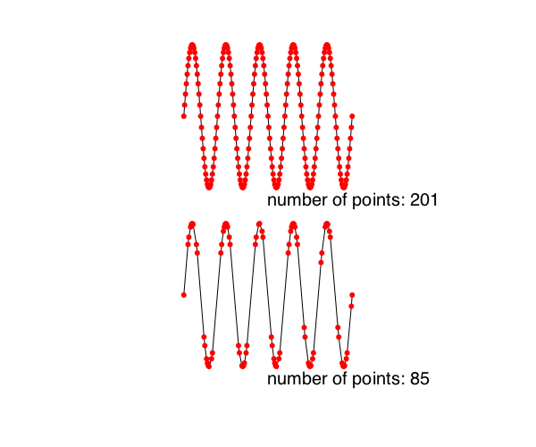
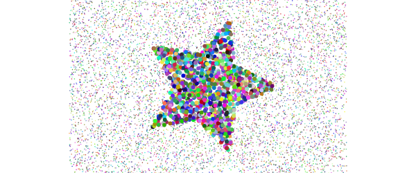
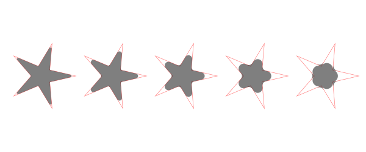
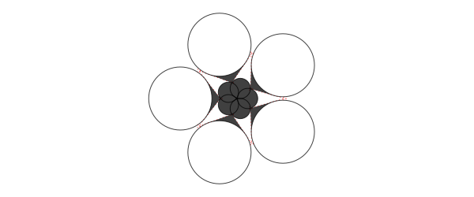
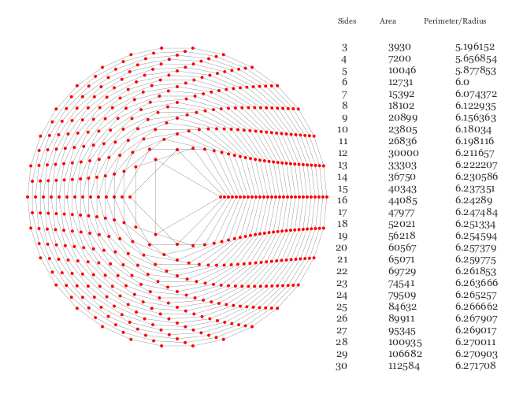

# Polygons and paths

For drawing shapes, Luxor provides polygons and paths.

A polygon is an ordered collection of Points stored in an array.

A path is a sequence of one or more straight and curved (circular arc or Bézier curve) segments. Paths can consist of subpaths. Luxor maintains a 'current path', to which you can add lines and curves until you finish with a stroke or fill instruction.

Luxor also provides a BezierPath type, which is an array of four-point tuples, each of which is a Bézier cubic curve section.

|create                         |convert                 		|draw                   	|info                     	|edit                           |
|:---	                        |:---	                 		|:---	                	|:---	                  	|:---                           |
| *polygons*                    |                        		|                       	|				          	|                               |
|[`ngon`](@ref)                 |[`polysmooth`](@ref)    		|[`poly`](@ref)         	|[`isinside`](@ref)       	|[`simplify`](@ref)             |
|[`ngonside`](@ref)             |                        		|[`prettypoly`](@ref)   	|[`polyperimeter`](@ref)  	|[`polysplit`](@ref)            |
|[`star`](@ref)                 |                        		|[`polysmooth`](@ref)   	|[`polyarea`](@ref)       	|[`polyportion`](@ref)          |
|[`polycross`](@ref)            |                        		|                       	|[`polycentroid`](@ref)   	|[`polyremainder`](@ref)        |
|[`offsetpoly`](@ref)           |                        		|                       	|[`BoundingBox`](@ref)     	|[`polysortbyangle`](@ref)      |
|[`hypotrochoid`](@ref)         |                        		|                       	|[`ispolyclockwise`](@ref)  |[`polysortbydistance`](@ref)   |
|[`epitrochoid`](@ref)          |                        		|                       	|[`ispolyconvex`](@ref)     |[`polyintersections`](@ref)    |
|[`polyrotate!`](@ref)          |                        		|                       	|[`ispointonpoly`](@ref)    |[`polymove!`](@ref)            |
|[`polyfit`](@ref)              |                        		|                       	|				   			|[`polyscale!`](@ref)           |
|                               |                        		|                       	|				   			|                               |
|                               |                        		|                       	|				   			|[`polyreflect!`](@ref)         |
|                               |                        		|                       	|				   			|[`polysample`](@ref)           |
|                               |                        		|                       	|				   			|[`polytriangulate`](@ref)      |
|                               |                        		|                       	|				   			|[`insertvertices!`](@ref)      |
| *paths*                       |                        		|                       	|				   			|                               |
|[`getpath`](@ref)              |[`pathtopoly`](@ref)    		|                       	|				   			|                               |
|[`getpathflat`](@ref)          |                        		|                       	|				   			|                               |
| *Bezier paths*                |                        		|                       	|				   			|                               |
|[`makebezierpath`](@ref)       |[`pathtobezierpaths`](@ref)  	|[`drawbezierpath`](@ref)   |                  			|                               |
|[`pathtobezierpaths`](@ref)    |[`bezierpathtopoly`](@ref)   	|[`brush`](@ref)            |                  			|                               |
|`BezierPath`                   |                        		|                           |                  			|                               |
|`BezierPathSegment`            |                        		|                           |                  			|                               |
|[`beziersegmentangles`](@ref)  |                        		|                           |                  			|                               |

## Regular polygons ("ngons")

A polygon is an array of points. The points can be joined with straight lines.

You can make regular polygons — from triangles, pentagons, hexagons, septagons, heptagons, octagons, nonagons, decagons, and on-and-on-agons — with [`ngon`](@ref).

```@example
using Luxor, Colors # hide
Drawing(700, 600, "../assets/figures/n-gon.png") # hide

origin() # hide
background("white") # hide
cols = distinguishable_colors(10)
setline(2)
fontsize(12)
tiles = Tiler(700, 600, 3, 3)

for (pos, n) in tiles
    @layer begin
        translate(pos)

        p = ngon(Point(0, 0), 80, n, vertices=true)

        sethue(cols[n])

        poly(p, :fill, close=true)
        sethue("black")
        poly(p, :stroke, close=true)

        circle(Point(0, 0), 4, :fill)

        label.([string(i) for i in 1:n], slope.(O, p), p, offset=5)
    end
end

finish() # hide

nothing # hide
```

The initial orientation of the polygon defaults to 0.



If you want to specify the side length rather than the circumradius, use [`ngonside`](@ref).

```@example
using Luxor # hide
Drawing(500, 600, "../assets/figures/ngonside.png") # hide
background("white") # hide
origin() # hide

setline(2) # hide
for i in 20:-1:3
    sethue(i/20, 0.5, 0.7)
    ngonside(Point(0, 0), 75, i, 0, :fill)
    sethue("black")
    ngonside(Point(0, 0), 75, i, 0, :stroke)
end

finish() # hide
nothing # hide
```



The functions return the vertices, or you can use the `vertices=true` option.

```julia
ngon(Point(0, 0), 10, 5)
```
```5-element Array{Point,1}:
 Point(3.0901699437494745, 9.510565162951535)
 Point(-8.090169943749473, 5.877852522924733)
 Point(-8.090169943749475, -5.87785252292473)
 Point(3.0901699437494723, -9.510565162951536)
 Point(10.0, -2.4492935982947065e-15)
```

## Polygons

Use [`poly`](@ref) to draw lines connecting the points and/or just fill the area:

```@example
using Luxor, Random # hide
Drawing(600, 250, "../assets/figures/simplepoly.png") # hide
background("white") # hide
Random.seed!(42) # hide
origin() # hide
sethue("orchid4") # hide
tiles = Tiler(600, 250, 1, 2, margin=20)
tile1, tile2 = collect(tiles)

randompoints = [Point(rand(-100:100), rand(-100:100)) for i in 1:10]

gsave()
translate(tile1[1])
poly(randompoints, :stroke)
grestore()

gsave()
translate(tile2[1])
poly(randompoints, :fill)
grestore()

finish() # hide
nothing # hide
```


A polygon can contain holes. The `reversepath` keyword changes the direction of the polygon. The following piece of code uses [`ngon`](@ref) to make and draw two paths, the second forming a hole in the first, to make a hexagonal bolt shape:

```@example
using Luxor # hide
Drawing(400, 250, "../assets/figures/holes.png") # hide
background("white") # hide
origin() # hide
setline(5)
sethue("gold")
line(Point(-200, 0), Point(200, 0), :stroke)
sethue("orchid4")
ngon(0, 0, 60, 6, 0, :path)
newsubpath()
ngon(0, 0, 40, 6, 0, :path, reversepath=true)
fillstroke()
finish() # hide
nothing # hide
```


The [`prettypoly`](@ref) function can place graphics at each vertex of a polygon. After the polygon action, the supplied `vertexfunction` function is evaluated at each vertex. For example, to mark each vertex of a polygon with a randomly-colored circle:

```@example
using Luxor # hide
Drawing(400, 250, "../assets/figures/prettypolybasic.png") # hide
background("white") # hide
origin() # hide
sethue("steelblue4") # hide

apoly = star(O, 70, 7, 0.6, 0, vertices=true)
prettypoly(apoly, :fill, () ->
        begin
            randomhue()
            circle(O, 10, :fill)
        end,
    close=true)
finish() # hide
nothing # hide
```


An optional keyword argument `vertexlabels` lets you pass a function that can
number each vertex. The function can use two arguments, the current vertex number, and the
total number of points in the polygon:

```@example
using Luxor # hide
Drawing(400, 250, "../assets/figures/prettypolyvertex.png") # hide
background("white") # hide
origin() # hide
sethue("steelblue4") # hide

apoly = star(O, 80, 5, 0.6, 0, vertices=true)
prettypoly(apoly,
    :stroke,
    vertexlabels = (n, l) -> (text(string(n, " of ", l), halign=:center)),
    close=true)
finish() # hide
nothing # hide
```




Recursive decoration is possible:

```@example
using Luxor, Random # hide
Drawing(400, 260, "../assets/figures/prettypolyrecursive.png") # hide
background("white") # hide
Random.seed!(42) # hide
origin() # hide
sethue("magenta") # hide
setopacity(0.5) # hide

decorate(pos, p, level) = begin
    if level < 4
        randomhue()
        scale(0.25, 0.25)
        prettypoly(p, :fill, () -> decorate(pos, p, level+1), close=true)
    end
end

apoly = star(O, 100, 7, 0.6, 0, vertices=true)
prettypoly(apoly, :fill, () -> decorate(O, apoly, 1), close=true)
finish() # hide
nothing # hide
```


Polygons can be simplified using the Douglas-Peucker algorithm (non-recursive version), via [`simplify`](@ref).

```@example
using Luxor # hide
Drawing(600, 500, "../assets/figures/simplify.png") # hide
background("white") # hide
origin() # hide
sethue("black") # hide
setline(1) # hide
fontsize(20) # hide
translate(0, -120) # hide
sincurve = [Point(6x, 80sin(x)) for x in -5π:π/20:5π]
prettypoly(collect(sincurve), :stroke,
    () -> begin
            sethue("red")
            circle(O, 3, :fill)
          end)
text(string("number of points: ", length(collect(sincurve))), 0, 100)
translate(0, 200)
simplercurve = simplify(collect(sincurve), 0.5)
prettypoly(simplercurve, :stroke,
    () -> begin
            sethue("red")
            circle(O, 3, :fill)
          end)
text(string("number of points: ", length(simplercurve)), 0, 100)
finish() # hide
nothing # hide
```


The [`isinside`](@ref) function returns true if a point is inside a polygon.

```@example
using Luxor # hide
Drawing(500, 500, "../assets/figures/isinside.png") # hide
background("white") # hide
origin() # hide

apolygon = star(O, 200, 8, 0.5, 0, vertices=true)
for pt in collect(first.(Table(30, 30, 15, 15)))
    sethue(noise(pt.x/600, pt.y/600), noise(pt.x/300, pt.y/300), noise(pt.x/250, pt.y/250))
    isinside(pt, apolygon, allowonedge=true) ? circle(pt, 8, :fill) : circle(pt, 3, :fill)
end

finish() # hide
nothing # hide
```


### Quickly changing polygons

If you want to quickly and permanently modify a polygon, there's [`polymove!`](@ref), [`polyscale!`](@ref), [`polyreflect!`](@ref), and [`polyrotate!`](@ref).

```@example
using Luxor # hide
Drawing(400, 350, "../assets/figures/polychange.png") # hide
origin() # hide

sethue("magenta") # hide
shape = star(O, 10, 5, 0.5, 0, vertices=true)

circle(O, 3, :stroke)

polymove!(shape, O, O + (0, 50))

poly(shape, :stroke, close=true)

for i in 1:20
    poly(polyrotate!(shape, π/5), :fill, close=true)
    polyscale!(shape, 19//18)
end

finish() # hide
nothing # hide
```

The polygon is continually modified (notice the `!` in the function names).


```@example
using Luxor, Random # hide
Drawing(400, 350, "../assets/figures/polyreflect.png") # hide
origin() # hide
Random.seed!(34) # hide
setopacity(0.7) # hide
sethue("grey60") # hide
pgon = randompointarray(BoundingBox()/2 ..., 10)
polymove!(pgon, O, Point(-80, 0))
poly(pgon, :fill, close=true)
# reflect in y axis:
polyreflect!(pgon, Point(0, 0), Point(0, 100))
sethue("blue")
poly(pgon, :fill, close=true)
finish() # hide
nothing # hide
```


### Other functions

There are a number of experimental polygon functions. These won't work well for polygons that aren't simple or where the sides intersect each other, but they sometimes do a reasonable job. For example, here's [`polysplit`](@ref):

```@example
using Luxor, Random # hide
Drawing(400, 150, "../assets/figures/polysplit.png") # hide
origin() # hide
setopacity(0.7) # hide
Random.seed!(42) # hide
sethue("black") # hide
s = squircle(O, 60, 60, vertices=true)
pt1 = Point(0, -120)
pt2 = Point(0, 120)
line(pt1, pt2, :stroke)
poly1, poly2 = polysplit(s, pt1, pt2)
randomhue()
poly(poly1, :fill)
randomhue()
poly(poly2, :fill)
finish() # hide
nothing # hide
```


### Smoothing polygons

Because polygons can have sharp corners, the experimental [`polysmooth`](@ref) function attempts to insert arcs at the corners and draw the result.

The original polygon is shown in red; the smoothed polygon is shown on top:

```@example
using Luxor, Random # hide
Drawing(600, 250, "../assets/figures/polysmooth.svg") # hide
origin() # hide
background("white") # hide
setopacity(0.5) # hide
Random.seed!(42) # hide
setline(0.7) # hide
tiles = Tiler(600, 250, 1, 5, margin=10)
for (pos, n) in tiles
    p = star(pos, tiles.tilewidth/2 - 2, 5, 0.3, 0, vertices=true)
    sethue("red")
    poly(p, close=true, :stroke)
    sethue("black")
    polysmooth(p, n * 2, :fill)
end

finish() # hide
nothing # hide
```



The final polygon shows that you can get unexpected results if you attempt to smooth corners by more than the possible amount. The `debug=true` option draws the circles if you want to find out what's going wrong, or if you want to explore the effect in more detail.

```@example
using Luxor, Random # hide
Drawing(600, 250, "../assets/figures/polysmooth-pathological.svg") # hide
origin() # hide
background("white") # hide
setopacity(0.75) # hide
Random.seed!(42) # hide
setline(1) # hide
p = star(O, 60, 5, 0.35, 0, vertices=true)
setdash("dot")
sethue("red")
prettypoly(p, close=true, :stroke)
setdash("solid")
sethue("black")
polysmooth(p, 40, :fill, debug=true)
finish() # hide
nothing # hide
```



## Offsetting polygons

There are three methods for [`offsetpoly`](@ref), a function which
constructs a new polygon that's offset from an existing one.

- `offsetpoly(plist, d)` treats the `plist` of points as a polygon
   with `n` vertices joined by `n` lines with offset `d` on both
   sides.

- `offsetpoly(plist, startoffset=d1, endoffset=d2)` treats
  the `plist` of points as a polyline with `n` vertices
  joined by `n-1` lines, where the offset varies from
  `startoffset` to `endoffset`.

- `offsetpoly(plist, f::function)` applies a function f at
  each vertex of the polyline to determine the width of the
  offset polygon at that point.

The first method is good for making closed shapes larger or smaller.
The other methods are useful for building shapes around an open
linear spine.

#### 1: `n` vertices joined by `n` lines

The `offsetpoly(plist, d)` method constructs a closed
polygon outside or inside an existing polygon, at distance `d`.  The last
vertex in `plist` as assumed to be be connected to the
first.

In the following example, the dotted red polygon is the
original, the black polygons have positive offsets and
surround the original, the cyan polygons have negative
offsets and run inside the original. Use [`poly`](@ref) to draw
the result.

```@example
using Luxor, Random # hide
Drawing(600, 250, "../assets/figures/polyoffset-simple.png") # hide
origin() # hide
background("white") # hide
Random.seed!(42) # hide
setline(1.5) # hide

p = star(O, 45, 5, 0.5, 0, vertices=true)
sethue("red")
setdash("dot")
poly(p, :stroke, close=true)
setdash("solid")
sethue("black")

poly(offsetpoly(p, 20), :stroke, close=true)
poly(offsetpoly(p, 25), :stroke, close=true)
poly(offsetpoly(p, 30), :stroke, close=true)
poly(offsetpoly(p, 35), :stroke, close=true)

sethue("darkcyan")

poly(offsetpoly(p, -10), :stroke, close=true)
poly(offsetpoly(p, -15), :stroke, close=true)
poly(offsetpoly(p, -20), :stroke, close=true)
finish() # hide
nothing # hide
```


The function is intended for simple cases, and it can go
wrong if pushed too far. Sometimes the offset distances can
be larger than the polygon segments, and things will start
to go wrong. In this example, the offset goes so far
negative that the polygon overshoots the origin, becomes
inverted and starts getting larger again.


#### 2 `n` vertices joined by `n-1` lines

The `offsetpoly(plist)` method constructs a polygon around a
line joining the lines in `plist`. At the start of the line,
the polygon will be `startoffset` units on each side; by the
end of the line, the polygon will be `endoffset` units on
each side. The last vertex isn't joined to the first, hence `n-1`.

In the following example, the original spine is drawn in
orange, on top of the black polygon that's constructed to be
offset 2 units on each side at the start and 30 units on
each side at the end.

```@example
using Luxor # hide
Drawing(800, 500, "../assets/figures/polyoffset-open.png") # hide
origin() # hide
background("purple") # hide
setline(2) # hide

spine = [Point(20 + 40x, 15sin(2x)) for x in 0:.1:4π]

for θ in range(0, 2π, step=π/12)
    @layer begin
        sethue("black")
        rotate(θ)
        poly(offsetpoly(spine, startoffset=1, endoffset=30), :fill)
        sethue("orange")
        poly(spine, :stroke)
    end
end

finish() # hide
nothing # hide
```


##### Using an offset-control function

This method accepts a keyword argument that allows you to
control the way the offsets are applied, using the easing
functionality built in to Luxor (see [Animation helper functions](@ref)).

By default the function is `lineartween`, so the offset
changes linearly between the `startoffset` and the
`endoffset` values. With other easing functions, this change
is modulated. For example, the `easeinoutquad` function
moves between start and end values using a quadratic motion.

```@example
using Luxor # hide
Drawing(800, 500, "../assets/figures/polyoffset-easing.png") # hide
origin() # hide
background("white") # hide
setline(2) # hide
setlinejoin("round") # hide

spine = between.(O - (200, 0), O + (200, 0), 0:0.025:1)

sethue("red")
prettypoly(spine, :stroke)

sethue("black")
pg = offsetpoly(spine, startoffset=0, endoffset=200, easingfunction=easeinoutquad)
prettypoly(pg, :stroke, close=true)

finish() # hide
nothing # hide
```


But in the next example, the function `f(t, b, c, d)` (the
Luxor standard four-argument easing function) is defined to run
from 0 to 2 and back again as `t` goes from  0 to 1, so the initial and final offsets
are 'eased' to 0, and at the middle of the polygon the offsets
at that location are 'eased' to 2 × the offset value at that point.

```@example
using Luxor # hide
Drawing(800, 200, "../assets/figures/polyoffset-easing1.png") # hide
origin() # hide
background("white") # hide
setline(2) # hide
setlinejoin("round") # hide

spine = [Point(20x, 15sin(x)) for x in -4π:pi/24:4pi]

f(t, b, c, d) = 2sin(t * π)

pg = offsetpoly(spine, startoffset=1, endoffset=10, easingfunction=f)
sethue("black")
poly(pg, :fill)

sethue("white")
poly(spine, :stroke)

finish() # hide
nothing # hide
```


#### 3: Applying a function

This method generates offset widths using the supplied function. The value of the supplied function `f` at `f(0, θ)` determines the start offset on each side, and `f(1, θ)` determines the finishing offset on each side. The width at the middle vertex will be `f(0.5, θ)` (on each side). `θ` is provided as the current slope of the polyline at that point.

```@example
using Luxor # hide
Drawing(800, 250, "../assets/figures/polyoffset-function.png") # hide
origin() # hide
background("white") # hide
setline(2) # hide
setlinejoin("round") # hide


spiralcurve = spiral(10, 0.3, log=true, period=3π)
f(x, θ) = 1 + 15sin(x * π)
pgon = offsetpoly(spiralcurve, f)
poly(pgon, :fill)

finish() # hide
nothing # hide
```


### Fitting splines

The experimental [`polyfit`](@ref) function constructs a B-spline that follows the points approximately.

```@example
using Luxor, Random # hide
Drawing(600, 250, "../assets/figures/polyfit.png") # hide
origin() # hide
background("white") # hide
Random.seed!(42) # hide

pts = [Point(x, rand(-100:100)) for x in -280:30:280]
setopacity(0.7)
sethue("red")
prettypoly(pts, :none, () -> circle(O, 5, :fill))
sethue("darkmagenta")
poly(polyfit(pts, 200), :stroke)

finish() # hide
nothing # hide
```


## Converting paths to polygons

You can convert the current path to an array of polygons, using [`pathtopoly`](@ref).

In the next example, the path consists of a number of paths, some of which are subpaths, which form the holes.

```@example
using Luxor # hide
Drawing(800, 300, "../assets/figures/path-to-poly.png") # hide
background("white") # hide
origin() # hide
fontsize(60) # hide
translate(-300, -50) # hide
textpath("get polygons from paths")
plist = pathtopoly()
setline(0.5) # hide
for (n, pgon) in enumerate(plist)
    randomhue()
    prettypoly(pgon, :stroke, close=true)
    gsave()
    translate(0, 100)
    poly(polysortbyangle(pgon, polycentroid(pgon)), :stroke, close=true)
    grestore()
end
finish() # hide
nothing # hide
```


The [`pathtopoly`](@ref) function calls [`getpathflat`](@ref) to convert the current path to an array of polygons, with each curved section flattened to line segments.

The [`getpath`](@ref) function gets the current path as an array of elements, lines, and unflattened curves.

## Polygons to Bézier paths and back again

Use the [`makebezierpath`](@ref) and [`drawbezierpath`](@ref) functions to make and draw Bézier paths, and [`pathtobezierpaths`](@ref) to convert the current path to an array of Bézier paths.  

A BezierPath type contains a sequence of `BezierPathSegment`s; each curve segment is defined by four points: two end points and their control points.

```
    (Point(-129.904, 75.0),        # start point
     Point(-162.38, 18.75),        # ^ control point
     Point(-64.9519, -150.0),      # v control point
     Point(-2.75546e-14, -150.0)), # end point
    (Point(-2.75546e-14, -150.0),
     Point(64.9519, -150.0),
     Point(162.38, 18.75),
     Point(129.904, 75.0)),
    (Point(129.904, 75.0),
     Point(97.4279, 131.25),
     Point(-97.4279, 131.25),
     Point(-129.904, 75.0)
     ),
     ...
```

Bézier paths are different from ordinary paths in that they don't usually contain straight line segments. However, by setting the two control points to be the same as their matching start/end points, you create straight line sections.

[`makebezierpath`](@ref) takes the points in a polygon and converts each line segment into one Bézier curve. [`drawbezierpath`](@ref) draws the resulting sequence.

```@example
using Luxor # hide
Drawing(600, 320, "../assets/figures/abezierpath.png") # hide
background("white") # hide
origin() # hide
setline(1.5) # hide
setgray(0.5) # hide
pts = ngon(O, 150, 3, pi/6, vertices=true)
bezpath = makebezierpath(pts)
poly(pts, :stroke)
for (p1, c1, c2, p2) in bezpath[1:end-1]
    circle.([p1, p2], 4, :stroke)
    circle.([c1, c2], 2, :fill)
    line(p1, c1, :stroke)
    line(p2, c2, :stroke)
end
sethue("black")
setline(3)
drawbezierpath(bezpath, :stroke, close=false)
finish() # hide
nothing # hide
```


```@example
using Luxor, Random # hide
Drawing(600, 320, "../assets/figures/bezierpaths.png") # hide
background("white") # hide
origin() # hide
Random.seed!(3) # hide
tiles = Tiler(600, 300, 1, 4, margin=20)
for (pos, n) in tiles
    @layer begin
        translate(pos)
        pts = polysortbyangle(
                randompointarray(
                    Point(-tiles.tilewidth/2, -tiles.tilewidth/2),
                    Point(tiles.tilewidth/2, tiles.tilewidth/2),
                    4))
        setopacity(0.7)
        sethue("black")
        prettypoly(pts, :stroke, close=true)
        randomhue()
        drawbezierpath(makebezierpath(pts), :fill)
    end
end
finish() # hide
nothing # hide
```


You can convert a Bézier path to a polygon (an array of points), using the [`bezierpathtopoly`](@ref) function. This chops up the curves into a series of straight line segments. An optional `steps` keyword lets you specify how many line segments are used to approximate each Bézier segment.

In this example, the original star is drawn in a dotted gray line, then converted to a Bézier path (drawn in orange), then the Bézier path is converted (with low resolution) to a polygon but offset by 20 units before being drawn (in blue).

```@example
using Luxor, Random # hide
Drawing(600, 600, "../assets/figures/bezierpathtopoly.png") # hide
background("white") # hide
origin() # hide
Random.seed!(3) # hide

pgon = star(O, 250, 5, 0.6, 0, vertices=true)

@layer begin
    setgrey(0.5)
    setdash("dot")
    poly(pgon, :stroke, close=true)
    setline(5)
end

setline(4)

sethue("orangered")

np = makebezierpath(pgon)    
drawbezierpath(np, :stroke)

sethue("steelblue")
p = bezierpathtopoly(np, steps=3)    

q1 = offsetpoly(p, 20)
prettypoly(q1, :stroke, close=true)

finish() # hide
nothing # hide
```


You can convert the current path to an array of BezierPaths using the [`pathtobezierpaths`](@ref) function.

In the next example, the letter "a" is placed at the current position (set by [`move`](@ref)) and then converted to an array of Bézier paths. Each Bézier path is drawn first of all in gray, then the control points of segment are drawn (in orange) showing how they affect the curvature.

```@example
using Luxor # hide
Drawing(600, 400, "../assets/figures/pathtobezierpaths.png") # hide
background("ivory") # hide
origin() # hide
st = "a"
thefontsize = 500
fontsize(thefontsize)
sethue("red")
tex = textextents(st)
move(-tex[3]/2, tex[4]/2)
textpath(st)
nbps = pathtobezierpaths()
setline(1.5)
for nbp in nbps
    sethue("grey80")
    drawbezierpath(nbp, :stroke)
    for p in nbp
        sethue("darkorange")
        circle(p[2], 2.0, :fill)
        circle(p[3], 2.0, :fill)
        line(p[2], p[1], :stroke)
        line(p[3], p[4], :stroke)
        if p[1] != p[4]
            sethue("black")
            circle(p[1], 2.0, :fill)
            circle(p[4], 2.0, :fill)
        end
    end
end
finish() # hide
nothing # hide
```


[`beziersegmentangles`](@ref) lets you define a Bézier path segment by specifying the angles the control handles make with the base line.

```@example
using Luxor # hide
Drawing(600, 400, "../assets/figures/beziersegmentangles.svg") # hide
background("ivory") # hide
origin() # hide

setline(.5)

@layer begin
    rule.(O, (0, (π/2)))
end

P = O
Q = O + (200, 0)
sethue("black")

pts = beziersegmentangles(P, Q,
    out = deg2rad(60),
    in  = 2π - deg2rad(45))

@layer begin
    setline(2)
    sethue("purple")
    drawbezierpath(pts, :stroke)
end

sethue("grey50")
line(O, pts[2], :stroke)
line(Q, pts[3], :stroke)
fontsize(15)
circle.((P, pts[2], pts[3], Q), 5, :fill)
label.(("P", "Q"), :ne, (P, Q))
text("60°", P + (40, 20))
text("135°", Q + (10, 20))
finish() # hide
nothing # hide
```


## Brush strokes

The [`brush`](@ref) function builds Bezier paths in a quasi-random fashion, that could look like brush strokes. The optional keyword arguments allow a range of different effects.

You can pass a function that can adjust various drawing settings before the shapes are drawn.

```@example
using Luxor, Random # hide

brushα(nbpb) = begin
    setline(1)
    setopacity(0.3)
    drawbezierpath(nbpb, :stroke)
    sethue(0.2, 0.3, rand(0.3:0.01:0.65))
    return nbpb
end

function numberit(pos, n)
    @layer begin
        sethue("black")
        text(string(n), pos)
    end    
end

Drawing(800, 700, "../assets/figures/brush1.png") # hide
origin() # hide
background("white") # hide
Random.seed!(42) # hide
t  = Tiler(800, 700, 5, 1)
sethue("orange3")
fontsize(20)
for (pos, n) in t
    start, finish = pos - (200, 0), pos + (200, 0)
    if n == 1
        # five brush strokes
        brush(start, finish, 1)
        numberit(pos, n)
    elseif n == 2
        # minwidth and maxwidth control the, er, width
         brush(start, finish, 5, minwidth = -5, maxwidth = 2)
         numberit(pos, n)
    elseif n == 3
        # dont have to have transparent strokes
         brush(start, finish, 20, minwidth = .2, randomopacity = false)
         numberit(pos, n)
    elseif n == 4
        # twist and adjust handles to taste
         brush(start, finish, minwidth = -.1, maxwidth = .2,
             twist = 2, highhandle = 2, tidystart=false)
         numberit(pos, n)    
    elseif n == 5   
        # call a function to modify each stroke
        brush(start, finish, 1, minwidth = -2.2, maxwidth = .8,
            lowhandle = -.4, highhandle = 1.5, twist = .5,  
            strokefunction = brushα)
        numberit(pos, n)
    end
end
finish() # hide
nothing # hide
```


For more information (and more than you probably wanted to know) about Luxor's Bézier paths, visit [https://cormullion.github.io/pages/2018-06-20-bezier/](https://cormullion.github.io/pages/2018-06-20-bezier/).

## Polygon information

`polyperimeter` calculates the length of a polygon's perimeter.

```@example
using Luxor, Random # hide
Drawing(600, 250, "../assets/figures/polyperimeter.png") # hide
origin() # hide
background("white") # hide
Random.seed!(42) # hide
setline(1.5) # hide
sethue("black") # hide
fontsize(20) # hide
p = box(O, 50, 50, vertices=true)
poly(p, :stroke)
text(string(round(polyperimeter(p, closed=false))), O.x, O.y + 60)

translate(200, 0)

poly(p, :stroke, close=true)
text(string(round(polyperimeter(p, closed=true))), O.x, O.y + 60)

finish() # hide
nothing # hide
```


## Polygon selection and modification

There are Luxor functions to return the first part or last part of a polygon. You can also ask for a resampling of a polygon, choosing either to increase the number of points (which places new points to the "lines" joining the vertices) or decrease them (which changes the shape of the polygon). It's also possible to insert vertices automatically.

[`polyportion`](@ref) and [`polyremainder`](@ref) return part of a polygon depending on the fraction you supply. For example, `polyportion(p, 0.5)` returns the first half of polygon `p`, `polyremainder(p, .75)` returns the last quarter of it.

```@example
using Luxor, Random # hide
Drawing(600, 250, "../assets/figures/polyportion.png") # hide
origin() # hide
background("white") # hide
Random.seed!(42) # hide
setline(1.5) # hide
sethue("black") # hide
fontsize(20) # hide

p = ngon(O, 100, 7, 0, vertices=true)
poly(p, :stroke, close=true)
setopacity(0.75)

setline(20)
sethue("red")
poly(polyportion(p, 0.25), :stroke)

setline(10)
sethue("green")
poly(polyportion(p, 0.5), :stroke)

setline(5)
sethue("blue")
poly(polyportion(p, 0.75), :stroke)

setline(1)
circle(polyremainder(p, 0.75)[1], 5, :stroke) # first point

finish() # hide
nothing # hide
```


You can insert vertices in the edges of a polygon with [`insertvertices!`](@ref). For example, this code inserts a new vertex into each side of a polygon five times. The polygon ends up with 128 vertices.

```@example
using Luxor # hide
Drawing(600, 250, "../assets/figures/insertvertices.png") # hide
origin() # hide
background("white") # hide
setline(1) # hide
sethue("black") # hide

pts = box(O, 500, 200, vertices=true)
prettypoly(pts, :stroke, close=true)

for i in 1:5
    insertvertices!(pts)
    prettypoly(pts, :stroke, close=true)
    fontsize(16)
    label(string(length(pts)), :ne, pts[1], offset=10)
    scale(0.8)
end

finish() # hide
nothing # hide
```


To resample a polygon, use [`polysample`](@ref). In this example, the same four-sided polygon is resampled at multiples of 4, with different circle radii at each multiple. This adds more points to the new copy of the original polygon.

```@example
using Luxor # hide
Drawing(600, 250, "../assets/figures/polysample.png") # hide
origin() # hide
background("white") # hide
setline(1) # hide
sethue("black") # hide

pts = ngon(O, 100, 4, vertices=true)
for (n, npoints) in enumerate(reverse([4, 8, 16, 32, 48]))
    prettypoly(polysample(pts, npoints),
        :stroke, close=true,
        () -> begin
                circle(O, 2n, :stroke)
              end)
end    

finish() # hide
nothing # hide
```


There is a `closed` option, which determines whether or not the final edge (the one that would join the final vertex to the first), is included in the sampling. In the following example, the original polygon is drawn in black, then sampled as a closed polygon (in blue), then as a non-closed one (magenta).

```@example
using Luxor # hide
Drawing(600, 250, "../assets/figures/polysample2.png") # hide
origin() # hide
background("white") # hide
setline(1) # hide
sethue("black") # hide
fontsize(8) # hide

translate(0, -50) # hide
setline(1) # hide
sethue("black") # hide

# original polygon

numbervertices(l, n) = label(string(l), :N, O)
drawvertices() = ngon(O, 3, 4, 0, :fill)

pts = [Point(30x, 20sin(x)) for x in -2π:π/6:2π]

# 1: drawn as defined

prettypoly(pts, "stroke", drawvertices, vertexlabels = numbervertices)

translate(0, 50)


# 2: resampled as closed

npoints = 40

sethue("cornflowerblue")
prettypoly(polysample(pts, npoints, closed=true), :stroke, drawvertices,
    vertexlabels = numbervertices)

translate(0, 50)

# 3: resampled as open

sethue("magenta")
prettypoly(polysample(pts, npoints, closed=false), :stroke, drawvertices,
    vertexlabels = numbervertices)


finish() # hide
nothing # hide
```


### Polygon side lengths

`polydistances` returns an array of the accumulated side lengths of a polygon.

    julia> p = ngon(O, 100, 7, 0, vertices=true);
    julia> polydistances(p)
    8-element Array{Real,1}:
       0.0000
      86.7767
     173.553
     260.33
     347.107
     433.884
     520.66
     607.437

It's used by [`polyportion`](@ref) and [`polyremainder`](@ref), and you can pre-calculate and pass them to these functions via keyword arguments for performance. By default the result includes the final closing segment (`closed=true`).

These functions also make use of the [`nearestindex`](@ref), which returns a tuple of: the index of the nearest value in an array of distances to a given value; and the excess value.

In this example, we want to find a point halfway round the perimeter of a triangle. Use [`nearestindex`](@ref) to find the index of the nearest vertex (`nidx`, 2), and the surplus length, (`over`, 100).

```@example
using Luxor # hide
Drawing(650, 250, "../assets/figures/nearestindex.png") # hide
origin() # hide
background("white") # hide

sethue("black") # hide
setline(0.5) # hide

p = ngonside(O, 200, 3, vertices=true)
prettypoly(p, :stroke, close=true, vertexlabels = (n, l) -> label(string(n), :NW, offset=10))

# distances array
da = polydistances(p)

nidx, over = nearestindex(da, polyperimeter(p)/2)

sethue("red")
circle(p[nidx], 5, :stroke)

arrow(p[nidx],
      between(p[nidx], p[nidx+1], over/distance(p[nidx], p[nidx+1])),
      linewidth=2)

finish() # hide
nothing # hide
```


Of course, it's much easier to do `polyportion(p, 0.5)`.

### Area of polygon

Use [`polyarea`](@ref) to find the area of a polygon. Of course, this only works for simple polygons; polygons that intersect themselves or have holes are not correctly processed.

This code draws some regular polygons and calculates their area, perimeter, and shows how near the ratio of perimeter over radius approaches 2π.

```@example
using Luxor # hide
Drawing(650, 500, "../assets/figures/polyarea.png") # hide
origin() # hide
background("white") # hide
fontsize(13) # hide
fontface("Georgia")
sethue("black")
setline(0.25)
outerframe = Table([500], [400, 200])
total = 30
properties = Table(fill(15, total), [20, 85, 85], outerframe[1, 2])
radius = 55
sethue("grey20")
for i in 3:total
    global radius
    text(string(i), properties[i, 1], halign=:right)
    p = ngon(outerframe[1], radius, i, 0, vertices=true)
    prettypoly(p, :stroke, close=true, () -> (sethue("red"); circle(O, 2, :fill)))
    pa = polyarea(p)
    pp = polyperimeter(p)
    ppoverradius = pp/radius
    text(string(Int(round(pa, digits=0))), properties[i, 2], halign=:left)
    text(string(round(ppoverradius, digits=6)), properties[i, 3], halign=:left)
    radius += 5
end

fontsize(10)
[text(["Sides", "Area", "Perimeter/Radius"][n], pt, halign=:center)
    for (pt, n) in Table([20], [20, 85, 85], outerframe[2] - (0, 220))]

finish() # hide
nothing # hide
```



## Other polygon operations

These functions are still in development. Expect varying degrees of success when using them.

### Intersections

`intersectlinepoly(pt1, pt2, polygon)` returns an array containing the points where a line from `pt1` to `pt2` crosses the perimeter of the `polygon`.

```@example
using Luxor, Random # hide
Drawing(600, 550, "../assets/figures/linepolyintersections.png") # hide
origin() # hide
background("white") # hide
Random.seed!(5) # hide
setline(0.3)
sethue("thistle")
c = star(O, 120, 7, 0.2, vertices=true)
poly(c, :fillstroke, close=true)
for n in 1:15
    pt1 = Point(rand(-250:250, 2)...)
    pt2 = Point(rand(-250:250, 2)...)
    ips = intersectlinepoly(pt1, pt2, c)
    if !isempty(ips)
            sethue("grey20")
            line(pt1, pt2, :stroke)
            randomhue()
            circle.(ips, 2, :fill)
    else
        sethue("grey80")
        line(pt1, pt2, :stroke)
    end
end
finish() # hide
nothing # hide
```


`polyintersect` calculates the intersection points of two polygons.

```@example
using Luxor # hide
Drawing(600, 550, "../assets/figures/polyintersections.png") # hide

origin() # hide
background("white") # hide
sethue("grey60") # hide
setopacity(0.8) # hide
pentagon = ngon(O, 250, 5, vertices=true)
square = box(O + (80, 20), 280, 400, vertices=true)

poly(pentagon, :stroke, close=true)
poly(square, :stroke, close=true)

sethue("orange")
circle.(polyintersect(pentagon, square), 8, :fill)

finish() # hide
nothing # hide
```


The returned polygon contains the points where one polygon crosses another.

### Triangulation

Use [`polytriangulate`](@ref) to join the vertices of a polygon to form triangles. It returns an array of triangular polygons.

```@example
using Luxor, Random # hide
Drawing(600, 550, "../assets/figures/polytriangulate.png") # hide

origin() # hide
background("white") # hide
fontsize(18) # hide

pts = ngon(O, 200, 7, vertices=true)
triangles = polytriangulate(pts)

for (n, tri) in enumerate(triangles)
    sethue([Luxor.julia_purple,
            Luxor.julia_blue,
            Luxor.julia_red,  
            Luxor.julia_green
            ][mod1(n, end)])
    poly(offsetpoly(tri, -2), :fill, close = true)
    sethue("white")
    text(string(n), polycentroid(tri), halign=:center)
end

sethue("red")
setline(3)
poly(pts, :stroke, close=true)

finish() # hide
nothing # hide
```


