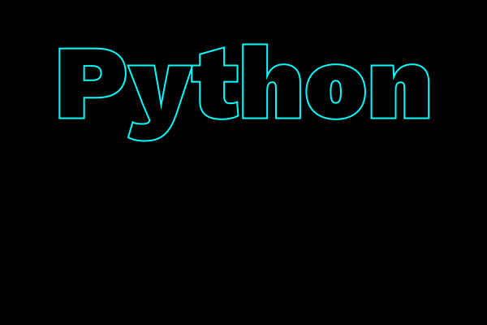

# Polygons and paths

For drawing shapes, Luxor provides polygons and paths.

A polygon is an ordered collection of Points stored in an array. To draw a polygon, you can use the [`poly()`](@ref) function, which converts the points to a path.

A path is a sequence of one or more straight and curved (circular arc or Bézier curve) segments. Paths can consist of subpaths. Luxor maintains a 'current path', to which you can add lines and curves until you finish with a stroke or fill instruction.

You can store a path in a Path type, which contains path elements.

Luxor also provides a BezierPath type, which is an array of four-point tuples, each of which is a Bézier cubic curve section.

|create                        |convert                    |draw                     |info                      |edit                        |
|:---                          |:---                       |:---                     |:---                      |:---                        |
| *polygons*                   |                           |                         |                          |                            |
|[`ngon`](@ref)                |[`polysmooth`](@ref)       |[`poly`](@ref)           |[`isinside`](@ref)        |[`simplify`](@ref)          |
|[`ngonside`](@ref)            |[`polytopath`](@ref)       |[`prettypoly`](@ref)     |[`polyperimeter`](@ref)   |[`polysplit`](@ref)         |
|[`star`](@ref)                |[`polyintersect`](@ref)    |[`polysmooth`](@ref)     |[`polyarea`](@ref)        |[`polyportion`](@ref)       |
|[`polycross`](@ref)           |                           |                         |[`polycentroid`](@ref)    |[`polyremainder`](@ref)     |
|[`offsetpoly`](@ref)          |                           |                         |[`BoundingBox`](@ref)     |[`polysortbyangle`](@ref)   |
|[`hypotrochoid`](@ref)        |                           |                         |[`ispolyclockwise`](@ref) |[`polysortbydistance`](@ref)|
|[`epitrochoid`](@ref)         |                           |                         |[`ispolyconvex`](@ref)    |[`polyclip`](@ref)          |
|[`polyrotate!`](@ref)         |                           |                         |[`ispointonpoly`](@ref)   |[`polymove!`](@ref)         |
|[`polyfit`](@ref)             |                           |                         |[`polysidelengths`](@ref) |[`polyscale!`](@ref)        |
|[`polyhull`](@ref)            |                           |                         |                          |[`polyreflect!`](@ref)      |
|[`polysuper`](@ref)           |                           |                         |                          |[`polysample`](@ref)        |
|[`polybspline`](@ref)         |                           |                         |                          |[`polytriangulate`](@ref)   |
|                              |                           |                         |                          |[`insertvertices!`](@ref)   |
|                              |                           |                         |                          |[`polymorph`](@ref)         |
|                              |                           |                         |                          |                            |
|                              |                           |                         |                          |                            |
| *paths*                      |                           |                         |                          |                            |
|[`storepath`](@ref)           |                           |                         |                          |                            |
|[`getpath`](@ref)             |[`pathtopoly`](@ref)       |[`drawpath`](@ref)       |[`pathlength`](@ref)      |[`pathsample`](@ref)        |
|[`getpathflat`](@ref)         |                           |                         |                          |                            |
| *Bezier paths*               |                           |                         |                          |                            |
|[`makebezierpath`](@ref)      |[`pathtobezierpaths`](@ref)|[`drawbezierpath`](@ref) |                          |[`trimbezier`](@ref)        |
|[`pathtobezierpaths`](@ref)   |[`bezierpathtopoly`](@ref) |[`brush`](@ref)          |                          |[`splitbezier`](@ref)       |
|`BezierPath`                  |[`bezierpathtopath`](@ref) |[`bezigon`](@ref)        |                          |                            |
|`BezierPathSegment`           |                           |                         |                          |                            |
|[`beziersegmentangles`](@ref) |                           |                         |                          |                            |

## Regular polygons ("ngons")

A polygon is an array of points. The points can be joined with straight lines.

You can make regular polygons — from triangles, pentagons, hexagons, septagons, heptagons, octagons, nonagons, decagons, and on-and-on-agons — with [`ngon`](@ref).

```@example
using Luxor, Colors # hide
Drawing(700, 600, "../assets/figures/n-gon.png") # hide

origin() # hide
background("white") # hide
cols = distinguishable_colors(10)
setline(2)
fontsize(12)
tiles = Tiler(700, 600, 3, 3)

for (pos, n) in tiles
    @layer begin
        translate(pos)

        plist = ngon(Point(0, 0), 80, n, vertices=true)

        sethue(cols[n])

        poly(plist, action=:fill, close=true)
        sethue("grey10")
        poly(plist, action=:stroke, close=true)

        circle(Point(0, 0), 4, action=:fill)

        label.([string(i) for i in 1:n], slope.(O, plist), plist, offset=5)
    end
end

finish() # hide

nothing # hide
```

The initial orientation of the polygon defaults to 0.


If you want to specify the side length rather than the circumradius, use [`ngonside`](@ref).

```@example
using Luxor # hide
Drawing(500, 600, "../assets/figures/ngonside.png") # hide
background("white") # hide
origin() # hide

setline(2) # hide
for i in 20:-1:3
    sethue(i/20, 0.5, 0.7)
    ngonside(Point(0, 0), 75, i, 0, action = :fill)
    sethue("grey10")
    ngonside(Point(0, 0), 75, i, 0, action = :stroke)
end

finish() # hide
nothing # hide
```


The functions return the vertices, or you can use the `vertices=true` option.

```@example
using Luxor # hide
Drawing() # hide
ngon(Point(0, 0), 10, 5)
```

## Polygons

Use [`poly`](@ref) to draw lines connecting the points and/or just fill the area:

```@example
using Luxor, Random # hide
Drawing(600, 250, "../assets/figures/simplepoly.png") # hide
background("white") # hide
Random.seed!(42) # hide
origin() # hide
sethue("orchid4") # hide
tiles = Tiler(600, 250, 1, 2, margin=20)
tile1, tile2 = collect(tiles)

randompoints = [Point(rand(-100:100), rand(-100:100)) for i in 1:10]

gsave()
translate(tile1[1])
poly(randompoints, action = :stroke)
grestore()

gsave()
translate(tile2[1])
poly(randompoints, action = :fill)
grestore()

finish() # hide
nothing # hide
```


### Holes

To form a hole in a polygon, you reverse the direction of the hole compared to the outer shape. When converted to paths (which happens as part of the drawing process), the reversed polygon forms a hole when drawn.

In this example, the first nut is made by reversing the list of points, the second by using the keyword argument when constructing the shape, and the third when drawing the polygon as a path.

```@example
using Luxor # hide
d = Drawing(600, 300, :svg) # hide
background("antiquewhite") # hide
origin() # hide

# nut 1

translate(-100, 0)

nut = ngon(O, 120, 6, vertices=true)
hole = reverse(ngon(O, 70, 6, vertices=true))

poly.((nut, hole), action = :path)
fillpath()

# nut 2

translate(100, 0)

sethue("purple")
nut = ngon(O, 120, 6, vertices=true)
hole = ngon(O, 70, 6, reversepath=true, vertices=true)

poly(nut, action = :path)
poly(hole, action = :path)
fillpath()

# nut 3

translate(100, 0)

sethue("orange")
nut = ngon(O, 120, 6, vertices=true)
hole = ngon(O, 70, 6, vertices=true)

poly(nut, action = :path)
newsubpath()
poly(hole, reversepath=true, action = :path)
fillpath()

finish() # hide
d # hide
```

### Fill rule

You can have more control over the hole business by using the `setfillrule()` function. This allows you to set the fill rule for subpaths to either `:winding` or `:even_odd`. The fill rule is used to select how paths that contain subpaths are filled. The default rule (which determines the behaviour we usually see for the current drawing) is `:winding`.

See the wikipedia entry for [Even–odd_rule](https://en.wikipedia.org/wiki/Even–odd_rule) for more details.

In the following example, the default `:winding` rule is shown in cyan, on the left, and the `reverse` flag controls whether the subpath is reversed or not. Without it, the boxes would just be drawn on top of each other and you'd just see a big cyan box.

The `:even_odd` rule is shown in operation in magenta, on the right. The results are the same, but the code can be simpler, because `reverse`-ing every other subpath is not required.

```@example
using Luxor # hide
@drawsvg begin # hide
fontsize(69)
panes = Tiler(800, 400, 1, 2)

setfillrule(:winding)
sethue("cyan")

@layer begin
    translate(first(panes[1]))
    let
        reverse = false
        for s in 300:-20:30
            box(O, s, s, reversepath=reverse, :path)
            reverse = !reverse
        end
    end
    fillpath()
end

setfillrule(:even_odd)
sethue("magenta")

@layer begin
    translate(first(panes[2]))
    for s in 300:-20:30
        box(O, s, s, :path)
    end
    fillpath()
end

end 800 400 # hide
```

### Pretty polygons

The [`prettypoly`](@ref) function can place graphics at each vertex of a polygon. After the polygon action, the supplied `vertexfunction` function is evaluated at each vertex. For example, to mark each vertex of a polygon with a randomly-colored circle:

```@example
using Luxor # hide
Drawing(400, 250, "../assets/figures/prettypolybasic.png") # hide
background("white") # hide
origin() # hide
sethue("steelblue4") # hide

apoly = star(O, 70, 7, 0.6, 0, vertices=true)
prettypoly(apoly, action=:fill, () ->
        begin
            randomhue()
            circle(O, 10, action=:fill)
        end,
    close=true)
finish() # hide
nothing # hide
```


An optional keyword argument `vertexlabels` lets you pass a
function that can number each vertex. The function can use
two arguments, the current vertex number, and the total
number of points in the polygon:

```@example
using Luxor # hide
Drawing(400, 250, "../assets/figures/prettypolyvertex.png") # hide
background("white") # hide
origin() # hide
sethue("steelblue4") # hide

apoly = star(O, 80, 5, 0.6, 0, vertices=true)
prettypoly(apoly,
    :stroke,
    vertexlabels = (n, l) -> (text(string(n, " of ", l), halign=:center)),
    close=true)
finish() # hide
nothing # hide
```


Recursive decoration is possible:

```@example
using Luxor, Random # hide
Drawing(400, 260, "../assets/figures/prettypolyrecursive.png") # hide
background("white") # hide
Random.seed!(42) # hide
origin() # hide
sethue("magenta") # hide
setopacity(0.5) # hide

decorate(pos, p, level) = begin
    if level < 4
        randomhue()
        scale(0.25, 0.25)
        prettypoly(p, action = :fill, () -> decorate(pos, p, level+1), close=true)
    end
end

apoly = star(O, 100, 7, 0.6, 0, vertices=true)
prettypoly(apoly, action = :fill, () -> decorate(O, apoly, 1), close=true)
finish() # hide
nothing # hide
```


Polygons can be simplified using the Douglas-Peucker algorithm (non-recursive version), via [`simplify`](@ref).

```@example
using Luxor # hide
Drawing(600, 500, "../assets/figures/simplify.png") # hide
background("white") # hide
origin() # hide
sethue("grey10") # hide
setline(1) # hide
fontsize(20) # hide
translate(0, -120) # hide
sincurve = [Point(6x, 80sin(x)) for x in -5π:π/20:5π]
prettypoly(collect(sincurve), action = :stroke,
    () -> begin
            sethue("red")
            circle(O, 3, action = :fill)
          end)
text(string("number of points: ", length(collect(sincurve))), 0, 100)
translate(0, 200)
simplercurve = simplify(collect(sincurve), 0.5)
prettypoly(simplercurve, action = :stroke,
    () -> begin
            sethue("red")
            circle(O, 3, action = :fill)
          end)
text(string("number of points: ", length(simplercurve)), 0, 100)
finish() # hide
nothing # hide
```


### Quickly changing polygons

If you want to quickly and permanently modify a polygon, there's [`polymove!`](@ref), [`polyscale!`](@ref), [`polyreflect!`](@ref), and [`polyrotate!`](@ref).

```@example
using Luxor # hide
Drawing(400, 350, "../assets/figures/polychange.png") # hide
origin() # hide

sethue("magenta") # hide
shape = star(O, 10, 5, 0.5, 0, vertices=true)

circle(O, 3, action = :stroke)

polymove!(shape, O, O + (0, 50))

poly(shape, action = :stroke, close=true)

for i in 1:20
    poly(polyrotate!(shape, π/5), action = :fill, close=true)
    polyscale!(shape, 19//18)
end

finish() # hide
nothing # hide
```

The polygon is continually modified (notice the `!` in the function names).


```@example
using Luxor, Random # hide
Drawing(400, 350, "../assets/figures/polyreflect.png") # hide
origin() # hide
Random.seed!(34) # hide
setopacity(0.7) # hide
sethue("grey60") # hide
pgon = randompointarray(BoundingBox()/2 ..., 10)
polymove!(pgon, O, Point(-80, 0))
poly(pgon, action = :fill, close=true)
# reflect in y axis:
polyreflect!(pgon, Point(0, 0), Point(0, 100))
sethue("blue")
poly(pgon, action = :fill, close=true)
finish() # hide
nothing # hide
```


### Other functions

There are a number of experimental polygon functions. These won't work well for polygons that aren't simple or where the sides intersect each other, but they sometimes do a reasonable job. For example, here's [`polysplit`](@ref):

```@example
using Luxor, Random # hide
Drawing(400, 150, "../assets/figures/polysplit.png") # hide
origin() # hide
setopacity(0.7) # hide
Random.seed!(42) # hide
sethue("grey10") # hide
s = squircle(O, 60, 60, vertices=true)
pt1 = Point(0, -120)
pt2 = Point(0, 120)
line(pt1, pt2, action = :stroke)
poly1, poly2 = polysplit(s, pt1, pt2)
randomhue()
poly(poly1, action = :fill)
randomhue()
poly(poly2, action = :fill)
finish() # hide
nothing # hide
```


### Smoothing polygons

Because polygons can have sharp corners, the experimental [`polysmooth`](@ref) function attempts to insert arcs at the corners and draw the result.

The original polygon is shown in red; the smoothed polygon is shown on top:

```@example
using Luxor, Random # hide
Drawing(600, 250, "../assets/figures/polysmooth.svg") # hide
origin() # hide
background("white") # hide
setopacity(0.5) # hide
Random.seed!(42) # hide
setline(0.7) # hide
tiles = Tiler(600, 250, 1, 5, margin=10)
for (pos, n) in tiles
    p = star(pos, tiles.tilewidth/2 - 2, 5, 0.3, 0, vertices=true)
    sethue("red")
    poly(p, close=true, action = :stroke)
    sethue("grey10")
    polysmooth(p, n * 2, action = :fill)
end

finish() # hide
nothing # hide
```


The final polygon shows that you can get unexpected results if you attempt to smooth corners by more than the possible amount. The `debug=true` option draws the circles if you want to find out what's going wrong, or if you want to explore the effect in more detail.

```@example
using Luxor, Random # hide
Drawing(600, 250, "../assets/figures/polysmooth-pathological.svg") # hide
origin() # hide
background("white") # hide
setopacity(0.75) # hide
Random.seed!(42) # hide
setline(1) # hide
p = star(O, 60, 5, 0.35, 0, vertices=true)
setdash("dot")
sethue("red")
prettypoly(p, close=true, action = :stroke)
setdash("solid")
sethue("grey10")
polysmooth(p, 40, action = :fill, debug=true)
finish() # hide
nothing # hide
```


## Offsetting polygons

There are three methods for [`offsetpoly`](@ref), a function which
constructs a new polygon that's offset from an existing one.

- `offsetpoly(plist, d)` treats the `plist` of points as a polygon
   with `n` vertices joined by `n` lines with offset `d` on both
   sides.

- `offsetpoly(plist, startoffset=d1, endoffset=d2)` treats
  the `plist` of points as a polyline with `n` vertices
  joined by `n-1` lines, where the offset varies from
  `startoffset` to `endoffset`.

- `offsetpoly(plist, f::function)` applies a function f at
  each vertex of the polyline to determine the width of the
  offset polygon at that point.

The first method is good for making closed shapes larger or smaller.
The other methods are useful for building shapes around an open
linear spine.

#### 1: `n` vertices joined by `n` lines

The `offsetpoly(plist, d)` method constructs a closed
polygon outside or inside an existing polygon, at distance `d`.  The last
vertex in `plist` as assumed to be be connected to the
first.

In the following example, the dotted red polygon is the
original, the black polygons have positive offsets and
surround the original, the cyan polygons have negative
offsets and run inside the original. Use [`poly`](@ref) to draw
the result.

```@example
using Luxor, Random # hide
Drawing(600, 250, "../assets/figures/polyoffset-simple.png") # hide
origin() # hide
background("white") # hide
Random.seed!(42) # hide
setline(1.5) # hide

p = star(O, 45, 5, 0.5, 0, vertices=true)
sethue("red")
setdash("dot")
poly(p, action = :stroke, close=true)
setdash("solid")
sethue("black")

poly(offsetpoly(p, 20), action = :stroke, close=true)
poly(offsetpoly(p, 25), action = :stroke, close=true)
poly(offsetpoly(p, 30), action = :stroke, close=true)
poly(offsetpoly(p, 35), action = :stroke, close=true)

sethue("darkcyan")

poly(offsetpoly(p, -10), action = :stroke, close=true)
poly(offsetpoly(p, -15), action = :stroke, close=true)
poly(offsetpoly(p, -20), action = :stroke, close=true)
finish() # hide
nothing # hide
```


The function is intended for simple cases, and it can go
wrong if pushed too far. Sometimes the offset distances can
be larger than the polygon segments, and things will start
to go wrong. In this example, the offset goes so far
negative that the polygon overshoots the origin, becomes
inverted and starts getting larger again.


#### 2: `n` vertices joined by `n-1` lines

The `offsetpoly(plist)` method constructs a polygon around a
line joining the lines in `plist`. At the start of the line,
the polygon will be `startoffset` units on each side; by the
end of the line, the polygon will be `endoffset` units on
each side. The last vertex isn't joined to the first, hence `n-1`.

In the following example, the original spine is drawn in
orange, on top of the black polygon that's constructed to be
offset 2 units on each side at the start and 30 units on
each side at the end.

```@example
using Luxor # hide
Drawing(800, 500, "../assets/figures/polyoffset-open.png") # hide
origin() # hide
background("purple") # hide
setline(2) # hide

spine = [Point(20 + 40x, 15sin(2x)) for x in 0:.1:4π]

for θ in range(0, 2π, step=π/12)
    @layer begin
        sethue("black")
        rotate(θ)
        poly(offsetpoly(spine, startoffset=1, endoffset=30), action = :fill)
        sethue("orange")
        poly(spine, action = :stroke)
    end
end

finish() # hide
nothing # hide
```


##### Using an offset-control function

This method accepts a keyword argument that allows you to
control the way the offsets are applied, using the easing
functionality built in to Luxor (see [Animation helper functions](@ref)).

By default the function is `lineartween`, so the offset
changes linearly between the `startoffset` and the
`endoffset` values. With other easing functions, this change
is modulated. For example, the `easeinoutquad` function
moves between start and end values using a quadratic motion.

```@example
using Luxor # hide
Drawing(800, 500, "../assets/figures/polyoffset-easing.png") # hide
origin() # hide
background("white") # hide
setline(2) # hide
setlinejoin("round") # hide

spine = between.(O - (200, 0), O + (200, 0), 0:0.025:1)

sethue("red")
prettypoly(spine, action = :stroke)

sethue("black")
pg = offsetpoly(spine, startoffset=0, endoffset=200, easingfunction=easeinoutquad)
prettypoly(pg, action = :stroke, close=true)

finish() # hide
nothing # hide
```


But in the next example, the function `f(t, b, c, d)` (the
Luxor standard four-argument easing function) is defined to run
from 0 to 2 and back again as `t` goes from  0 to 1, so the initial and final offsets
are 'eased' to 0, and at the middle of the polygon the offsets
at that location are 'eased' to 2 × the offset value at that point.

```@example
using Luxor # hide
Drawing(800, 200, "../assets/figures/polyoffset-easing1.png") # hide
origin() # hide
background("white") # hide
setline(2) # hide
setlinejoin("round") # hide

spine = [Point(20x, 15sin(x)) for x in -4π:pi/24:4pi]

f(t, b, c, d) = 2sin(t * π)

pg = offsetpoly(spine, startoffset=1, endoffset=10, easingfunction=f)
sethue("black")
poly(pg, action = :fill)

sethue("white")
poly(spine, action = :stroke)

finish() # hide
nothing # hide
```


#### 3: Applying a function

This method generates offset widths using the supplied function. The value of the supplied function `f` at `f(0, θ)` determines the start offset on each side, and `f(1, θ)` determines the finishing offset on each side. The width at the middle vertex will be `f(0.5, θ)` (on each side). `θ` is provided as the current slope of the polyline at that point.

This example uses a simple sine curve in `f()` to vary the width of the spiral from beginning to end.

```@example
using Luxor, Colors # hide

f(x, θ) =  10 + 40sin(x * π)

@draw begin # hide

spine = spiral(30, 1.3, vertices=true)
ps = polysample(spine, 250, include_first=true, closed=false)
pgon = offsetpoly(ps, f)
poly(pgon, action = :stroke)

setmesh(mesh(box(BoundingBox(pgon)),
    [
    RGB(Luxor.julia_red...),
    RGB(Luxor.julia_blue...),
    RGB(Luxor.julia_green...),
    RGB(Luxor.julia_purple...),
    ]))
poly(pgon, action = :fill)

end # hide
```

### Fitting splines

The experimental [`polyfit`](@ref) function constructs a B-spline that follows the points approximately.

```@example
using Luxor, Random # hide
Drawing(600, 250, "../assets/figures/polyfit.png") # hide
origin() # hide
background("white") # hide
Random.seed!(42) # hide

pts = [Point(x, rand(-100:100)) for x in -280:30:280]
setopacity(0.7)
sethue("red")
prettypoly(pts, () -> circle(O, 5, action = :fill))
sethue("darkmagenta")
poly(polyfit(pts, 200), action = :stroke)

finish() # hide
nothing # hide
```


There is also the [`polybspline`](@ref) function, which constructs a B-spline curve based on the control points and desired degree with the option of being unclamped.

```@example
using Luxor, Random # hide
Drawing(600, 250, "../assets/figures/polyfit.png") # hide
origin() # hide
background("white") # hide
Random.seed!(42) # hide

pts = [Point(x, rand(-100:100)) for x in -280:30:280] # hide
setopacity(0.7) # hide
sethue("red") # hide
prettypoly(pts, () -> circle(O, 5, action = :fill)) # hide
sethue("darkmagenta") # hide
poly(polybspline(pts, 200; degree = 5), action = :stroke)

finish() # hide
nothing # hide
```


## Converting paths to polygons

You can convert the current path to an array of polygons, using [`pathtopoly`](@ref).

In the next example, the path consists of a number of paths, some of which are subpaths, which form the holes.

```@example
using Luxor # hide
Drawing(800, 300, "../assets/figures/path-to-poly.png") # hide
background("white") # hide
origin() # hide
fontsize(60) # hide
translate(-300, -50) # hide
textpath("get polygons from paths")
plist = pathtopoly()
setline(0.5) # hide
for (n, pgon) in enumerate(plist)
    randomhue()
    prettypoly(pgon, action = :stroke, close=true)
    gsave()
    translate(0, 100)
    poly(polysortbyangle(pgon, polycentroid(pgon)), action = :stroke, close=true)
    grestore()
end
finish() # hide
nothing # hide
```


The [`pathtopoly`](@ref) function calls [`getpathflat`](@ref) to convert the current path to an array of polygons, with each curved section flattened to line segments.

The [`getpath`](@ref) function gets the current path as an array of elements, lines, and unflattened curves.

## Bezigons

A bezigon is like a polygon, but the sides can be Bézier paths instead of straight lines. Supply the corners and sides to the [`bezigon`](@ref) function.

```@example
using Luxor, Colors # hide
@drawsvg begin # hide
background("grey10") # hide
corners = [Point(10, 0), Point(200, 0)]
sides = [
    [Point(70, -40), Point(150, -50)],
    [Point(150, 50), Point(70, 40)],
]
for i in 1:10
    sethue(HSV(36i, .7, .7))
    rotate(2π / 10)
    bezigon(corners, sides, :fill)
end
sethue("white")
circle.([corners..., sides[1]..., sides[2]...], 7, :fill)
end 600 400 # hide
```

## Polygons to Bézier paths and back again

Use the [`makebezierpath`](@ref) and [`drawbezierpath`](@ref) functions to make and draw Bézier paths, and [`pathtobezierpaths`](@ref) to convert the current path to an array of Bézier paths.

A BezierPath type contains a sequence of `BezierPathSegment`s; each curve segment is defined by four points: two end points and their control points.

```julia
    (Point(-129.904, 75.0),        # start point
     Point(-162.38, 18.75),        # ^ control point
     Point(-64.9519, -150.0),      # v control point
     Point(-2.75546e-14, -150.0)), # end point
    (Point(-2.75546e-14, -150.0),
     Point(64.9519, -150.0),
     Point(162.38, 18.75),
     Point(129.904, 75.0)),
    (Point(129.904, 75.0),
     Point(97.4279, 131.25),
     Point(-97.4279, 131.25),
     Point(-129.904, 75.0)
     ),
     ...
```

Bézier paths are different from ordinary paths in that they don't usually contain straight line segments. However, by setting the two control points to be the same as their matching start/end points, you create straight line sections.

[`makebezierpath`](@ref) takes the points in a polygon and converts each line segment into one Bézier curve. [`drawbezierpath`](@ref) draws the resulting sequence.

```@example
using Luxor # hide
Drawing(600, 320, "../assets/figures/abezierpath.png") # hide
background("white") # hide
origin() # hide
setline(1.5) # hide
setgray(0.5) # hide
pts = ngon(O, 150, 3, pi/6, vertices=true)
bezpath = makebezierpath(pts)
poly(pts, action = :stroke)
for (p1, c1, c2, p2) in bezpath[1:end-1]
    circle.([p1, p2], 4, action = :stroke)
    circle.([c1, c2], 2, action = :fill)
    line(p1, c1, action = :stroke)
    line(p2, c2, action = :stroke)
end
sethue("black")
setline(3)
drawbezierpath(bezpath, action = :stroke, close=false)
finish() # hide
nothing # hide
```


```@example
using Luxor, Random # hide
Drawing(600, 320, "../assets/figures/bezierpaths.png") # hide
background("white") # hide
origin() # hide
Random.seed!(3) # hide
tiles = Tiler(600, 300, 1, 4, margin=20)
for (pos, n) in tiles
    @layer begin
        translate(pos)
        pts = polysortbyangle(
                randompointarray(
                    Point(-tiles.tilewidth/2, -tiles.tilewidth/2),
                    Point(tiles.tilewidth/2, tiles.tilewidth/2),
                    4))
        setopacity(0.7)
        sethue("black")
        prettypoly(pts, action = :stroke, close=true)
        randomhue()
        drawbezierpath(makebezierpath(pts), action = :fill)
    end
end
finish() # hide
nothing # hide
```


You can convert a Bézier path to a polygon (an array of points), using the [`bezierpathtopoly`](@ref) function. This chops up the curves into a series of straight line segments. An optional `steps` keyword lets you specify how many line segments are used to approximate each Bézier segment.

In this example, the original star is drawn in a dotted gray line, then converted to a Bézier path (drawn in orange), then the Bézier path is converted (with low resolution) to a polygon but offset by 20 units before being drawn (in blue).

```@example
using Luxor, Random # hide
Drawing(600, 600, "../assets/figures/bezierpathtopoly.png") # hide
background("white") # hide
origin() # hide
Random.seed!(3) # hide

pgon = star(O, 250, 5, 0.6, 0, vertices=true)

@layer begin
    setgrey(0.5)
    setdash("dot")
    poly(pgon, action = :stroke, close=true)
    setline(5)
end

setline(4)

sethue("orangered")

np = makebezierpath(pgon)
drawbezierpath(np, action = :stroke)

sethue("steelblue")
p = bezierpathtopoly(np, steps=3)

q1 = offsetpoly(p, 20)
prettypoly(q1, action = :stroke, close=true)

finish() # hide
nothing # hide
```


You can convert the current path to an array of BezierPaths using the [`pathtobezierpaths`](@ref) function.

In the next example, the letter "a" is placed at the current position (set by [`move`](@ref)) and then converted to an array of Bézier paths. Each Bézier path is drawn first of all in gray, then the control points of segment are drawn (in orange) showing how they affect the curvature.

```@example
using Luxor # hide
Drawing(600, 400, "../assets/figures/pathtobezierpaths.png") # hide
background("ivory") # hide
origin() # hide
st = "a"
thefontsize = 500
fontsize(thefontsize)
sethue("red")
tex = textextents(st)
move(-tex[3]/2, tex[4]/2)
textpath(st)
nbps = pathtobezierpaths()
setline(1.5)
for nbp in nbps
    sethue("grey80")
    drawbezierpath(nbp, action = :stroke)
    for p in nbp
        sethue("darkorange")
        circle(p[2], 2.0, action = :fill)
        circle(p[3], 2.0, action = :fill)
        line(p[2], p[1], action = :stroke)
        line(p[3], p[4], action = :stroke)
        if p[1] != p[4]
            sethue("black")
            circle(p[1], 2.0, action = :fill)
            circle(p[4], 2.0, action = :fill)
        end
    end
end
finish() # hide
nothing # hide
```


[`beziersegmentangles`](@ref) lets you define a Bézier path segment by specifying the angles the control handles make with the base line.

```@example
using Luxor # hide
Drawing(600, 400, "../assets/figures/beziersegmentangles.svg") # hide
background("ivory") # hide
origin() # hide

setline(0.5)

@layer begin
    rule.(O, (0, (π / 2)))
end

P = O
Q = O + (200, 0)
sethue("black")

pts = beziersegmentangles(P, Q,
    out=deg2rad(60),
    in=2π - deg2rad(45))

@layer begin
    setline(2)
    sethue("purple")
    drawbezierpath(pts, action=:stroke)
end

sethue("grey50")
line(O, pts[2], action=:stroke)
line(Q, pts[3], action=:stroke)
fontsize(15)
circle.((P, pts[2], pts[3], Q), 5, action=:fill)
label.(("P", "Q"), Ref(:ne), (P, Q))
text("60°", P + (40, 20))
text("135°", Q + (10, 20))
finish() # hide
nothing # hide
```


There are some functions that can modify Bezier path segments. For example, [`trimbezier`](@ref) chops portions off each end:

```@example
using Luxor # hide
d = Drawing(600, 400, :svg) # hide
background("ivory") # hide
origin() # hide

setline(2)

bez  = BezierPathSegment(ngon(O, 150, 4, vertices=true)...)
drawbezierpath(bez, action = :stroke)

setopacity(0.4)
sethue("red")
setline(20)
trimbez = trimbezier(bez, 0.2, 0.8)
drawbezierpath(trimbez, action = :stroke)

setline(40)
sethue("purple")
trimbez = trimbezier(trimbez, 0.2, 0.8)
drawbezierpath(trimbez, action = :stroke)

finish() # hide
d # hide
```

When working with Bézier curves it's usual to consider the curve in terms of a parameter `t` going from 0.0 to 1.0.

[`splitbezier`](@ref) can split a segment into two shorter segments.

## Brush strokes

The [`brush`](@ref) function builds Bezier paths in a quasi-random fashion, that could look like brush strokes. The optional keyword arguments allow a range of different effects.

You can pass a function that can adjust various drawing settings before the shapes are drawn.

```@example
using Luxor, Random # hide

brushα(nbpb) = begin
    setline(1)
    setopacity(0.3)
    drawbezierpath(nbpb, action = :stroke)
    sethue(0.2, 0.3, rand(0.3:0.01:0.65))
    return nbpb
end

function numberit(pos, n)
    @layer begin
        sethue("black")
        text(string(n), pos)
    end
end

Drawing(800, 700, "../assets/figures/brush1.png") # hide
origin() # hide
background("white") # hide
Random.seed!(42) # hide
t = Tiler(800, 700, 5, 1)
sethue("orange3")
fontsize(20)
for (pos, n) in t
    start, finish = pos - (200, 0), pos + (200, 0)
    if n == 1
        # five brush strokes
        brush(start, finish, 1)
        numberit(pos, n)
    elseif n == 2
        # minwidth and maxwidth control the, er, width
         brush(start, finish, 5, minwidth = -5, maxwidth = 2)
         numberit(pos, n)
    elseif n == 3
        # dont have to have transparent strokes
         brush(start, finish, 20, minwidth = .2, randomopacity = false)
         numberit(pos, n)
    elseif n == 4
        # twist and adjust handles to taste
         brush(start, finish, minwidth = -.1, maxwidth = .2,
             twist = 2, highhandle = 2, tidystart=false)
         numberit(pos, n)
    elseif n == 5
        # call a function to modify each stroke
        brush(start, finish, 1, minwidth = -2.2, maxwidth = .8,
            lowhandle = -.4, highhandle = 1.5, twist = .5,
            strokefunction = brushα)
        numberit(pos, n)
    end
end
finish() # hide
nothing # hide
```


For more information (and more than you probably wanted to know) about Luxor's Bézier paths, visit [https://cormullion.github.io/pages/2018-06-20-bezier/](https://cormullion.github.io/pages/2018-06-20-bezier/).

## Polygon information

`polyperimeter` calculates the length of a polygon's perimeter.

```@example
using Luxor, Random # hide
Drawing(600, 250, "../assets/figures/polyperimeter.png") # hide
origin() # hide
background("white") # hide
Random.seed!(42) # hide
setline(1.5) # hide
sethue("black") # hide
fontsize(20) # hide
p = box(O, 50, 50, vertices=true)
poly(p, action = :stroke)
text(string(round(polyperimeter(p, closed=false))), O.x, O.y + 60)

translate(200, 0)

poly(p, action = :stroke, close=true)
text(string(round(polyperimeter(p, closed=true))), O.x, O.y + 60)

finish() # hide
nothing # hide
```


To find the "left-most" point, ie the point with the lowest x coordinate, you can use built-in `extrema()` function, to return the left-most and right-most points. (This is because, when you compare points, the x coordinate is tested first.) To find the "lowest" points, ie the points with the lowest y value, you could find the y extrema and use it to find the index:

```julia
findfirst(pt -> isequal(pt.y, first(extrema(pt -> pt.y, pts))), pts)
# 13
```

### Point inside polygon

The [`isinside`](@ref) function returns true if a point is inside a polygon.

```@example
using Luxor # hide
Drawing(500, 500, "../assets/figures/isinside.png") # hide
background("white") # hide
origin() # hide

apolygon = star(O, 200, 8, 0.5, 0, vertices=true)
for pt in collect(first.(Table(30, 30, 15, 15)))
    sethue(noise(pt.x/600, pt.y/600), noise(pt.x/300, pt.y/300), noise(pt.x/250, pt.y/250))
    isinside(pt, apolygon, allowonedge=true) ?
        circle(pt, 8, action = :fill) : circle(pt, 3, action = :fill)
end

finish() # hide
nothing # hide
```


### Convex hull

A convex hull of a polygon is the subset of points such that, when connected with straight lines, the resulting shape contains every point of the polygon.

Use [`polyhull`](@ref) to find the convex hull of an array of points.

This code obtains all the points in the Julia logo's circles, combines them into a single array, and then calculates the convex hull that encloses them all.

```@example
using Luxor # hide
d = Drawing(800, 500, :svg) # hide
origin() # hide
setline(4)

juliacircles(130) # draw in color

# get all the points
juliacircles(130, action=:path)
points = collect(Iterators.flatten(vcat(pathtopoly())))

hull = polyhull(points)

sethue("gold2")

prettypoly(hull, close=true, action = :stroke)

finish() # hide
d # hide
```

## Polygon selection and modification

There are Luxor functions to return the first part or last part of a polygon. You can also ask for a resampling of a polygon, choosing either to increase the number of points (which places new points to the "lines" joining the vertices) or decrease them (which changes the shape of the polygon). It's also possible to insert vertices automatically.

[`polyportion`](@ref) and [`polyremainder`](@ref) return part of a polygon depending on the fraction you supply. For example, `polyportion(p, 0.5)` returns the first half of polygon `p`, `polyremainder(p, .75)` returns the last quarter of it.

```@example
using Luxor, Random # hide
Drawing(600, 250, "../assets/figures/polyportion.png") # hide
origin() # hide
background("white") # hide
Random.seed!(42) # hide
setline(1.5) # hide
sethue("black") # hide
fontsize(20) # hide

p = ngon(O, 100, 7, 0, vertices=true)
poly(p, action = :stroke, close=true)
setopacity(0.75)

setline(20)
sethue("red")
poly(polyportion(p, 0.25), action = :stroke)

setline(10)
sethue("green")
poly(polyportion(p, 0.5), action = :stroke)

setline(5)
sethue("blue")
poly(polyportion(p, 0.75), action = :stroke)

setline(1)
circle(polyremainder(p, 0.75)[1], 5, action = :stroke) # first point

finish() # hide
nothing # hide
```


You can insert vertices in the edges of a polygon with [`insertvertices!`](@ref). For example, this code inserts a new vertex into each side of a polygon five times. The polygon ends up with 128 vertices.

```@example
using Luxor # hide
Drawing(600, 250, "../assets/figures/insertvertices.png") # hide
origin() # hide
background("white") # hide
setline(1) # hide
sethue("black") # hide

pts = box(O, 500, 200, vertices=true)
prettypoly(pts, action = :stroke, close=true)

for i in 1:5
    insertvertices!(pts)
    prettypoly(pts, action = :stroke, close=true)
    fontsize(16)
    label(string(length(pts)), :ne, pts[1], offset=10)
    scale(0.8)
end

finish() # hide
nothing # hide
```


To resample a polygon, use [`polysample`](@ref). In this example, the same four-sided polygon is resampled at multiples of 4, with different circle radii at each multiple. This adds more points to the new copy of the original polygon.

```@example
using Luxor # hide
Drawing(600, 250, "../assets/figures/polysample.png") # hide
origin() # hide
background("white") # hide
setline(1) # hide
sethue("black") # hide

pts = ngon(O, 100, 4, vertices=true)
for (n, npoints) in enumerate(reverse([4, 8, 16, 32, 48]))
    prettypoly(polysample(pts, npoints),
        :stroke, close=true,
        () -> begin
                circle(O, 2n, action = :stroke)
              end)
end

finish() # hide
nothing # hide
```


There is a `closed` option, which determines whether or not the final edge (the one that would join the final vertex to the first), is included in the sampling. In the following example, the original polygon is drawn in black, then sampled as a closed polygon (in blue), then as a non-closed one (magenta).

```@example
using Luxor # hide
Drawing(600, 250, "../assets/figures/polysample2.png") # hide
origin() # hide
background("white") # hide
setline(1) # hide
sethue("black") # hide
fontsize(8) # hide

translate(0, -50) # hide
setline(1) # hide
sethue("black") # hide

# original polygon

numbervertices(l, n) = label(string(l), :N, O)
drawvertices() = ngon(O, 3, 4, 0, action = :fill)

pts = [Point(30x, 20sin(x)) for x in -2π:π/6:2π]

# 1: drawn as defined

prettypoly(pts, action = :stroke, drawvertices, vertexlabels = numbervertices)

translate(0, 50)


# 2: resampled as closed

npoints = 40

sethue("cornflowerblue")
prettypoly(polysample(pts, npoints, closed=true), action = :stroke, drawvertices,
    vertexlabels = numbervertices)

translate(0, 50)

# 3: resampled as open

sethue("magenta")
prettypoly(polysample(pts, npoints, closed=false), action = :stroke, drawvertices,
    vertexlabels = numbervertices)


finish() # hide
nothing # hide
```


!!! note

    In Luxor, you'll meet `close` and `closed` options.
    `close` is an instruction to path-drawing functions,
    that says "join the most recent point to the first
    point". Whereas, `closed` is an indication that the
    polygons or paths should be treated as being closed
    rather than open, ie whether that last segment joining
    the end point to the first is used for calculations.

### Polygon sides

`polydistances` returns an array of the accumulated side lengths of a polygon. `polysidelengths()` returns an array of the side lengths without summing them.

```julia-repl
julia> p = ngon(O, 100, 7, 0, vertices=true);
julia> polydistances(p)
8-element Vector{Float64}:
   0.0
  86.77674782351163
 173.55349564702325
 260.33024347053487
 347.10699129404645
 433.8837391175581
 520.6604869410697
 607.4372347645814

julia> polysidelengths(p)
7-element Vector{Float64}:
 86.77674782351163
 86.77674782351163
 86.77674782351161
 86.77674782351161
 86.77674782351163
 86.77674782351161
 86.77674782351166

julia> sum(polysidelengths(p))
607.4372347645814
```

`polydistances()` is used by [`polyportion`](@ref) and [`polyremainder`](@ref), and you can pre-calculate and pass them to these functions via keyword arguments for performance. By default the result includes the final closing segment (`closed=true`).

These functions also make use of the [`nearestindex`](@ref), which returns a tuple of: the index of the nearest value in an array of distances to a given value; and the excess value.

In this example, we want to find a point halfway round the perimeter of a triangle. Use [`nearestindex`](@ref) to find the index of the nearest vertex (`nidx`, 2), and the surplus length, (`over`, 100).

```@example
using Luxor # hide
Drawing(650, 250, "../assets/figures/nearestindex.png") # hide
origin() # hide
background("white") # hide

sethue("black") # hide
setline(0.5) # hide

p = ngonside(O, 200, 3, vertices=true)
prettypoly(p, action = :stroke, close=true,
    vertexlabels = (n, l) -> label(string(n), :NW, offset=10))

# distances array
da = polydistances(p)

nidx, over = nearestindex(da, polyperimeter(p)/2)

sethue("red")
circle(p[nidx], 5, action = :stroke)

arrow(p[nidx],
      between(p[nidx], p[nidx+1], over/distance(p[nidx], p[nidx+1])),
      linewidth=2)

finish() # hide
nothing # hide
```


Of course, it's much easier to do `polyportion(p, 0.5)`.

### Area of polygon

Use [`polyarea`](@ref) to find the area of a polygon. Of course, this only works for simple polygons; polygons that intersect themselves or have holes are not correctly processed.

This code draws some regular polygons and calculates their area, perimeter, and shows how near the ratio of perimeter over radius approaches 2π.

```@example
using Luxor # hide
Drawing(650, 500, "../assets/figures/polyarea.png") # hide
origin() # hide
background("white") # hide
fontsize(13) # hide
fontface("Georgia")
sethue("black")
setline(0.25)
outerframe = Table([500], [400, 200])
total = 30
properties = Table(fill(15, total), [20, 85, 85], outerframe[1, 2])
radius = 55
sethue("grey20")
for i in 3:total
    global radius
    text(string(i), properties[i, 1], halign=:right)
    p = ngon(outerframe[1], radius, i, 0, vertices=true)
    prettypoly(p, action = :stroke, close=true, () -> (sethue("red"); circle(O, 2, action = :fill)))
    pa = polyarea(p)
    pp = polyperimeter(p)
    ppoverradius = pp/radius
    text(string(Int(round(pa, digits=0))), properties[i, 2], halign=:left)
    text(string(round(ppoverradius, digits=6)), properties[i, 3], halign=:left)
    radius += 5
end

fontsize(10)
[text(["Sides", "Area", "Perimeter/Radius"][n], pt, halign=:center)
    for (pt, n) in Table([20], [20, 85, 85], outerframe[2] - (0, 220))]

finish() # hide
nothing # hide
```


## Morphing polygons

"morph" means to make one thing turn into another. The experimental [`polymorph`](@ref) function can gradually turn one polygon into another.

You supply two polygons and a value between 0 and 1. For example, if the value is 0.5, the shape is about halfway between the two polygons.

!!! note
    `polymorph()` always returns an array of polygons. Arguments can be arrays of polygons, or single polygons.

By default, the polygons are assumed to be closed, suitable for filling.

```@example
using Luxor, Colors # hide
@drawsvg begin # hide
background("grey10") # hide

fromshape = ngon(O, 50, 4, vertices=true)
toshape = ngon(O, 350, 4, π/4, vertices=true)

setline(8)
for i in range(0, 1, length=10)
    @show i
    sethue(HSB(360i, 0.8, 0.8))
    morph = polymorph(fromshape, toshape, i)
    for p in morph
        poly(p, close=true, action=:stroke)
    end
end
end 800 600 # hide
```

In the next example, each of the two wavy-line polygons are open rather than closed, so you can pass `false` values to the `closed` argument, and the polygons won't be treated as closed shapes.

```@example
using Luxor # hide
@drawsvg begin # hide
background("grey10") # hide
setline(1.5) # hide
rotate(π/2)
fromshape = [Point(90x, -230 + 50sin(3x)) for x in range(-π, π, length=250)]
toshape = [Point(90x, 230 + 50sin(-3x)) for x in range(-π, π, length=250)]
for i in 0:0.03:1
    sethue(1 - i, i/4 + 0.2, 1 - i/4)
    morph = polymorph(fromshape, toshape, i,
        easingfunction=easeinoutcubic,
        closed=(false, false))
    poly(first(morph), action = :stroke)
end
end # hide
```

Sometimes polygons consist of two or more loops - this is how holes work. So `polymorph()` accepts both simple polygons and arrays of polygons, but always returns an array of polygons.

`polymorph()` accepts easing functions that determine the 'speed' and 'acceleration' of the changes. These are the same functions that are described in more detail in the Animation section, [Easing-functions](@ref). In the previous example, the `easeinoutcubic` function made the earlier and later changes small (lines closer together), but the changes at the middle of the morph were larger.

Here are all the easing functions used to `polymorph()` between two polygons:

```@example
using Luxor, Colors # hide
@drawsvg begin # hide
background("grey10")
setline(1)
w, h = 450, 20
a = [[Point(-w / 2, -h / 2), Point(-w / 2, 0), Point(-w / 2, h / 2)]]
b = [[Point(w / 2, -h / 2), Point(w / 2, 0), Point(w / 2, h / 2)]]
translate(boxtopcenter() + (50, 30))
for (i, ef) in enumerate(Luxor.easingfunctions)
    sethue(HSB(12i, .7, .8))
    for i in range(0, 1, length=20)
        pm = polymorph(a, b, i, easingfunction=ef)
        poly(pm[1], :stroke)
    end
    sethue("white")
    text(string(ef), Point(-w/2 - 20, 0), halign=:right, valign=:middle)
    translate(0, 22)
end
end # hide
```

In the next example, `fromshape`, the circle, is an array holding a single vector of Points (`pathtopoly()` returns an array of polygons), and `toshape`, the line, is a simple vector of points (the minimum of three points). In this case, with just simple polygons, only the first element of the result of the `polymorph()` function is needed.

```@example
using Luxor # hide
@drawsvg begin # hide
background("grey10") # hide
setline(0.5) # hide
circlepath(O, 200, action = :path)
fromshape = pathtopoly()
toshape = [Point(0, -250), O, Point(0, 250)] # minimum of 3
for i in 0:0.015:1
    sethue(i, 1 - i, i/2 + 0.5)
    morph = polymorph(fromshape, toshape, i, easingfunction=easeinoutsine)
    poly(first(morph), action = :stroke, close=true)
end
end # hide
```

In the next example, a square morphs into a hexagon.

```@example
using Luxor # hide
@drawsvg begin # hide
background(0.15, 0.15, 0.1) # hide
pgon1 = ngon(O, 80, 4,  vertices = true)
pgon2 = ngon(O, 270, 6, vertices = true)
sethue("cyan")
setline(1)
for i in 0:0.05:1.0
    sethue(i, 1 - i, 0.5)
    poly(first(polymorph(pgon1, pgon2, i)),
        action = :stroke,
        close = true)
end
end 600 600 # hide
```

In the next example, an octagon with a square hole morphs into a square with an octagonal hole.

```@example
using Luxor # hide
@drawsvg begin # hide
background(0.15, 0.15, 0.1) # hide
# build first polygon
ngon(O + (-350, 0), 40, 8, π, action = :path)
newsubpath()
box(O + (-350, 0), 30, 30, reversepath=true, action = :path)
pgon1 = pathtopoly()

# build second polygon
newpath()
box(O + (350, 0), 60, 60, action = :path)
newsubpath()
ngon(O + (350, 0), 20, 8, π, reversepath=true, action = :path)
pgon2 = pathtopoly()

# draw morphs
sethue("cyan")
setline(1)
for i in 0:0.1:1.0
    sethue(i, 1 - i, 0.5)
    poly.(polymorph(pgon1, pgon2, i),
        action=:path,
        close=true)
    fillpath()
end
end 850 250 # hide
```

Because both polygons have reversed subpaths (holes), the polygons should be drawn using `:path` and `fillpath()`.

The next example animates a morph between two programming languages.

```julia
using Luxor, Colors

function frame(scene, framenumber)
    background("grey10")

    fontface("JuliaMono")
    fontsize(120)

    textoutlines("", O + (0, 0), halign=:center, valign=:middle)
    python_logo = pathtopoly()

    textoutlines("", O + (0, 0), halign=:center, valign=:middle)
    julia_logo = pathtopoly()

    fontface("WorkSans-Black")
    fontsize(130)
    textoutlines("Python", O + (0, -100), halign=:center, valign=:middle, action = :path)
    fromtext = pathtopoly()

    textoutlines("Julia", O + (0, 100), halign=:center, valign=:middle, action = :path)
    totext   = pathtopoly()

    newpath()
    sethue("cyan")

    eased_n = scene.easingfunction(framenumber - scene.framerange.start,
      0, 1, scene.framerange.stop - scene.framerange.start)

    i = sin(eased_n * π)
    poly.(polymorph(fromtext, totext, i, easingfunction=easingflat, samples=200),
        action=:path,
        close=true)
    strokepath()

    pm = polymorph(python_logo, julia_logo, i)
    for p in pm
        poly(p, action = :path)
    end
    fillpath()
end

amovie = Movie(600, 400, "p to j")
animate(amovie,
    Scene(amovie, frame, 1:200,
        easingfunction = easeinoutsine),
    creategif = true,
    pathname = "/tmp/python-julia.gif")
```



The "Python" path has 9 loops, whereas "Julia" has 8. The `polymorph()` function tries to work around this - notice how the ninth loop, "n", morphs down to nothing. If you don't want this to happen, set the `kludge` keyword to false. In this particular case, you could increase the number of loops in `totext` to match by using a lower-case "j".

## Other polygon operations

These functions are still in development. Expect varying degrees of success when using them.

[`polyclip()`](@ref) returns the region of a source polygon that lies inside a clipping polygon. In this example, each intersecting piece is created by clipping one of the "circles" with another (each circle is an 80-sided polygon).

```@example
using Luxor, Colors
@drawsvg begin
    background("grey10")

    npoints = 80
    D = 140
    pts = ngon(O, 110, 3, π / 6, vertices=true)

    circle1 = ngon(pts[1], D, npoints, vertices=true)
    circle2 = ngon(pts[2], D, npoints, vertices=true)
    circle3 = ngon(pts[3], D, npoints, vertices=true)

    sethue("cyan"); poly(circle1, :fill)
    sethue("magenta"); poly(circle2, :fill)
    sethue("yellow"); poly(circle3, :fill)

    sethue("blue")
    pc1 = polyclip(circle1, circle2)
    poly(pc1, :fill, close=true)

    sethue("red")
    pc2 = polyclip(circle1, circle3)
    poly(pc2, :fill, close=true)

    sethue("green")
    pc3 = polyclip(circle2, circle3)
    poly(pc3, :fill, close=true)

    pc4 = polyclip(pc1, pc2) # or polyclip(pc1, pc3) ...

    sethue("white")
    poly(pc4, :fill, close=true)
end
```

## Polygon/line Intersections

`intersectlinepoly(pt1, pt2, polygon)` returns an array containing the points where a line from `pt1` to `pt2` crosses the perimeter of the `polygon`.

```@example
using Luxor, Random # hide
Drawing(600, 550, "../assets/figures/linepolyintersections.png") # hide
origin() # hide
background("white") # hide
Random.seed!(5) # hide
setline(0.3)
sethue("thistle")
c = star(O, 120, 7, 0.2, vertices=true)
poly(c, action = :fillstroke, close=true)
for n in 1:15
    pt1 = Point(rand(-250:250, 2)...)
    pt2 = Point(rand(-250:250, 2)...)
    ips = intersectlinepoly(pt1, pt2, c)
    if !isempty(ips)
            sethue("grey20")
            line(pt1, pt2, action = :stroke)
            randomhue()
            circle.(ips, 2, action = :fill)
    else
        sethue("grey80")
        line(pt1, pt2, action = :stroke)
    end
end
finish() # hide
nothing # hide
```


## Polygon intersections

Use [`polyintersect()`](@ref) to find the areas where two polygons intersect.

In the following illustration, the annular sector polygon and a varying rectangular polygon are passed to `polyintersect()`.

In each case, the returned result is an array of polygons. The number of
polygons in the array depends on how the two polygons intersect - there could be
anything from 0 to a lot. Then we iterate through the array, drawing each
polygon in different colors.

```@example
using Luxor, Colors # hide
@drawsvg begin
    background("grey10")

    tiles = Tiler(800, 300, 1, 3)

    for (pos, n) in tiles
        @layer begin
            translate(pos)

            sector(O, 50, 100, 0 + π / 8, 2π - π / 8, :path)
            pg1 = pathtopoly()[1]

            pg2 = box(O,
                    [250, 80, 250][n],
                    [120, 250, 80][n])

            setopacity(0.6)

            sethue("lightpink")
            poly(pg1, :fill)

            sethue("yellowgreen")
            poly(pg2, :fill)

            pintersection = polyintersect(pg1, pg2)

            for (i, p) in enumerate(pintersection)
                setcolor(HSB([0, 180, 310][i], 0.9, 0.9))
                poly(p, :fill)
                sethue("grey90")
                poly(p, :stroke, close=true)
            end
        end
    end
end 800 300
```

In case there's no intersection, the returned result is empty: `Vector{Point}[]`.

The algorithm used is the [Weiler-Atherton algorithm](https://liorsinai.github.io/mathematics/2023/09/30/polygon-clipping.html).

## Triangulation

Use [`polytriangulate`](@ref) to join the vertices of a polygon to form triangles. It returns an array of triangular polygons.

```@example
using Luxor, Random # hide
Drawing(600, 550, "../assets/figures/polytriangulate.png") # hide

origin() # hide
background("white") # hide
fontsize(18) # hide

pts = ngon(O, 200, 7, vertices=true)
triangles = polytriangulate(pts)

for (n, tri) in enumerate(triangles)
    sethue([Luxor.julia_purple,
            Luxor.julia_blue,
            Luxor.julia_red,
            Luxor.julia_green
            ][mod1(n, end)])
    poly(offsetpoly(tri, -2), action = :fill, close = true)
    sethue("white")
    text(string(n), polycentroid(tri), halign=:center)
end

sethue("red")
setline(3)
poly(pts, action = :stroke, close=true)

finish() # hide
nothing # hide
```


