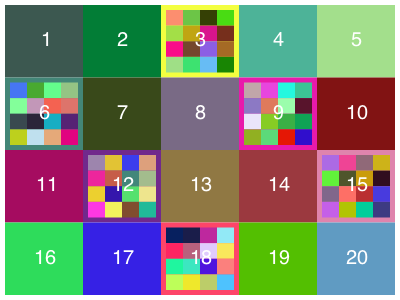

```@meta
DocTestSetup = quote
    using Luxor, Colors
    end
```
# Tables and grids

You often want to position graphics at regular locations on the drawing. The positions can be provided by:

- `Tiler`: a rectangular grid which you specify by enclosing area, and the number of rows and columns
- `Partition`: a rectangular grid which you specify by enclosing area, and the width and height of each cell
- `Grid` a rectangular grid, points supplied on demand
- `Table`: a rectangular grid which you specify by providing row and column numbers, row heights and column widths

These are types which act as iterators. Their job is to provide you with centerpoints; you'll probably want to use these in combination with the cell's widths and heights.

There are also functions to make hexagonal grids. See [Hexagonal grids](@ref).

## Tiles and partitions

The drawing area (or any other area) can be divided into rectangular tiles (as rows and columns) using the `Tiler` and `Partition` iterators.

The [`Tiler`](@ref) iterator returns the center point and tile number of each tile in turn.

In this example, every third tile is divided up into subtiles and colored:

```@example
using Luxor, Random # hide
Drawing(800, 500, "../assets/figures/tiler.png") # hide
background("white") # hide
origin() # hide
Random.seed!(1) # hide
fontsize(20) # hide
tiles = Tiler(800, 500, 4, 5, margin=5)
for (pos, n) in tiles
    randomhue()
    box(pos, tiles.tilewidth, tiles.tileheight, action=:fill)
    if n % 3 == 0
        gsave()
        translate(pos)
        subtiles = Tiler(tiles.tilewidth, tiles.tileheight, 4, 4, margin=5)
        for (pos1, n1) in subtiles
            randomhue()
            box(pos1, subtiles.tilewidth, subtiles.tileheight, action=:fill)
        end
        grestore()
    end
    sethue("white")
    textcentered(string(n), pos + Point(0, 5))
end
finish() # hide
nothing # hide
```



[`Partition`](@ref) is like `Tiler`, but you specify the width and height of the tiles, rather than
how many rows and columns of tiles you want.

You can obtain the centerpoints of all the tiles in one go with:

```julia
first.(collect(tiles))
```

or obtain ranges with:

```julia
tiles[1:2:end]
```

## Tables

The [`Table`](@ref) iterator can be used to define tables: rectangular grids with a specific number of rows and columns.

Unlike a `Tiler`, the `Table` iterator lets you have columns with different widths, and rows with different heights.

!!! note

    Luxor generally tries to keep to the Julia convention of
    ‘width’ -> ‘height’, ‘row’ -> ‘column’. This flavour of
    consistency can sometimes be confusing if you’re
    expecting other kinds of consistency, such as ‘x before
    y’ or ‘column major’.)

Tables don't store data, of course, but are designed to help you draw tabular data.

To create a simple table with 3 rows and 4 columns, using the default width and height (100):

```julia
julia> t = Table(3, 4);
```

When you use this as an iterator, you can get the coordinates of the center of each cell, and its number:

```julia
julia> for i in t
           println("row: $(t.currentrow), column: $(t.currentcol), center: $(i[1])")
       end
row: 1, column: 1, center: Luxor.Point(-150.0, -100.0)
row: 1, column: 2, center: Luxor.Point(-50.0, -100.0)
row: 1, column: 3, center: Luxor.Point(50.0, -100.0)
row: 1, column: 4, center: Luxor.Point(150.0, -100.0)
row: 2, column: 1, center: Luxor.Point(-150.0, 0.0)
row: 2, column: 2, center: Luxor.Point(-50.0, 0.0)
row: 2, column: 3, center: Luxor.Point(50.0, 0.0)
row: 2, column: 4, center: Luxor.Point(150.0, 0.0)
row: 3, column: 1, center: Luxor.Point(-150.0, 100.0)
row: 3, column: 2, center: Luxor.Point(-50.0, 100.0)
row: 3, column: 3, center: Luxor.Point(50.0, 100.0)
row: 3, column: 4, center: Luxor.Point(150.0, 100.0)
```

You can also access row and column information:

```julia
julia> for r in 1:size(t)[1]
           for c in 1:size(t)[2]
               @show t[r, c]
           end
       end
t[r, c] = Luxor.Point(-150.0, -100.0)
t[r, c] = Luxor.Point(-50.0, -100.0)
t[r, c] = Luxor.Point(50.0, -100.0)
t[r, c] = Luxor.Point(150.0, -100.0)
t[r, c] = Luxor.Point(-150.0, 0.0)
t[r, c] = Luxor.Point(-50.0, 0.0)
t[r, c] = Luxor.Point(50.0, 0.0)
t[r, c] = Luxor.Point(150.0, 0.0)
t[r, c] = Luxor.Point(-150.0, 100.0)
t[r, c] = Luxor.Point(-50.0, 100.0)
t[r, c] = Luxor.Point(50.0, 100.0)
t[r, c] = Luxor.Point(150.0, 100.0)
```

The next example creates a table with 10 rows and 10 columns, where each cell is 50 units wide and 35 high.

```@example
using Luxor, Random # hide
Drawing(600, 400, "../assets/figures/table2.png") # hide
background("white") # hide
origin() # hide
Random.seed!(42) # hide
fontface("Helvetica-Bold") # hide
fontsize(20) # hide
sethue("black")

t = Table(10, 10, 50, 35) # 10 rows, 10 columns, 50 wide, 35 high

hundred = 1:100

for n in 1:length(t)
   text(string(hundred[n]), t[n], halign=:center, valign=:middle)
end

setopacity(0.5)
sethue("thistle")
circle.(t[3, :], 20, action=:fill) # row 3, every column

finish() # hide
nothing # hide
```


You can access rows or columns in the usual Julian way.

Notice that the table is drawn row by row, whereas 2D Julia arrays are usually accessed column by column.

### Varying row heights and column widths

To specify varying row heights and column widths, supply arrays or ranges to the `Table` constructor. The next example has logarithmically increasing row heights, and four columns of width 130 points:

```@example
using Luxor # hide
Drawing(600, 400, "../assets/figures/table1.png") # hide
background("white") # hide
origin() # hide

t = Table(10 .^ range(0.7, length=25, stop=1.5), fill(130, 4))

for (pt, n) in t
    setgray(rescale(n, 1, length(t), 0, 1))
    box(pt, t.colwidths[t.currentcol], t.rowheights[t.currentrow], :fill)
    sethue("white")
    fontsize(t.rowheights[t.currentrow])
    text(string(n), pt, halign=:center, valign=:middle)
end

finish() # hide
nothing # hide
```


To fill table cells, it's useful to be able to access the table's row and column specifications (using the `colwidths` and `rowheights` fields), and iteration can also provide information about the current row and column being processed (`currentrow` and `currentcol`).

To ensure that graphic elements don't stray outside the cell walls, you can use a clipping region.

### Drawing arrays and dataframes

With a little bit of extra work you can write code that draws objects like arrays and dataframes combining text with graphic features. For example, this code draws arrays visually and numerically.

```@example
using Luxor, Random # hide
function drawbar(t::Table, data, row, column, minvalue, maxvalue, barheight)
    setline(1.5)
    cellwidth = t.colwidths[column] - 10
    leftmargin = t[row, column] - (cellwidth/2, 0)
    sethue("gray70")
    box(leftmargin - (0, barheight/2), leftmargin + (cellwidth, barheight/2), :fill)
    boxwidth = rescale(data[row, column], minvalue, maxvalue, 0, cellwidth)
    sethue("red")
    box(leftmargin - (0, barheight/2), leftmargin + (boxwidth, barheight/2), :fill)
    sethue("black")
    line(leftmargin + (boxwidth, -barheight/2),
         leftmargin + (boxwidth, +barheight/2),
         :stroke)
    text(string(round(data[row, column], digits=3)), t[row, column] - (cellwidth/2, 10),
         halign=:left)
end

Drawing(700, 250, "../assets/figures/arraytable.svg")  # hide
origin() # hide
background("white") # hide
Random.seed!(42) # hide
A = rand(6, 6)
l, h = extrema(A)
rt, ct = size(A)
t = Table(size(A), (80, 30))
fontface("Georgia")
fontsize(12)
for r in 1:rt
    for c in 1:ct
        drawbar(t, A, r, c, l, h, 10)
    end
end
finish() # hide
nothing # hide
```


## Grids

You might also find a use for a grid. Luxor provides a simple grid utility. Grids are lazy: they'll supply the next point on the grid when you ask for it.

Define a rectangular grid with `GridRect`. Get the next grid point from a grid with `nextgridpoint(grid)`.

```@example
using Luxor, Random # hide
Drawing(700, 250, "../assets/figures/grids.png")  # hide
background("white") # hide
fontsize(14) # hide
translate(50, 50) # hide
Random.seed!(42) # hide
grid = GridRect(O, 40, 80, (10 - 1) * 40)
for i in 1:20
    randomhue()
    p = nextgridpoint(grid)
    squircle(p, 20, 20, :fill)
    sethue("white")
    text(string(i), p, halign=:center)
end
finish() # hide
nothing # hide
```


## Hexagonal grids

Use the hexagon constructors `HexagonOffsetOddR`, `HexagonOffsetEvenR`, `HexagonAxial`, and `HexagonCubic` to define a hexagonal tile on a grid, using _hexagon index values_ to specify their location.

You can use [`hexcenter()`](@ref) to find the Cartesian coordinates of the center of a hexagonal tile on the grid, and [`hextile()`](@ref) to return the Cartesian coordinates of the vertices of the tile.

For example, this code draws a hexagon with the hexagonal indices `0 0` on a grid centred at the origin with grid spacing of 100 units:

```@example
using Luxor, Colors # hide
@drawsvg begin  # hide
sethue("purple")
poly(hextile(HexagonOffsetOddR(0, 0, 100)), :fill)
end 600 300  # hide
```

By default the hexagonal grid indices `0 0` are located at the drawing's origin (`Point(0, 0)`). You can change this, and also specify the width and height of the hexagonal grid.

By using different index values you can draw hexagons at other locations on the hexagonal grid.

```@example
using Luxor, Colors  # hide
@drawsvg begin  # hide
sethue("purple")
poly(hextile(HexagonOffsetOddR(-1, -1, 40)), :fill)
sethue("orange")
poly(hextile(HexagonOffsetOddR(-1, 1, 40)), :fill)
sethue("green")
poly(hextile(HexagonOffsetOddR(1, 1, 40)), :fill)
sethue("blue")
poly(hextile(HexagonOffsetOddR(1, -1, 40)), :fill)
end 600 300  # hide
```

### Hexagonal grid indexing 

Whereas rectangular grids can be indexed using x ("column") and y ("row") integers, hexagonal grids can be indexed in various ways. For example, odd-numbered "rows" can be shifted to the right:

```@example
using Luxor, Colors, Random  # hide
@drawsvg begin  # hide
fontsize(16)
for q in -2:2 # vertical
    for r in -2:2 # horizontal
        pgon = hextile(HexagonOffsetOddR(q, r, 40))
        sethue(HSB(rand(1:360), 0.6, 0.7))
        poly(pgon, :fill)
        sethue("white")
        text("$q", hexcenter(HexagonOffsetOddR(q, r, 40)),
            halign=:left, valign=:top)
        text("$r", hexcenter(HexagonOffsetOddR(q, r, 40)),
            halign=:right, valign=:bottom)
    end
end
end 600 350  # hide
```

Alternatively, even-numbered "rows" can be shifted to the right:

```@example
using Luxor, Colors, Random  # hide
@drawsvg begin # hide
fontsize(16)
for q in -2:2 # vertical
    for r in -2:2 # horizontal
        pgon = hextile(HexagonOffsetEvenR(q, r, 40))
        sethue(HSB(rand(1:360), 0.6, 0.7))
        poly(pgon, :fill)
        sethue("white")
        text("$q", hexcenter(HexagonOffsetEvenR(q, r, 40)),
            halign=:left, valign=:top)
        text("$r", hexcenter(HexagonOffsetEvenR(q, r, 40)),
            halign=:right, valign=:bottom)
    end
end
end 600 350 # hide
```

The cubic hexagon constructor accepts three coordinates: 

```@example
using Luxor, Colors, Random  # hide
@drawsvg begin # hide
for q in -2:2 
    for r in -2:2 
        pgon = hextile(HexagonCubic(q, r, -q - r, 25))
        sethue(HSB(rand(1:360), 0.6, 0.7))
        poly(pgon, :fill)
    end
end
end 600 350 # hide
```

The axial constructor accepts two:

```@example
using Luxor, Colors, Random  # hide
@drawsvg begin # hide
for q in -2:2
    for r in -2:2
        pgon = hextile(HexagonAxial(q, r, 25))
        sethue(HSB(rand(1:360), 0.6, 0.7))
        poly(pgon, :fill)
    end
end
end 600 350 # hide
```

### Hexagonal rings

The `hexring()` function finds the `n`th ring of adjacent hexagons surrounding a hexagon.

The first ring consists of six hexagons. Ring `n` consists of `6n` hexagons. 

```@example
using Luxor # hide
using Colors # hide

@drawsvg begin # hide
hexa = HexagonOffsetOddR(0, 0, 10)
for i in 1:15
    ring = hexring(i, hexa)
    sethue(HSB(rescale(i, 1, 15, 0, 360), 0.8, 0.8))
    for (n, h) in enumerate(ring)
        poly(hextile(h), :fillpreserve)
    end
end
end # hide
```

### Neighbouring hexagons

To find the six hexagons that surround a hexagon, use `hexneighbors()`.

```@example
using Luxor # hide
using Colors # hide

@drawsvg begin # hide
for i in 1:10
    sethue(HSB(rand(0:360), 0.8, 0.8))
    hex1 = HexagonOffsetOddR(rand(-7:7), rand(-7:7), 15)
    for neighbor in hexneighbors(hex1)
        poly(hextile(neighbor), :fill)
        circle(hexcenter(neighbor), 25, :stroke)
    end
end
end # hide
```

### Spiralling hexagons

The [`hexspiral()`](@ref) function generates a spiral of hexagons around a central hexagon to form `n` rings of hexagons.

```@example
using Luxor, Colors
@drawsvg begin # hide
background("black")
hexagon = HexagonOffsetEvenR(0, 0, 16)
setline(0.75)
for (n, h) in enumerate(hexspiral(hexagon, 10))
    sethue(HSB(mod1(5n, 360), 0.8, 0.8))
    poly(hextile(h), :fillpreserve)
    sethue("black")
    text(string(n), hexcenter(h), halign=:center)
    strokepath()
end
end # hide
```
