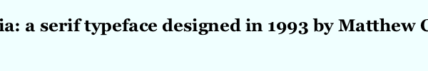
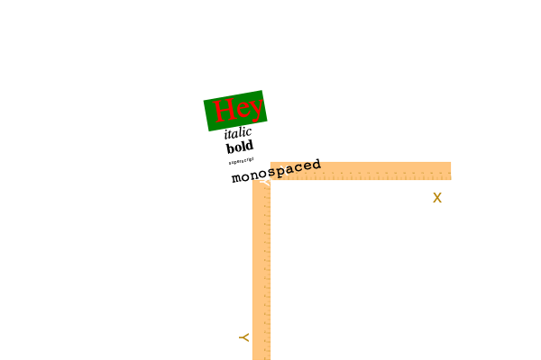
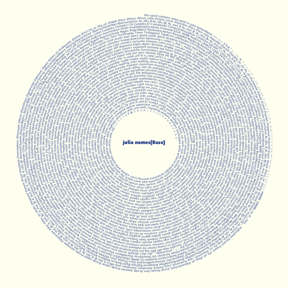
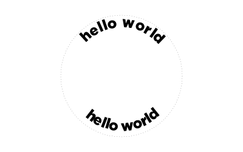

```@meta
DocTestSetup = quote
    using Luxor, Colors
    end
```
# Text and fonts

## A tale of two APIs

There are two ways to draw text in Luxor. You can use either the so-called 'toy' API or the 'pro' API. Both have their advantages and disadvantages. Also, font selection and availability varies a lot across the three operating systems. You may have to experiment to find code patterns that work for you.

#### The Toy API

Use:
- `text(string, [position])` to place text at a position, otherwise at `0/0`, and optionally specify the horizontal and vertical alignment
- `fontface(fontname)` to specify the fontname
- `fontsize(fontsize)` to specify the fontsize

```@example
using Luxor # hide
Drawing(600, 100, "../assets/figures/toy-text-example.png") # hide
origin() # hide
background("azure") # hide
sethue("black") # hide
fontsize(16)
fontface("Georgia-Bold")
text("Georgia: a serif typeface designed in 1993 by Matthew Carter.", halign=:center)
finish() # hide
nothing # hide
```


(If the specified font is unavailable on the current system configuration, the default, usually Times/Helvetica or DejaVu, is used.)

The [`label`](@ref) function also uses the Toy API.

#### The Pro API

Use:

- `setfont(fontname, fontsize)` to specify the fontname and size
- `settext(text, [position])` to place the text at a position, and optionally specify horizontal and vertical alignment, rotation (in degrees counterclockwise!), and the presence of any pseudo-Pango-flavored markup.

```@example
using Luxor # hide
Drawing(600, 100, "../assets/figures/pro-text-example.png") # hide
origin() # hide
background("azure") # hide
sethue("black") # hide
setfont("Georgia Bold", 16)
settext("Georgia: a serif typeface designed in 1993 by Matthew Carter.", halign="center")
finish() # hide
nothing # hide
```



## Specifying the font ("Toy" API)

Use `fontface(fontname)` to choose a font, and `fontsize(n)` to set the font size. [`get_fontsize`](@ref) finds the current font size.

## Specifying the font ("Pro" API)

To select a font in the Pro text API, use [`setfont`](@ref) and supply both the font name and a size.

## Placing text ("Toy" API)

Use [`text`](@ref) to place text.

```@example
using Luxor # hide
Drawing(400, 150, "../assets/figures/text-placement.png") # hide
origin() # hide
background("white") # hide
fontsize(80) # hide
sethue("black") # hide
pt1 = Point(-100, 0)
pt2 = Point(0, 0)
pt3 = Point(100, 0)
sethue("black")
text("1",  pt1, halign=:left,   valign = :bottom)
text("2",  pt2, halign=:center, valign = :bottom)
text("3",  pt3, halign=:right,  valign = :bottom)
text("4",  pt1, halign=:left,   valign = :top)
text("5", pt2, halign=:center, valign = :top)
text("6",  pt3, halign=:right,  valign = :top)
sethue("red")
map(p -> circle(p, 4, :fill), [pt1, pt2, pt3])
finish() # hide
nothing # hide
```


```@example
using Luxor # hide
Drawing(400, 300, "../assets/figures/text-rotation.png") # hide
origin() # hide
background("white") # hide
sethue("black") # hide
fontsize(10)
fontface("Georgia")
[text(string(θ), Point(40cos(θ), 40sin(θ)), angle=θ) for θ in 0:π/12:47π/24]
finish() # hide
nothing # hide
```


## Placing text ("Pro" API)

Use [`settext`](@ref) to place text. You can include some pseudo-HTML markup with the keyword argument `markup=true`.

```@example
using Luxor # hide
Drawing(400, 150, "../assets/figures/pro-text-placement.png") # hide
origin() # hide
background("white") # hide
rulers()
sethue("black")
settext("<span font='26' background ='green' foreground='red'> Hey</span>
    <i>italic</i> <b>bold</b> <sup>superscript</sup>
    <tt>monospaced</tt>",
    halign="center",
    markup=true,
    angle=10) # degrees counterclockwise!
finish() # hide
nothing # hide
```



## Writing LaTeX

It's possible to write math equations in ``\LaTeX`` by
passing a `LaTeXString` to the `text` function. Luxor uses
[MathTeXEngine.jl](https://github.com/Kolaru/MathTeXEngine.jl)
to parse the `LaTeXString`. You should load MathTeXEngine.jl
(`using MathTeXEngine`) before accessing this feature.

!!! note

    MathTeXEngine.jl is a package that renders
    `LaTeXString`s without requiring a ``\LaTeX`` compiler.
    The package uses the fonts _Computer Modern_ and _New
    Computer Modern_. They're included with the
    MathTeXEngine package, and you can find them in your
    `julia` folder in
    `packages/MathTeXEngine/.../assets/fonts`. You should
    make sure these have been installed before running
    Luxor and writing ``\LaTeX`` strings.

```julia
using Luxor
using MathTeXEngine
d = Drawing(600, 400, :svg) # hide
origin() # hide
background("grey6")
fontsize(26)
sethue("white")
t₁ = L"e^{i\pi} + 1 = 0"
t₂ = L"e^x = \sum^\infty_{n=0} \frac{x^n}{n!} = \lim_{n\to\infty}(1+\frac{x}{n})^n"
t₃ = L"cos(\theta)"

text(t₁, Point(0, -100), halign=:center, valign=:baseline, angle=0)
text(t₂, Point(0, -20), halign=:center, valign=:top, angle=0)

line(Point(0, 132), Point(50, 132), :stroke)
line(Point(0, 132), Point(50cos(π/4), 132 - 50sin(π/4)), :stroke)

fontsize(18)
text(t₃, Point(0, 120), halign = :left, valign = :baseline, angle = -π/4, rotationfixed = false)
finish() # hide
nothing # hide
```


## Notes on fonts

Fonts are loaded when you first start using Luxor/Cairo in a Julia session. This partly explains why starting a Luxor/Cairo session can take a few seconds.

On macOS, the fontname required by the Toy API's [`fontface`](@ref) should be the PostScript name of a currently activated font. You can find this out using, for example, the FontBook application.

On macOS, a list of currently activated fonts can be found (after a while) with the shell command:

```julia
system_profiler SPFontsDataType
```

Fonts currently activated by a Font Manager can be found and used by the Toy API but not by the Pro API (at least on my macOS computer currently).

On macOS, you can obtain a list of fonts that `fontconfig` considers are installed and available for use (via the Pro Text API with [`setfont`](@ref)) using the shell command:

```julia
fc-list | cut -f 2 -d ":"
```

although typically this lists only those fonts in `/System/Library/Fonts` and `/Library/Fonts`, and not `~/Library/Fonts`.

(There is a Julia interface to `fontconfig` at [Fontconfig.jl](https://github.com/JuliaGraphics/Fontconfig.jl).
See also [FreeTypeAbstraction.jl](https://github.com/JuliaGraphics/FreeTypeAbstraction.jl))

In the Pro API, the default font is Times Roman (on macOS). In the Toy API, the default font is Helvetica (on macOS).

One difference between [`settext`](@ref) and [`text`](@ref) (on macOS) is that many more missing Unicode glyphs are automatically substituted by other fonts when you use the former.

Cairo.jl (and hence Luxor.jl) doesn't support emoji currently. 😢

Text is rasterized (converted from outlines to pixels)
only when you output to the PNG format. For SVG formats, text
is converted to outlines (curves and lines). For PDF and EPS formats, the fonts
you use are stored inside the output file ("embedded"), and the
text is displayed using that font only when the file is
viewed.

For PNG files, the appearance of fonts when output is controlled to some extent by the operating system. For example, on Windows, if ClearType is active, differently-colored pixels are used to display fonts, because of the use of subpixel rendering. These colored pixels will be visible in the PNG output.

## Text to paths

`textoutlines(string, position)` converts the text into graphic path(s), places them starting at `position`, and applies the `action`.

```@example
using Luxor # hide
Drawing(400, 400, "../assets/figures/textoutlines.png") # hide
origin() # hide
fontface("Times-Roman")
fontsize(500)
setline(4)
sethue("maroon2")
textoutlines("&", O, :path, valign=:middle, halign=:center)
fillpreserve()
sethue("black")
strokepath()
finish() # hide
nothing # hide
```


[`textpath`](@ref) converts the text into graphic paths suitable for further manipulation.

`textpath` preserves the Bézier curves, whereas `textoutlines` flattens all curves and converts them to polygons.

## Text and font dimensions ("Toy" API only)

The `textextents(str)` function returns the dimensions of the string `str`, given the current font. There has to be a current drawing before this function is called.

`width` and `height` are stored in elements 3 and 4. The first two elements are the offsets ("bearings") from the reference point (green) to the bounding box. The last two elements determine where the next ("advance") character should start (blue).


!!! note

    There is currently no equivalent of this function for the "Pro" API.

## Labels

The [`label`](@ref) function places text relative to a specific point, and you can use compass
points or angles to indicate where it should be. So `:N` (for North) places a text label directly above the point, as does `3π/2`.

```@example
using Luxor # hide
Drawing(400, 350, "../assets/figures/labels.png") # hide
origin() # hide
background("white") # hide
sethue("black")
fontsize(15)
octagon = ngon(O, 100, 8, 0, vertices=true)

compass = [:SE, :S, :SW, :W, :NW, :N, :NE, :E, :SE]

for i in 1:8
    circle(octagon[i], 5, :fill)
    label(string(compass[i]), compass[i], octagon[i], leader=true, leaderoffsets=[0.2, 0.9], offset=50)
end

finish() # hide
nothing # hide
```


## Text on a circle

Use `textcurve(str)` to draw a string `str` on a circular arc or spiral.

```@example
using Luxor # hide
Drawing(800, 800, "../assets/figures/text-spiral.png") # hide

origin() # hide
background("ivory") # hide
sethue("royalblue4") # hide
fontsize(7)
fontface("Menlo")
textstring = join(names(Base), " ")
textcurve("this spiral contains every word in julia names(Base): " * textstring,
    -π/2,
    350, 0, 0,
    spiral_in_out_shift = -8.0,
    letter_spacing = 0,
    spiral_ring_step = 0)
fontsize(35)
fontface("Avenir-Black")
textcentered("julia names(Base)", 0, 0)
finish() # hide

nothing # hide
```



For shorter strings, [`textcurvecentered`](@ref) tries to place the text on a circular arc by its center point.

```@example
using Luxor # hide
Drawing(400, 250, "../assets/figures/text-centered.png") # hide
origin() # hide
background("white") # hide
fontface("Arial-Black")
fontsize(24) # hide
sethue("black") # hide
setdash("dot") # hide
setline(0.25) # hide
circle(O, 100, :stroke)
textcurvecentered("hello world", -π/2, 100, O;
    clockwise = true,
    letter_spacing = 0,
    baselineshift = -20
    )
textcurvecentered("hello world", π/2, 100, O;
    clockwise = false,
    letter_spacing = 0,
    baselineshift = 10
    )
finish() # hide
nothing # hide
```



## Text on a polygon

Use [`textonpoly()`](@ref) to draw a string `str` that follows the route of a polygon.

```@example
using Luxor, Colors # hide

d = @drawsvg begin # hide
    origin() # hide
    background("black") # hide
    setmesh(mesh(
        box(BoundingBox()),
        [
            RGB(0.2, 0.2, 0.99),
            RGB(0.9, 0.2, 0.3),
            RGB(0.9, 0.9, 0.4),
            RGB(0.2, 0.8, 0.99),
        ],
    ))

    fontsize(15)

    for y = -250:20:250
        points = [
            Point(
                65x,
                y + 30sin(x + rescale(y, -260, 250, 0, 2π)),
            ) for x = -2π:π/10:2π
        ]
        textonpoly("WAVES " ^ 15, points)
    end

end 800 500 # hide
d # hide
```

## Text clipping

You can use newly-created text paths as a clipping region - here the text paths are filled with names of randomly chosen Julia functions:


```julia
using Luxor

currentwidth = 1250 # pts
currentheight = 800 # pts
Drawing(currentwidth, currentheight, "/tmp/text-path-clipping.png")

origin()
background("darkslategray3")

fontsize(600)                             # big fontsize to use for clipping
fontface("Agenda-Black")
str = "julia"                             # string to be clipped
w, h = textextents(str)[3:4]              # get width and height

translate(-(currentwidth/2) + 50, -(currentheight/2) + h)

textpath(str)                             # make text into a path
setline(3)
setcolor("black")
fillpreserve()                            # fill but keep
clip()                                    # and use for clipping region

fontface("Monaco")
fontsize(10)
namelist = map(x->string(x), names(Base)) # get list of function names in Base.

let
    x = -20
    y = -h
    while y < currentheight
        sethue(rand(7:10)/10, rand(7:10)/10, rand(7:10)/10)
        s = namelist[rand(1:end)]
        text(s, x, y)
        se = textextents(s)
        x += se[5]                            # move to the right
        if x > w
            x = -20                            # next row
            y += 10
        end
    end
end

finish()
preview()
```

## Text blocks, boxes, and wrapping

Longer lines of text can be made to wrap inside an imaginary rectangle with [`textwrap`](@ref). Specify the required width of the rectangle, and the location of the top left corner.

```@example

using Luxor # hide
Drawing(500, 400, "../assets/figures/text-wrapping.png") # hide
origin() # hide
background("white") # hide
fontface("Georgia")
fontsize(12) # hide
sethue("black") # hide

loremipsum = """Lorem ipsum dolor sit amet, consectetur
adipiscing elit. Nunc placerat lorem ullamcorper,
sagittis massa et, elementum dui. Sed dictum ipsum vel
commodo pellentesque. Aliquam erat volutpat. Nam est
dolor, vulputate a molestie aliquet, rutrum quis lectus.
Sed lectus mauris, tristique et tempor id, accumsan
pharetra lacus. Donec quam magna, accumsan a quam
quis, mattis hendrerit nunc. Nullam vehicula leo ac
leo tristique, a condimentum tortor faucibus."""

setdash("dot")
box(O, 200, 200, :stroke)
textwrap(loremipsum, 200, O - (200/2, 200/2))

finish() # hide
nothing # hide
```


[`textwrap`](@ref) accepts a function that allows you to insert code that responds to the next line's linenumber, contents, position, and height.

```@example
using Luxor, Colors # hide
Drawing(500, 400, "../assets/figures/text-wrapping-1.png") # hide
origin() # hide
background("white") # hide
fontface("Georgia")
fontsize(12) # hide
sethue("black") # hide

loremipsum = """Lorem ipsum dolor sit amet, consectetur
adipiscing elit. Nunc placerat lorem ullamcorper,
sagittis massa et, elementum dui. Sed dictum ipsum vel
commodo pellentesque. Aliquam erat volutpat. Nam est
dolor, vulputate a molestie aliquet, rutrum quis lectus.
Sed lectus mauris, tristique et tempor id, accumsan
pharetra lacus. Donec quam magna, accumsan a quam
quis, mattis hendrerit nunc. Nullam vehicula leo ac
leo tristique, a condimentum tortor faucibus."""

textwrap(loremipsum, 200, O - (200/2, 200/2),
    (lnumber, str, pt, l) -> begin
        sethue(Colors.HSB(rescale(lnumber, 1, 15, 0, 360), 1, 1))
        text(string("line ", lnumber), pt - (50, 0))
    end)

finish() # hide
nothing # hide
```


The [`textbox`](@ref) function also draws text inside a box, but doesn't alter the lines, and doesn't force the text to a specific width. Supply an array of strings and the top left position. The `leading` argument specifies the distance between the lines, so should be set relative to the current font size (as set with [`fontsize`](@ref)).

This example counts the number of characters drawn, using a simple closure. The function returns the position of the start of what would have been the next line.

```@example
using Luxor, Colors # hide
Drawing(600, 300, "../assets/figures/textbox.png") # hide
origin() # hide
background("ivory") # hide
sethue("black") # hide
fontface("Georgia")
fontsize(30)

loremipsum = """Lorem ipsum dolor sit amet, consectetur
adipiscing elit. Nunc placerat lorem ullamcorper,
sagittis massa et, elementum dui. Sed dictum ipsum vel
commodo pellentesque. Aliquam erat volutpat. Nam est
dolor, vulputate a molestie aliquet, rutrum quis lectus.
Sed lectus mauris, tristique et tempor id, accumsan
pharetra lacus. Donec quam magna, accumsan a quam
quis, mattis hendrerit nunc. Nullam vehicula leo ac
leo tristique, a condimentum tortor faucibus."""

_counter() = (a = 0; (n) -> a += n)
counter = _counter()

translate(boxtopleft(BoundingBox()))
fontface("Georgia")
fontsize(20)

finishpos = textbox(filter(!isempty, split(loremipsum, "\n")),
    O + (5, 0),
    leading = 28,
    linefunc = (lnumber, str, pt, h) -> begin
        text(string(lnumber), pt - (30, 0))
        counter(length(str))
    end)

fontsize(10)
text(string(counter(0), " characters"), finishpos)

finish() # hide
nothing # hide
```


## Text tracking

Use [`texttrack`](@ref) to track or letter-space text, i.e.
vary the spacing between every letter. ("Kerning" is when
you do this for just a pair of letters.)

The tracking units depend on the current font size. In a
12‑point font, 1 em equals 12 points. A point is about
0.35mm, so a 1000 units of tracking for 12 point text
produces about 4.2mm of space between each character.

```@example
using Luxor # hide
Drawing(600, 400, "../assets/figures/texttrack.svg") # hide
origin() # hide
background("white") # hide
sethue("black") # hide

function text_tracking_example()
    fonts = [
        "Verdana",
        "TrebuchetMS",
        "Times-Roman",
        "Georgia",
        "Monaco"]
    fsize = 16
    grid = GridRect(boxtopleft(BoundingBox() * 0.9), 0, 20)
    tracking = 50
    for f in fonts
        fontsize(fsize)
        fontface(f)
        texttrack("This is some text in $(f): it’s been tracked by +$(tracking)",
            nextgridpoint(grid), tracking, fsize)
        text("This is some text in $(f): it’s not been tracked",
            nextgridpoint(grid))
        texttrack("This is some text in $(f): it’s been tracked by -$(tracking)",
            nextgridpoint(grid), -tracking, fsize)
    end

    finish() # hide
end

text_tracking_example()
nothing # hide
```


## Text fitting

Sometimes you want to fit some text into a specific area, rather than use a specific font size.

To do this, use [`textfit`](@ref), and supply the text and a bounding box.

```@example
using Luxor # hide
d = Drawing(800, 800, :svg) # hide
origin() # hide
background("grey7") # hide
rh = 700 .* [4//11, 2//11, 4//11, 1//11]
cw = 700 .* [6//11, 2//11, 3//11, 1//11]
cells = Table(rh, cw)
for (pos, n) in cells
    setgrey(rand()/2)
    box(cells, n, :fill)
    setgrey(1)
    textfit("The sound of one hand clapping", BoundingBox(box(cells, n)), horizontalmargin=10)
end
finish() # hide
d # hide
```

You can supply a value for `maximumfontsize` as an optional
argument, such that the text never exceeds that size
(although it will probably be smaller).

!!! note

    The algorithm used by this function doesn't always
    produce ideal results. Suggestions for improvements
    welcome!

## Animating text

To animate the drawing of text, you can obtain and store the paths, and then build an animation using `drawpath()`.


```julia
using Luxor

function frame(scene, framenumber)
    background("black")
    sethue("gold")
    fontface("BigMummy")
    fontsize(40)
    textpath("Thank you for using", boxtopcenter() + (0, 80) , halign=:center)
    tp1 = storepath()
    fontsize(130)
    textpath("Luxor", O + (0, 80), halign=:center)
    tp2 = storepath()

    eased_n = scene.easingfunction(framenumber - scene.framerange.start,
        0, 1, scene.framerange.stop - scene.framerange.start)

    for tp in (tp1, tp2)
        drawpath(tp, eased_n, :stroke)
    end
end

amovie = Movie(600, 250, "a movie")
animate(amovie, Scene(amovie, frame, 1:150), creategif=true, pathname="/tmp/textanimation.gif")
```
