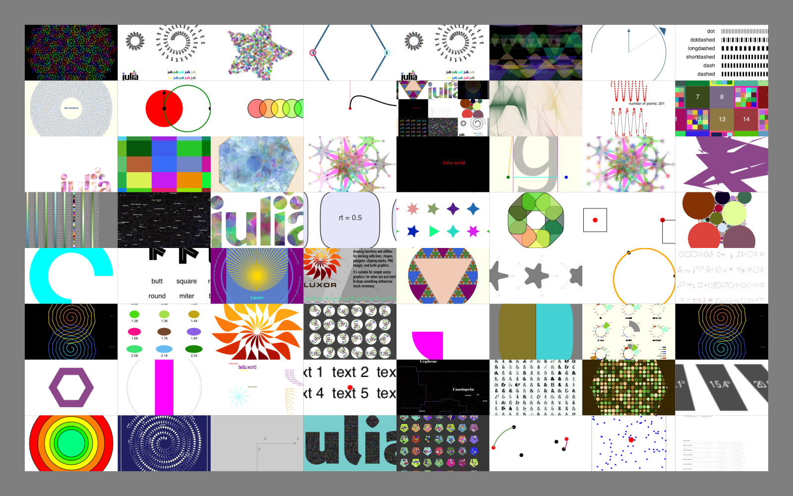
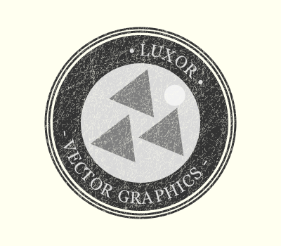

# More examples

A good place to look for examples (sometimes not very exciting or well-written examples, I'll admit), is in the `Luxor/test` directory.



## An early test


```julia
using Luxor
Drawing(1200, 1400, "basic-test.png") # or PDF/SVG filename for PDF or SVG
origin()
background("purple")
setopacity(0.7)                      # opacity from 0 to 1
sethue(0.3,0.7,0.9)                  # sethue sets the color but doesn't change the opacity
setline(20)                          # line width

rect(-400,-400,800,800, :fill)       # or :stroke, :fillstroke, :clip
randomhue()
circle(0, 0, 460, :stroke)
circle(0,-200,400,:clip)             # a circular clipping mask above the x axis
sethue("gold")
setopacity(0.7)
setline(10)
for i in 0:pi/36:2pi - pi/36
    move(0, 0)
    line(cos(i) * 600, sin(i) * 600 )
    stroke()
end
clipreset()                           # finish clipping/masking
fontsize(60)
setcolor("turquoise")
fontface("Optima-ExtraBlack")
textwidth = textextents("Luxor")[5]
textcentred("Luxor", 0, currentdrawing.height/2 - 400)
fontsize(18)
fontface("Avenir-Black")

# text on curve starting at angle 0 rads centered on origin with radius 550
textcurve("THIS IS TEXT ON A CURVE " ^ 14, 0, 550, O)
finish()
preview() # on macOS, opens in Preview
```

## Illustrating this document

This documentation was built with [Documenter.jl](https://github.com/JuliaDocs/Documenter.jl), which is an amazingly powerful and flexible documentation generator written in Julia. The illustrations are mostly created when the documentation is generated: the Julia source for the image is stored in the Markdown document, and processed every time the documentation is generated:

The Markdown markup looks like this:

`````
```@example
using Luxor # hide
Drawing(600, 250, "../figures/polysmooth-pathological.png") # hide
origin() # hide
background("white") # hide
setopacity(0.75) # hide
srand(42) # hide
setline(1) # hide
p = star(O, 60, 5, 0.35, 0, vertices=true)
setdash("dot")
sethue("red")
prettypoly(p, close=true, :stroke)
setdash("solid")
sethue("black")
polysmooth(p, 40, :fill, debug=true)
finish() # hide
```


`````

and after the document is processed by Documenter it looks like this:

```@example
using Luxor # hide
Drawing(600, 250, "../figures/polysmoothy.png") # hide
origin() # hide
background("white") # hide
setopacity(0.75) # hide
srand(42) # hide
setline(1) # hide
p = star(O, 60, 5, 0.35, 0, vertices=true)
setdash("dot")
sethue("red")
prettypoly(p, close=true, :stroke)
setdash("solid")
sethue("black")
polysmooth(p, 40, :fill, debug=true)
finish() # hide
nothing # hide
```


## Luxor logo

In this example, the color scheme is mirrored so that the lighter colors are at the top of the circle.


```
using Luxor, ColorSchemes

function spiral(colscheme)
  circle(0, 0, 90, :clip)
  for theta in pi/2 - pi/8:pi/8: (19 * pi)/8 # start at the bottom
    sethue(get(colscheme, rescale(theta, pi/2, (19 * pi)/8, 0, 1)))
    gsave()
    rotate(theta)
    move(5,0)
    curve(Point(40, 40), Point(50, -40), Point(80, 30))
    closepath()
    fill()
    grestore()
  end
  clipreset()
end

width = 225  # pts
height = 225 # pts
Drawing(width, height, "/tmp/logo.png")
origin()
background("white")
scale(1.3, 1.3)
using ColorSchemes.solar
colschememirror = vcat(solar, reverse(solar))
spiral(colschememirror)
finish()
preview()
```

## Why turtles?

An interesting application for turtle-style graphics is for drawing Lindenmayer systems (l-systems). Here's an example of how a complex pattern can emerge from a simple set of rules, taken from [Lindenmayer.jl](https://github.com/cormullion/Lindenmayer.jl):


The definition of this figure is:

```
penrose = LSystem(Dict("X"  =>  "PM++QM----YM[-PM----XM]++t",
                       "Y"  => "+PM--QM[---XM--YM]+t",
                       "P"  => "-XM++YM[+++PM++QM]-t",
                       "Q"  => "--PM++++XM[+QM++++YM]--YMt",
                       "M"  => "F",
                       "F"  => ""),
                  "1[Y]++[Y]++[Y]++[Y]++[Y]")
```

where some of the characters—eg "F", "+", "-", and "t"—issue turtle control commands, and others—"X,", "Y", "P", and "Q"—refer to specific components of the design. The execution of the l-system involves replacing every occurrence in the drawing code of every dictionary key with the matching values.

## Strange

It's usually better to draw fractals and similar images using pixels and image processing tools. But just for fun it's an interesting experiment to render a strange attractor image using vector drawing rather than placing pixels. This version uses about 600,000 circular dots (which is why it's better to target PNG rather than SVG or PDF for this example!).

```@example
using Luxor, Colors, ColorSchemes
function strange(dotsize, w=800.0)
    xmin = -2.0; xmax = 2.0; ymin= -2.0; ymax = 2.0
    cs = ColorSchemes.botticelli
    Drawing(w, w, "../figures/strange-vector.png")
    origin()
    background("white")
    xinc = w/(xmax - xmin)
    yinc = w/(ymax - ymin)
    # control parameters
    a = 2.24; b = 0.43; c = -0.65; d = -2.43; e1 = 1.0
    x = y = z = 0.0
    wover2 = w/2
    for j in 1:w
        for i in 1:w
            xx = sin(a * y) - z  *  cos(b * x)
            yy = z * sin(c * x) - cos(d * y)
            zz = e1 * sin(x)
            x = xx; y = yy; z = zz
            if xx < xmax && xx > xmin && yy < ymax && yy > ymin
                xpos = rescale(xx, xmin, xmax, -wover2, wover2) # scale to range
                ypos = rescale(yy, ymin, ymax, -wover2, wover2) # scale to range
                col1 = get(cs, rescale(xx, -1, 1, 0.0, .5))
                col2 = get(cs, rescale(yy, -1, 1, 0.0, .4))
                col3 = get(cs, rescale(zz, -1, 1, 0.0, .2))
                sethue(mean([col1, col2, col3]))
                circle(Point(xpos, ypos), dotsize, :fill)
            end
        end
    end
    finish()
end

strange(.3, 800)
nothing # hide
```


## Hipster logo: text on curves

```@example
using Luxor
function hipster(fname)
    Drawing(400, 350, fname)
    origin()
    rotate(pi/8)

    circle(O, 135, :clip)
    sethue("antiquewhite2")
    paint()

    sethue("gray20")
    setline(3)
    circle(O, 130, :stroke)
    circle(O, 135, :stroke)
    circle(O, 125, :fill)

    sethue("antiquewhite2")
    circle(O, 85, :fill)

    sethue("wheat")
    fontsize(24)
    fontface("Helvetica-Bold")
    textcurvecentered("• LUXOR •", (3pi)/2, 100, O, clockwise=true, baselineshift = -4)
    textcurvecentered("• VECTOR GRAPHICS •", pi/2, 100, O, clockwise=false, letter_spacing=2, baselineshift = -15)

    sethue("gray20")
    map(pt -> star(pt, 40, 3, 0.5, -pi/2, :fill), ngon(O, 40, 3, 0, vertices=true))
    circle(O.x + 30, O.y - 55, 15, :fill)

    # cheap weathered texture:
    sethue("antiquewhite2")
    setline(0.2)
    setdash("dotdotdashed")
    for i in 1:500
        line(randompoint(Point(-200, -350), Point(200, 350)),
             randompoint(Point(-200, -350), Point(200, 350)),
             :stroke)
    end
    finish()
end

hipster("../figures/textcurvecenteredexample.png")
nothing # hide
```



# Index
