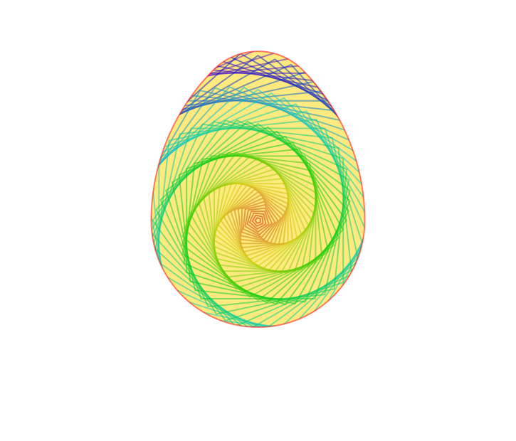

```@meta
DocTestSetup = quote
    using Luxor, Colors
    end
```
# First tutorial

Experienced Julia users and programmers fluent in other languages and graphics systems should have no problem using Luxor by referring to the rest of the documentation. For others, here is a short tutorial to help you get started.

## What you need

If you've already downloaded Julia, and have added the Luxor package successfully (using `] add Luxor`):

```@raw html
<span style="font-feature-settings: 'ss20' on">
<pre>
                   _
       _       _ _(_)_     |  Documentation: https://docs.julialang.org
      (_)     | (_) (_)    |
       _ _   _| |_  __ _   |  Type "?" for help, "]?" for Pkg help.
      | | | | | | |/ _` |  |
      | | |_| | | | (_| |  |  Version 1.6.0 (2021-03-24)
     _/ |\__'_|_|_|\__'_|  |  Official https://julialang.org/ release
    |__/                   |

$ julia
(v1.6) pkg> add Luxor
</pre>
</span>
```

then you're ready to start.

You can work in a Jupyter or Pluto notebook, or perhaps use the Atom/Juno or VSCode editor/development environment. It's also possible to work in a text editor (make sure you know how to run a file of Julia code), or, at a pinch, you could use the Julia REPL directly.

Ready? Let's begin. The goal of this tutorial is to do a bit of basic 'compass and ruler' Euclidean geometry, to introduce the basic concepts of Luxor drawings.

## First steps

We'll have to load just one package for this tutorial:

```julia
using Luxor
```

Here's an easy shortcut for making drawings in Luxor. It's a Julia macro, and it's a good way to test that your system's working. Evaluate this code:

```julia
@png begin
    text("Hello world")
    circle(Point(0, 0), 200, :stroke)
end
```

```@setup hw
using Luxor
Drawing(725, 600, "../assets/figures/tutorial-hello-world.png")
background("white")
origin()
sethue("black")
text("Hello world")
circle(Point(0, 0), 200, :stroke)
finish()
```

What happened? Can you see this image somewhere?


If you're using Juno, the image should appear in the Plots window. If you're working in a Jupyter or Pluto notebook, the image should appear below or above the code. If you're using Julia in a terminal or text editor, the image should have opened up in some other application, or, at the very least, it should have been saved in your current working directory (as `luxor-drawing-(time stamp).png`). If nothing happened, or if something bad happened, we've got some set-up or installation issues probably unrelated to Luxor...

Let's press on. The [`@png`](@ref) macro is an easy way to make a drawing; all it does is save a bit of typing. (The macro expands to enclose your drawing commands with calls to the [`Drawing()`](@ref), [`origin`](@ref), [`finish`](@ref), and [`preview`](@ref) functions.) There are also [`@svg`](@ref) and [`@pdf`](@ref) macros, which do a similar thing. PNGs and SVGs are good because they show up in Juno and Jupyter. SVGs are usually higher quality too, but they're text-based so can become very large and difficult to load if the image is complex. PDF documents are always higher quality, and usually open up in a separate application.

This example illustrates a few things about Luxor drawings:

- There are default values which you don't have to set if you don't want to (file names, colors, font sizes, and so on).

- Positions on the drawing are specified with x and y coordinates stored in the Point type, and you can sometimes omit positions altogether.

- The text was placed at the origin point (0/0), and by default it's left aligned.

- The circle wasn't filled, but [`stroked`. We passed the `:stroke` symbol as an action to the [`circle`](@ref) function. Many drawing functions expect some action, such as `:fill` or `:stroke`, and sometimes `:clip` or `:fillstroke`.

- Did the first drawing takes a few seconds to appear? The Cairo drawing engine takes a little time to warm up. Once it's running, drawings appear much faster.

Once more, with more black, and some rulers:

```julia
@png begin
    text("Hello again, world!", Point(0, 250))
    circle(Point(0, 0), 200, :fill)
    rulers()
end
```

```@setup hw2
using Luxor
Drawing(725, 502, "../assets/figures/tutorial-hello-world-2.png")
background("white")
origin()
sethue("black")
text("Hello again, world!", Point(0, 250))
circle(Point(0, 0), 200, :fill)
rulers()
finish()
```


The x-coordinates usually run from left to right, the y-coordinates from top to bottom. So here, `Point(0, 250)` is a point at the left/right center, but at the bottom of the drawing.

## Euclidean eggs

For the main section of this tutorial, we'll attempt to draw Euclid's egg, which involves a bit of geometry.

For now, you can continue to store all the drawing instructions between the `@png` macro's `begin` and `end` markers. Technically, however, working like this at the top-level in Julia (ie without storing instructions in functions which Julia can compile) isn't considered to be 'best practice', because the unit of compilation in Julia is the function. (Look up 'global scope' in the documentation.)

```julia
@png begin
```

and first define the variable `radius` to hold a value of 80 units (there are 72 units in a traditional inch):

```julia
    radius=80
```

Select gray dotted lines. To specify a color you can supply RGB (or HSB or LAB or LUV) values or use named colors, such as "red" or "green". "gray0" is black, and "gray100" is white. (For more information about colors, see [Colors.jl](https://github.com/JuliaGraphics/Colors.jl).)

```julia
    setdash("dot")
    sethue("gray30")
```

(You can use [`setcolor`](@ref) instead of [`sethue`](@ref) — the latter doesn't affect the current opacity setting.)

Next, make two points, A and B, which will lie either side of the origin point. This line uses an array comprehension - notice the square brackets enclosing a `for` loop.

```julia
    A, B = [Point(x, 0) for x in [-radius, radius]]
```

`x` uses two values from the inner array, and a Point using each value is created and stored in its own variable. It seems hardly worth doing for two points, but it shows how you can assign more than one variable at the same time, and also how to generate points.

With two points defined, draw a line from A to B, and stroke it.

```julia
    line(A, B, :stroke)
```

Draw a stroked circle too. The center of the circle is placed at the origin. You can use the letter **O** as a short cut for Origin, ie the `Point(0, 0)`.

```julia
    circle(O, radius, :stroke)
end
```

```@setup te1
using Luxor
Drawing(725, 300, "../assets/figures/tutorial-egg-1.png")
background("white")
origin()
radius=80
setdash("dot")
sethue("gray30")
A, B = [Point(x, 0) for x in [-radius, radius]]
line(A, B, :stroke)
circle(O, radius, :stroke)
finish()
nothing
```


### Labels and dots

It's a good idea to label points in geometrical constructions, and to draw small dots to indicate their location clearly. For the latter task, small filled circles will do. For labels, there's a special [`label`](@ref) function we can use, which positions a text string close to a point, using angles or points of the compass, so `:N` places the label to the north of a point.

Edit your previous code by adding instructions to draw some labels and circles:

```julia
@png begin
    radius=80
    setdash("dot")
    sethue("gray30")
    A, B = [Point(x, 0) for x in [-radius, radius]]
    line(A, B, :stroke)
    circle(Point(0, 0), radius, :stroke)
# >>>>
    label("A", :NW, A)
    label("O", :N,  O)
    label("B", :NE, B)

    circle.([A, O, B], 2, :fill)
    circle.([A, B], 2radius, :stroke)
end
```

```@setup te2
using Luxor
Drawing(725, 400, "../assets/figures/tutorial-egg-2.png")
background("white")
origin()
radius=80
setdash("dot")
sethue("gray30")

A, B = [Point(x, 0) for x in [-radius, radius]]
line(A, B, :stroke)
circle(O, radius, :stroke)
label("A", :NW, A)
label("O", :N, O)
label("B", :NE, B)
circle.([A, O, B], 2, :fill)
circle.([A, B], 2radius, :stroke)
finish()
```


While we could have drawn all the circles as usual, we've taken the opportunity to introduce a powerful Julia feature called _broadcasting_. The dot (`.`) just after the function name in the last two [`circle`](@ref) function calls tells Julia to apply the function to all the arguments. We supplied an array of three points, and filled circles were placed at each one. Then we supplied an array of two points and stroked circles were placed there. Notice that we didn't have to supply an array of radius values or an array of actions — in each case Julia did the necessary broadcasting (from scalar to vector) for us.

### Intersect this

We're now ready to tackle the job of finding the coordinates of the two points where two circles intersect. There's a Luxor function called [`intersectionlinecircle`](@ref) that finds the point or points where a line intersects a circle. So we can find the two points where one of the circles crosses an imaginary vertical line drawn through O. Because of the symmetry, we'll only have to do circle A.

```julia
@png begin
    # as before
    radius=80
    setdash("dot")
    sethue("gray30")
    A, B = [Point(x, 0) for x in [-radius, radius]]
    line(A, B, :stroke)
    circle(O, radius, :stroke) # use letter O for Point(0, 0)

    label("A", :NW, A)
    label("O", :N,  O)
    label("B", :NE, B)

    circle.([A, O, B], 2, :fill)
    circle.([A, B], 2radius, :stroke)
```

The [`intersectionlinecircle`](@ref) takes four arguments: two points to define the line and a point/radius pair to define the circle. It returns the number of intersections (probably 0, 1, or 2), followed by the two points.

The line is specified with two points with an x value of 0 and y values of ± twice the radius, written in Julia's math-friendly style. The circle is centered at A and has a radius of AB (which is `2radius`). Assuming that there are two intersections, we feed these to [`circle`](@ref) and [`label`](@ref) for drawing and labeling using our new broadcasting superpowers.

```julia
# >>>>
    nints, C, D =
        intersectionlinecircle(Point(0, -2radius), Point(0, 2radius), A, 2radius)

    if nints == 2
        circle.([C, D], 2, :fill)
        label.(["D", "C"], :N, [D, C])
    end

end
```

```@setup te3
using Luxor
Drawing(725, 400, "../assets/figures/tutorial-egg-3.png")
background("white")
origin()
radius=80
setdash("dot")
sethue("gray30")

A, B = [Point(x, 0) for x in [-radius, radius]]
line(A, B, :stroke)
circle(O, radius, :stroke)
label("A", :NW, A)
label("O", :N, O)
label("B", :NE, B)
circle.([A, O, B], 2, :fill)
circle.([A, B], 2radius, :stroke)

nints, C, D = intersectionlinecircle(Point(0, -2radius), Point(0, 2radius), A, 2radius)
if nints == 2
    circle.([C, D], 2, :fill)
    label.(["D", "C"], :N, [D, C])
end

finish()
```


### The upper circle

Now for the trickiest part of this construction: a small circle whose center point sits on top of the inner circle and that meets the two larger circles near the point D.

Finding this new center point C1 is easy enough, because we can again use [`intersectionlinecircle`](@ref) to find the point where the central circle crosses a line from O to D.

Add some more lines to your code:

```julia
@png begin

# >>>>

    nints, C1, C2 = intersectionlinecircle(O, D, O, radius)
    if nints == 2
        circle(C1, 3, :fill)
        label("C1", :N, C1)
    end

end
```

```@setup te4
using Luxor
Drawing(725, 400, "../assets/figures/tutorial-egg-4.png")
background("white")
origin()
radius=80
setdash("dot")
sethue("gray30")

A, B = [Point(x, 0) for x in [-radius, radius]]
line(A, B, :stroke)
circle(O, radius, :stroke)
label("A", :NW, A)
label("O", :N, O)
label("B", :NE, B)
circle.([A, O, B], 2, :fill)
circle.([A, B], 2radius, :stroke)

nints, C, D = intersectionlinecircle(Point(0, -2radius), Point(0, 2radius), A, 2radius)
if nints == 2
    circle.([C, D], 2, :fill)
    label.(["D", "C"], :N, [D, C])
end

nints, C1, C2 = intersectionlinecircle(O, D, O, radius)
if nints == 2
    circle(C1, 3, :fill)
    label("C1", :N, C1)
end
finish()
```


The two other points that define this circle lie on the intersections of the large circles with imaginary lines through points A and B passing through the center point C1. We're looking for the lines `A-C1-ip`, where `ip` is somewhere on the circle between D and B, and `B-C1-ip`, where `ip` is somewhere between A and D.

To find (and draw) these points is straightforward. We'll mark these as intermediate for now, because there are in fact four intersection points but we want just the two nearest the top:

```julia
# >>>>

    nints, I3, I4 = intersectionlinecircle(A, C1, A, 2radius)
    nints, I1, I2 = intersectionlinecircle(B, C1, B, 2radius)

    circle.([I1, I2, I3, I4], 2, :fill)
```

So we can use the [`distance`](@ref) function to find the distance between two points, and it's simple enough to compare the values and choose the shortest.

```julia

# >>>>

    if distance(C1, I1) < distance(C1, I2)
       ip1 = I1
    else
       ip1 = I2
    end
    if distance(C1, I3) < distance(C1, I4)
       ip2 = I3
    else
       ip2 = I4
    end

    label("ip1", :N, ip1)
    label("ip2", :N, ip2)
    circle(C1, distance(C1, ip1), :stroke)

end
```

```@setup te5
using Luxor
Drawing(725, 400, "../assets/figures/tutorial-egg-5.png")
background("white")
origin()
radius=80
setdash("dot")
sethue("gray30")

A, B = [Point(x, 0) for x in [-radius, radius]]
line(A, B, :stroke)
circle(O, radius, :stroke)
label("A", :NW, A)
label("O", :N, O)
label("B", :NE, B)
circle.([A, O, B], 2, :fill)
circle.([A, B], 2radius, :stroke)

nints, C, D = intersectionlinecircle(Point(0, -2radius), Point(0, 2radius), A, 2radius)
if nints == 2
    circle.([C, D], 2, :fill)
    label.(["D", "C"], :N, [D, C])
end

nints, C1, C2 = intersectionlinecircle(O, D, O, radius)
if nints == 2
    circle(C1, 3, :fill)
    label("C1", :N, C1)
end

# finding two more points on the circumference

nints, I3, I4 = intersectionlinecircle(A, C1, A, 2radius)
nints, I1, I2 = intersectionlinecircle(B, C1, B, 2radius)

circle.([I1, I2, I3, I4], 2, :fill)

if distance(C1, I1) < distance(C1, I2)
    ip1 = I1
else
   ip1 = I2
end
if distance(C1, I3) < distance(C1, I4)
   ip2    = I3
else
   ip2 = I4
end

label("ip1", :N, ip1)
label("ip2", :N, ip2)
circle(C1, distance(C1, ip1), :stroke)

finish()
```


### Eggs at the ready

We now know all the points on the egg's perimeter, and the centers of the circular arcs. To draw the outline, we'll use the [`arc2r`](@ref) function four times. This function takes: a center point and two points that together define a circular arc, plus an action.

The shape consists of four curves, so we'll use the `:path` action. Instead of immediately drawing the shape, like the `:fill` and `:stroke` actions do, this action adds a section to the current path.

```julia

    label("ip1", :N, ip1)
    label("ip2", :N, ip2)
    circle(C1, distance(C1, ip1), :stroke)

# >>>>

    setline(5)
    setdash("solid")

    arc2r(B,    A,  ip1, :path) # centered at B, from A to ip1
    arc2r(C1, ip1,  ip2, :path)
    arc2r(A,  ip2,    B, :path)
    arc2r(O,    B,    A, :path)
```

Finally, once we've added all four sections to the path we can stroke and fill it. If you want to use separate styles for the stroke and fill, you can use a `preserve` version of the first action. This applies the action but keeps the path available for more actions.

```julia
    strokepreserve()
    setopacity(0.8)
    sethue("ivory")
    fillpath()
end
```

```@setup te6
using Luxor
Drawing(725, 400, "../assets/figures/tutorial-egg-6.png")
background("white")
origin()
radius=80
setdash("dot")
sethue("gray30")

A, B = [Point(x, 0) for x in [-radius, radius]]
line(A, B, :stroke)
circle(O, radius, :stroke)
label("A", :NW, A)
label("O", :N, O)
label("B", :NE, B)
circle.([A, O, B], 2, :fill)
circle.([A, B], 2radius, :stroke)

nints, C, D =
    intersectionlinecircle(Point(0, -2radius), Point(0, 2radius), A, 2radius)
if nints == 2
    circle.([C, D], 2, :fill)
    label.(["D", "C"], :N, [D, C])
end

nints, C1, C2 = intersectionlinecircle(O, D, O, radius)
if nints == 2
    circle(C1, 3, :fill)
    label("C1", :N, C1)
end

# finding two more points on the circumference

nints, I3, I4 = intersectionlinecircle(A, C1, A, 2radius)
nints, I1, I2 = intersectionlinecircle(B, C1, B, 2radius)

circle.([I1, I2, I3, I4], 2, :fill)

if distance(C1, I1) < distance(C1, I2)
    ip1 = I1
else
   ip1 = I2
end
if distance(C1, I3) < distance(C1, I4)
   ip2    = I3
else
   ip2 = I4
end

label("ip1", :N, ip1)
label("ip2", :N, ip2)
circle(C1, distance(C1, ip1), :stroke)

setline(5)
setdash("solid")

arc2r(B, A, ip1, :path)
arc2r(C1, ip1, ip2, :path)
arc2r(A, ip2, B, :path)
arc2r(O, B, A, :path)
strokepreserve()
setopacity(0.8)
sethue("ivory")
fillpath()
finish()
```


## Egg stroke

To be more generally useful, the above code can be boiled into a single function.

```julia
function egg(radius, action=:none)
    A, B = [Point(x, 0) for x in [-radius, radius]]
    nints, C, D =
        intersectionlinecircle(Point(0, -2radius), Point(0, 2radius), A, 2radius)

    flag, C1 = intersectionlinecircle(C, D, O, radius)
    nints, I3, I4 = intersectionlinecircle(A, C1, A, 2radius)
    nints, I1, I2 = intersectionlinecircle(B, C1, B, 2radius)

    if distance(C1, I1) < distance(C1, I2)
        ip1 = I1
    else
        ip1 = I2
    end
    if distance(C1, I3) < distance(C1, I4)
        ip2 = I3
    else
        ip2 = I4
    end

    newpath()
    arc2r(B, A, ip1, :path)
    arc2r(C1, ip1, ip2, :path)
    arc2r(A, ip2, B, :path)
    arc2r(O, B, A, :path)
    closepath()

    do_action(action)
end
```

This keeps all the intermediate code and calculations safely hidden away, and it's now possible to draw a Euclidean egg by calling `egg(100, :stroke)`, for example, where `100` is the required width (radius), and `:stroke` is the required action.

(Of course, there's no error checking. This should be added if the function is to be used for any serious applications...!)

Notice that this function doesn't define anything about what color it is, or where it's placed. When called, the function inherits the current drawing environment: scale, rotation, position of the origin, line thickness, color, style, and so on. This lets us write code like this:

```julia
@png begin
    setopacity(0.7)
    for θ in range(0, step=π/6, length=12)
        @layer begin
            rotate(θ)
            translate(0, -150)
            egg(50, :path)
            setline(10)
            randomhue()
            fillpreserve()

            randomhue()
            strokepath()
        end
    end
end 800 800 "/tmp/eggstravaganza.png"
```

```@setup te7
using Luxor, Random
Random.seed!(42)
Drawing(725, 500, "../assets/figures/tutorial-egg-7.png")
function egg(radius, action=:none)
    A, B = [Point(x, 0) for x in [-radius, radius]]
    nints, C, D =
        intersectionlinecircle(Point(0, -2radius), Point(0, 2radius), A, 2radius)

    flag, C1 = intersectionlinecircle(C, D, O, radius)
    nints, I3, I4 = intersectionlinecircle(A, C1, A, 2radius)
    nints, I1, I2 = intersectionlinecircle(B, C1, B, 2radius)

    if distance(C1, I1) < distance(C1, I2)
        ip1 = I1
    else
        ip1 = I2
    end
    if distance(C1, I3) < distance(C1, I4)
        ip2 = I3
    else
        ip2 = I4
    end

    newpath()
    arc2r(B, A, ip1, :path)
    arc2r(C1, ip1, ip2, :path)
    arc2r(A, ip2, B, :path)
    arc2r(O, B, A, :path)
    closepath()
    do_action(action)
end
background("white")
origin()
setopacity(0.7)
for θ in range(0, step=π/6, length=12)
    @layer begin
        rotate(θ)
        translate(0, -150)
        egg(50, :path)
        setline(10)
        randomhue()
        fillpreserve()

        randomhue()
        strokepath()
    end
end
finish()
```


The loop runs 12 times, with `theta` increasing from 0 upwards in steps of π/6. But before each egg is drawn, the entire drawing environment is rotated by `theta` radians and then shifted along the y-axis away from the origin by -150 units (the y-axis values usually increase downwards, so, before any rotation takes place, a shift of -150 looks like an upwards shift). The [`randomhue`](@ref) function does what you expect, and the `egg` function is passed the `:fill` action and the radius.

Notice that the four drawing instructions are encased in a `@layer begin...end` shell. Any change made to the drawing environment inside this shell is discarded after the `end`. This allows us to make temporary changes to the scale and rotation, etc. and discard them easily once the shapes have been drawn.

Rotations and angles are typically specified in radians. The positive x-axis (a line from the origin increasing in x) starts off heading due east from the origin, and the y-axis due south, and positive angles are clockwise (ie from the positive x-axis towards the positive y-axis). So the second egg in the previous example was drawn after the axes were rotated by π/6 radians clockwise.

If you look closely you can tell which egg was drawn first — it's overlapped on each side by subsequent eggs.

#### Thought experiments

1. What would happen if the translation was `translate(0, 150)` rather than `translate(0, -150)`?

2. What would happen if the translation was `translate(150, 0)` rather than `translate(0, -150)`?

3. What would happen if you translated each egg *before* you rotated the drawing environment?

Some useful tools for investigating the important aspects of coordinates and transformations include:

- [`rulers`](@ref) to draw the current x and y axes
- [`getrotation`](@ref) to get the current rotation
- [`getscale`](@ref) to get the current scale

## Polyeggs

As well as stroke and fill actions, you can use the path as a clipping region (`:clip`), or as the basis for more shape shifting.

The `egg` function creates a path and lets you apply an action to it. It's also possible to convert the path into a polygon (an array of points), which lets you do more things with it. The following code converts the egg's path into a polygon, and then moves every other point of the polygon halfway towards the centroid.

```julia
@png begin
    egg(160, :path)
    pgon = first(pathtopoly())
```

The [`pathtopoly`](@ref) function converts the current path made by `egg(160, :path)` into a polygon. Those smooth curves have been approximated by a series of straight line segments. The `first` function is used because [`pathtopoly`](@ref) returns an array of one or more polygons (paths can consist of a series of loops), and we know that we need only the single path here.

```julia
    pc = polycentroid(pgon)
    circle(pc, 5, :fill)
```

[`polycentroid`](@ref) finds the centroid of the new polygon.

This loop steps through the points and moves every odd-numbered one halfway towards the centroid. [`between`](@ref) finds a point midway between two specified points. Finally the [`poly`](@ref) function draws the array of points.

```julia
    for pt in 1:2:length(pgon)
        pgon[pt] = between(pc, pgon[pt], 0.5)
    end
    poly(pgon, :stroke)
end
```

```@setup te8
using Luxor
Drawing(725, 500, "../assets/figures/tutorial-egg-8.png")
function egg(radius, action=:none)
    A, B = [Point(x, 0) for x in [-radius, radius]]
    nints, C, D =
        intersectionlinecircle(Point(0, -2radius), Point(0, 2radius), A, 2radius)

    flag, C1 = intersectionlinecircle(C, D, O, radius)
    nints, I3, I4 = intersectionlinecircle(A, C1, A, 2radius)
    nints, I1, I2 = intersectionlinecircle(B, C1, B, 2radius)

    if distance(C1, I1) < distance(C1, I2)
        ip1 = I1
    else
        ip1 = I2
    end
    if distance(C1, I3) < distance(C1, I4)
        ip2    = I3
    else
        ip2 = I4
    end

    newpath()
    arc2r(B, A, ip1, :path)
    arc2r(C1, ip1, ip2, :path)
    arc2r(A, ip2, B, :path)
    arc2r(O, B, A, :path)
    closepath()
    do_action(action)
end
background("white")
origin()
egg(160, :path)
sethue("black")
pgon = first(pathtopoly())
pc = polycentroid(pgon)
circle(pc, 5, :fill)

for pt in 1:2:length(pgon)
    pgon[pt] = between(pc, pgon[pt], 0.5)
end
poly(pgon, :stroke)
finish()
```


The uneven appearance of the interior points here looks to be a result of the default line join settings. Experiment with `setlinejoin("round")` to see if this makes the geometry look tidier.

For a final experiment with our `egg` function, here's Luxor's [`offsetpoly`](@ref) function struggling to draw around the spiky egg-based polygon.

```julia
@png begin
    egg(80, :path)
    pgon = first(pathtopoly()) |> unique
    pc = polycentroid(pgon)

    for pt in 1:2:length(pgon)
        pgon[pt] = between(pc, pgon[pt], 0.8)
    end

    for i in 30:-3:-8
        randomhue()
        op = offsetpoly(pgon, i)
        poly(op, :stroke, close=true)
    end
end 800 800 "/tmp/spike-egg.png"
```

```@setup te9
using Luxor, Random
Drawing(725, 600, "../assets/figures/tutorial-egg-9.png")
function egg(radius, action=:none)
    A, B = [Point(x, 0) for x in [-radius, radius]]
    nints, C, D =
        intersectionlinecircle(Point(0, -2radius), Point(0, 2radius), A, 2radius)

    flag, C1 = intersectionlinecircle(C, D, O, radius)
    nints, I3, I4 = intersectionlinecircle(A, C1, A, 2radius)
    nints, I1, I2 = intersectionlinecircle(B, C1, B, 2radius)

    if distance(C1, I1) < distance(C1, I2)
        ip1 = I1
    else
        ip1 = I2
    end
    if distance(C1, I3) < distance(C1, I4)
        ip2    = I3
    else
        ip2 = I4
    end

    newpath()
    arc2r(B, A, ip1, :path)
    arc2r(C1, ip1, ip2, :path)
    arc2r(A, ip2, B, :path)
    arc2r(O, B, A, :path)
    closepath()
    do_action(action)
end
background("white")
origin()
Random.seed!(42)
egg(80, :path)
pgon = first(pathtopoly()) |> unique
pc = polycentroid(pgon)
circle(pc, 5, :fill)

for pt in 1:2:length(pgon)
    pgon[pt] = between(pc, pgon[pt], 0.8)
end

for i in 30:-3:-8
    randomhue()
    op = offsetpoly(pgon, i)
    poly(op, :stroke, close=true)
end

finish()
```


The small changes in the regularity of the points created by the path-to-polygon conversion and the varying number of samples it made are continually amplified in successive outlinings.

## Clipping

A useful feature of Luxor is that you can use shapes as a clipping mask. Graphics can be hidden when they stray outside the boundaries of the mask.

In this example, the egg (assuming you're still in the same Julia session in which you've defined the `egg` function) isn't drawn, but is defined to act as a clipping mask. Every graphic shape that you draw now is clipped where it crosses the mask. This is specified by the `:clip` action which is passed to the [`do_action`](@ref) function at the end of the `egg`.

Here, the graphics are provided by the [`ngon`](@ref) function, which draws regular `n`-sided polygons.

```julia
using Luxor, Colors
@svg begin
    setopacity(0.5)
    eg(a) = egg(150, a)
    sethue("gold")
    eg(:fill)
    eg(:clip)
    @layer begin
       for i in 360:-4:1
           sethue(Colors.HSV(i, 1.0, 0.8))
           rotate(π/30)
           ngon(O, i, 5, 0, :stroke)
       end
    end
    clipreset()
    sethue("red")
    eg(:stroke)
end
```

```@setup te10
using Luxor, Colors
Drawing(725, 620, "../assets/figures/tutorial-egg-10.png")
origin()
background("white")
function egg(radius, action=:none)
    A, B = [Point(x, 0) for x in [-radius, radius]]
    nints, C, D =
        intersectionlinecircle(Point(0, -2radius), Point(0, 2radius), A, 2radius)

    flag, C1 = intersectionlinecircle(C, D, O, radius)
    nints, I3, I4 = intersectionlinecircle(A, C1, A, 2radius)
    nints, I1, I2 = intersectionlinecircle(B, C1, B, 2radius)

    if distance(C1, I1) < distance(C1, I2)
        ip1 = I1
    else
        ip1 = I2
    end
    if distance(C1, I3) < distance(C1, I4)
        ip2    = I3
    else
        ip2 = I4
    end

    newpath()
    arc2r(B, A, ip1, :path)
    arc2r(C1, ip1, ip2, :path)
    arc2r(A, ip2, B, :path)
    arc2r(O, B, A, :path)
    closepath()
    do_action(action)
end
setopacity(0.5)
eg(a) = egg(150, a)
sethue("gold")
eg(:fill)
eg(:clip)
@layer begin
   for i in 360:-4:1
       sethue(Colors.HSV(i, 1.0, 0.8))
       rotate(π/30)
       ngon(O, i, 5, 0, :stroke)
   end
end
clipreset()
sethue("red")
eg(:stroke)
finish()
```


It's good practice to add a matching [`clipreset`](@ref) after the clipping has been completed. Unbalanced clipping can lead to unpredictable results.

Good luck with your explorations!
