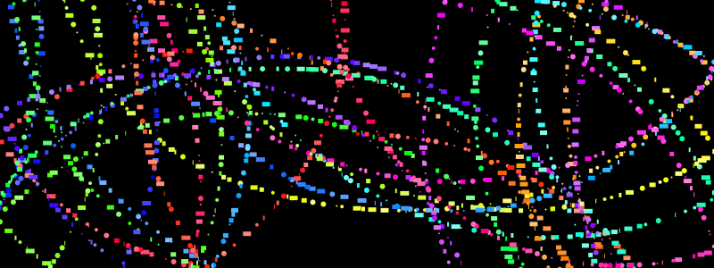

```@meta
DocTestSetup = quote
    using Luxor, Colors
end
```
# Introducing turtle graphics



Luxor includes "turtle graphics". This refers to a way of making drawings by steering a turtle around a drawing surface. The turtle holds (somehow) a pen, and, following some simple instructions, draws lines behind it as it goes.

## How to type the turtle emoji

Luxor's turtles have names. You can call your turtles anything. But if you like, you can create and name your turtle with a suitable emoji:

```julia
using Luxor

🐢 = Turtle() # type the turtle emoji \:turtle: TAB
```

That's "backslash colon turtle colon tab" in VS-Code, for example. (It's Unicode `U+1F422`.)

But you can use any simple Julia variable name if you'd prefer:

```julia
raphael = Turtle()
```

## A very simple turtle graphics drawing

Here's a very simple example:

```julia
using Luxor, Colors # hide
@drawsvg begin
    background("honeydew")
    🐢 = Turtle() 
    Forward(🐢, 100)
    Turn(🐢, 90)
    Forward(🐢, 100)
    Turn(🐢, 90)
    Forward(🐢, 100)
end
```

Or - with the same result, without using the drawing-creation macro:

```@example
using Luxor, Colors # hide
Drawing(500, 500, :png)
origin()
background("honeydew")
🐢 = Turtle() 
Forward(🐢, 100)
Turn(🐢, 90)
Forward(🐢, 100)
Turn(🐢, 90)
Forward(🐢, 100)
finish()
preview()
```

- `Forward(🐢, 100)` tells the turtle called 🐢 to move forward 100 units. It's moved across the drawing, to the right.

- `Turn(🐢, 90)` tells the turtle called 🐢 to turn through 90° (clockwise)

and the two function calls are repeated, to give another line, and another turn, and another line.

Here's an animated view of how the image was made (I added the turtle):


Even with just these two instructions, the turtle can draw quite interesting things:


```julia
using Luxor, Colors # hide

@drawsvg begin
background("honeydew")
🐢 = Turtle()
for i in 1:200
    Forward(🐢, 50 + i)
    Turn(🐢, 85)
end 
end
```

The smaller turn angle of 85° makes the pattern more interesting. And there's no speed restriction for this turtle.

All the turtle instructions start with an uppercase letter. (This isn't very good Julia practice, by the way!)

The idea of turtle graphics is that it's easy to build up complicated pictures just by repeating very simple instructions.

For example, here's a function that draws a pentagon; just five sides and five 72° turns:

```@example
using Luxor, Colors # hide

function a_pentagon(t::Turtle, s)
    for i in 1:5
        Forward(t, s)
        Turn(t, 72)
    end
    Turn(t, 72) # it's less interesting without this
end

@drawsvg begin
    background("honeydew")
    🐢 = Turtle()
    for i in 1:100
        a_pentagon(🐢, 20 + i)
    end
end
```

## More instructions

Turtles understand more instructions than just `Forward` and `Turn`:

- `Pendown()` (the default)
- `Penup()`  lift the pen from the drawing
- `Pencolor()` change the color (default is "black")
- `Penwidth()` change the width
- `Circle()` draw a filled circle
- `Rectangle()` draw a rectangle
- `Reposition()` move the turtle to a new location
- `Message()` draw some text
- `HueShift()` change the hue of the pen's color by a small amount

All these require a turtle name as the first argument. The full list is here: [Turtle graphics](@ref).

This next drawing is also simple, but the gradual shifting hue - thanks to `HueShift()` - is effective:

```@example
using Luxor, Colors
function draw_graphics()
    🐢 = Turtle()
    Pencolor(🐢, "cyan")
    Penwidth(🐢, 1.5)
    n = 5
    for i in 1:400
        Forward(🐢, n)
        Turn(🐢, 89.5)
        HueShift(🐢)
        n += 1
    end
    fontsize(40)
    Reposition(🐢, Point(-250, -250))
    Pencolor(🐢, 1.0, 0.5, 0.0)
    Message(🐢, "finished")
end

@drawsvg begin
    draw_graphics()
end
```

You don't have to restrict yourself to drawing lines. With `Circle()` and `Rectangle()` you can create all kinds of images. 

## Adding new commands

There's isn't a `Back()` instruction as you might expect - because it could behave in various different ways (is there another 180° turn afterwards?). Here's how to add your own `Back()` command:

```@example
using Luxor, Colors # hide

function Back(t::Turtle, n)
    Turn(t, 180)
    Forward(t, n)
    Turn(t, 180) # now looking back towards where it just was
end 

function draw_graphics(🐢::Turtle)
    for i in 1:8
        Forward(🐢, 150)
        Circle(🐢, 15)
        Back(🐢, 100)
        Turn(🐢, 45)
        HueShift(🐢, 30)
        Circle(🐢, 5)
    end
end

@drawsvg begin
    background("black")
    🐢 = Turtle()
    Penwidth(🐢, 30)
    Pencolor(🐢, "blue")
    draw_graphics(🐢)
end
```

## Further credit

Here's the code for the abstract splash image at the top of this section:

```julia
using Luxor, Colors
Drawing(800, 300, "/tmp/turtles.png")
origin()
background("black")
t = Turtle()
Pencolor(t, "red")
for i in 1:1500
    Forward(t, rand(1:10))
    Turn(t, rand() * π)
    rand(Bool) ? Circle(t, rand(1:3)) : Rectangle(t, rand(1:10), 5)
    HueShift(t, .5)
    Randomize_saturation(t)
    Penup(t)
    Forward(t, rand(5:15))
    Pendown(t)
    pt = Point(t.xpos, t.ypos)
    if !isinside(pt, box(BoundingBox()))
        Reposition(t, pointcrossesboundingbox(pt, BoundingBox()))
        Turn(t, 90)
    end 
end  
finish()
preview()
```
