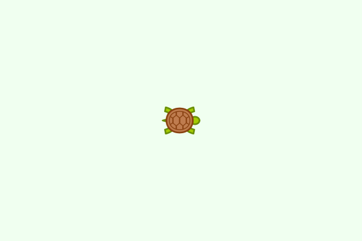
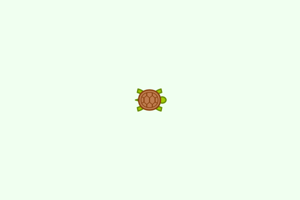
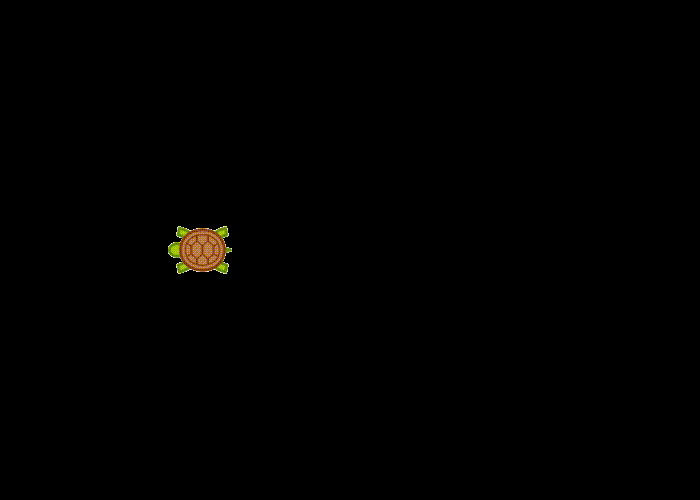
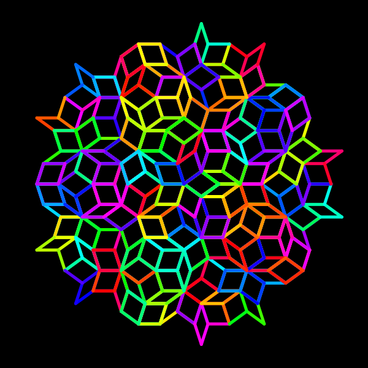

```@meta
DocTestSetup = quote
    using Luxor, Colors
end
```
# Introducing turtle graphics


Luxor includes "turtle graphics". This is a way of making drawings by steering an imaginary turtle around a 2D drawing surface. The turtle holds (somehow) a pen, and draws lines behind it, as it wanders around the drawing obeying your instructions.

## How to type the turtle emoji

Luxor's turtles have names. You can call your turtles anything. If you like, you can create and name your turtle with a suitable emoji:

```julia
using Luxor

🐢 = Turtle() # type the turtle emoji \:turtle: TAB
```

That's "backslash colon turtle colon tab" in VS-Code, for example. (It's Unicode character `U+1F422`.)

Or you can use any simple Julia variable name if you'd prefer:

```julia
raphael = Turtle()
```

Then, you create a new drawing, and give the turtle some instructions.

## A very simple turtle graphics drawing

Here's a very simple example:

```julia
using Luxor, Colors # hide
@drawsvg begin
    background("honeydew")
    🐢 = Turtle()          # we create the turtle
    Forward(🐢, 100)       # go forward by 100 'steps'
    Turn(🐢, 90)           # turn 90° clockwise   
    Forward(🐢, 100)       # go forward by 100 'steps'
    Turn(🐢, 90)           # turn 90° clockwise  
    Forward(🐢, 100)       # go forward by 100 'steps'    
end
```

Or - with the same result, without using the drawing-creation macro (which saves a few keystrokes):

```@example
using Luxor, Colors # hide
Drawing(500, 500, :png)
origin()
background("honeydew")
🐢 = Turtle() 
Forward(🐢, 100)
Turn(🐢, 90)
Forward(🐢, 100)
Turn(🐢, 90)
Forward(🐢, 100)
finish()
preview()
```

- `Forward(🐢, 100)` tells the turtle called 🐢 to move forward 100 units. It's moved across the drawing, to the right.

- `Turn(🐢, 90)` tells the turtle called 🐢 to turn through 90° (clockwise)

and the two function calls are repeated, to give another line, and another turn, and another line.

Here's an animated view of how the image was made (I added the turtle):



Even with just these two instructions, you can make the turtle draw quite interesting things:



```julia
using Luxor, Colors # hide

@drawsvg begin
background("honeydew")
🐢 = Turtle()
for i in 1:200
    Forward(🐢, 50 + i)
    Turn(🐢, 85)
end 
end
```

The smaller turn angle of 85° makes the pattern more interesting.

!!! note

    All the turtle instructions in Luxor.jl start with an uppercase letter. This isn't considered good practice in Julia code; initial capitalization is supposed to be restricted to module and type names. In Luxor, this bad habit (I was young once) at least helps to distinguish between turtle graphics commands and non-turtle graphics commands.

The idea of turtle graphics is that it's easy to build up complicated pictures just by repeating very simple instructions such as moving along a line and turning through angles.

Here's a function that draws a pentagon; move forward five times, turn through 72° after each move:

```@example
using Luxor, Colors # hide

function a_pentagon(t::Turtle, s)
    for i in 1:5
        Forward(t, s)
        Turn(t, 72.0)
    end
end

@drawsvg begin
    background("honeydew")
    🐢 = Turtle()
    Penwidth(🐢, 10)
    Pencolor(🐢, "red")
    for i in 1:5
        a_pentagon(🐢, 100.0)
        HueShift(🐢, 30)
        Turn(🐢, 72)
    end
end
```

After the first pentagon is drawn by `a_pentagon`, the turtle rotates 72° - so the next pentagon doesn't overlap the previous one. We've used `HueShift()` as well, so that each pentagon is drawn in a different color, starting with redw.

## More instructions

Turtles understand more instructions than just `Forward` and `Turn`:

- `Pendown(🐢)` (the default)
- `Penup(🐢)`  lift the pen from the drawing
- `Pencolor(🐢, r, g, b)` change the color (default is (0, 0, 0) or "black")
- `Penwidth(🐢, w)` change the pen width to `w`
- `Circle(🐢, r)` draw a filled circle with radius `r`
- `Orientation(🐢, θ)` face θ°
- `Rectangle(🐢, w, h)` draw a rectangle with width `w` and height `h`
- `Reposition(🐢, pt)` move the turtle to a new location point 
- `Message(🐢, t)` draw the text in `t`
- `HueShift(🐢, h)` change the hue of the pen's color by a `h`, or a small amount

plus a few more.

All these require a turtle name as the first argument. The full list is here: [Turtle graphics](@ref).

This next drawing is also simple, but the gradual shifting hue - again thanks to `HueShift()` - is effective:

```@example
using Luxor, Colors
function draw_graphics()
    🐢 = Turtle()
    Pencolor(🐢, "cyan")
    Penwidth(🐢, 1.5)
    n = 5
    for i in 1:400
        Forward(🐢, n)
        Turn(🐢, 89.5)
        HueShift(🐢)
        n += 1
    end
    fontsize(40)
    Reposition(🐢, Point(-250, -250))
    Pencolor(🐢, 1.0, 0.5, 0.0)
    Message(🐢, "finished")
end

@drawsvg begin
    draw_graphics()
end
```

You don't have to restrict yourself to drawing lines. With `Circle()` and `Rectangle()` you can create all kinds of images. 

Here's a visualization of two ways to draw the Julia logo with a turtle.



The version on the left is drawn by the turtle on a journey:

```julia
using Luxor, Colors # hide

@drawsvg begin
    colors = [Luxor.julia_purple, Luxor.julia_red, Luxor.julia_green]
    🐢 = Turtle()
    S = 50
    Penup(🐢)
    Turn(🐢, 30) ; Forward(🐢, S) ; 
        Pencolor(🐢, colors[1]); Pendown(🐢) ; 
        Circle(🐢, 40) ; Penup(🐢)
    Turn(🐢, 150) ; Forward(🐢, 2S) ; 
        Pencolor(🐢, colors[2]) ; Pendown(🐢) ; 
        Circle(🐢, 40) ; Penup(🐢)
    Turn(🐢, 120) ; Forward(🐢, 2S) ; 
        Pencolor(🐢, colors[3]) ; Pendown(🐢) ; 
        Circle(🐢, 40) ; Penup(🐢)
end 
```

THe version on the right repeats the same action three times:

```julia
using Luxor, Colors # hide

@drawsvg begin
    colors = [Luxor.julia_purple, Luxor.julia_red, Luxor.julia_green]
    🐢 = Turtle()
    for i in 1:3
        Push(🐢)
        Orientation(🐢, [30, 150, 270][i])
        Penup(🐢)
        Forward(🐢, 120)
        Pencolor(🐢, colors[i])
        Pendown(🐢)
        Circle(🐢, 80)
        Pop(🐢)    
    end
end
```

The `Push()` instruction tells the turtle to remember the current position and rotation on a *stack* and continue. `Pop()` gets information from the stack and then teleports the turtle to that position and orientation - forgetting where it was and where it was heading. This way, the same task - turn-forward-pencolor-pendown-circle - is easily repeated in different directions.

## Adding new commands

There's isn't a `Back()` instruction as you might expect - because it's not clear how it should work. For example, is it like putting a car in reverse and reversing, when you don't change the direction you're facing, or is it like turning through 180° and then going forward? And do you turn round afterwards?. But it's easy to add your own `Back()` command that does exactly what you want it to:

```@example
using Luxor, Colors # hide

function Back(t::Turtle, n)
    Turn(t, 180)
    Forward(t, n)
    Turn(t, 180) # looking forward again
end 

function draw_graphics(🐢::Turtle)
    for i in 1:8
        Forward(🐢, 150)
        Circle(🐢, 15)
        Back(🐢, 100)
        Turn(🐢, 45)
        HueShift(🐢, 30)
        Circle(🐢, 5)
    end
end

@drawsvg begin
    background("black")
    🐢 = Turtle()
    Penwidth(🐢, 30)
    Pencolor(🐢, "blue")
    draw_graphics(🐢)
end
```

## More turtles

Here's the code for the abstract splash image at the top of this section:

```julia
using Luxor, Colors
Drawing(800, 300, "/tmp/turtles.svg")
origin()
background("black")
turtles = Turtle[]
for i in 1:100
    turtle = Turtle(rand(BoundingBox()))
    Pencolor(turtle, HSL(30rand(), 0.8, 0.7))
    Orientation(turtle, 360rand())
    Penwidth(turtle, .5)
    push!(turtles, turtle)
    for t in turtles
        HueShift(t, 5)
        Forward(t, rand(5:10))
        Turn(t, rand(-15:15))
        rand(Bool) ? Circle(t, 2) : Rectangle(t, 2, 2)
        Pen_opacity_random(t)
        pt = Point(t.xpos, t.ypos)
        if !isinside(pt, box(BoundingBox()))
            Towards(t, Point(0, 0))
        end
    end
end
finish()
preview()
```

This code generates a hundred turtles in random positions and moves and turns them randomly. When a turtle reaches the edge, its orientation is changed so that it  points to the center.

If you enjoy drawing with turtles, you might enjoy the [Lindenmayer.jl](https://github.com/cormullion/Lindenmayer.jl) package.

```julia
using Lindenmayer
using Luxor
using Colors

@draw begin
    background("black")
    setlinecap("round")
    penrose = LSystem(["X" => "PM++QM----YM[-PM----XM]++t",
            "Y" => "+PM--QM[---XM--YM]+t",
            "P" => "-XM++YM[+++PM++QM]-t",
            "Q" => "--PM++++XM[+QM++++YM]--YMt",
            "M" => "F",
            "F" => ""],
        "[Y]++[Y]++[Y]++[Y]++[Y]")

    # evaluate the LSystem
    Lindenmayer.evaluate(penrose, 5)

    # create a turtle
    🐢 = Turtle(colorant"purple")
    Penwidth(🐢, 5)
    Pencolor(🐢, "cyan")

    # render the LSystem's evaluation to the drawing 
    # forward 35, turn angle 36
    Lindenmayer.render(penrose, 🐢, 35, 36)
end
```


